# The gross pages — Highest-Grossing Artists by Country and Highest-grossing shows — plus certifications phone density: brief for Claude Design

**Site:** burnaboystats.com, an unofficial, verification-first Burna Boy stats site that also ranks other African artists.
**Pages:** `/records/tours/revenue/countries` (Job 1, main job) · `/records/tours/revenue` (Job 2, main job; "Highest-grossing shows", renamed in #406, URL unchanged) · `/certifications` on the phone and the phone certifications section of every `/afrobeats/<artist>` page (Job 3, smaller).
**Source:** read from the live site and the code on 3–4 Oct 2026. Code at `main` `1cd8972b` (#403, #404, #405 and #406 all merged and live). The box-office data file, `app/data/tourRevenue.ts`, is byte-identical to the `2ac28b4a` copy every figure in `research/` was derived from, and every figure was recomputed a second time, independently, from `1cd8972b` before this brief was handed over.

**Since the research was written: #406 (merged and live 4 Oct, 01:48 BST)** renamed the board **"Highest-grossing shows"** everywhere a reader sees it (h1s, breadcrumbs, the phone top bar, the countries page's back buttons, footers, metadata, JSON-LD, the OG card) and made **every phone board row name its artist, his included** ("Burna Boy · London · 2024"). Those are code stopgaps, not a design: they used the existing parts, and your design replaces them. §4.1, §5.1 and the screenshots of `/records/tours/revenue` and the desktop countries page show the site **after** #406; where [`research/pages.md`](research/pages.md) still quotes the old name, it records the code as read before #406 (its own header says so).

You can't see the code, so everything you need is in this brief. The screenshots of today's pages are in [`current/`](current/) (index: [`current/README.md`](current/README.md)) and are shown in place below. The research notes, with a `file:line` citation for every claim, are in [`research/`](research/):
- [`data.md`](research/data.md): every figure both gross pages show, recomputed independently from the data file by [`derive.mjs`](research/derive.mjs) and [`board-extras.mjs`](research/board-extras.mjs) (both re-runnable);
- [`pages.md`](research/pages.md): every block of every page in scope, top to bottom, with its exact copy and live phone measurements at 320, 360 and 390 (method: [`measure-phone.js`](research/measure-phone.js));
- [`design-system.md`](research/design-system.md): the tokens, type, controls and components as the code defines them today.

You don't need them to do the work. They are there so the owner and Claude Code can check each claim. Read-only excerpts of every artboard this brief names are in [`artboards/`](artboards/README.md), with the templates for what you hand back in [`artboards/templates/`](artboards/templates/).

**Live site:** https://burnaboystats.com/records/tours/revenue/countries · https://burnaboystats.com/records/tours/revenue · https://burnaboystats.com/certifications

**Every number in this brief is a sizing example.** The site derives every figure from its data on every build. Each one is traceable to [`research/data.md`](research/data.md) (section given where it helps). Draw every figure as a slot (§3, rule 7); never type one.

---

## 1. The ask

The owner's bar, verbatim (3 Oct 2026): *"ensure the design for pages are extremely good, claude design should make the best, so the new gross pages have the best ui/ux"*.

So this is not a tidy-up. The two **gross pages** get a full design pass, desktop and phone, and should be the best data pages on the site. The certifications phone screens get a smaller density pass.

| Job | Priority | Page | What you draw | Existing artboards |
|---|---|---|---|---|
| **1. Highest-Grossing Artists by Country** | Main | `/records/tours/revenue/countries` (new, live since 3 Oct, #405) | The whole page, desktop and phone: hero, continent leaders, country-by-country leaders, the multi-night runs inside countries, Africa's empty state, navigation on a long page, the link back, the share card | **None.** The page was assembled from the box-office board's parts. The parts kit: [`records-revenue-per-show-FULL.dc.html`](artboards/records-revenue-per-show-FULL.dc.html), [`mobile-14-revenue-lines-405-453.html`](artboards/mobile-14-revenue-lines-405-453.html) |
| **2. Highest-grossing shows** | Main | `/records/tours/revenue` (renamed from "Highest revenue per show" in #406; URL unchanged) | The whole page, desktop and phone: hero, artist chips, the ranked board rows, the Multi-night runs section, the source notes, the link to Job 1, the share card | `designs/desktop/Records - Revenue Per Show.dc.html` (41 shows, no runs, old name) · Deep Pages screen 14 |
| **3. Certifications phone density** | Smaller | `/certifications` phone (`MobileCerts`) and every `/afrobeats/<artist>` phone certs section | Shorter ledes and notes, the switch row and its adaptive kicker placed so they scan, nothing lost | Mobile screen 02 · `Afrobeats - Mobile Artist.dc.html` (phones A and B) |

**Why now.**
- **Job 1** works but was never designed. Every part is borrowed from the box-office board: its hero, its row grammar, its meta bars as continent headings. Nothing on the page shows geography or scale. $26.9M in the United States and $0.39M in Singapore read as two rows of the same text ([`pages.md`](research/pages.md) A4).
- **Job 2** was designed for 41 shows, 27 of them his, under the name "Revenue per show". The board now holds **82 single shows** (32 his) by ten artists, plus a new **Multi-night runs** section under it, and the owner has renamed it. #406 swapped the name in and named his phone rows, but the page is still the 41-show design: a hero that lists rather than tells, two gold actions on one phone screen, rows that still truncate at 320, and a 9-line note.
- **Job 3:** #404 added two switches and an adaptive kicker to the certifications screens on top of ledes that already ran to 7–9 lines on artist pages.

**What success looks like.**
- A visitor on a 390px phone understands each gross page from its first screen, before any list: the biggest night, whose it is, how much of the whole is Burna Boy's, and how far the list reaches.
- Every row reads in one glance: who, where, when, gross, tickets or nights, and the share where the page has one.
- A journalist can lift an exact figure (full dollars, the venue, the year) without opening anything.
- Both themes pass WCAG AA, including hover; every control is 44px on the phone.
- Every fact on today's pages is still on the page. Nothing is typed. Nothing hides behind a toggle.
- The owner can approve your change list in one pass, with few questions.

**Who uses these pages:**
- **Fans on phones** checking "is he the biggest?" and comparing artists.
- **Journalists and fan pages** who want a quotable figure with its venue, year and source.
- **Search visitors** who land on a single page from a question about African artists' concert grosses.

**Where the artboards are.** Every artboard path in this brief is relative to your own project, the bundle you hand off as `design_handoff_burnaboystats/`. You wrote its `START-HERE.md` entries and its design responses, so the files are yours to edit there:
- desktop: `design_handoff_burnaboystats/designs/desktop/<name>`;
- phone: `design_handoff_burnaboystats/designs/mobile/Burna Boy Stats - Mobile Deep Pages.dc.html` ("Deep Pages"), `…/designs/mobile/Burna Boy Stats - Mobile.dc.html` ("Mobile") and `…/designs/mobile/Afrobeats - Mobile Artist.dc.html`;
- responses and prompts: `design_handoff_burnaboystats/docs-design/` and the bundle root.

The line numbers in this brief come from the owner's copy of the bundle, with design files dated **30 Sep 2026** (after the tour-map response). They are newer than the ones the tour-map brief quoted (Deep Pages lines moved by about 3). [`artboards/`](artboards/README.md) holds a read-only excerpt of every cited range. If your copy differs, yours wins; say so in your response. **The figures in those artboards are old** (41 shows, "$6.15M", "Revenue per show", no runs). Take figures only from §4.3, §5.3 and [`research/data.md`](research/data.md).

**Phone width.** Draw every phone artboard at **390 × 844**: every screenshot and every live measurement in this brief was taken at 390. Check tight copy at **360** and **320** (the narrowest width the site is measured at). Where you edit an existing mobile file in place and its frames are 402 × 874, keep its frame and put the 390 and 320 checks beside it. Desktop artboards are **1440**, with a **1024** check.

**First-screen budget on the phone (390 × 844).** On both gross pages the back bar takes the top 69px and the gold action bar the bottom 75px plus a 34px home indicator. **Content you place on the first screen runs from y 69 to y 735: 666px.** The story (§2) has to land inside that.

---

## 2. The bar: what best-in-class means here

Read this before you draw. It is what the owner will judge the two gross pages by.

### 2.1 Explore before you draw

- For **each gross page**, sketch **two or three genuinely different directions** as small thumbnails: the first screen at 1440 and at 390, dark, nothing else. Different means a different idea of what the page is, not three colourways of one layout. Examples (not prescriptions):
  - **Data-story hero:** the page opens on its one headline finding, set large, with the figures that prove it, and the list follows as the evidence.
  - **Map-led** (Job 1 especially): a small world map of the 12 countries, using the site's own map shapes and `--map-*` tokens (§7), as the navigation into the list.
  - **Ranked-bars-led:** one bar per country (Job 1) or per show (Job 2), length = gross, so scale is visible before any number is read.
- **Pick one per page and write down why**: who it serves, what it shows first, what it costs on the phone. Put the thumbnails and the rationale at the top of your design response (§10).
- **Then draw the chosen direction fully**, every state in §4.6 and §5.6, both layouts, both themes.

### 2.2 What the finished pages must do

1. **The hero tells the story at a glance, before any list.** On Job 1: how much reported gross there is, across how many nights, countries and continents; how many countries Burna Boy leads; his share of the whole. On Job 2: the biggest night (whose, where, when, how much, how many tickets), his share of the board, and how far the board reaches (82 shows, ten artists, $47,221 to $6,147,209). The exact figures are in §4.3 and §5.3.
2. **Use data visualisation where it beats a list**, and keep the exact figure readable beside it:
   - share-of-total bars (his share of a country, of a continent, of the board);
   - a continent comparison;
   - a small map, if you choose it (the site draws its own maps; no library, no tiles);
   - a mini bar per row, if it earns its space.
   - **Scale is the hard part.** Country totals run 70× ($26,920,799 to $385,207). Shows run 130× ($6,147,209 to $47,221). Artist totals inside a country run from $15,495,482 to $100,555. A linear bar makes the smallest rows about one pixel long. Choose a rule (linear with a visible minimum, bars only within one country, a labelled break, or no bar where it misleads), say it on the artboard, and never let a bar be the only place a figure lives.
3. **Every row scans in one glance.** Who · where · when · gross · tickets or nights · share. One reading order, the same on every row of a list, Burna Boy's rows included (§3, the artist-name rule).
4. **Phone-first interaction.**
   - Artist chips with a clear active state, and the result count announced to screen readers.
   - On a long page, a **jump-to** control (continent or country on Job 1; artist or section on Job 2) that **stays reachable** as the reader scrolls, under the back bar, without covering rows.
   - Clear current, pressed and focused states in both themes.
   - **Never an accordion, never a hidden row, never "show more".** Every row is in the page at every width.
5. **Motion only where it explains** (a bar growing to its value once, a jump scrolling to its target). Under reduced motion everything settles to its final state at once.
6. **Accessibility, both themes:**
   - WCAG AA: 4.5:1 for text, 3:1 for large text, controls and data marks (a bar against its track), **including hover and pressed states**. Gold text on a hovered paper row measures 4.14:1 today (§7.3), which fails for anything under 24px.
   - 44px tap targets on the phone; 24px with a mouse.
   - A visible focus ring on every control and every row link.
   - Real headings in order (h1, then h2 per section or continent, then h3 per country), real lists or tables for ranked data, and a text equivalent for any chart or map.
7. **Empty and edge states are designed, not left to the build.** At least: Africa's "No reported box office yet"; a one-artist country; a one-artist continent (Asia); a leader whose total is mostly multi-night runs (Canada); an artist with no single night in a country (Wizkid, UK); the longest names; $47K beside $6.1M. The full lists are §4.6 and §5.6.
8. **Typography and rhythm come from the site's own system** (§7): Anton for display and figures, Geist for reading, Space Mono for short labels, on the spacing scale. Extend it; don't import a new look.
9. **Link-preview (OG) cards for both pages are designed too.** They stay **gold**, as every card does (§4.5 J, §5.5 I).

### 2.3 Self-check before you hand back

Tick every line on your response's first page. If one fails, say which and why.

- [ ] Two or three directions per gross page were explored as thumbnails, one was chosen, and the rationale is written.
- [ ] At 390 × 844, each gross page's first screen (y 69–735) carries the story: headline figures and his share, before any list row.
- [ ] Every row on every board names its artist in the same position and format, Burna Boy's rows included.
- [ ] Gold appears only on his figures (and his name, if you choose that under §3 rule 15), on what is live, on actions, and on the h1's split word. No other artist's figure, rank or name is gold.
- [ ] No figure is typed. Every figure is a slot sized for its longest real value (§4.3, §5.3).
- [ ] "Gross", never "revenue", in every new string. The page names are exactly "Highest-Grossing Artists by Country", "Highest-grossing shows" and "Multi-night runs".
- [ ] Africa is shown with "No reported box office yet". South America's treatment is drawn or raised as a question (§4.5 F).
- [ ] No accordion, no hidden rows, no "show more" added anywhere.
- [ ] Phone top-bar titles fit on one line at 320 on all three jobs.
- [ ] Every fact on today's pages survives (the checklists in §4.5 I, §5.5 F and §6.3).
- [ ] AA contrast in both themes, hover and pressed included, with the ratios written on the artboard for every new colour pairing.
- [ ] 44px phone targets; visible focus; headings in order; a text equivalent for every chart or map.
- [ ] Reduced motion drawn or noted for every animated part.
- [ ] Desktop and phone drawn as separate designs, each in light and dark, with the 1024 and 320 checks.
- [ ] Both OG cards drawn, gold, at 1200 × 630.
- [ ] The phone chrome (back bar, action bar) is untouched; any label or destination change to it is on the change list.
- [ ] A numbered change list is in the response, with every gold move, rename, removal and test change listed.

---

## 3. What to keep: the owner's standing decisions

These bind every job. Never contradict them; where your design needs one changed, put it in your change list as a question, with your default.

1. **Page names**, exactly: **"Highest-Grossing Artists by Country"** (the new page), **"Highest-grossing shows"** (the box-office board, renamed; the URL `/records/tours/revenue` stays), **"Multi-night runs"** (the section under the board).
2. **Figures are GROSS ticket sales.** Never "revenue" in new copy. The data is reported gross box office in US dollars.
3. **Leading a country = an artist's TOTAL reported gross in that country**: every single show plus every multi-night run. The **best night** is shown alongside, and it comes from single shows only; a run never stands in for a night.
4. **Africa is shown**, as **"No reported box office yet"**. Never hidden. (Box-office reporting barely reaches venues there: not reported, not unplayed.)
5. **Gold marks Burna Boy's own figures, and what is live or an action.** Nothing else. No other artist's figure or rank is gold.
6. **The h1's split word is gold, and only the split word.** (Owner, 30 Sep 2026: "the split word stays gold … nothing else in gold".) The board's design file still has three gold words in its h1 ("Revenue Per Show"); the live page dropped them in #406 ("Highest-Grossing **Shows**", one gold word), and your design keeps it at one.
7. **Every figure is derived from data, never typed.** Draw every figure as a **live-data slot**: a dashed magenta outline, which is annotation, not colour. Size each slot for its longest real value.
8. **Dense screens over accordions.** Never collapse a list behind a toggle; the owner reverted an accordion redesign once. (The certifications phone screen has one owner-approved fold, "Compare with…", and an existing "All 93 releases" button; both stay as they are. Add none.)
9. **Desktop and phone are separate designs**, split at 900px, each with its own component. Never scale or copy one into the other. A detail added to one is drawn for the other or listed as desktop-only / phone-only.
10. **Light and dark themes**, through the site's tokens (`light-dark(LIGHT, DARK)`, light first). Dark is the default; light ("paper") is a full theme. A new colour is a new token pair with a reason.
11. **Link-preview (OG) cards stay gold for every artist.** (Ayra Starr's purple is page-only.)
12. **Phone chrome is not redrawn:** the top back bar, the five-tab bar and the gold action bars. Design around them. A change to a bar's label or destination goes on the change list.
13. **Sources are kept in the data and not printed per row** (the owner's earlier ruling; `tests/revenueSources.test.ts` guards it). A page states its sources once, in its note.
14. **No designer redesign of pages outside this brief.** The pages that link to the gross pages (§5.8) change only their names and wording.
15. **NEW, 3 Oct 2026, the artist-name rule.** The owner, verbatim: *"burna boy name should appear in the list of his shows"* / *"just like how other artist a placed"* / *"tell that to the designer as well"*.
    - **Every row on every board names its artist**, Burna Boy's rows included, **in exactly the same position and format** as every other artist's: for example "Burna Boy · London · 2024" just as "Fally Ipupa · Paris · 2023".
    - **His rows keep the gold gross.** His name takes the same position, string and type as every other name. Whether it is also gold (it is on the desktop board today; the phone countries rows set it in ink) is your call: list it either way in the change list.
    - Until 4 Oct the phone board dropped his name ("London · I Told Them… Tour · 2024") and named everyone else. #406 fixed it in code: every phone row now reads "{artist} · {city} · {year}", his included, and `tests/revenueRowsNameArtist.test.tsx` fails if a row stops starting with its artist. **Your design must keep that**, and the design file (Deep Pages screen 14, which still draws the old meta) must follow it.
    - It applies to every list on both gross pages: the ranked board (desktop and phone), the Multi-night runs rows, every country table and continent leader on Job 1, and any chart or map label that names a row.
16. **What the data rules already settle** (from [`data.md`](research/data.md)): in the runs list, **"nights", never "shows"**; a run is one combined figure and is **never split** into nights; Ziggo Dome, Amsterdam (2022) is **held off the board** (no original report), so the Netherlands is absent; the board **never renumbers** when filtered (a row keeps its rank on the full board).
17. **SEO:** one visible h1 per layout (both layouts are in the HTML at once), headings in order, all text in the HTML at every width, and the JSON-LD lists stay complete.

---

## 4. Job 1: Highest-Grossing Artists by Country, `/records/tours/revenue/countries`

### 4.1 What exists today

One route, two layouts in the HTML, split at 900px. Built on 3 Oct (#405) from the board's own classes. Full detail: [`pages.md`](research/pages.md) A1–A3.

#### Desktop (above 900px)

Column 1360px wide with 40px side padding (the board's `.wide`). From the top:

1. **Breadcrumb:** "Home / Career Records / Tours & Live / Highest-Grossing Shows / Highest-Grossing Artists by Country" (the fourth crumb renamed in #406).
2. **Hero:**
   - Eyebrow (ember 22 × 2 rule + mono caps, muted): **"African artists · reported box office"**.
   - h1 **"Highest-Grossing Artists by Country"**, "by Country" in gold. Anton 84px (61px in the 1024 band).
   - Lede (live), verbatim: **"Every reported box-office gross by an African artist, added up country by country — 82 single shows and 3 multi-night runs (89 nights) in 12 countries on 4 continents. Burna Boy leads 9 of the 12."**
   - One secondary button: **"← Highest-grossing shows"** (renamed in #406).
3. **"By continent"**: Anton 38px h2, then a hairline grid of five cards, in rank order: North America, Europe, Oceania, Asia, then **Africa**. A card: continent label (mono, ember) · "60 nights" / "2 countries" (mono) · leader name (gold if his) · leader's total, Anton 34px (gold if his, muted otherwise) · "of $34.31M" (only when more than one artist) · "Next: Asake · $4.28M" or "The only artist reported". Africa: **"No reported box office yet"**, then **"Box-office reporting barely reaches venues in Africa — not reported, not unplayed."**
4. **Countries, grouped by continent.** Per continent: Anton 40px h2 ("North America") with "$34.31M · 60 nights" on the right over a 2px rule. Per country, ranked:
   - h3 Anton 26px "🇺🇸 United States", and on the right the leader line "**Burna Boy** leads · $15.50M of $26.92M · 48 nights reported" (one-artist countries: "Tyla · the only artist reported · $1.18M · 1 night").
   - A five-column table, `# · Artist · Best night · Nights · Total`. Best night on two lines, "$1.72M · Capital One Arena" over "Washington, D.C. · 2024 · 13,892 tickets". Total in full dollars, "$15,495,482", gold if his.
   - Wizkid in the UK (runs only): **"Nights reported together"** over "3 nights reported together · The O2 Arena, London (28–29 November and 1 December 2021)".
   - Burna Boy in Canada (runs plus single nights): a third line, "Total includes 4 nights in 2 runs, each reported together · Scotiabank Arena, Toronto; Centre Bell, Montreal".
5. **Method note**, 13px muted, one 643-character paragraph (verbatim in [`pages.md`](research/pages.md) A1 item 5).
6. **Back row:** "← Highest-grossing shows" and "Tours", both secondary.
7. **Footer** (site chrome): "Box-office figures via Billboard Boxscore." and links.

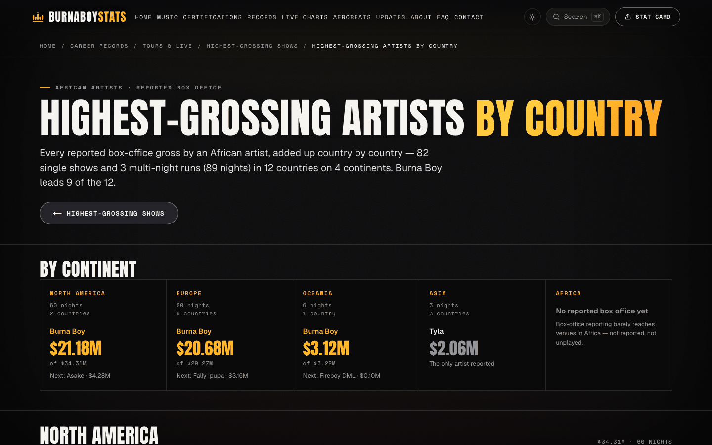

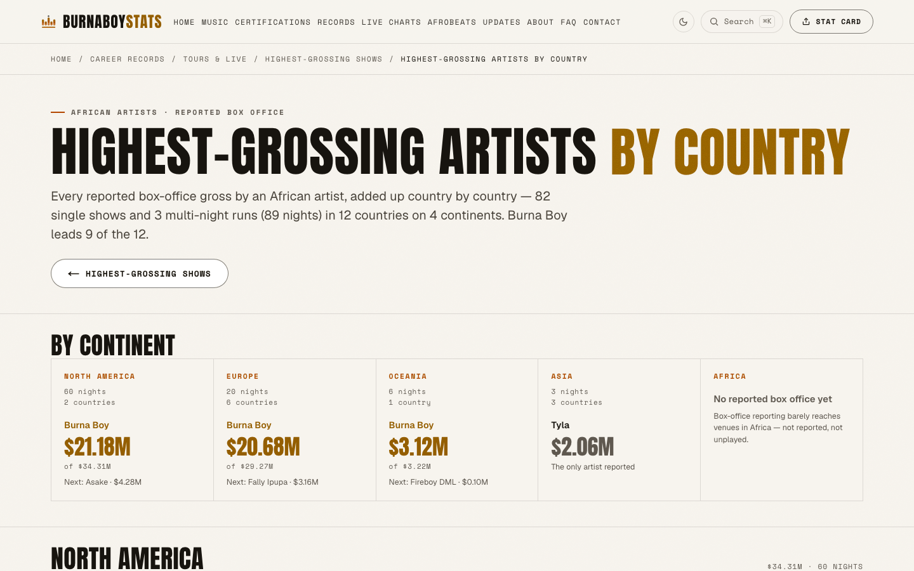

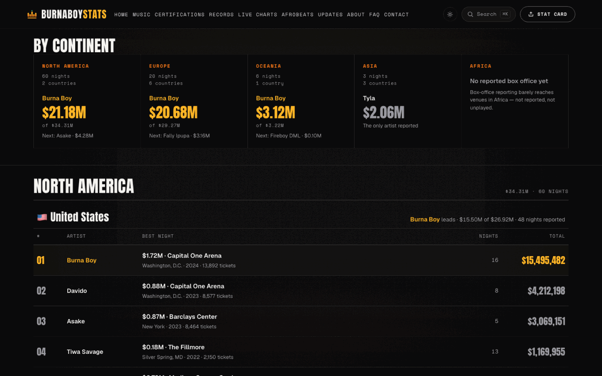

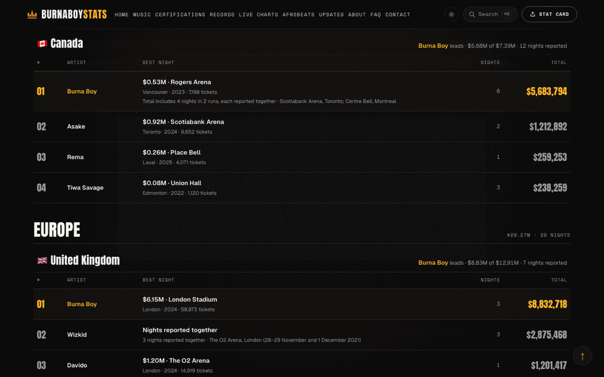

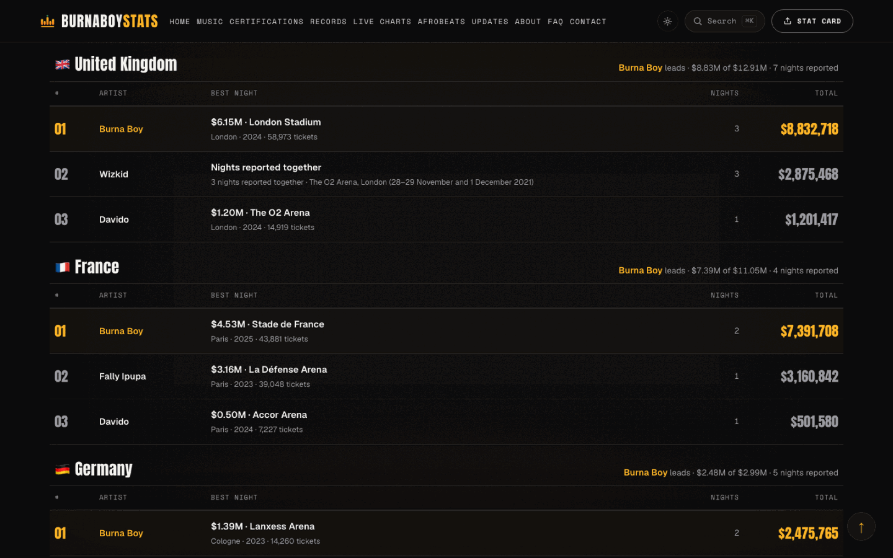

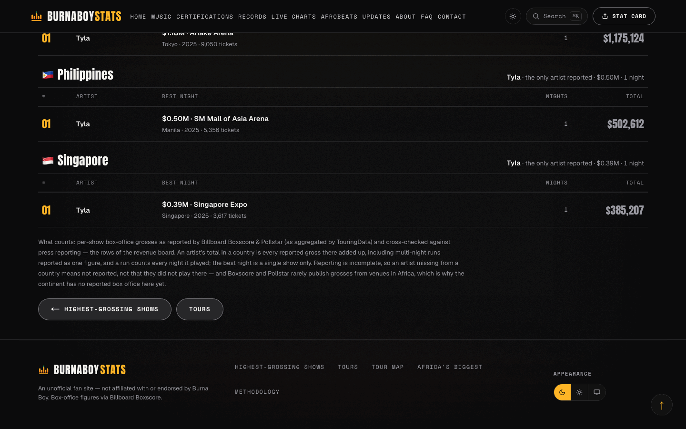

Whole page: [`countries-1440-dark.png`](current/countries-1440-dark.png) · [`countries-1440-light.png`](current/countries-1440-light.png).

#### Phone (900px and below)

Gutter 18px. From the top:

1. **Back bar** (sticky): back → `/records/tours/revenue`, label **"BY COUNTRY"** (kept on one line by a `nowrap` rule and 8px gaps below 360), gold badge **"12 countries"**, menu.
2. **Hero:** kicker "African artists · reported box office" (ember text) · h1 "Highest-grossing artists **by country**" (Anton 40px, gold ramp on "by country") · the same lede as desktop.
3. **Stat grid**, two cells: **"9 of 12" / COUNTRIES HE LEADS** · **"89" / REPORTED NIGHTS** (Anton 32px, both gold).
4. **"By continent"** meta bar, then one row per continent with no rank: name, the wrapping meta "**Burna Boy** leads · $21.18M of $34.31M · next Asake, $4.28M", and the continent's total on the right (muted) over "2 countries". Asia: "Tyla · the only artist reported".
5. **Africa row:** "Africa · No reported box office yet", the note under it.
6. **Per continent:** a meta bar "NORTH AMERICA … $34.31M · 60 nights"; per country a head (Anton 20px name, the leader line at 12.5px); then artist rows: rank · name · the best-night line (wraps) · total (`usdM`, gold if his) over "16 nights".
7. **Foot:** the full method note, 12px, dim.
8. **Action bar**, gold: **"Every show, ranked"** → the board.

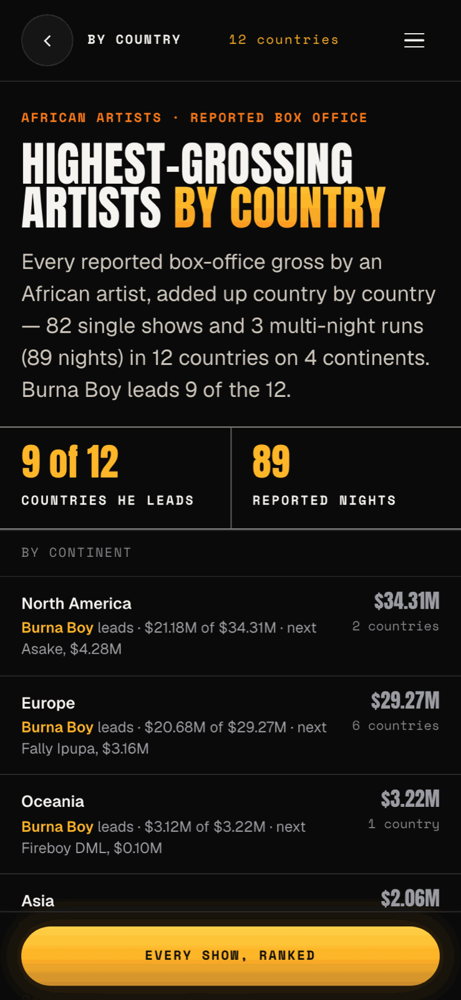

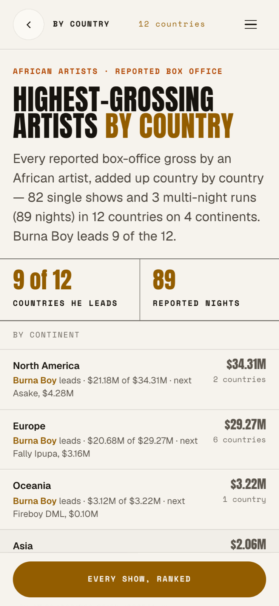

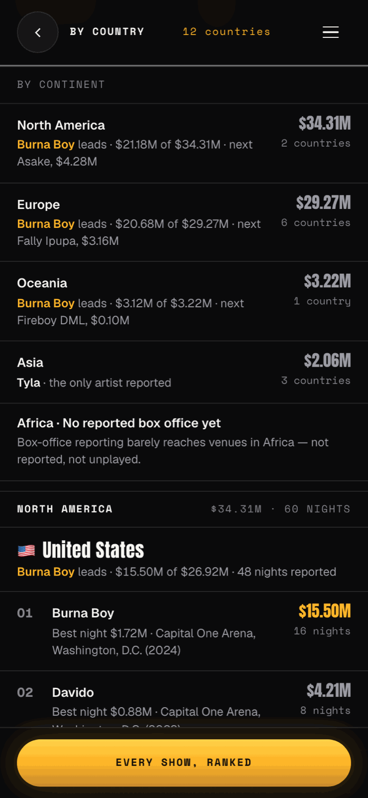

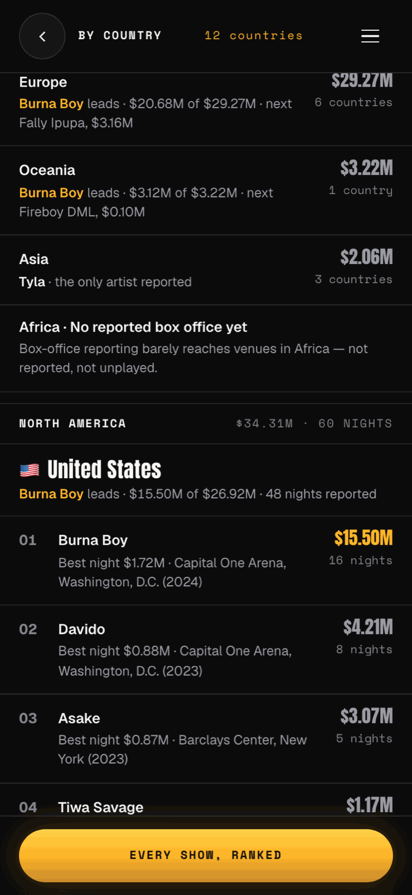

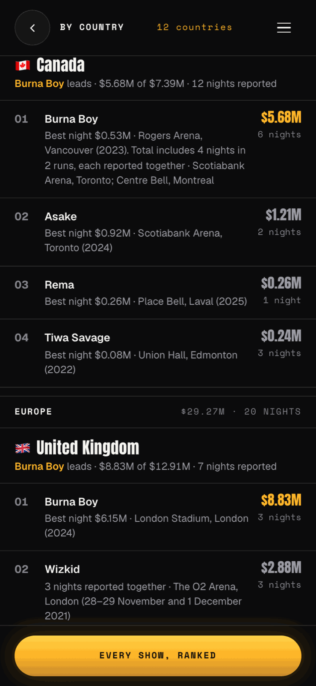

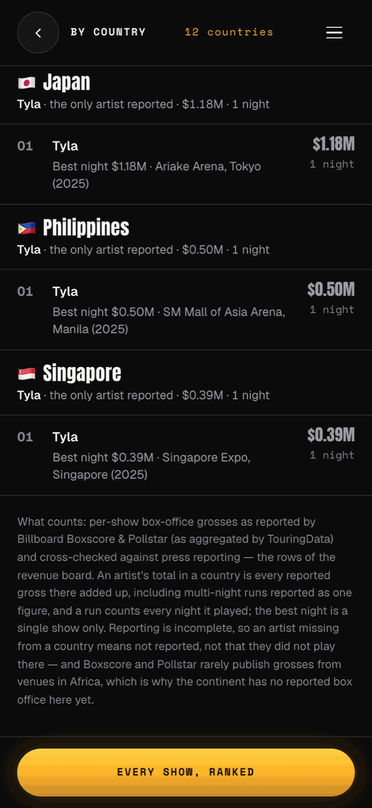

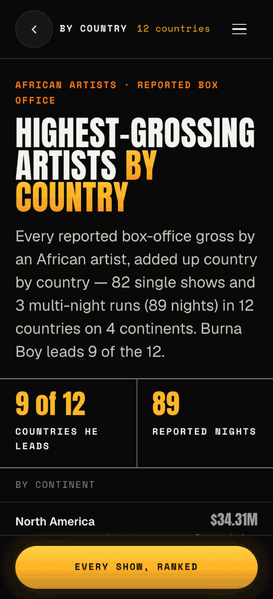

Whole page (4,656px): [`countries-390-dark.png`](current/countries-390-dark.png) · [`countries-390-light.png`](current/countries-390-light.png). The UK crop: [`countries-390-dark-uk.png`](current/countries-390-dark-uk.png).

### 4.2 What is wrong today

From the screenshots and from [`pages.md`](research/pages.md) A4 and E3. Phone figures are measured (simulated with the screen's own CSS) at 320 / 360 / 390.

**Both layouts**
- **No story, no geography, no scale.** Twelve countries, six continents' worth of headings, and not one graphic. The page never shows that the US is 70× Singapore, or that his share runs from 53.5% (Ireland) to 96.9% (Australia).
- **The continent summary appears twice:** the cards (desktop) or rows (phone), and again as each continent's heading further down.
- **Wording still lags in two places** (#406 renamed the buttons and the breadcrumb): the method note calls the board "the revenue board", and the footer's "Box-office figures via Billboard Boxscore." (on both gross pages) names one source where the board's own source line names TouringData, Billboard Boxscore and Pollstar. The method note is yours (piece I); the footer line is a code fix (§9).
- **The runs are buried.** Canada's two Burna runs live in a third line of small text; Wizkid's O2 run reads "Nights reported together" in the slot where a figure belongs, then repeats it.
- **The method note is one 643-character paragraph**: 5 lines at 1440, **11 / 12 / 13 lines** on the phone (390 / 360 / 320).
- **South America** has no reported box office and is printed nowhere, while Africa is shown.

**Desktop**
- **Rank "01" is gold on every leader's row, Tyla's included.** That breaks rule 5.
- **Twelve identical tables.** Each repeats `# · ARTIST · BEST NIGHT · NIGHTS · TOTAL`; in the five one-artist countries the header is taller than the data.
- **One figure, two forms:** cards in compact "$21.18M", tables in full "$15,495,482".
- The "BY CONTINENT" heading sits on the cards' top edge with no gap; the Africa card has no figure, so its column reads emptier than the others.
- The first screen is mostly empty space to the right of the lede.

**Phone**
- **The first screen shows no country at all.** The lede (196 characters) is 5 lines at 390 and repeats the two tiles (9 of 12, 89 nights).
- **Money labels lose resolution below $1M:** 13 of the 29 artist rows print "$0.xxM" ("$0.05M", "$0.08M", "$0.10M"). The board's own phone screen already solved this with `compactGross` ("$527.4K").
- **Row length:** Burna Boy's Canada row is 160 characters, **4 / 5 / 6 lines** at 390 / 360 / 320. A typical best-night line takes 2–3 lines.
- **Each one-artist country takes about 300px** to say one fact twice (in the head and again in row 01).
- At 320: the kicker wraps ("…REPORTED BOX / OFFICE"), the h1 takes 3 lines, the lede 6–7, a tile label wraps.
- The Africa row is a plain text row, with no marker; it reads like a footnote, not a continent.

### 4.3 The data

Everything here is from [`research/data.md`](research/data.md), recomputed from `app/data/tourRevenue.ts` (82 single shows, 3 multi-night runs). **Bold = Burna Boy** (his figures are the gold ones). Formats today: `usdM` "$15.50M", `usdFull` "$15,495,482", and the board phone's `compactGross` "$6.147M" / "$527.4K".

**The rules** (the owner's, 3 Oct 2026): leading = biggest **total** in a country (single shows + runs); best night = single shows only; nights = one per single show + every night of a run (82 + 7 = **89**); within a country, rank by total, then best night, then name; countries and continents by total.

#### Headline figures (data.md §1)

| Figure | Value |
|---|---|
| Nights | **89** = 82 single shows + 3 multi-night runs (7 nights) |
| Countries · continents | **12** countries on **4** of 6 continents (North America, Europe, Oceania, Asia) |
| Countries Burna Boy leads | **9 of 12**. Tyla leads Japan, the Philippines and Singapore (the only artist reported in each) |
| Grand total, every reported gross | **$68,869,662** ($68.87M) |
| His share of the grand total | **$44,986,067 = 65.3%** |
| Biggest country | United States, $26,920,799 (48 nights, 7 artists) |
| Board last re-read | October 2026 |

#### Continents (data.md §2)

| # | Continent | Total | Nights | Countries | Leader · total · share | Runner-up |
|---|---|---|---|---|---|---|
| 1 | North America | $34,314,997 | 60 | 2 | **Burna Boy · $21.18M · 61.7%** | Asake · $4.28M |
| 2 | Europe | $29,267,544 | 20 | 6 | **Burna Boy · $20.68M · 70.7%** | Fally Ipupa · $3.16M |
| 3 | Oceania | $3,224,178 | 6 | 1 | **Burna Boy · $3.12M · 96.9%** | Fireboy DML · $0.10M |
| 4 | Asia | $2,062,943 | 3 | 3 | Tyla · $2.06M · 100% | the only artist reported |
| — | Africa | — | 0 | 0 | **No reported box office yet** (shown) | |
| — | South America | — | 0 | 0 | No reported box office; **not printed today** | |

#### Countries (data.md §3)

| # | Country | Continent | Total | Nights | Artists | Leader · total of country (share) | Leader's best single night |
|---|---|---|---|---|---|---|---|
| 1 | 🇺🇸 United States | N. America | $26,920,799 | 48 | 7 | **Burna Boy · $15.50M of $26.92M (57.6%)** | $1,724,853 · Capital One Arena, Washington, D.C. (2024) · 13,892 tickets |
| 2 | 🇬🇧 United Kingdom | Europe | $12,909,603 | 7 | 3 | **Burna Boy · $8.83M of $12.91M (68.4%)** | $6,147,209 · London Stadium, London (2024) · 58,973 tickets |
| 3 | 🇫🇷 France | Europe | $11,054,130 | 4 | 3 | **Burna Boy · $7.39M of $11.05M (66.9%)** | $4,528,368 · Stade de France, Paris (2025) · 43,881 tickets |
| 4 | 🇨🇦 Canada | N. America | $7,394,198 | 12 | 4 | **Burna Boy · $5.68M of $7.39M (76.9%)** | $527,395 · Rogers Arena, Vancouver (2023) · 7,198 tickets |
| 5 | 🇦🇺 Australia | Oceania | $3,224,178 | 6 | 2 | **Burna Boy · $3.12M of $3.22M (96.9%)** | $1,116,628 · Qudos Bank Arena, Sydney (2025) · 10,401 tickets |
| 6 | 🇩🇪 Germany | Europe | $2,991,402 | 5 | 3 | **Burna Boy · $2.48M of $2.99M (82.8%)** | $1,386,581 · Lanxess Arena, Cologne (2023) · 14,260 tickets |
| 7 | 🇯🇵 Japan | Asia | $1,175,124 | 1 | 1 | Tyla · only artist | $1,175,124 · Ariake Arena, Tokyo (2025) · 9,050 tickets |
| 8 | 🇨🇭 Switzerland | Europe | $822,939 | 1 | 1 | **Burna Boy · only artist** | $822,939 · Hallenstadion, Zurich (2022) · 8,827 tickets |
| 9 | 🇧🇪 Belgium | Europe | $781,236 | 1 | 1 | **Burna Boy · only artist** | $781,236 · Sportpaleis, Antwerp (2023) · 8,266 tickets |
| 10 | 🇮🇪 Ireland | Europe | $708,234 | 2 | 2 | **Burna Boy · $0.38M of $0.71M (53.5%)** | $378,802 · 3Arena, Dublin (2022) · 7,504 tickets |
| 11 | 🇵🇭 Philippines | Asia | $502,612 | 1 | 1 | Tyla · only artist | $502,612 · SM Mall of Asia Arena, Manila (2025) · 5,356 tickets |
| 12 | 🇸🇬 Singapore | Asia | $385,207 | 1 | 1 | Tyla · only artist | $385,207 · Singapore Expo, Singapore (2025) · 3,617 tickets |

Every artist row of every country (29 rows), with their best nights and runs, is in [`data.md`](research/data.md) §4. Every leader line and best-night line as the page builds them today is at the end of §7.

#### Multi-night runs, and the country each one adds to (data.md §5)

| Run | Artist | Dates | Nights | Gross | Tickets | Adds to |
|---|---|---|---|---|---|---|
| 🇬🇧 The O2 Arena, London | Wizkid | 28–29 November and 1 December 2021 | 3 | $2,875,468 | 50,814 | United Kingdom: **Wizkid's only UK figure** (no single night there) |
| 🇨🇦 Scotiabank Arena, Toronto | **Burna Boy** | 24–25 February 2024 | 2 | $2,801,928 | 29,579 | Canada |
| 🇨🇦 Centre Bell, Montreal | **Burna Boy** | 28–29 February 2024 | 2 | $1,904,384 | 26,303 | Canada |

#### The cases the layout must hold (data.md §7–8)

| Case | Today |
|---|---|
| **A leader carried mostly by runs** | Canada: Burna Boy $5,683,794, of which **$4,706,312 (82.8%) is his two runs**. Without them, Asake ($1,212,892) would lead. His own best single night there ($527,395, Rogers Arena, 2023) is **smaller than the runner-up's** (Asake, $916,954, Scotiabank Arena, 2024). Leads on total, best night is someone else's bigger: the design must make that read as right, not as a bug |
| **An artist with no single night in a country** | Wizkid, UK: total $2,875,468, 3 nights, all one run. His row has a total but no best night |
| **One-artist countries** (5 of 12) | Japan, Switzerland, Belgium, the Philippines, Singapore. No runner-up, no "of $X" |
| **One-artist continent** | Asia: Tyla, 3 countries, 3 nights |
| **Led by someone else** | 3 countries and 1 continent, all Tyla. Plain ink, never gold |
| **Narrowest lead** | Ireland, 53.5% ($378,802 against Asake's $329,432) |
| **Most artists / most nights** | United States: 7 artists, 48 nights; his 16 nights there, Tiwa Savage's 13 |
| **Many nights, small money** | Tiwa Savage, US: 13 nights, $1,169,955, ranked above Rema's 3 nights, $1,132,167. Nights and totals tell different stories |
| **Scale** | Country totals $26,920,799 → $385,207 (70×). Artist totals in a country $15,495,482 → $100,555. Best nights $6,147,209 → $53,334 |
| **Labels below $1M** | 13 of 29 artist totals print as "$0.xxM" today |
| **Same venue, several artists** | Madison Square Garden (5 artists); The O2 Arena (Burna Boy, Davido single nights + Wizkid's run); Scotiabank Arena (Asake's night + Burna Boy's run) |
| **Longest strings** | country "United Kingdom" (14); artist "Tiwa Savage" (11); best-night venue "Mitsubishi Electric Halle" (25); city "Silver Spring, MD" (17); best-night line, runs-only (Wizkid, UK, 86); phone meta, his Canada line with the run note (160) |
| **Could join later** | Ziggo Dome, Amsterdam 2022 (held off, no original report) would add the Netherlands; Tiwa Savage's O2 Academy Brixton 2022 is pending. **A 13th country, a new continent or a change of leader must fit without a redesign** |

### 4.4 Direction (your call)

Explore two or three directions (§2.1) and choose. Some starting points; none is required:

- **(a) The leaders' story.** A hero built on three figures: the grand total, "leads 9 of 12", his share (65.3%). Under it, one horizontal bar per continent (or per country), split into the leader's part and everyone else's, with the exact figures beside each bar. The country blocks follow as the evidence.
- **(b) Map-led.** A small world map of the 12 countries, each shaded by who leads it (his vs another artist's, never gold for another artist), using the site's own map shapes (Equal Earth, Natural Earth 110m, the 900 × 470 box) and the `--map-*` tokens (§7.2). Tapping or clicking a country jumps to its block. Africa and South America drawn as "no reported box office", not as "unplayed". Watch the small places: Belgium, Switzerland, Ireland and Singapore are a few pixels at world scale (the tour-map work measured this in detail). **Where the shapes are:** your own `designs/desktop/Tour Map.dc.html` (the tour-map response, which already draws them and the small-places close-up); in the public repo, the site's one shapes file `app/data/worldShapes.ts` (175 countries, Natural Earth 110m, Equal Earth, 900 × 470) and its map styles `app/components/worldMap.module.css`.
- **(c) Ranked bars.** Twelve country bars in rank order, each bar's length the country total and its gold segment his part; a continent strip above. The bar list is also the jump navigation.

Whatever you choose:
- **One figure, one form per role.** Decide where full dollars appear (exact, quotable) and where compact forms do (scan), and keep it the same across the page. On the phone, small figures must stay distinct (`compactGross`-style, "$527.4K", or full dollars).
- **Continents are a group, not a heading repeated.** Say each continent's summary once.
- **Africa is a place on this page**, not a footnote.

### 4.5 The new pieces, specified

Each piece lists its content, both layouts, its states and the constraints the code puts on it. Every figure is a slot.

#### A. Hero

- **Content:** eyebrow; h1 **"Highest-Grossing Artists by Country"** (desktop) / "Highest-grossing artists by country" (the phone component's string; Anton sets both in capitals), with **one split word or phrase in gold**: today "by Country"; your call where the split sits, gold on it only; the story figures (§2.2 item 1): grand total, nights, countries, continents, countries he leads, his share; a lede that does **not** repeat what the figures say.
- **Desktop:** the right half of today's first screen is empty; the story figures or your chosen graphic go there or under the h1.
- **Phone:** the story lands inside y 69–735 at 390 (§1). Show the sum on the artboard (each block's height, as the tour-map response did).
- **The lede today** (196 characters) must not exceed **3 lines at 390** if you keep one; the facts it carries ("82 single shows and 3 multi-night runs (89 nights) in 12 countries on 4 continents. Burna Boy leads 9 of the 12.") may move into the figures.
- **At 320:** the kicker on one line, the h1 at most 3 lines, no tile label wrapping mid-phrase.

#### B. Continent leaders

- Four continents with data, plus **Africa**, plus a decision on **South America** (piece F).
- Each continent with data: name; total; nights; countries; **leader + leader's total + share of the continent**; runner-up and their total; or "the only artist reported" (Asia).
- His leads gold: his figure is gold; his name's colour is your call under rule 15 (listed). Tyla's lead of Asia in plain ink, name and figure.
- **Desktop:** today's cards, or your graphic. One money form across the cards and the tables (or an explicit reason why not).
- The leader is **named** on every continent, his included, in the same place and form as Tyla's (rule 15).
- **Phone:** each continent's summary appears **once** on the page (today it appears twice).

#### C. Country blocks

- **Head:** flag + country name (h3) · the leader line: **leader · leader's total of the country's total (share) · nights reported**. One-artist: "**{artist}** · the only artist reported · {total} · {n} night(s)".
- **Rows, every artist ranked:** rank · **artist name** (same position and format on every row, his included) · **best single night: gross · venue · city · year · tickets** · **nights** · **total** (gold if his). A rank is never gold on another artist's row (rule 5).
- **Share:** show the leader's share of the country (data.md §3). A bar per row is your call (§2.2 item 2: decide the scale rule).
- **Desktop:** don't repeat a full header row on every one of the twelve tables, and don't let a one-artist country carry a header taller than its row. Keep table semantics for screen readers (the build uses `role="table"` and an aria-label per country today).
- **Phone:** a typical row at most **2 lines at 390** for its meta; the longest (Canada, his, with runs) laid out so it reads as structure, not prose (piece D). Small totals distinct (no "$0.05M").

#### D. Multi-night runs inside a country

The two real cases, both drawn:
- **Canada, Burna Boy: runs + single nights.** His total $5,683,794 = two single nights (Vancouver, Edmonton) + **Scotiabank Arena, Toronto, 24–25 Feb 2024, 2 nights, $2,801,928, 29,579 tickets** + **Centre Bell, Montreal, 28–29 Feb 2024, 2 nights, $1,904,384, 26,303 tickets**. Show that the runs are inside his total (and how much of it), without splitting a run into nights. His best single night is still Rogers Arena, $527,395.
- **UK, Wizkid: runs only.** **The O2 Arena, London, 28–29 November and 1 December 2021, 3 nights, $2,875,468, 50,814 tickets.** His row has no best night. Design that state as a run, with its own marker, not as a sentence in the best-night slot, and don't say "nights reported together" twice.
- Use the same run marker (and the word "run") that Job 2's **Multi-night runs** section uses, so a reader recognises a run on both pages.

#### E. One-artist countries

Five today (Japan, Switzerland, Belgium, the Philippines, Singapore). Today each takes about 300px on the phone and says one fact twice. Draw a compact form that still carries every field (artist, total, nights, best night with venue, city, year, tickets) and still sits in its continent's ranked order. Not a fold: the row is fully shown.

#### F. Africa, and South America

- **Africa:** **"No reported box office yet"**, with the reason: "Box-office reporting barely reaches venues in Africa — not reported, not unplayed." (the current wording, `AFRICA_NOTE`; you may tighten it, keeping both facts). Give it the weight of a continent, not a footnote: it sits in the continent set and in any map or graphic, drawn as "no reported box office", never as empty space that reads as "nothing happened".
- **South America:** it also has no reported box office and is printed nowhere today. If your design shows the continents as a set (a map, a row of six), it needs a state. Either draw it the same way as Africa, or leave it out and **raise it as a question for the owner** in your response, with your default.
- Don't invent a figure for either. No "coming soon".

#### G. Getting around a long page

The phone page is 4,656px today. Design a **jump-to** control for continents or countries (chips, an index, or the map/bars themselves) that stays reachable as the reader scrolls, sits under the back bar, never covers a row, and shows where the reader is. On desktop, decide whether the same control is needed at 1440 (the page is 5,055px).

#### H. The link back, and the phone action bar

- Desktop: the hero's button and the back row read **"← Highest-grossing shows"** since #406 (keep, or your shorter wording, listed). "Tours" stays.
- Phone: the back bar returns to the board; its label today is "BY COUNTRY" (fits at 320). Keep it or propose another; one line at 320.
- Phone action bar: gold **"Every show, ranked"** → the board. Keep it or propose another label (it is chrome: the bar is not redrawn; its label goes on the change list).
- The breadcrumb's fourth crumb already reads "Highest-Grossing Shows" (#406).

#### I. The method note

Keep every fact; make it scan. It must still say, in reader words:
1. what counts: per-show gross box office as reported by Billboard Boxscore and Pollstar, as aggregated by TouringData, cross-checked against press reporting (the rows of Highest-grossing shows; today's note says "the revenue board", which goes);
2. an artist's total in a country = every reported gross there, multi-night runs included, each run reported as one figure;
3. a run counts every night it played; the best night is a single show only;
4. reporting is incomplete: an artist missing from a country means not reported, not that they did not play there;
5. Billboard Boxscore and Pollstar rarely publish grosses from venues in Africa, which is why Africa has none yet.

Today that is one 643-character paragraph (11–13 phone lines). Target: **at most 6 lines at 390** in whatever form you choose (short labelled lines, a definition list, a footnote style). Facts 2–3 may live where the reader meets them (the runs marker, the best-night label) if they are not lost. Sources stay in this note, never per row (rule 13).

#### J. Link-preview (OG) card

- Today (shared template, `app/lib/og-image.tsx`): 1200 × 630, ground `#0a0a0b` in both themes, the crown lockup top-left, kicker in gold "African artists · box office", title "Highest-Grossing Artists by Country", sub "Who leads each of 12 countries for reported box office by African artists — Burna Boy leads 9", "BURNABOYSTATS.COM" bottom-left.
- **Draw the card for this page.** Gold (rule 11). The lockup stays. Every figure on it is a slot (the card is versioned by its data, so a new country moves its URL). If you print a path, it is lowercase: `BURNABOYSTATS.COM/records/tours/revenue/countries` (the domain shouts, the path doesn't; an upper-case path is a dead link).
- If your card changes the shared template's drawing, say so: the build bumps `OG_ART` for it.

### 4.6 Every state and edge case to draw

| State | Desktop 1440 | Phone 390 | Notes |
|---|---|---|---|
| Default, full page | ✓ light + dark | ✓ light + dark | |
| First screen with the fold / first-screen sum marked | ✓ | ✓ (y 69–735) | |
| 1024 band | ✓ dark | | the board's h1 steps 84 → 61; the country table narrows |
| 320 | | ✓ hero and one country | kicker one line, h1 ≤ 3 lines, no clipped label |
| Canada: leader mostly runs; leader's best night smaller than runner-up's | ✓ | ✓ | piece D |
| UK: Wizkid runs-only row | ✓ | ✓ | piece D |
| One-artist country (Switzerland, his; Japan, Tyla's) | ✓ | ✓ | piece E |
| Asia: one-artist continent, led by someone else | ✓ | ✓ | plain ink |
| Ireland: narrowest lead | ✓ | ✓ | the share must read correctly at 53.5% |
| US: 7 artists, $15.50M beside $0.84M | ✓ | ✓ | the scale rule |
| Africa: "No reported box office yet" | ✓ | ✓ | piece F |
| South America | ✓ or question | ✓ or question | piece F |
| Jump-to control: at rest, scrolled (current continent shown), focused | ✓ if used | ✓ | piece G |
| Row hover and focus (paper: never gold text on `--bg-raised`) | ✓ | pressed | §7.3 |
| A 13th country / a leader change (layout note only) | note | note | must fit without redesign |
| OG card | 1200 × 630 | | piece J |
| Reduced motion | note | note | |

### 4.7 What not to do

- **No "revenue"** anywhere in new copy. No "first", "every show", "complete" or "all-time" claims beyond the data: reporting is incomplete.
- **No gold on another artist's name, figure or rank.** Tyla's leads are plain ink.
- **No accordion, no "show more", no collapsed country.** Every artist row stays in the page.
- **Don't split a run into nights** or show a per-night average. A run is one combined figure.
- **Don't hide Africa**, and don't draw it (or South America) as if nothing happened there.
- **Don't print a source per row.**
- **No typed figures**, including on the map, the bars, the card and the OG card.
- **No mapping library, no tiles**, if you draw a map; the site draws its own.
- **No new photo or illustration of him.**

### 4.8 Artboards to add

- **New canvas:** `designs/desktop/Highest-Grossing Artists by Country.dc.html`: the direction thumbnails, then every Job 1 artboard, desktop 1440 (+ the 1024 check) and phone 390 (+ 320) in iPhone frames, light and dark, every state in §4.6, and the OG card. Split states into a companion canvas if the file gets heavy (the tour-map response did this), linked from the top.
- **Parts kit, read but not edited for Job 1:** [`records-revenue-per-show-FULL.dc.html`](artboards/records-revenue-per-show-FULL.dc.html) (hero 97–108, chips 110–118, rows + note + back link 120–140) and [`mobile-14-revenue-lines-405-453.html`](artboards/mobile-14-revenue-lines-405-453.html) (back bar, hero, stat tiles, chip rail, rows, note, action bar). Job 2 redraws both; build Job 1 and Job 2 from one shared set of parts so the two gross pages read as a pair.
- **Ways in** (edited under Job 2, §5.8): Deep Pages screen 12's "More from the road" and `Records - Tours.dc.html`'s link card.

---

## 5. Job 2: Highest-grossing shows, `/records/tours/revenue`

A full design pass, desktop and phone: hero, artist chips, the ranked board rows, the Multi-night runs section, the source notes, the link to Job 1, the share card. This is not a rename job (#406 did the rename in code) and not a density tidy-up: it is the second of the two best data pages on the site, drawn to the bar in §2. The URL stays; the name is **"Highest-grossing shows"**. Full detail: [`pages.md`](research/pages.md) B1–B5 (read before #406; the differences are listed under each layout below).

### 5.1 What exists today

Live since #406 (4 Oct): the name, the one-gold-word h1 and the named phone rows below. Everything else is the 41-show design, stretched to 82.

#### Desktop (above 900px)

1. **Breadcrumb:** "Home / Career Records / Tours & Live / Highest-Grossing Shows".
2. **Hero:** eyebrow "Box office · all-time" (ember rule) · h1 **"Highest-Grossing Shows"** with **one** word in gold ("Shows"; three until #406), Anton 84px · lede (live): "Every reported single-show gross by an African artist we have verified — 82 shows, ranked. Burna Boy holds 32 of them." · gold primary **"Highest-grossing artists by country →"** · secondary "See the grosses visualised →" (→ `/records/visualized#grosses`).
3. **Filter band:** label "Artist", then 11 chips with counts: All artists 82 · Burna Boy 32 · Davido 10 · Asake 8 · Wizkid 1 · Rema 5 · Tyla 3 · Fally Ipupa 1 · Tiwa Savage 16 · Tems 4 · Fireboy DML 2; "82 of 82 shown" right. Chips are toggles; filtering never renumbers.
4. **Board**, 82 rows: `# · Artist · Venue · Tour · Tickets · Gross`. Rank 01–82 (**01–03 gold on every row**, Fally Ipupa's No. 3 included) · artist (gold if his) · flag + venue over city · tour · year · tickets · gross in full "$6,147,209" (gold if his). His rows carry a 4% gold wash. Tour column drops in the 1024 band.
5. **Multi-night runs:** h2 (Anton 38px), lede "Concerts played over two or more nights at the same venue and reported only as one combined total, so they're listed here rather than ranked against single nights.", three rows (flag + venue, city · artist · tour · dates · gross · "50,814 tickets over 3 nights"), then a note: "No per-night split is invented for them: each total would sit in the top five of a board of single nights it never had."
6. **Source note** (13px, muted): "Box-office reports as published by TouringData, which republishes Billboard Boxscore and Pollstar reports — read at its site archive and in its own posts, cross-checked with press reporting, as of October 2026. Each entry is a single night's gross. Multi-night runs reported only as one combined total are listed beneath the board with the reported figures; they cannot be ranked against single nights, and no per-night split is invented for them."
7. **"← Tours"** (secondary); site footer, with the same "Box-office figures via Billboard Boxscore." note as the countries page.

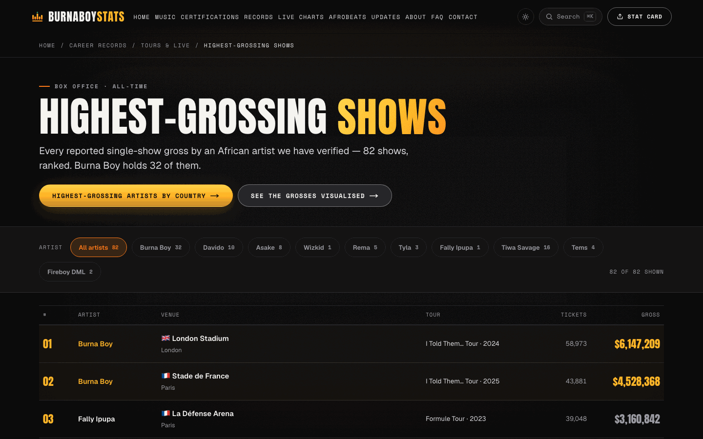

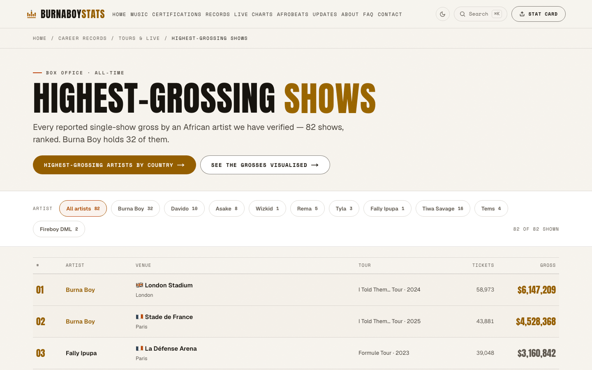

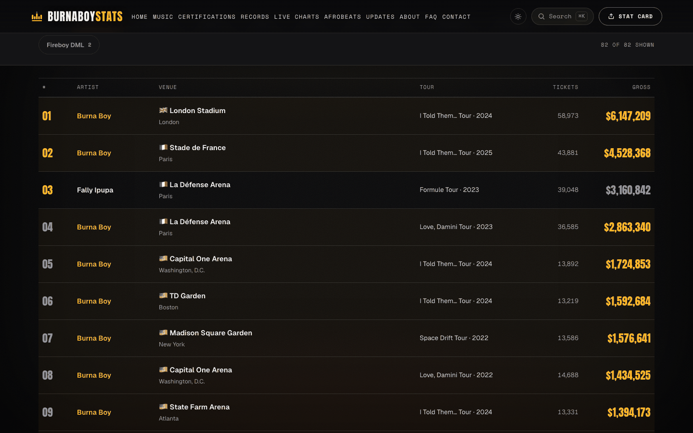

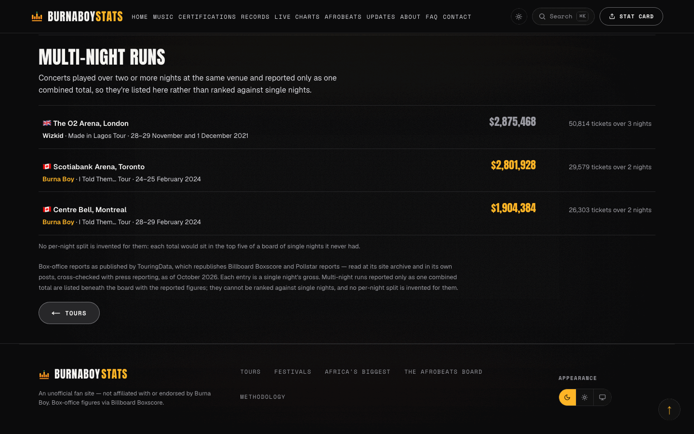

Whole page (about 7,850px): [`revenue-1440-dark.png`](current/revenue-1440-dark.png) · [`revenue-1440-light.png`](current/revenue-1440-light.png) · light crops: [`board`](current/revenue-1440-light-board.png), [`runs`](current/revenue-1440-light-runs.png).

#### Phone (900px and below): Deep Pages screen 14, as built

1. **Back bar:** back → `/records/tours`; label **"HIGHEST-GROSSING"** (#406: the full name cannot sit on one line at 320, so the bar carries its first word; `nowrap`, and below 360 the bar's gaps close to 8px and the badge's tracking eases; measured one line at 320, 360 and 390); gold badge **"$6.15M"** (the No. 1 gross); menu.
2. **Hero:** kicker "Box office, per night" (ember) · h1 "Highest-grossing **shows**" (Anton 40px, 2 lines at every phone width) · lede: "Eighty-two documented shows by African artists, ranked by gross — 32 of them his."
3. **Stat grid:** **$6.15M** BIGGEST NIGHT · **58,973** TICKETS, LONDON (gold).
4. **Full-width gold primary:** "Highest-grossing artists by country →" (wraps to two lines at 390).
5. **Chip rail:** ALL 82 · BURNA BOY 32 · OTHERS 50 (ember when on).
6. **Meta bar:** "82 SHOWS" · legend "● HIS NIGHTS".
7. **82 rows:** rank · venue · one-line meta, ellipsised · gross (`compactGross`, gold if his) over tickets (mono). **Every meta reads "{artist} · {city} · {year}", his included** ("Burna Boy · London · 2024", "Fally Ipupa · Paris · 2023"; #406; until then his read "London · I Told Them… Tour · 2024" and did not name him). No phone row carries the tour now (only his ever did). Other artists' rows carry a 2% wash (about 1.03:1, effectively invisible).
8. **Multi-night runs:** h2 (Anton 26px), the same lede, three rows (flag + place · artist · tour; dates on their own line; "29,579 tickets over 2 nights"; gross right, gold if his).
9. **Foot** (12px, dim, 524 characters): the source sentence, then "The board ranks every reported show by an African artist we have verified, not only his — a missing night means no gross for it was reported, or none we could verify yet. Multi-night runs reported only as one combined total sit beneath the board with the reported figures; no per-night split is invented for them."
10. **Action bar**, gold: **"Make a stat card"** → `/share`.

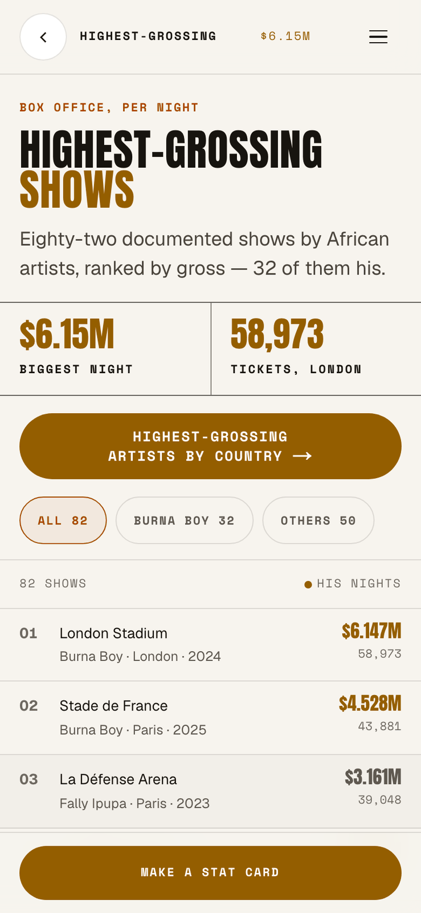

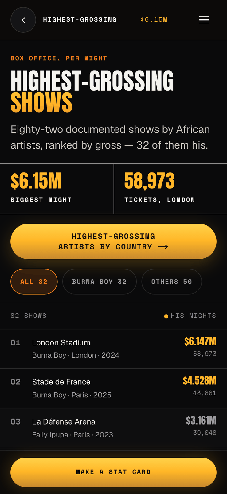

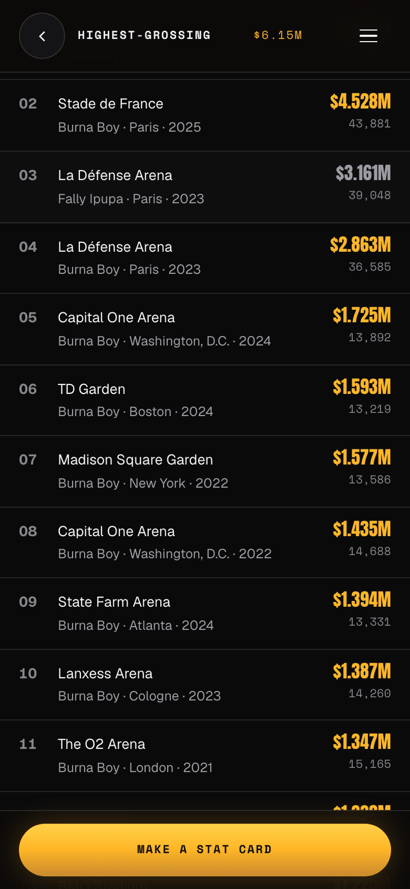

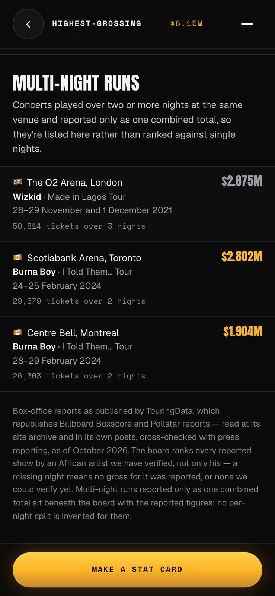

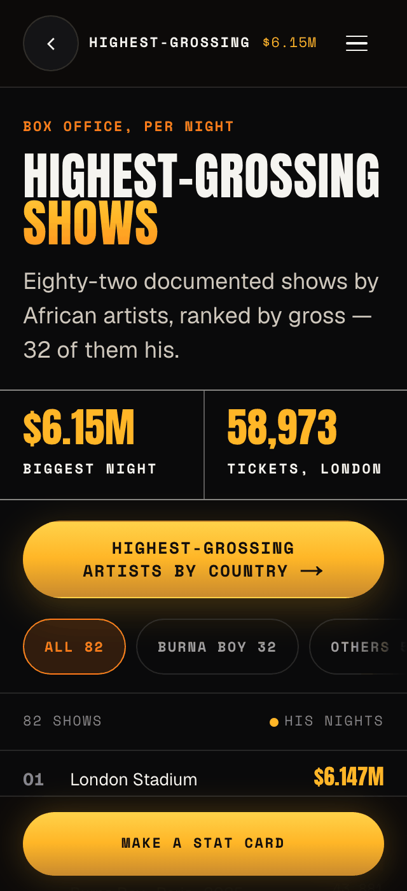

Whole page (6,868px): [`revenue-390-dark.png`](current/revenue-390-dark.png) · [`revenue-390-light.png`](current/revenue-390-light.png).

### 5.2 What is wrong today

**Both layouts**
- **The name arrived; the design didn't.** #406 swapped the words in (no reader-facing "revenue" is left on this page; `tests/highestGrossingShowsName.test.ts` guards it), but the page around the name is the 41-show design: nothing on it says what 82 shows add up to.
- **The hero lists, it doesn't tell.** It never says what the board shows at a glance: **9 of the top 10 are his** (data.md §9), his 32 shows hold **65.7% of the board's gross** ($40,279,755 of $61,287,882), and the board runs 130× from top to bottom.
- **The runs rule is explained three times** (desktop: lede, note, source note's last sentence; phone: lede and foot).
- **Gold on other artists:** desktop ranks 01–03 are gold on every row (rule 5).

**Desktop**
- The design file's h1 has three gold words; the live page has one since #406. Draw one (rule 6).
- The filter chips' edge is `--border`, 1.29:1, under the 3:1 control floor.
- His hovered row paints a 22px gold gross on `--bg-raised`: **4.14:1 on paper**, under AA for that size.
- In the footer, "Methodology" drops to a second row (site chrome; note only).

**Phone** (measured on the live page after #406 at 320 / 360 / 390, with [`measure-phone.js`](research/measure-phone.js); the pre-#406 figures are in [`pages.md`](research/pages.md) E1–E2)
- **The top bar is one line, but it is a stopgap.** The full name "HIGHEST-GROSSING SHOWS" (22 characters, about 175px) cannot fit beside the "$6.15M" badge at 320 or 360, so #406 cut the bar to **"HIGHEST-GROSSING"** (16 characters, 127px) and closed the gaps below 360. It fits at 320 with about 2px to spare (label 70–197px, badge 206–249px, menu 258–302px, 8px minimum gaps). A label that is half the name and a badge that repeats the first tile is the room you have to rethink (§5.5 A).
- **Two gold actions on one screen:** the full-width "Highest-grossing artists by country →" (2 lines at 390) and the gold action bar. The site's rule is one gold action per screen.
- **The hero says the page three times** (kicker, h1, lede) and prints $6.15M twice (badge and tile).
- **Rows still truncate at 320** with no way to read the rest: **5 of 82 rows at 320** (down from 29 before #406 dropped the tour), 0 at 360 and 390: "Burna Boy · Washington, D.C. · 2024", "Burna Boy · Washington, D.C. · 2022", "Burna Boy · Hollywood, FL · 2024", "Tiwa Savage · Silver Spring, MD · 2022", "Tiwa Savage · San Francisco · 2022".
- **His rows are named now (#406), but the marks that stood in for his name stay:** the "● HIS NIGHTS" legend and the 2% wash on everyone else's rows. Decide whether they still earn their place (§5.5 D).
- **Only three filters** on the phone (All · Burna Boy · Others) against eleven on desktop. Your call whether the phone gets per-artist chips; if so, it is a sideways rail, and the third chip is already cut at 320 today.
- **The foot is 9 / 10 / 11 lines** (390 / 360 / 320) and repeats the runs lede just above it. The runs lede is 4 lines; each run row is 4 lines.
- The filter result count changes silently (no live region).

### 5.3 The data

From [`data.md`](research/data.md) §6 and §9 (re-run with `derive.mjs` and `board-extras.mjs`). **Bold = Burna Boy.**

#### The board's own facts

| Fact | Value |
|---|---|
| Single shows on the board | **82**, by 10 artists, 2021–2025, 20 tours |
| His | **32** (39.0%); everyone else 50 |
| His share of the board's gross | **$40,279,755 of $61,287,882 = 65.7%** |
| No. 1 | **Burna Boy · London Stadium, London · 2024 · $6,147,209 · 58,973 tickets** (I Told Them… Tour) |
| His shows in the top ten · top five | **9 · 4** |
| Highest show that is not his | No. 3, Fally Ipupa, La Défense Arena, Paris (2023), $3,160,842 |
| Shows at $1M or more | **18**, 14 of them his |
| Smallest | Fireboy DML · 170 Russell, Melbourne · 2023 · $47,221 · 881 tickets |
| Scale, top to bottom | **130×** |
| Tickets per show | 525 to 58,973 |
| Rows with no headcount | 0 today (the "not reported" dash exists in code for when one appears) |
| "More than every other artist combined" clause | **does not print** (32 is not more than 50); it returns on its own if that changes |
| Source month | October 2026 |

#### Top ten (data.md §9)

| # | Artist | Venue, city | Year | Tickets | Gross |
|---|---|---|---|---|---|
| 1 | **Burna Boy** | 🇬🇧 London Stadium, London | 2024 | 58,973 | **$6,147,209** |
| 2 | **Burna Boy** | 🇫🇷 Stade de France, Paris | 2025 | 43,881 | **$4,528,368** |
| 3 | Fally Ipupa | 🇫🇷 La Défense Arena, Paris | 2023 | 39,048 | $3,160,842 |
| 4 | **Burna Boy** | 🇫🇷 La Défense Arena, Paris | 2023 | 36,585 | **$2,863,340** |
| 5 | **Burna Boy** | 🇺🇸 Capital One Arena, Washington, D.C. | 2024 | 13,892 | **$1,724,853** |
| 6 | **Burna Boy** | 🇺🇸 TD Garden, Boston | 2024 | 13,219 | **$1,592,684** |
| 7 | **Burna Boy** | 🇺🇸 Madison Square Garden, New York | 2022 | 13,586 | **$1,576,641** |
| 8 | **Burna Boy** | 🇺🇸 Capital One Arena, Washington, D.C. | 2022 | 14,688 | **$1,434,525** |
| 9 | **Burna Boy** | 🇺🇸 State Farm Arena, Atlanta | 2024 | 13,331 | **$1,394,173** |
| 10 | **Burna Boy** | 🇩🇪 Lanxess Arena, Cologne | 2023 | 14,260 | **$1,386,581** |

#### Per artist (the chip counts, data.md §9)

| Artist | Shows | Gross of those shows | Best show |
|---|---|---|---|
| **Burna Boy** | 32 | $40,279,755 | $6,147,209 · London Stadium, London (2024) |
| Davido | 10 | $5,915,195 | $1,201,417 · The O2 Arena, London (2024) |
| Asake | 8 | $4,611,475 | $916,954 · Scotiabank Arena, Toronto (2024) |
| Fally Ipupa | 1 | $3,160,842 | $3,160,842 · La Défense Arena, Paris (2023) |
| Tyla | 3 | $2,062,943 | $1,175,124 · Ariake Arena, Tokyo (2025) |
| Rema | 5 | $1,646,360 | $793,707 · Madison Square Garden, New York (2025) |
| Tiwa Savage | 16 | $1,408,214 | $175,420 · The Fillmore, Silver Spring, MD (2022) |
| Tems | 4 | $1,099,834 | $547,697 · Radio City Music Hall, New York (2024) |
| Wizkid | 1 | $1,002,709 | $1,002,709 · Madison Square Garden, New York (2022) |
| Fireboy DML | 2 | $100,555 | $53,334 · Metro Theatre, Sydney (2023) |

#### Multi-night runs (the section under the board)

The three runs in §4.3. Each total would rank No. 4, No. 5 and No. 5 among single shows, which is why they are listed, not ranked.

#### Longest strings (data.md §7, §9)

| Field | Longest real value |
|---|---|
| Venue | "Brisbane Entertainment Centre" (29) |
| City | "Silver Spring, MD" (17) |
| Tour | "We Rise by Lifting Others Tour" (30) |
| Artist | "Fally Ipupa", "Tiwa Savage", "Fireboy DML" (11) |
| Phone meta, **"Artist · City · Year" on every row** (the owner's form) | "Tiwa Savage · Silver Spring, MD · 2022" (38); his longest: "Burna Boy · Washington, D.C. · 2024" (35) |
| The same with the tour added | "Tiwa Savage · Silver Spring, MD · Water & Garri Tour · 2022" (59) |
| Run dates | "28–29 November and 1 December 2021" (34) |
| Gross labels | `compactGross` keeps every pair of neighbours distinct ("$6.147M", "$527.4K"); `usdM` ("$X.XXM") would collide on 22 neighbouring pairs, so don't use it on the phone board |

### 5.4 Direction (your call)

Explore two or three directions (§2.1). Starting points:

- **(a) The record night.** London Stadium, 2024, as the hero: the figure, the venue, the year, the tickets, then "9 of the top 10 are his" and the share. The board follows.
- **(b) The share.** A single bar of the board's total gross split by artist (his 65.7%, then each other artist), which doubles as the artist filter. The board follows.
- **(c) The ladder.** The board itself as ranked bars (length = gross, on the scale rule you choose for $6.1M down to $47K), with exact figures at the end of every bar, so the drop from No. 1 to No. 82 is visible before a figure is read.

Whatever you choose, Job 1 and Job 2 should read as a **pair**: the same hero grammar, the same row grammar, the same run marker, the same money forms.

### 5.5 The new pieces, specified

#### A. The name, and the phone top bar

- **h1:** "Highest-grossing shows", **one split word in gold** (live since #406: "shows"; your call to keep or move it). Desktop and phone. List the design file's old three-gold-word h1 as a change.
- **Phone top bar: one line at 320**, beside the badge. "HIGHEST-GROSSING SHOWS" does not fit (≈175px against ≈129px of label room at 320 with 8px gaps). #406 shipped **"HIGHEST-GROSSING"** (127px, 2px spare) as a stopgap. Keep it, or choose, each a change-list item:
  - another bar label (the bar is a label, not the page name; the h1 carries the name), a word or two that names the page within 16 characters at 320;
  - a different badge (or none), which frees room, especially since the badge repeats the hero's biggest-night figure;
  - the `nowrap` + ellipsis rule the other back bars use (only if nothing important is cut).
  Measure it at 320, 360 and 390 on the artboard.
- **Kicker:** "Box office, per night" is the third statement of the page name; rework or drop it. The family rule puts the ember signature on the kicker's tick, not its text; your call, listed.
- **Breadcrumb, metadata, OG title, JSON-LD names, the board's aria-label**: renamed in code by #406. You set the strings on the two pages you draw; if you change one, Claude Code carries it to the rest ([`pages.md`](research/pages.md) B5 lists every place).

#### B. Hero

- Tells the story (§2.2 item 1) inside y 69–735 at 390: the No. 1 night (artist, venue, city, year, gross, tickets), his share of the board (shows and gross), and the reach (82 shows, 10 artists, $47,221 to $6,147,209). The figures above; draw them as slots.
- The badge and the first tile must not print the same figure twice.
- Lede: if you keep one, **at most 2 lines at 390** and not a restatement of the h1.
- Desktop: the same story, drawn for 1440, not the phone hero widened.

#### C. Artist chips and filters

- **Desktop:** 11 chips with counts today, in the design's order then by count. Keep them, or replace them with your share bar (direction b) as long as every artist stays one tap away. Chip edges must reach 3:1. The active state is not colour alone.
- **Phone:** three chips today (All · Burna Boy · Others). Per-artist chips are your call (a sideways rail, with the edge treatment for a rail that runs off-screen). Every chip ≥ 44px.
- **Both:** filtering never renumbers (a filtered row keeps its board rank). The result count is visible and **announced** (a polite live region). No chip leads to an empty board today; if your design adds a filter that can, draw its empty state.
- State in the URL is optional (code); say if you want it.

#### D. The ranked board rows

**Row spec, every row identical in structure** (rule 15):
- rank (never gold on another artist's row);
- **artist name, in the same position and format on every row, Burna Boy's included**: e.g. "Burna Boy · London · 2024" exactly as "Fally Ipupa · Paris · 2023";
- flag + venue;
- city · year (and the tour, if you keep it: **on every row or on none**, the same way);
- tickets;
- gross: **gold on his rows only**; others in muted or ink, your call, contrast checked.

On the phone:
- **No truncation at 320**: the longest meta in the owner's form is 38 characters ("Tiwa Savage · Silver Spring, MD · 2022"), and 5 rows still ellipsise at 320 today (§5.2). With the tour it is 59. #406 took the tour off his phone rows (no phone row carries it now); bringing it back means its own line on every row, listed. The desktop board keeps its Tour column.
- `compactGross` (or full dollars) so neighbours stay distinct.
- The "● HIS NIGHTS" legend and the near-invisible 2% wash exist because his rows weren't named; now that every row is named (#406), decide whether either still earns its place (listed).

On desktop:
- The artist column already names every artist; keep it. His name sits in the same position, string and type as everyone's, its colour per rule 15; his gross stays gold; the 4% row wash is your call.
- Hover never puts gold text on `--bg-raised` on paper (4.14:1); find a hover that keeps his gross at AA.
- A mini bar per row, if your direction has one, follows your scale rule.

#### E. Multi-night runs

- Heading **"Multi-night runs"** (rule 1), on both layouts; a real h2.
- Three rows (§4.3): flag + venue, city · **artist** (named like every row) · tour · dates · nights · gross (gold if his) · tickets "over N nights". **Nights, never shows.** No rank: they are listed, not ranked. No per-night split, no average.
- **One** explanation of why runs sit apart. Today it is said three times; keep one clear statement where the reader meets the section, and let the foot carry only the source.
- On the phone each row is 4 lines today; target **at most 3 at 390**, with "24–25" never split across lines.
- Use the same run marker as Job 1 piece D.

#### F. The source notes

Keep every fact. Today's desktop note + runs note and the phone foot together say:
1. reports as published by **TouringData**, which republishes **Billboard Boxscore** and **Pollstar**, read at its site archive and in its own posts, **cross-checked with press reporting**, **as of October 2026** (a slot);
2. each board entry is **a single night's gross**;
3. the board ranks **every** reported show by an African artist the site has verified, not only his;
4. a missing night means **no gross was reported, or none could be verified yet**;
5. multi-night runs are reported only as one combined total, listed beneath the board with the reported figures, **not ranked against single nights**, and **no per-night split is invented**;
6. (only while a row lacks a headcount) the dash means not reported.

Target: **one note, at most 5 lines at 390**, in a footnote style (labelled short lines, or a definition list), with fact 5 said once on the page (piece E). No source per row.

#### G. The link to Job 1, and the gold actions

- The link to **Highest-Grossing Artists by Country** stays prominent on both layouts.
- **One gold action per phone screen.** Today the full-width gold link sits above the gold "Make a stat card" bar. Settle it: e.g. the link becomes secondary, or the bar's action changes. The action bar is chrome (not redrawn), so a change to its label or destination is a change-list item with your reason.
- Desktop: one primary in the hero. "See the grosses visualised →" stays reachable.

#### H. The way back

"← Tours" (desktop) and the phone back bar (→ `/records/tours`) stay.

#### I. Link-preview (OG) card

- Today: kicker "Box office", title "Highest-Grossing Shows" (renamed in #406), sub "Every verified single-show gross by an African artist — 82 shows, ranked" (count derived). The text was swapped; the card was never designed for this page.
- **Draw the card for "Highest-grossing shows"**: gold, the lockup, the shared template's frame (or your change to it, listed so `OG_ART` is bumped). Figures are slots. A printed path is lowercase (`BURNABOYSTATS.COM/records/tours/revenue`).
- Job 1's and Job 2's cards should read as a pair.

### 5.6 Every state and edge case to draw

| State | Desktop 1440 | Phone 390 | Notes |
|---|---|---|---|
| Default, full page | ✓ light + dark | ✓ light + dark | |
| First screen with the sum marked | ✓ | ✓ (y 69–735) | |
| 1024 band | ✓ dark | | Tour column drops today |
| 320: top bar, hero, longest row | | ✓ | one-line bar; no truncated row |
| Filter: Burna Boy | ✓ | ✓ | ranks keep their board numbers |
| Filter: an artist with one show (Fally Ipupa or Wizkid) | ✓ | ✓ if per-artist chips | |
| Filter: Others (phone) or Tiwa Savage, 16 small shows | ✓ | ✓ | |
| Row: No. 1 (his), No. 3 (Fally Ipupa), the smallest (Fireboy DML, $47,221) | ✓ | ✓ | scale; names; gold only on his |
| Row: longest venue ("Brisbane Entertainment Centre") and longest meta (Tiwa Savage, Silver Spring, MD) | ✓ | ✓ | |
| Row with no headcount (the dash; none today) | ✓ | ✓ | |
| Hover, focus, pressed | ✓ both themes | pressed | AA on paper |
| Multi-night runs | ✓ | ✓ | |
| Chip focus and the announced count | ✓ | ✓ | |
| OG card | 1200 × 630 | | |
| Reduced motion | note | note | |

### 5.7 What not to do

- **No "revenue"** in new copy. No "Revenue per show" anywhere you draw.
- **No gold on another artist's rank, name or figure.** No three-word gold h1.
- **No unnamed rows.** His rows name him, in the same place and form as everyone's.
- **No truncated row at 320**, no hidden row, no accordion, no "show more", no "top 10 + expand".
- **Don't rank the runs among single nights**, split them, or average them.
- **Don't renumber on filter.**
- **Don't print a source per row.**
- **Don't redraw the phone chrome**; list label or destination changes.

### 5.8 Artboards to add or update

- **New canvas:** `designs/desktop/Highest-Grossing Shows.dc.html`: the direction thumbnails, desktop 1440 (+ 1024) and phone 390 (+ 320), light and dark, every state in §5.6, and the OG card.
- **Superseded:** `designs/desktop/Records - Revenue Per Show.dc.html` (excerpt [`records-revenue-per-show-FULL.dc.html`](artboards/records-revenue-per-show-FULL.dc.html): breadcrumb 93, h1 102, lede 103, source note 137). The old file stays, with a one-line pointer to the new canvas at its top.
- **Edited in place:** Deep Pages screen **14** (excerpt [`mobile-14-revenue-lines-405-453.html`](artboards/mobile-14-revenue-lines-405-453.html): top-bar title 411, hero 415–419, source note 446, action bar 448–450), redrawn to the new default state, with a note that the states live on the new canvas.
- **Names only, edited in place** (no redesign, rule 14). The live code already carries these since #406 ("Highest-grossing shows" in each place, "ranked by reported gross" on the Tours card); the design files still say "Revenue per show", so bring them in line:
  - `Records - Tours.dc.html` lines 199–230 ([excerpt](artboards/records-tours-highest-grossing-lines-199-230.html)): the link card's title, and line 225 "ranked by reported revenue" → gross wording;
  - Deep Pages screen **12**, "More from the road" ([excerpt](artboards/deep-pages-12-more-from-the-road-lines-284-308.html), the link at 293–299): "Revenue per show" → the new name; add a row for Job 1 only if you want one (listed);
  - `Records.dc.html` lines 144–183 ([excerpt](artboards/records-hub-revenue-lines-144-183.html)): the h2 "Highest revenue per show" (149);
  - Mobile screen **04** lines 455–471 ([excerpt](artboards/mobile-04-records-shows-lines-455-471.html)): check only; its label and lede must agree with the renamed page.

---

## 6. Job 3: certifications phone density

> **Add-on, 4 Oct 2026 (owner):** keep Burna Boy's portrait at the **top right of the certifications hero**, behind the type, on phone and desktop. The image and the live values are in [PORTRAIT-CERTS-HERO.md](PORTRAIT-CERTS-HERO.md) and [assets/burna-boy-portrait-640.jpg](assets/burna-boy-portrait-640.jpg).

The phone certifications screen (`/certifications`, `MobileCerts`) and the same component on every `/afrobeats/<artist>` page. **Phone only**; the desktop certifications page is reference (§6.5). Keep every fact; make it scan. Full detail: [`pages.md`](research/pages.md) C1–D.

### 6.1 What exists today

**`/certifications`, phone, top to bottom:**
1. Back bar: back → `/`, label **"CERTIFICATIONS"** (one line, ellipsis rule), **muted** count (249 today, recounted per view), menu.
2. Hero, with the faded portrait: the **adaptive kicker** (gold text today) · **the total is the h1**: "249" (Anton 86px, gold) with the unit stacked beside it, "AWARDS" over "26 COUNTRIES" · the lede · four tier bars (Diamond, Platinum, Gold, Silver; count, %, a bar in the tier's colour).
3. **The switch row** (#404, `/compare`'s style): **"FEATURES"** + a 30 × 16 track + **"ON · EVERY PLAQUE HELD"** / "OFF · LEAD CREDITS ONLY"; **"NIGERIA"** (the artist's home country, in full) + track + **"INCLUDED"** / "LEFT OUT". Both default on. State lives in the URL fragment (`#feat=0`, `#home=0`). A flip never moves the switch under the finger.
4. Tier rail (All · Diamond · Platinum · Gold · Silver, each with a count), "MOST-CERTIFIED RELEASES", Albums and Songs (first 10 rows, then the existing "All 93 releases +83" button), the board buttons, the owner-approved "Compare with…" fold, the dated log, the action bar (gold "Compare ↗", "Stat card", filter icon).

**The adaptive kicker** (same words as the desktop eyebrow):

| Features | Home country | Kicker |
|---|---|---|
| on | included | **Certified worldwide** |
| on | left out | **Outside Nigeria** |
| off | included | **Worldwide · Lead credits** |
| off | left out | **Outside Nigeria · Lead credits** |

It must stay **one line at 320** for every artist: the longest, "Outside South Africa · Lead credits" (Tyla), measures 278px in a 284px box (**6px spare**). A test (`tests/certKicker.test.ts`) guards it.

**What recounts when a switch flips:** the bar count, the kicker, the h1 total and its unit ("177 international awards / 25 countries"), the lede, the tier bars, the tier chips and the list. The dated log does not (its lede tail changes). A polite live region announces "177 international certifications across 25 countries".

**`/afrobeats/<artist>`, phone:** the same component, with the artist's name in the back bar (longest "TIWA SAVAGE", "BLACK SHERIF", "FIREBOY DML"; all fit at 320), the artist's portrait and brand (Ayra Starr's purple is page-only), **a much longer lede**, no dated log, a "Common questions" FAQ, and the action bar "Compare <Name> ↗". Black Sherif and Seyi Vibez get no home switch (it would change nothing); BNXN and Tiwa Savage reach an **empty list** with both switches off ("Nothing matches these filters." + "Clear filters").

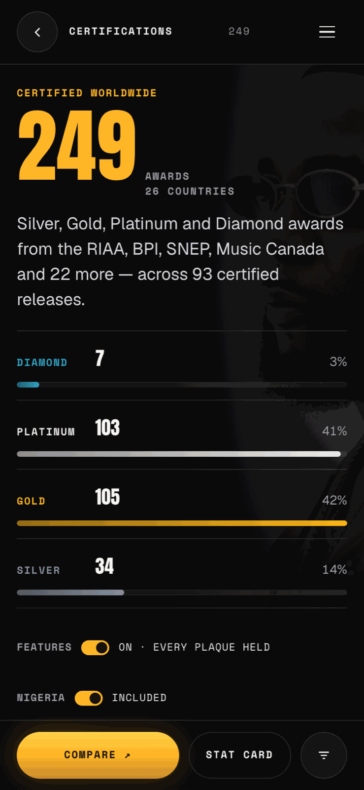

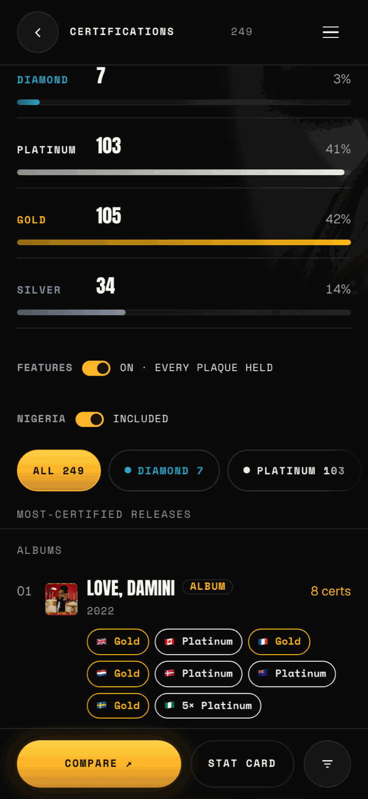

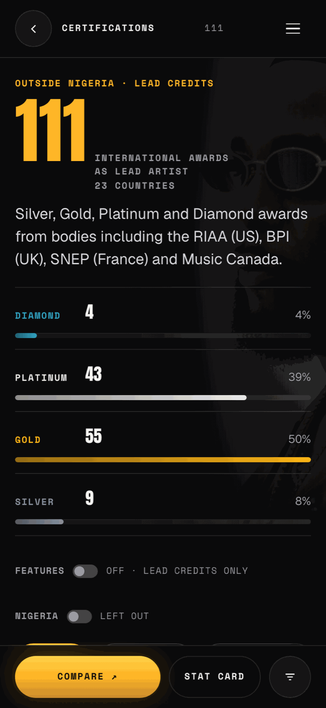

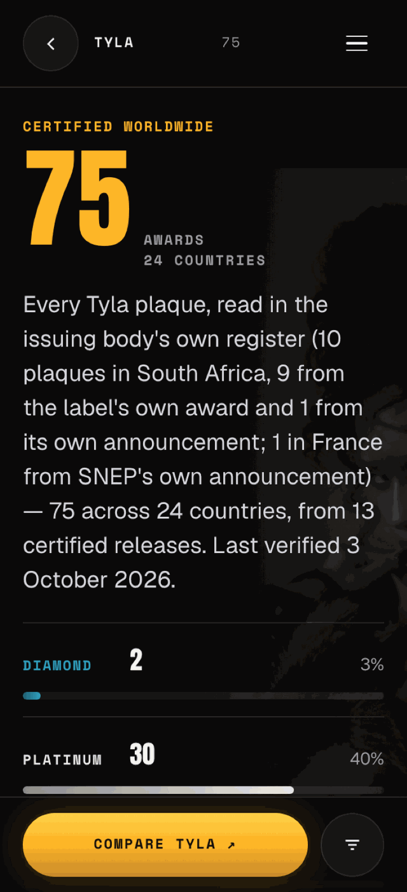

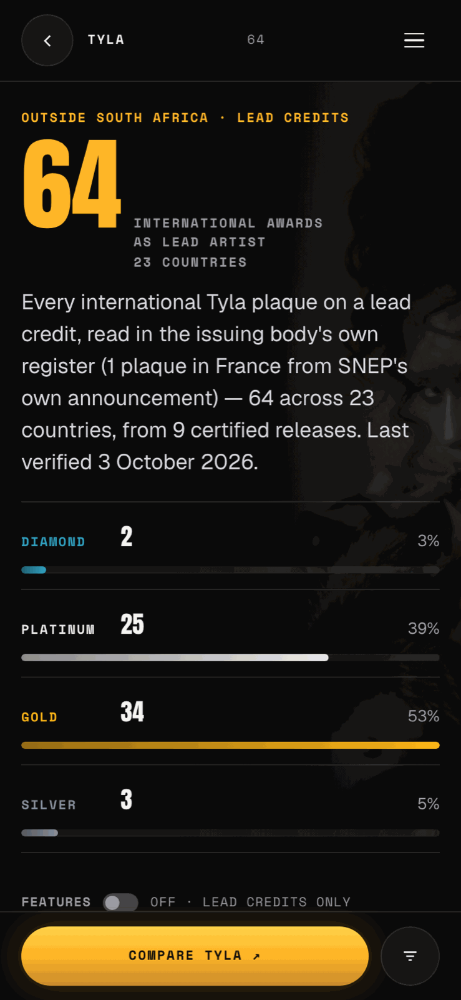

Light versions and the remaining crops: [`certifications-390-light-first`](current/certifications-390-light-first.png), [`certifications-390-light-switches`](current/certifications-390-light-switches.png), [`certifications-390-light-feat0-home0-switches`](current/certifications-390-light-feat0-home0-switches.png), [`certifications-320-dark-topbar`](current/certifications-320-dark-topbar.png), [`tyla-390-light-first`](current/tyla-390-light-first.png), [`tyla-390-dark-switches`](current/tyla-390-dark-switches.png), and the full pages [`certifications-390-dark`](current/certifications-390-dark.png), [`tyla-390-dark`](current/tyla-390-dark.png).

### 6.2 What is wrong today

Measured at 320 / 360 / 390 ([`pages.md`](research/pages.md) E4; switch row simulated with #404's CSS):

| Problem | Today |
|---|---|
| **Artist ledes are long** | Tyla (275 characters, with the provenance parenthesis): **9 / 8 / 7 lines** (243 / 216 / 189px). Tiwa Savage, Fireboy DML, Black Sherif (147–151 characters): 5 / 4–5 / 4 lines. Burna Boy (124): 5 / 4 / 4 |
| **The switch row is tall and late** | Two switches on two rows at every phone width: **106px** (two 44px rows and a 10px gap; about 210px in the 2× screenshots). On Burna Boy's screen it starts at the foot of the first screen, under the tier bars, so a reader doesn't see that the view can change. On Tyla's it is below the first screen |
| **The kicker has no room** | 6px spare at 320 for South Africa. Any change to its font, size, tracking or the hero padding means re-measuring |
| **The unit under the total** | Up to four words ("INTERNATIONAL AWARDS AS LEAD ARTIST") stacked on three lines beside a three-digit number |
| **Ledes repeat** | The all-view lede repeats the release count ("across 93 certified releases"), which "All 93 releases" repeats; the narrowed lede repeats what the tier bars show |
| **The dated log lede** | Two to three sentences at 13.5px before the year chips |
| **The switch track when off** | 1.95:1 against the page (under 3:1). The state word carries the state, so it passes on meaning, but the control's edge doesn't |

### 6.3 Targets (keep every fact)

- **Ledes:** Burna Boy's at most **3 lines at 390**; the artist pages' at most **4 lines at 390**, Tyla's included. The facts in Tyla's parenthesis (10 plaques in South Africa, 9 from the label's own award and 1 from its own announcement; 1 in France from SNEP's own announcement) and the "Last verified" date are owner-ruled provenance: **they stay visible on the screen**, but they may move out of the lede into a short provenance line in a caption or footnote style. Same for any artist with off-register plaques.
- **The switch row** is on the first screen at 390 for Burna Boy, and directly after the hero for the artist pages, at **no more than 96px**, with both state words still words ("on · every plaque held" / "off · lead credits only", "included" / "left out"; you may tighten the wording, listed, as long as the state is a word, not gold alone). A switch that would change nothing is still not drawn.
- **The kicker** keeps its four wordings and stays one line at 320 for "Outside South Africa · Lead credits". If you change its type, show the measurement.
- **The unit** under the total fits in two lines beside a three-digit total.
- **No new fold.** "Compare with…" (the owner-approved fold) and "All 93 releases" stay as they are.
- **The top bar:** already one line; keep it so for the longest names.
- **Draw the empty state** (BNXN or Tiwa Savage, both off) and the off states.

### 6.4 What not to do

- Don't drop a fact to save a line: move it, set it smaller, or label it.
- Don't change the switch order (Featured appearances first, then the home country) or their URL state.
- Don't gild the tier colours (data colours are never the brand gold) or recolour Ayra Starr's brand.
- Don't touch the desktop certifications page in this job.

### 6.5 Artboards to update

All **edited in place**:
- Mobile screen **02** ([excerpt](artboards/mobile-02-certifications-lines-239-315.html): top bar 243–250, kicker 253, lede 258, tier chips 275–279; data 976–996, 1184–1210): the switch row placed, the adaptive kicker in its four wordings, the lede and unit cut to fit.
- `Afrobeats - Mobile Artist.dc.html` ([excerpt](artboards/afrobeats-mobile-artist-lines-40-279.html)): phone A (an all-home-market shape, Seyi Vibez, 40–177) and phone B (a global shape, Omah Lay, 179–271): the same switch row and kicker; the lede, the provenance line and the notes (273–279) cut to fit.
- The states (each artist's longest lede, the empty state, the off states, 320 checks) go on a new canvas, `designs/mobile/Certifications Phone Density.dc.html`.
- Desktop reference only: [`certifications-hero-filters-lines-97-158.html`](artboards/certifications-hero-filters-lines-97-158.html), [`certifications-sources-lines-218-222.html`](artboards/certifications-sources-lines-218-222.html), and the screenshots [`certifications-1440-dark-switches`](current/certifications-1440-dark-switches.png), [`certifications-1440-dark-feat0-home0-first`](current/certifications-1440-dark-feat0-home0-first.png). If you think the desktop switch row needs work, raise it as a question.

---

## 7. Design system: extend it, don't replace it

- Don't invent a new visual language. The full, cited reference is [`research/design-system.md`](research/design-system.md); what matters most follows.
- Every screen in **both themes**. Dark is the default; paper is a full theme. Every colour is a token written once as `light-dark(LIGHT, DARK)`.
- **Desktop and phone are separate designs**, split at 900px. Bands: phone ≤ 900; the "1024 band" 901–1239 (menu button instead of inline nav, display type steps down); desktop ≥ 1240. Design desktop at 1440 and check at 1024; design phone at 390 and check at 320.

### 7.1 Type

| Role | Face | Used for |
|---|---|---|
| Display | **Anton 400** (no bold), uppercase except the country names | h1, h2, figures, grosses, continent and country names |
| Body | **Geist** | venues, meta lines, ledes, notes |
| Labels | **Space Mono 400/700**, tracked, uppercase | kickers, eyebrows, back-bar labels, chips, column heads, the switch row. **Never a sentence** |

| Token | Size / line height | Job |
|---|---|---|
| `--type-lede` | 18px / 1.5 (20px at ≥ 900) | page opener |
| `--type-body` | 16px / 1.6 | prose |
| `--type-small` | 13.5px / 1.5 | list meta, notes under figures |
| `--type-caption` | 12.5px / 1.45 | provenance, footnotes, phone meta |
| `--type-label` | 11px / 1.2, 0.11em | mono labels |
| `--measure` | 62ch | maximum prose width |

**Floor 11px everywhere.** Figures use tabular numerals. Off-scale sizes in scope today (12px phone foot, 13px desktop notes, 14.5px artist name, 11.5px eyebrow): move them onto the scale where you touch them, and list it.

Display sizes today: board h1 84px (61 in the 1024 band, 40 on the phone); section h2 38px (26 phone); continent h2 40px (34); country h3 26px (20 phone); row gross Anton 22px (17 phone); certs total Anton 86px.

### 7.2 Colour (light | dark)

| Token | Light | Dark | Role |
|---|---|---|---|
| `--bg` | `#f7f4ee` | `#0a0a0b` | page |
| `--bg-soft` | `#ffffff` | `#141416` | card, panel, filter band |
| `--bg-soft-2` | `#efeae1` | `#1c1c21` | well, track |
| `--bg-raised` | `#e6e0d4` | `#24242a` | hover and pressed (presses in on paper) |
| `--line` | `rgba(23,20,15,.12)` | `rgba(245,244,240,.12)` | decorative hairline, board row separators (1.31:1) |
| `--rule` | alpha .48 | alpha .38 | structural line (3.30:1) |
| `--btn-edge` | `rgba(23,20,15,.55)` | `rgba(245,244,240,.42)` | control boundary (≥ 3:1) |
| `--text` | `#17140f` | `#f5f4f0` | ink |
| `--text-body` / `--text-body-cool` | `#4a443b` | `#cfc7bb` / `#d8d8de` | reading text |
| `--text-muted` | `#5f584f` | `#9b9ba3` | other artists' grosses, column heads (6.39 / 7.17 on `--bg`) |
| `--dim` | `#6f685f` | `#85858e` | smallest meta (5.01 / 5.41) |
| `--gold` / `--gold-fill` | `#945e00` | `#ffb627` | **his** figures; actions; the badge; the switch track when on |
| `--gold-bright` / `--gold-dim` | `#945e00` | `#ffd24a` / `#c98a2e` | top / bottom of the fill ramp |
| `--gold-hit` | `#5f3c00` | `#ffd24a` | hover fill on maps |
| `--ink-on-gold` | `#ffffff` | `#14100a` | label on gold |
| `--ember` | `#b34700` | `#ff7a1a` | the Records family's signature: the eyebrow's tick (5.01 / 7.59) |
| `--green` / `--green-dot` | `#146b3c` / `#1f9a5a` | `#3ed17f` | live, verified |
| `--map-played` / `--map-land` / `--map-border` / `--map-sea` | `#a3742a` / `#efeae1` / `rgba(23,20,15,.22)` / `#ffffff` | `#a07820` / `#26262c` / `rgba(245,244,240,.14)` / `#141416` | **if you draw a map**: data 3.44 / 3.73 against land, borders kept quiet |

**Colour rules:**
- **One gold on paper, `#945e00`**, for text and fills. The fill ramp is `linear-gradient(180deg, --gold-bright 0%, --gold-fill 48%, --gold-dim 100%)`; flat `#945e00` with a white label on paper.
- **Gold text on paper fails on `--bg-raised` (4.14:1).** Never put his gold gross on a light hover surface at under 24px.
- **Tier colours and other data colours are never the brand gold.** The tier gold `#FBB417` is not `--gold`.
- **Dark-only effects** (glows, vignette, grain) vanish on paper; don't rely on them.
- **Washes** scale with `--wash-strength` (0.42 on paper, 1 on black). Today: desktop his-row wash 4%; phone other-artist wash `--text` 2% (about 1.03:1, invisible); revenue chip on-state ember 16%.
- **A new colour is a new token pair in `globals.css`, with a reason.** A test fails any colour literal in a page's styles. If you need, for example, a bar track or a "not reported" continent fill, propose the pair and its contrast.

### 7.3 Shape, spacing, motion

- Radius 6px (cards), 4px (small), 999px (pills, chips, the switch track, back circle, action-bar buttons). Board rows have **no radius and no card**: full-bleed bands on `--line` hairlines, a 2px rule under the head row.
- Spacing scale **4 · 8 · 12 · 16 · 24 · 32 · 48 · 64 · 96 · 128** (declared, unused today; modules use literal px). Please design on it.
- Containers: the gross pages use **1360px with 40px gutters**; the phone gutter is **18px**.
- Motion: 0.15 / 0.2 / 0.3s, `cubic-bezier(.22,1,.36,1)`. Reduced motion settles to the final state.
- Hover is `--bg-raised`, which presses in on paper. No glows on hover.

### 7.4 Controls and states

- **Buttons:** 46px, 26px side padding, pill, Space Mono 700 13px / 0.08em uppercase. **Primary** = the gold fill, one per screen. **Secondary** = `--btn-face` + `--btn-edge`. Keep the iPhone guard on any new button (labels have rendered blank or orange on iPhones without it).
- **The link rule:** filled = the one primary action in a section; outlined = its secondary; **↗** = a stand-alone link to another page; **→** = a card or full-width row that is itself the link; no arrow = utility.
- **Chips:** phone 44px, mono 700 11px; desktop 40px, Geist 600 13px with a mono count. On-state today: an ember wash with an ember border and label (revenue) or a gold wash (generic). Pick one for both gross pages and give the reason.
- **The `/compare` switch** (certs): 30 × 16 track, 12px knob, name in muted mono 700, state word beside it; on = gold track, `--ink-on-gold` knob; 44px row.
- **Focus:** 2px solid `--gold` ring at 2px offset; rows get an inset 2px `--gold` ring.
- **Not reported:** an em dash in `--dim`.
- **Tap targets:** 44px on the phone, 24px with a mouse.

### 7.5 Tests the design must keep passing (or name the one to change)

| Test | What it holds |
|---|---|
| `goldMarksHisRows.test.ts` | gold grosses mark **his** rows only, on both boards and the countries page |
| `revenueSources.test.ts` | every row carries a source in the data; **no page prints one**; Ziggo Dome 2022 stays off the board |
| `revenueGrossLabels.test.ts` | no two neighbouring rows with different grosses print the same compact label |
| `multiNightRuns.test.tsx` | both layouts head the runs "Multi-night runs" with the shared lede; every run names its artist; "nights", not "shows" |
| `revenueByCountry.test.ts`, `revenueCountriesPage.test.tsx` | totals, leaders and continents are derived; the page shows Africa |
| `certKicker.test.ts`, `certViewSwitches.test.tsx`, `certLabels.test.tsx` | the kicker's four wordings and its one-line budget at 320; switch roles, states and order; every label over a recounted number adapts |
| `cssColourTokens.test.ts` | no colour literal in page styles |
| `mobileLinkParity.test.ts` | a link on one layout exists on the other |
| `mobileHeroOrder.test.ts` | the phone hero's running order (the figure leads) |
| `seoAudit.test.tsx` | one visible h1 per layout |
| `highestGrossingShowsName.test.ts` (#406) | no reader-facing string says "revenue per show" or "highest revenue"; the scatter on `/records/visualized` says "gross" |
| `revenueRowsNameArtist.test.tsx` (#406) | every phone board row's meta starts with its artist, his included (the artist-name rule, §3 rule 15) |

If your design changes a guarded string (for example the runs lede, if you say it once differently), list the test and the new string.

---

## 8. Phone chrome: don't redraw it; place content around it

| Route | Top bar | Bottom bar |
|---|---|---|
| `/records/tours/revenue/countries` | back bar → the board; label "BY COUNTRY"; gold badge "12 countries"; menu | gold action bar "Every show, ranked" → the board |
| `/records/tours/revenue` | back bar → `/records/tours`; label "HIGHEST-GROSSING" (#406; one line, `nowrap`); gold badge "$6.15M"; menu | gold action bar "Make a stat card" → `/share` |
| `/certifications` | back bar → `/`; "CERTIFICATIONS" (one line, ellipsis); **muted** count; menu | gold "Compare ↗", outlined "Stat card", 50px filter icon |
| `/afrobeats/<artist>` | back bar → `/afrobeats`; the artist's name (ellipsis); muted count; menu | gold "Compare <Name> ↗", filter icon |

None of these screens shows the five-tab bar (excerpt for reference: [`phone-chrome-tab-bar-lines-227-234.html`](artboards/phone-chrome-tab-bar-lines-227-234.html)).

| Part | Size |
|---|---|
| Back bar | **69px** + safe area; sticky; 44px back circle, mono 700 11px label, badge or count on the right, 44px menu; `--scrim` with a 14px blur |
| Label room beside the badge | ≈ 169px (21 characters) at 375 with "$6.15M"; at 320 ≈ 114px (14 characters) with the usual 12px gaps, ≈ 129px (16 characters) with the 8px gaps the two gross screens use below 360. Both gross screens' labels are `nowrap` (#405, #406); the certs and shared back bars ellipsise |
| Action bar | **75px** + safe area (≈ 109 with a 34px home indicator); fixed; one 50px gold pill, optionally a secondary and a 50px icon |
| Spacer above the action bar | revenue 104px, certs 110px |

**One gold action per screen** is the site's rule (and the action bar's own code comment). The phone board breaks it today (§5.5 G). A sticky jump control (§4.5 G) sits **under** the back bar and never over it; the back bar is z 5, the action bar z 40.

---

## 9. Out of scope

- **Any page not named here**, beyond the name and wording changes in §5.8.
- **The desktop certifications page** (reference only, §6.5).
- **The masthead, the footer, the menu sheet, the five-tab bar** (and their labels).
- **The data itself:** which shows are on the board, the Ziggo Dome ruling, the sources. Pending reports join through the data, not the design.
- **New data the site doesn't have:** per-night splits of runs, attendance for unreported nights, African box office, a city coordinates table.
- **The code-only fixes** Claude Code will make whatever you draw: the footer source line on both gross pages ("Box-office figures via Billboard Boxscore."); the dead `.stand` ≤ 720 rule. (The rename in metadata, JSON-LD, search, the Records hub and the footers, [`pages.md`](research/pages.md) B5, shipped in #406.)

---

## 10. Deliverables

**Every artboard in light and dark** unless marked. **Phone at 390 × 844** in iPhone frames (with 320 checks for tight copy; existing 402 files keep their frame, §1). **Desktop at 1440**, with a **1024** check. Every figure is a **slot** (dashed magenta), sized for its longest real value (§4.3, §5.3).

**Where each job's artboards go** (paths from the bundle root, `design_handoff_burnaboystats/`). "Edited in place" means you change that file and nothing else in it; "superseded" means the old file stays, with a one-line pointer to its replacement at its top.

| Job | New file | Existing files |
|---|---|---|
| 1. Highest-Grossing Artists by Country | `designs/desktop/Highest-Grossing Artists by Country.dc.html`: thumbnails, rationale, desktop 1440 + 1024, phone 390 + 320, every §4.6 state, the OG card | none edited (parts kit read only) |
| 2. Highest-grossing shows | `designs/desktop/Highest-Grossing Shows.dc.html`: thumbnails, rationale, desktop 1440 + 1024, phone 390 + 320, every §5.6 state, the OG card | `designs/desktop/Records - Revenue Per Show.dc.html`: **superseded**. Deep Pages screen 14: **edited in place** to the new default. `Records - Tours.dc.html`, `Records.dc.html`, Deep Pages 12, Mobile 04: **names only, edited in place** (§5.8) |
| 3. Certifications phone density | `designs/mobile/Certifications Phone Density.dc.html`: before/after, every state, 320 checks | Mobile screen 02 and `Afrobeats - Mobile Artist.dc.html`: **edited in place** (§6.5) |

If a canvas gets heavy, split its states into a companion canvas linked from its top (as the tour-map response did) and say so.

**Per job, at least:**
1. **Job 1:** the thumbnails (2–3) and the rationale; the full page at 1440 and 390 in both themes; the 1024 check (dark); the 320 hero; every state in §4.6; the OG card.
2. **Job 2:** the same, with every state in §5.6; the phone top bar measured at 320 / 360 / 390.
3. **Job 3:** Burna Boy's screen and two artist screens (Tyla, and one of Tiwa Savage / Fireboy DML / Black Sherif) at 390 and 320, in both themes, in the default and both-off states; the empty state (BNXN or Tiwa Savage, both off); line counts written beside each lede.

**In every job:**
1. **The self-check** from §2.3, ticked, at the top of your response.
2. **A design response**, written by you: `design_handoff_burnaboystats/docs-design/design-response-box-office-by-country.md`. Start from the skeleton [`artboards/templates/design-response-box-office-by-country.md`](artboards/templates/design-response-box-office-by-country.md); the closest worked example is [`design-response-tour-map-and-phone-screens.md`](artboards/templates/design-response-tour-map-and-phone-screens.md). It holds:
   - the direction thumbnails for each gross page and why you chose one;
   - the reasoning, page by page, in the order the page reads;
   - the scale rule for every bar or map, and why;
   - the first-screen sums at 390 × 844 (and the fold at 1440 × 900);
   - each new token with its light and dark values and contrast, and every contrast pairing you checked (hover included);
   - the slots table: every slot, its longest real value, where it breaks first and what happens;
   - interaction notes: chips, jump navigation, focus order, what is announced, reduced motion;
   - **a numbered change list for the owner to approve**, numbered once across all three jobs: every addition, move, removal and rewording; every gold move (including the desktop rank numerals, and the design file's three-gold-word h1 that the live page already cut to one); every label or destination change to phone chrome; every test that has to change; anything you decided that the brief left open;
   - **questions for the owner**, batched, each with your default so a "yes" settles it (South America, for one);
   - any place where your copy of an artboard differed from its excerpt in `artboards/`.
3. **A paste-ready prompt for Claude Code**, written by you: `design_handoff_burnaboystats/PROMPT-BOX-OFFICE-BY-COUNTRY.md`, from the skeleton [`artboards/templates/PROMPT-BOX-OFFICE-BY-COUNTRY.md`](artboards/templates/PROMPT-BOX-OFFICE-BY-COUNTRY.md) (worked example: [`PROMPT-ON-THIS-DAY.md`](artboards/templates/PROMPT-ON-THIS-DAY.md)): read order, the rules, **one commit per job** and what each must pass, the do-nots, the verify steps. **Write it once the owner has approved the change list**, as last time.
4. **A `START-HERE.md` entry** pointing to the canvases, the response and the prompt.

---

## 11. How to give it back

As last time:
1. **Export the whole project as a zip**, `design_handoff_burnaboystats.zip`, with the new and edited canvases, `docs-design/design-response-box-office-by-country.md` and the `START-HERE.md` entry inside it.
2. **Also hand back the response `.md` on its own**, so the owner can read the change list without unzipping.
3. The owner reviews the change list and answers the questions. Then write `PROMPT-BOX-OFFICE-BY-COUNTRY.md`, add it to the bundle, and export the zip again.

Nothing is built until the owner approves the change list.

---

## 12. Screenshots, in brief order

All from the live site on 4 Oct 2026. Most were shot 00:10–01:45 BST, after #403, #404 and #405 deployed. **Every `revenue-*` shot and the desktop countries shots `countries-1440-*-first`, `-africa`, `-foot` and the two desktop full pages were retaken after #406 went live** (02:01–02:45 BST), so they show the new name, the one gold word and the named phone rows; nothing else on those pages changed in #406. Phone = 390 × 844 at 2× (crops 739 × 1600); the 320 shots 640 × 1400; desktop 1440 × 900 (full pages scaled to 1000 wide). Every PNG is cut to a 256-colour palette, so the dark grain and the photos band slightly; that is the compression, not the site. Full captions and the method: [`current/README.md`](current/README.md). **Take figures from §4.3 and §5.3, never from a screenshot.**

**Job 1, Highest-Grossing Artists by Country**
1. [countries-1440-dark-first](current/countries-1440-dark-first.png) · [light](current/countries-1440-light-first.png): desktop first screen.
2. [countries-1440-dark-continents](current/countries-1440-dark-continents.png) · [light](current/countries-1440-light-continents.png): the continent cards and the US table.
3. [countries-1440-dark-africa](current/countries-1440-dark-africa.png) · [light](current/countries-1440-light-africa.png): the cards with the hero above.
4. [countries-1440-dark-canada](current/countries-1440-dark-canada.png) · [light](current/countries-1440-light-canada.png): Canada and the UK.
5. [countries-1440-dark-uk](current/countries-1440-dark-uk.png) · [light](current/countries-1440-light-uk.png): UK, France, Germany.
6. [countries-1440-dark-foot](current/countries-1440-dark-foot.png) · [light](current/countries-1440-light-foot.png): Asia, the method note, the back row.
7. [countries-1440-dark](current/countries-1440-dark.png) · [light](current/countries-1440-light.png): the whole page.
8. [countries-390-dark-first](current/countries-390-dark-first.png) · [light](current/countries-390-light-first.png): phone first screen.
9. [countries-390-dark-continents](current/countries-390-dark-continents.png) · [light](current/countries-390-light-continents.png): the continent rows.
10. [countries-390-dark-africa](current/countries-390-dark-africa.png) · [light](current/countries-390-light-africa.png): Asia, Africa, the US block.
11. [countries-390-dark-canada](current/countries-390-dark-canada.png) · [light](current/countries-390-light-canada.png): Canada and the UK.
12. [countries-390-dark-uk](current/countries-390-dark-uk.png) · [light](current/countries-390-light-uk.png): the UK, France, Germany.
13. [countries-390-dark-foot](current/countries-390-dark-foot.png) · [light](current/countries-390-light-foot.png): the Tyla countries and the method note.
14. [countries-320-dark-topbar](current/countries-320-dark-topbar.png) · [light](current/countries-320-light-topbar.png): the first screen at 320.
15. [countries-390-dark](current/countries-390-dark.png) · [light](current/countries-390-light.png): the whole phone page.

**Job 2, Highest-grossing shows**

16. [revenue-1440-dark-first](current/revenue-1440-dark-first.png) · [light](current/revenue-1440-light-first.png): desktop first screen.
17. [revenue-1440-dark-board](current/revenue-1440-dark-board.png) · [light](current/revenue-1440-light-board.png): rows 01–09.
18. [revenue-1440-dark-runs](current/revenue-1440-dark-runs.png) · [light](current/revenue-1440-light-runs.png): Multi-night runs and the notes.
19. [revenue-1440-dark](current/revenue-1440-dark.png) · [light](current/revenue-1440-light.png): the whole page.
20. [revenue-390-dark-first](current/revenue-390-dark-first.png) · [light](current/revenue-390-light-first.png): phone first screen.
21. [revenue-390-dark-board](current/revenue-390-dark-board.png) · [light](current/revenue-390-light-board.png): rows 02–12.
22. [revenue-390-dark-runs](current/revenue-390-dark-runs.png) · [light](current/revenue-390-light-runs.png): runs, foot, action bar.
23. [revenue-320-dark-topbar](current/revenue-320-dark-topbar.png) · [light](current/revenue-320-light-topbar.png): the first screen at 320.
24. [revenue-390-dark](current/revenue-390-dark.png) · [light](current/revenue-390-light.png): the whole phone page.

**Job 3, certifications phone density**

25. [certifications-390-dark-first](current/certifications-390-dark-first.png) · [light](current/certifications-390-light-first.png): Burna Boy's first screen.
26. [certifications-390-dark-switches](current/certifications-390-dark-switches.png) · [light](current/certifications-390-light-switches.png): the switch row.
27. [certifications-390-dark-feat0-home0-first](current/certifications-390-dark-feat0-home0-first.png) · [light](current/certifications-390-light-feat0-home0-first.png): both switches off.
28. [certifications-390-dark-feat0-home0-switches](current/certifications-390-dark-feat0-home0-switches.png) · [light](current/certifications-390-light-feat0-home0-switches.png): the off states.
29. [certifications-320-dark-topbar](current/certifications-320-dark-topbar.png) · [light](current/certifications-320-light-topbar.png): at 320.
30. [certifications-390-dark](current/certifications-390-dark.png) · [light](current/certifications-390-light.png): the whole phone page.
31. [tyla-390-dark-first](current/tyla-390-dark-first.png) · [light](current/tyla-390-light-first.png): Tyla's 7-line lede.
32. [tyla-390-dark-switches](current/tyla-390-dark-switches.png) · [light](current/tyla-390-light-switches.png): Tyla's switch row.
33. [tyla-390-dark-feat0-home0-first](current/tyla-390-dark-feat0-home0-first.png) · [light](current/tyla-390-light-feat0-home0-first.png): the longest kicker.
34. [tyla-390-dark-feat0-home0-switches](current/tyla-390-dark-feat0-home0-switches.png) · [light](current/tyla-390-light-feat0-home0-switches.png): off states.
35. [tyla-320-dark-topbar](current/tyla-320-dark-topbar.png) · [light](current/tyla-320-light-topbar.png): Tyla at 320, a 9-line lede.
36. [tyla-390-dark](current/tyla-390-dark.png) · [light](current/tyla-390-light.png): the whole phone page.
37. Desktop reference: [certifications-1440-dark-first](current/certifications-1440-dark-first.png), [certifications-1440-dark-switches](current/certifications-1440-dark-switches.png), [certifications-1440-dark-feat0-home0-first](current/certifications-1440-dark-feat0-home0-first.png), [certifications-1440-dark-feat0-home0-switches](current/certifications-1440-dark-feat0-home0-switches.png) (and their light versions).

---
*Sources: every figure is in [`research/data.md`](research/data.md), made by [`derive.mjs`](research/derive.mjs) and [`board-extras.mjs`](research/board-extras.mjs) from `app/data/tourRevenue.ts` (82 single shows, 3 multi-night runs; unchanged on `main` from `2ac28b4a` to `1cd8972b`, and recomputed again from `1cd8972b` by a separate script before hand-over: every figure in §4.3 and §5.3 matched). The page contents, copy and phone measurements are in [`research/pages.md`](research/pages.md), with the measuring script [`measure-phone.js`](research/measure-phone.js). Tokens and components are in [`research/design-system.md`](research/design-system.md). Artboard excerpts and templates are in [`artboards/`](artboards/README.md). Screenshots are in [`current/`](current/README.md). All figures are sizing examples; the build derives the real values.*
