# Dai Dai page redesign: brief for Claude Design

**Site:** burnaboystats.com, an unofficial Burna Boy stats site.
**Pages:** `/dai-dai` and its Spanish edition `/dai-dai/es`.
**Source:** read from the live site and the code on 26 Sep 2026.

You can't see the code, so everything you need is in this brief. The screenshots are in [`shots/`](shots/) and shown in place below.

**Shareable page (same brief, with the screenshots laid out):** https://claude.ai/artifact/WA3MbThsA1BboFFNB5zVqt · **Live page:** https://burnaboystats.com/dai-dai · **Research notes with file:line citations:** [`research/`](research/)

---

## 1. The ask

`/dai-dai` tells the story of "Dai Dai", Shakira × Burna Boy's official 2026 FIFA World Cup song, from its release to the first-ever World Cup Final halftime show. After the story comes the song's full record.

It serves fans who scroll the story on a phone, journalists who need a figure they can quote with its chart and date, and search visitors who arrive with a question such as "who sings Dai Dai".

Make the phone and desktop versions feel better: a clearer story, a stronger hierarchy, figures that land, and less dead space. Stay inside the existing design system, and add one new section, a week-by-week chart replay (§5).

---

## 2. What to keep

### Every section, in today's order
**Bold** marks live data. Draw those figures as slots (§6). Values are as of 26 Sep 2026.

1. **Hero**
   - Kicker "2026 FIFA World Cup · official song", then the h1 "The Dai Dai story" with "Dai Dai" in gold ink, then the lede.
   - Actions: Watch the halftime show (external YouTube link), Skip to the numbers, Leer en español.
2. **Story, 7 chapters** (kicker · title · the fact it lands):

   | # | Kicker | Title | Fact |
   |---|---|---|---|
   | 01 | 15 May 2026 | A World Cup anthem, together | Release; single cover |
   | 02 | The record | No. 1 on the Billboard Global 200 | **7** weeks at No. 1 (4 straight, a week at No. 3, 3 more); **10** straight weeks on Global 200 Excl. US; first African artist, Shakira's 2nd |
   | 03 | Worldwide | No. 1 in country after country | **26** countries at No. 1; link to every chart position |
   | 04 | On streaming | The most-streamed song on Earth | 37 days at No. 1 on Spotify Global daily; first African artist to lead it |
   | 05 | Certified worldwide | The plaques rolled in | **17** certifications (see below); link to certifications |
   | 06 | The record | The biggest World Cup anthem ever | Highest-peaking World Cup anthem in Spotify Global history |
   | 07 | History made · 19 July | History on the World Cup Final stage | MetLife Stadium, audience of billions, with Madonna, BTS, Justin Bieber |

   The 17 certifications, as they are written today:
   - Diamond: FR
   - 2× Platinum: CA
   - 6× Platinum (RIAA Latin): US
   - Platinum: ES SK PT HU AT GR SE
   - Gold: CO CZ IT PL BE DE
   - Silver: UK
3. **Halftime lineup** ("19 July 2026 · MetLife Stadium", produced by Global Citizen)
   - Headliners, with gold rings: Shakira and Burna Boy, both tagged "Dai Dai".
   - Then Madonna "Music", BTS "Dynamite", Justin Bieber "Everything Hallelujah" and Coldplay "with PS22 Chorus".
   - A note naming the Triplets Ghetto Kids, Gustavo Dudamel and the PS22 Chorus.
4. **World takeover:** charted in **66** countries, No. 1 in **26**. One cell per country (flag, code, peak), sorted by peak, with the No. 1s in gold.
5. **By the numbers** (`#numbers`): "the song's own figures, not Burna Boy's career totals."
   - **6 lead figures:**
     - **68** chart entries
     - **26** No. 1 countries
     - No. 1 on both Billboard globals
     - **473M** Spotify streams
     - **17** certifications
     - 19 Jul performed
   - **28 more, in 4 groups:**
     - **Streaming streaks (6):** Spotify daily No. 1 for 37 days; Spotify weekly No. 1 for 6 weeks; entered at No. 114, then **122** straight days on the chart; Apple Music Europe 58 days; iTunes worldwide 40 days; No. 1 right now in **21** YouTube countries and **1** on Spotify.
     - **National charts (15):** weeks at No. 1 in DE, CH, FR, AT, Wallonia, NL, SE and NO; No. 1 in India and on MENA; UK No. 2; Canada No. 3; US Hot 100 No. 17; UK Big Top 40 for 4 weeks; US Rhythmic Airplay for 2 weeks.
     - **World rankings (5):** United World Chart 13 weeks; iTunes No. 1 in 73 countries; Deezer Worldwide No. 13; Spotify Global Music Video 29 days; Global Digital Artist No. 14.
     - **The video (2):** **1.14B** views; **80** straight days at No. 1 on YouTube's global music-video chart.
6. **FAQ, 8 questions:** who sings it · is it the World Cup song · did it reach No. 1 · UK peak · when was the halftime show · who performed · who the Ghetto Kids are · how many certifications.
7. **Outro:** one closing sentence and three links: Every chart position, Africa's biggest, Burna Boy discography.
8. **Keep exploring** (desktop only): Live Charts, Chart Records, and Stat Cards.
9. **Phone chrome** (the owner decided this on 9 Aug; keep it):
   - **Fixed back bar:** back button, "DAI DAI", the chapter counter "01 / 07", and menu.
   - **Fixed five-tab bar:** Home, Music, Certs, Charts, Records.

### The story idea
Keep the seven chapters and a figure beside each one. The idea is right; the execution fails (§3).

### SEO that must survive
- The title "Dai Dai — Shakira & Burna Boy's 2026 World Cup Anthem" and the URL `/dai-dai`.
- One h1, an h2 per chapter and section, and the FAQ questions as h3.
- FAQ answers stay in the HTML at every width, because structured data mirrors them. The phone folds them with the first answer open.
- The Article, Breadcrumb and MusicEvent data (the six performers, 19 Jul 2026, MetLife, Global Citizen) must match what is visible.
- Animated numbers render their final value in the HTML, and folded content stays in the HTML.
- Out of scope: the share card (it stays gold), and the global masthead and footer.

### The Spanish mirror
- `/dai-dai/es` uses the same components and stylesheet, so **one design serves both**. Tests enforce the same lineup order, the same number of cards and every figure.
- Spanish copy runs longer: "La historia de Dai Dai", "1140 millones", labels up to 542 characters.
- Draw the phone top bar in Spanish. Today it is English.

---

## 3. What is wrong today
Screenshots are dark theme unless named light. Files `phone-dark-05` and `desktop-dark-08` are real screens joined together, so the fixed bars repeat in each panel.

### Phone (390×844)
- **[`phone-dark-01-hero`](shots/phone-dark-01-hero.jpg):** three stacked full-size pills of equal weight, and the primary one leaves the site.

  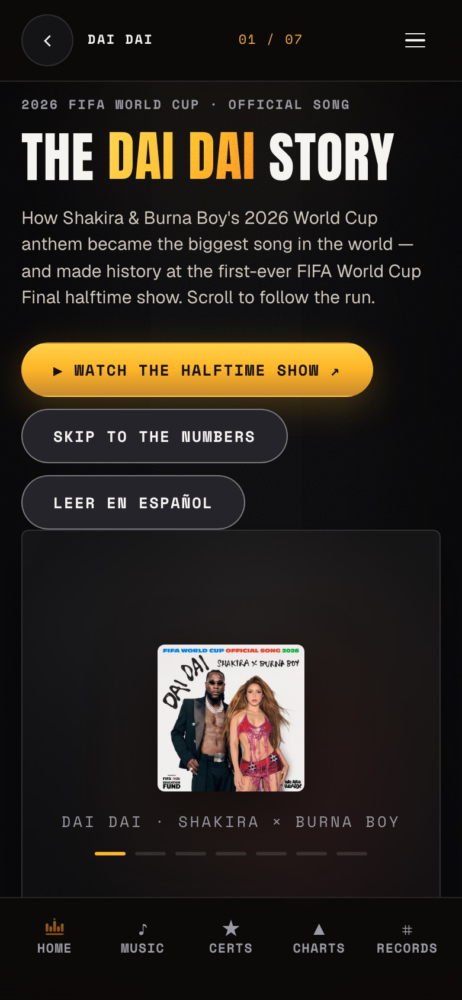
  - The first story sentence starts at 977px, below the fold.
- **[`phone-dark-02-story-billboard`](shots/phone-dark-02-story-billboard.jpg):** the back bar (69px) and tab bar (87px) cover 156px of every screen.

  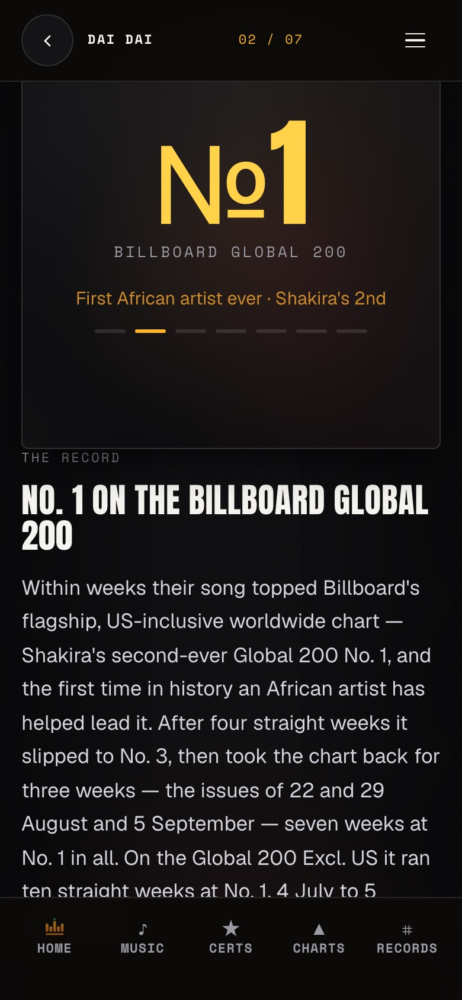
  - The pinned figure box (371px) sits 8px from the top, so its top 61px is always under the back bar.
  - The text gets 378px, 45% of the screen, and runs under the tab bar.
- **[`phone-dark-03-story-certs`](shots/phone-dark-03-story-certs.jpg):** a chapter turns active while its title is still hidden behind the figure box, so the reader joins mid-sentence.

  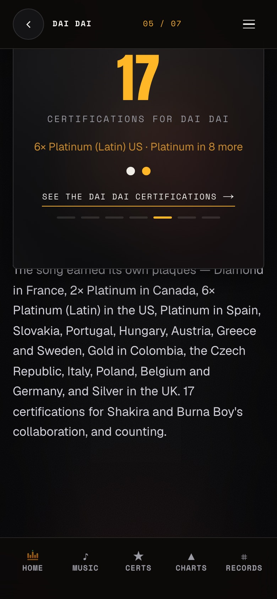
  - The figure is one number and two dots with no labels.
  - Short chapters leave about 280px blank.
- **[`phone-dark-04-numbers-hero`](shots/phone-dark-04-numbers-hero.jpg):** 2-up cards give labels 129px of width. One label runs 22 lines, and its neighbour is half empty.

  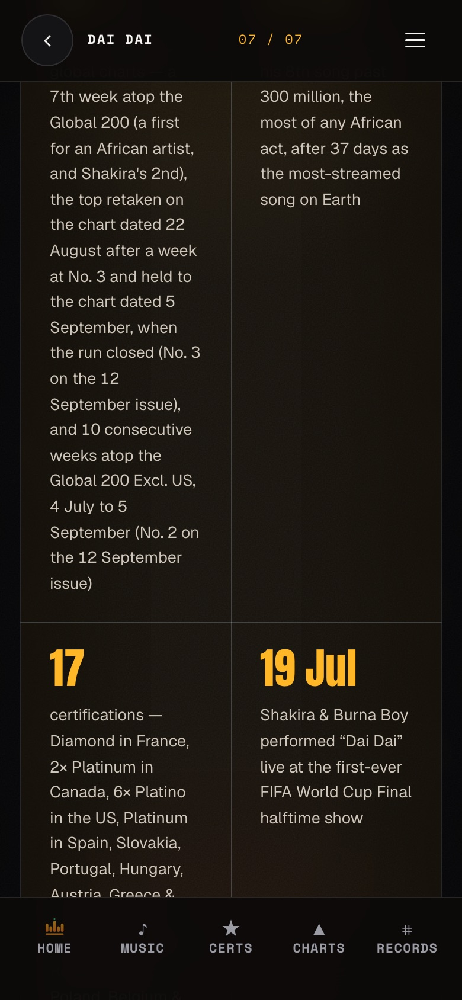
  - The counter reads "07 / 07" all the way to the bottom of the page.
- **[`phone-dark-05-lineup-takeover-outro`](shots/phone-dark-05-lineup-takeover-outro.jpg):**

  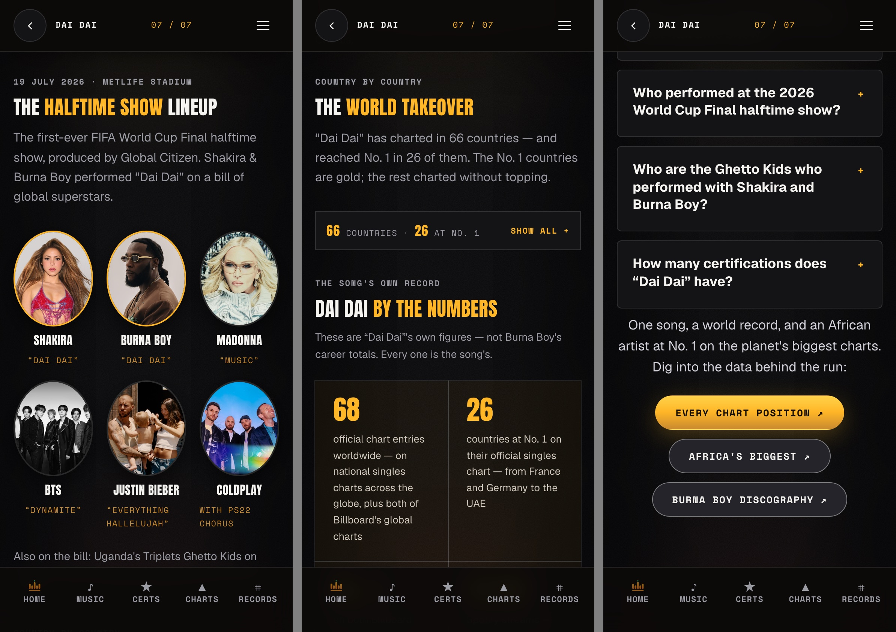
  - The portraits are ovals (106×128).
  - The takeover grid, the page's best visual, is folded, and its bar repeats the "66 · 26" from the sentence just above it.
  - "Show the full breakdown" adds 5,638px of identical cards whose values ("9 weeks") never name the country.
  - The outro is centred and sits 8px under the FAQ.
- **Works, keep:** the FAQ fold, story text at about 40 characters a line, the lineup's gold headliner rings, and zero overflow and layout shift.

### Desktop (1440×900)
- **[`desktop-dark-01-hero`](shots/desktop-dark-01-hero.jpg):** the Anton title with the gold "Dai Dai" is the brand at its best.

  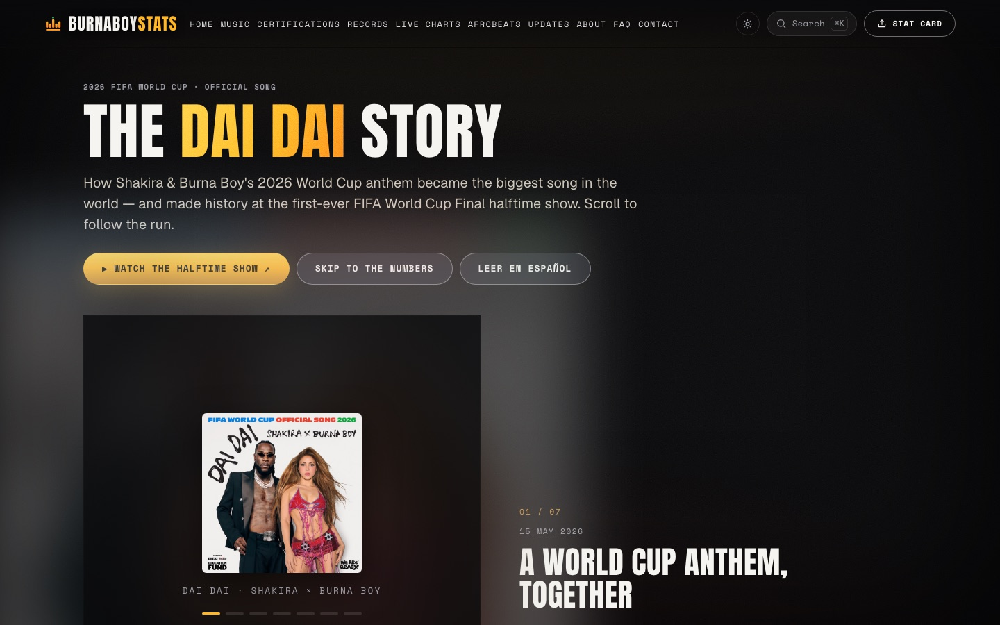
  - The three pills weigh the same.
  - Screen 1 ends on half an empty figure box.
- **[`desktop-light-02-story-stage`](shots/desktop-light-02-story-stage.jpg):** a 572px square figure box holds one centred glyph.

  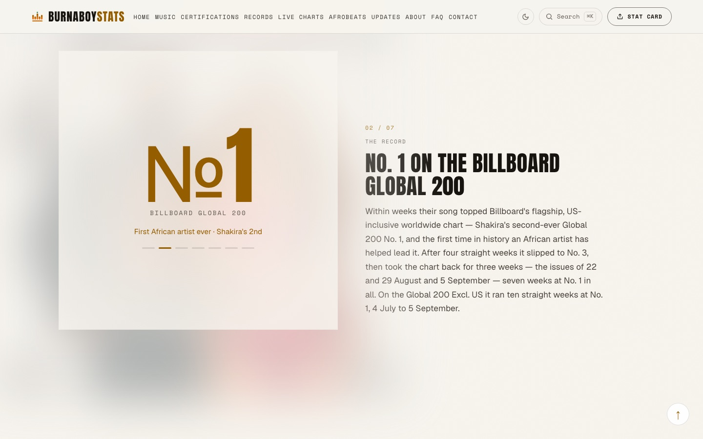
  - Its blurred backdrop spills 143px outside the box, which reads as smudges on paper.
- **[`desktop-dark-03-story-gap`](shots/desktop-dark-03-story-gap.jpg):** about 830px of scroll per chapter for about 280px of text, with a blank column between chapters.

  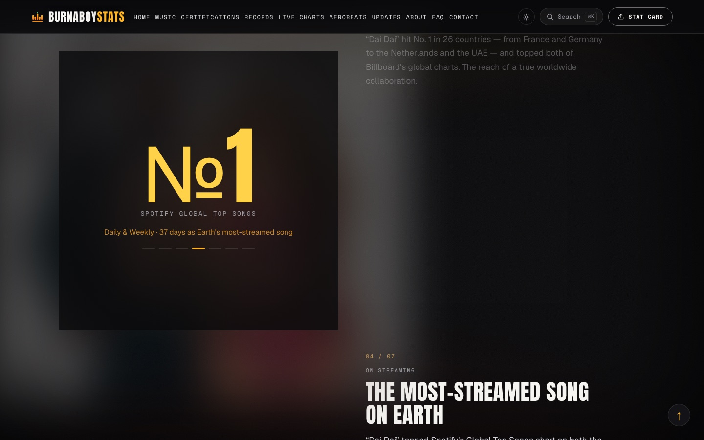
  - The figure swaps before its text arrives.
  - Chapters 02 and 04 share identical "№1" art.
- **[`desktop-dark-04-story-halftime`](shots/desktop-dark-04-story-halftime.jpg):** the climax is two 128px portraits.

  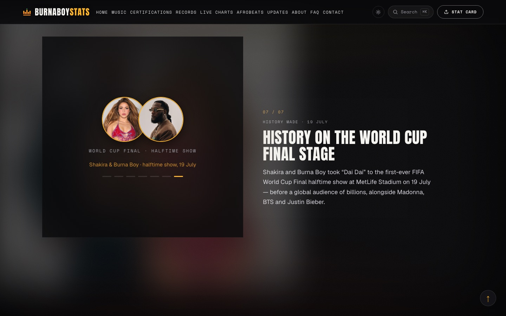
  - There is no video anywhere. The halftime show is only an external link.
  - The music video (1.14B views) isn't linked at all.
- **[`desktop-dark-08-lineup-takeover`](shots/desktop-dark-08-lineup-takeover.jpg):**

  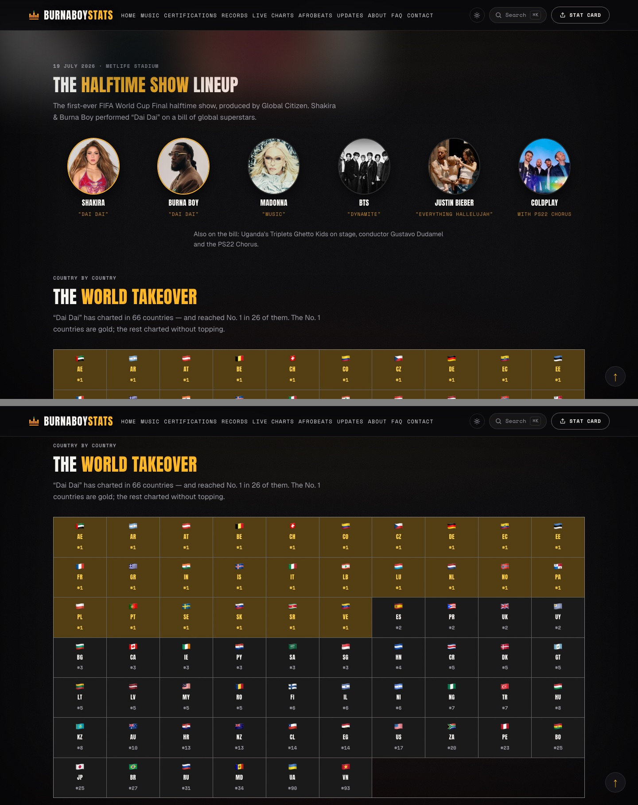
  - The lineup note is centred under a left-aligned section.
  - The lineup is told three times.
  - The grid leaves a 4-cell hole, and country names exist only as hover tooltips, which touch screens never show.
- **[`desktop-dark-05-numbers-national`](shots/desktop-dark-05-numbers-national.jpg):** 34 equal-weight cards over 3,008px.

  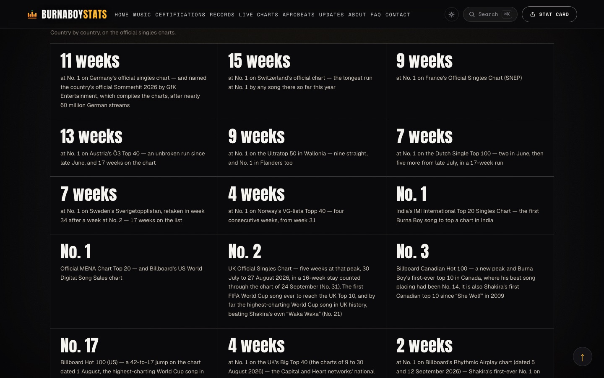
  - The national charts read "11 weeks / 15 weeks / 9 weeks…" without their countries: a table drawn as tiles.
  - Facts repeat 3–4 times across the page.
- **[`desktop-dark-06-faq`](shots/desktop-dark-06-faq.jpg):** 1,200px-wide cards, about 150 characters a line, and the heading glued to the first card.

  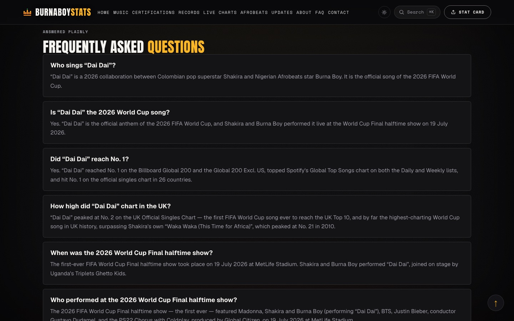
- **[`desktop-dark-07-outro-footer`](shots/desktop-dark-07-outro-footer.jpg):** the outro is glued to the FAQ and centred, with an orphan pill, and the rail sits 16px off the content edge.

  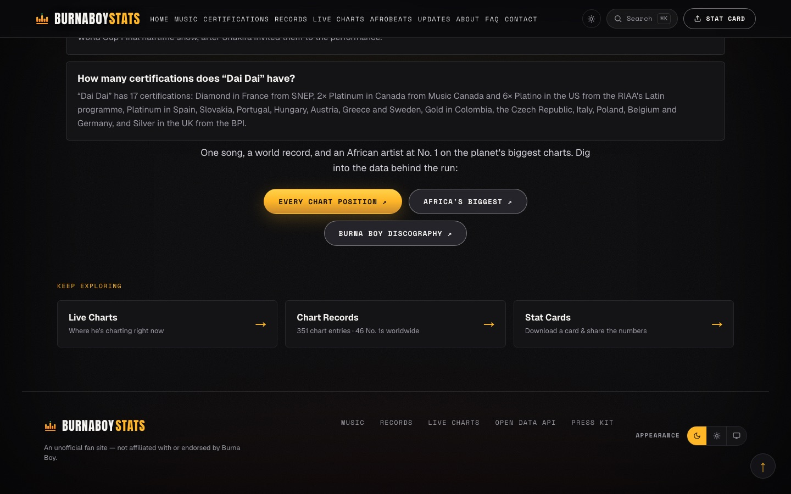
- **Whole page:**
  - Every section uses the same kicker + h2-with-gold-half + grey intro, so the story and the reference material run together.
  - Gold is everywhere, which breaks the gold rule (§6).
  - The largest paint is the decorative blurred backdrop.

### Spanish
- **[`es-01-hero-phone-desktop`](shots/es-01-hero-phone-desktop.jpg):** the phone h1 splits "DAI / DAI" across two lines.

  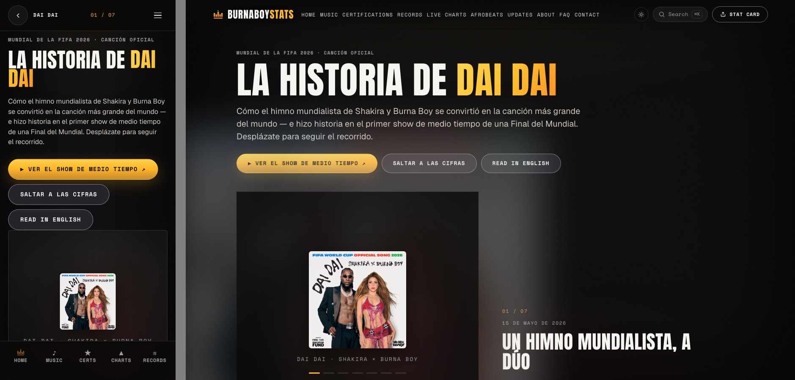
  - On desktop the accent on "DÚO" touches the line above (line-height 1.05).

### Direction (your call)
- **Phone story:** figure and sentence on one screen. A chapter goes active on a line the reader can see, and the counter stops when the story ends.
- **A distinct figure per chapter,** from data the site holds: the Global 200 weekly run, the 26 No. 1 cells, the 37 days as a strip of six spells, a plaque wall by tier with a legend, and the halftime video as a tap-to-play poster.
- **Hero:** one primary action and a small EN/ES switch. On the phone, chapter 01 shows on screen 1.
- **Numbers:** each lead figure gets a caption naming its chart. The national charts become a dense table (country · chart · peak · weeks at No. 1 · weeks on chart), with no empty cells.
- **Say each thing once.** The FAQ is exempt, since it serves search.
- **Structure:** a clear break between the story and the reference sections, and the desktop FAQ at about 70–75 characters a line.

---

## 4. Design system: extend it, don't replace it
- Don't invent a new visual language.
- Design every screen in **both themes**: dark is the default, and light ("paper") is a full theme.
- **Draw desktop and phone as separate designs.** The phone is not a scaled-down desktop, and a detail added to one must be drawn for the other.
- A new colour must be a light/dark pair, and flagged.

### Type
- **Anton 400 only**, uppercase: display text, headings, figures.
- **Geist:** prose, FAQ questions, table cells.
- **Space Mono 400/700, labels only:** kickers, buttons, chips, tags, headers, counters, legends. Never a sentence.
- **Floor and numerals:** nothing below 11px, and figures use tabular numerals.

| Token | Size / line height |
|---|---|
| `--type-lede` | 18px / 1.5 (20px at ≥900) |
| `--type-body` | 16px / 1.6 |
| `--type-small` | 13.5px / 1.5 |
| `--type-caption` | 12.5px / 1.45 |
| `--type-label` | 11px / 1.2, 0.11em, Space Mono 700 uppercase |
| `--type-h-prose` | 20px / 1.3 (FAQ questions) |
| `--measure` | 62ch |

- **Display sizes today:**
  - h1: 88px / 0.9 (46px on phone)
  - h2: 40px (26px on phone)
  - chapter title: 28.8–44.8px
  - lead figure: 52px (36px on phone)
- **Tablet step-down:** 88→64 and 44→34.
- **Off-scale sizes:** the page's other sizes (17.3, 15.7, 14.7px) should return to the scale.

### Colour (light | dark)
| Token | Light | Dark | Role |
|---|---|---|---|
| `--bg` | `#f7f4ee` | `#0a0a0b` | Page |
| `--bg-soft` | `#ffffff` | `#141416` | Card |
| `--bg-soft-2` | `#efeae1` | `#1c1c21` | Well / uncharted |
| `--bg-raised` | `#e6e0d4` | `#24242a` | **Hover** (presses in on paper) |
| `--btn-face` | `#ffffff` | `#24242a` | Secondary button |
| `--scrim` | `rgba(247,244,238,.94)` | `rgba(12,10,9,.94)` | Fixed bars, 14px blur |
| `--line` | `rgba(23,20,15,.12)` | `rgba(245,244,240,.12)` | Decorative hairline |
| `--rule` | `rgba(23,20,15,.48)` | `rgba(245,244,240,.38)` | Structural line (3.3:1) |
| `--btn-edge` | `rgba(23,20,15,.55)` | `rgba(245,244,240,.42)` | Control outline |
| `--text` | `#17140f` | `#f5f4f0` | Ink |
| `--text-body` | `#4a443b` | `#cfc7bb` | Reading text |
| `--text-muted` | `#5f584f` | `#9b9ba3` | Secondary, kickers |
| `--gold` / `--gold-fill` | `#945e00` | `#ffb627` | Gold ink and fills |
| `--gold-bright` | `#945e00` | `#ffd24a` | Ramp top |
| `--gold-dim` | `#945e00` | `#c98a2e` | Ramp bottom, hover border |
| `--ink-on-gold` | `#ffffff` | `#14100a` | Label on gold |

- **Gold fill:** `linear-gradient(180deg, --gold-bright 0%, --gold-fill 48%, --gold-dim 100%)`. On paper it is flat `#945e00` with a white label.
- **Gold washes:** 10% of the gold, with the alpha multiplied by 0.42 on paper and 1 in dark.
- **Dark-only effects:** glows, vignette and grain.
- **Tier inks (light | dark):**
  - Diamond `#0b6e7e` | `#31A1C0`
  - Platinum `#2f3a4e` | `#EFEDE6`
  - Gold `#945e00` | `#FBB417`
  - Silver `#6b6b74` | `#848F9E`
  - These are data colours and are never the brand gold.

### Shape, components, spacing
- **Radius:** 6px for cards, 999px for pills, circles for portraits.
- **Shadow:** dark `0 20px 50px rgba(0,0,0,.45)`, light `0 12px 32px rgba(23,20,15,.14)`.
- **Motion:** 0.15s / 0.2s / 0.3s, `cubic-bezier(0.22,1,0.36,1)`.
- **Buttons:** 46px tall, 26px side padding, pill shape, Space Mono 700 13px at 0.08em uppercase.
  - **Primary:** gold fill.
  - **Secondary:** `--btn-face` with a 1px `--btn-edge`.
  - **Icon button:** 36px (44px on touch).
- **Chips:** 44px tall on phone, 38px on desktop, mono 11px at 0.1em.
- **Tags:** mono 11px, padding 4×10. **Tier badge:** tier ink + edge, no fill.
- **Focus ring:** 2px solid `--gold`, 2px offset. **Prose links:** underlined.
- **Spacing scale:** 4 · 8 · 12 · 16 · 24 · 32 · 48 · 64 · 96 · 128. Please design on it.
- **Layout:** content max 1280px, with 40px gutters on desktop and 18px on phone.
- **Breakpoints:** desktop ≥1240, tablet 901–1239, phone ≤900.

---

## 5. New section: the chart run, week by week
An animated replay of Dai Dai's official chart positions: a world map plus a ranking, with play/pause and a scrubber.

**Placement:**
- Inside **The world takeover**, directly under the grid. The grid shows where the run ended; the replay shows how it got there.
- It goes on both EN and ES.
- Merging the grid and the replay into one figure is a content change, so list it for approval.

**Honest coverage.** The site stores peaks, not runs. After transcribing the notes it already holds:

| Group | Countries |
|---|---|
| Near-complete | CH, PL, NL, LU, AT, DE, FR, plus both Billboard global charts |
| Mostly gaps | SE, PT, SK, GR, NO, PA, UK, CO |
| Week counts, no dates | BE, SR, AE, AR, IT, IN, CZ, VE |
| Peak only (43) | includes No. 1 countries LB, IS, EC, EE |

51 of the 66 show only a peak. **Gaps are the normal state.** Draw your sample frames in that proportion, never as a fully filled run.

**Anatomy:**
- **Frames:** about 20 weekly frames, 15 May to 26 Sep, with the readout "Week of 13 July 2026". Tooltips use each chart's own label ("semaine 28", "31-34 (combined)").
- **Layout:** the two Billboard global charts as tiles above the map. On desktop, the map takes about 2/3 of the width and the ranking 1/3.
- **Map:** **a Europe inset is mandatory** (Luxembourg is half a pixel on a phone). Singapore has no shape and needs a marker.
- **Ranking:** group ties (up to 26 can share No. 1), show weeks at No. 1 so far as a secondary cue, and put a muted "not read this week" tray below.
- **Counter:** "No. 1 in N countries this week · M not read".
- **Transport:** play/pause, a week-tick scrubber, step buttons, and optional markers at 15 May and 19 Jul.

**Legend.** The peak data bands, never `--gold`:

| Band | Light | Dark |
|---|---|---|
| No. 1 | `#57360a` | `#ffd24a` |
| Top 5 | `#945e00` | `#ffb627` |
| Top 10 | `#b3822f` | `#c98a2e` |
| Top 40 | `#b4ada0` | `#8a7a52` |
| 41+ | `#dad5cb` | `#5a5a62` |

- **Light-theme contrast:** on the uncharted fill `#efeae1`, the Top 40 and 41+ bands reach only 1.86:1 and 1.22:1, so they need an outline too.
- **Each non-position state gets its own swatch:**
  - **Off chart:** the uncharted fill.
  - **No reading:** a neutral hatch with a dashed outline. Never draw it over the last known band.
  - **No chart published that week.**
  - **Peak only:** a dotted outline during play. At the end it fills with its peak band and a "peak" mark.
- **Never interpolate a week, and never carry one forward.**
- **Platform layer:** any later platform-chart layer must say "Platform charts, not official charts" on the map.

**States:**
1. **Poster:** the end frame, rendered on the server. It matches the grid (26 of 66 at No. 1). A Play control, **no autoplay**.
2. **Playing:** about 1s per frame, about 20s in all.
3. **Paused:** hover, focus or tap on a country shows a card: chart name, the chart's own date and label, position or status, source.
4. **Scrubbing:** snaps to weeks. Arrow keys step, Home/End jump, Space plays or pauses. Screen readers hear "Week of 13 July 2026: No. 1 in 9 countries, 12 not read".
5. **End:** the peak picture, plus Replay.
6. **Reduced motion / no JS:** **small multiples** by default.
   - One row per chart, 20 week-cells each, the globals first.
   - Peak-only rows get one "peak #N, run not recorded" cell.
   - Dense, not folded.
   - The player opens only when pressed, and it steps between frames without animating.

**Phone vs desktop:**
- **Phone:**
  - The ranking comes first.
  - The map is a Europe crop with a world toggle.
  - The transport sits above the 87px tab bar.
  - All controls are ≥44px.
  - Folding the ranking would be a new fold, so ask first.
- **Tablet:** the ranking goes under the map.
- **Optional:** a full-screen `/dai-dai/replay` page with **Download video** (1920×1080).
  - Every frame must stand alone: title, week, legend, the source line "Official national charts, as read by burnaboystats.com", the gap notice, and an end card with the site lockup and URL.

---

## 6. Owner rules
- **Gold marks what is live or an action,** and nothing else:
  - the one primary action per screen
  - links
  - live figures (the bot-updated streams and views, "No. 1 right now")
  - the brand ink on "Dai Dai" in the h1

  Headings, figures at rest and tags go back to ink.
- **Dense lists, not accordions.** The phone folds for the takeover, the breakdown and the FAQ are already approved. **Any new fold is a question for the owner**: list it, don't assume it.
- **Every figure is live data, never hard-coded.**
  - Draw figures as slots, sized for the worst case, and never bake them into images.
  - "37 days" is a closed run, so it stays in the past tense.
  - Don't reword the "first African artist" lines.
  - Write "No. 1" with a space.
- **Credits as on the record:** "Shakira × Burna Boy", as on the cover. Keep both names, in that order.
- **No stock imagery or invented photos.** The only real images are:
  - the single cover
  - the six artists' portraits
  - the two videos' own YouTube posters (click to load; no player until tapped)
- **Accessibility:**
  - AA contrast in both themes: 4.5:1 for text, 3:1 for large text, controls and data marks.
  - 44px tap targets on the phone.
  - Visible focus.
  - Nothing that exists only on hover.
  - Reduced motion settles to the final state.
- **Test-guarded content:** the full certification country list, "37 days", the h3 FAQ with visible answers, and EN/ES parity. Restructuring cards or shortening labels is allowed, but flag it.

---

## 7. Deliverables
1. **Full-page artboards:** desktop 1440 and phone 390, each in dark and light. Add a tablet note at about 1024 covering the story and the numbers.
2. **Spanish check at 390:** the hero, one chapter and the lead figures.
3. **The replay:** poster, playing, paused with a country card, scrubbing, end, and small multiples, on phone and desktop, with the legend in both themes.
4. **Interaction notes:**
   - chapter activation and when the counter clears
   - count-ups and their reduced-motion forms
   - folds
   - video posters
   - replay keyboard controls
   - what the largest first paint should be
5. **Slots:** mark every live figure as a slot.
6. **A change list for the owner to approve:** every move, merge, removal or rewording against §2; every new fold; every restructure that touches the tests.

### Screenshots, in brief order

1. **phone-dark-01-hero** 
2. **phone-dark-02-story-billboard** 
3. **phone-dark-03-story-certs** 
4. **phone-dark-04-numbers-hero** 
5. **phone-dark-05-lineup-takeover-outro** 
6. **desktop-dark-01-hero** 
7. **desktop-light-02-story-stage** 
8. **desktop-dark-03-story-gap** 
9. **desktop-dark-04-story-halftime** 
10. **desktop-dark-08-lineup-takeover** 
11. **desktop-dark-05-numbers-national** 
12. **desktop-dark-06-faq** 
13. **desktop-dark-07-outro-footer** 
14. **es-01-hero-phone-desktop** 

---
*Sources: token values are from `app/globals.css` at commit `93fedb07` (lines 23–38, 49–74, 107–128, 142–183, 215–226, 243–247, 282–285, 419, 447, 539). Page content is from `app/dai-dai/page.tsx`. The file:line citations for every claim are in `content.md`, `design-system.md`, `audit.md` and `replay.md`, which are in [`research/`](research/).*
