# On This Day: brief for Claude Design

**Site:** burnaboystats.com, an unofficial Burna Boy stats site.
**Feature:** On This Day. It has four parts: a home page card, a calendar page at `/on-this-day`, 167 day pages at `/on-this-day/<day>`, and two share images per day.
**Status:** built on a branch (PR #344), **not live yet**. Everything below was read from that build and its code on 26 Sep 2026. Every figure, date and line of copy is real. Nothing is a placeholder.

You can't see the code, so this brief holds everything you need. The screenshots are in [`shots/`](shots/), shown next to the problems in §3 and all together in §7.

**Shareable page (same brief, laid out with the screenshots):** https://claude.ai/artifact/7T6sAjJ6QD3M8r85zWmBxA · **Research notes and the full event list:** [`research/`](research/)

---

## 1. The ask

**What it is.** Each day the site shows a real Burna Boy milestone from that calendar date in an earlier year. A milestone is one of six kinds: an album release, a chart peak, a certification, an award, a streaming No. 1 or a show. Each is filed on the exact date its own source prints.

**Who it is for:**
- **Fans, daily.** The home card answers "what happened on this date in Burna Boy history?". The calendar and the day pages are for browsing.
- **Social followers.** Fans download a post-ready image and post it on Instagram and X. A link preview appears whenever a day page is shared.
- **Search visitors.** They search "Burna Boy on this day" or "what happened on 16 August Burna Boy". Every dated day has its own page, title and description.

**The goal:**
- Design every surface properly for phone (390) and desktop (1440), in dark and in light.
- Make the home card worth a look on the days it has nothing for today. That is most days (§2.4).
- Make the calendar a calendar people can use.
- Make a day page read as the story of a date, not as a log.
- Make the share image something fans want to post. It has to read at feed size and at profile-grid size.
- Stay inside the existing design system (§4). Extend it; don't invent a new visual language.

---

## 2. Every surface: content and rules

### 2.1 The content: 228 milestones on 167 days

- **228 events**, on **167 of the 366** calendar days. **199 days have none.**
- The earliest is **12 Aug 2013** (L.I.F.E released). The latest is **22 Sep 2026** (a SESAC award).
- **Only records whose data carries the exact day.** Anything known only by its year, its month or a range such as "7–8 September" stays off. That is why there are only 5 award events: most wins (Grammy, BET, MOBO) are year-only in the data.
- **Burna Boy only.** Every event is his, including features on other artists' records. Those are credited exactly as on the record, for example "Stormzy ft. Ed Sheeran & Burna Boy".

**What every event has:**

| Field | Example | Where it prints |
|---|---|---|
| Year | 2023 | Every row; the post card's big figure |
| Kind | Certification | The pill |
| Headline | “On the Low” was certified Platinum in Sweden | Every row; card label; link-preview lead line |
| Detail | IFPI Sverige | The second line of a row (not on the images) |
| Source | IFPI Sverige | The post card's "source" slot |
| Link | the certifications page, filtered to that title | The row's target |
| Rank | (internal) | Decides which event **leads** a day |

The **lead** is the one event a day's post card, link preview, calendar dot and home card open with. It is chosen by rank, not by year, so it is often not the newest row.

**The six kinds:**

| Pill | Events | Days it leads | Headline pattern | Detail pattern | Links to |
|---|---|---|---|---|---|
| **Release** | 9 | 9 | `Burna Boy released No Sign of Weakness` · `“Dai Dai” with Shakira was released` | `His eighth studio album · Atlantic · Bad Habit · Spaceship` | The album page (8), the Dai Dai page (1) |
| **Charts** | 35 | 28 | `“Want It All” hit No. 8 in Nigeria`. Albums are not quoted: `No Sign of Weakness hit No. 1 in Nigeria` | `Burna Boy feat. Polo G · TurnTable Top 100` | Chart records, filtered to the song |
| **Streaming** | 2 | 2 | `“Dai Dai” went to No. 1 on Spotify's global chart` | `Daily Top Songs Global — the first of 37 days at No. 1` | The Dai Dai page |
| **Certification** | 37 | 24 | `“On the Low” was certified Platinum in Sweden` | `{credit} · {body}`, or just the body, e.g. `BPI` | Certifications, filtered to the title |
| **Awards** | 5 | 4 | Titles, not sentences: “Nigeria Entertainment Awards: Album of the Year” · “BRIT Billion Award” · “SESAC Awards: Top Songs honoree” | “Won · Outside”, or the honour's note | Awards |
| **Live** | 140 | 100 | “Burna Boy played {venue}, {city}” (107 tour shows) · “Burna Boy headlined {festival}” (17) · 9 concerts · 5 other shows · 2 moments, e.g. “FIFA World Cup Final halftime show” | The tour name, plus “ · $1,592,684 from 13,219 tickets” when a Billboard Boxscore gross is known (25 shows). A festival's detail is its location. A record-making night carries its record line, e.g. “First African artist to sell out the world's most famous arena.” | Tours, festivals or tour revenue |

Breakdowns:
- **Charts:** Top 10 peaks only, dated to the chart issue that first reached the peak. Nigeria (TurnTable) 33, UK (Official Charts Company) 2. There are 11 No. 1s.
- **Certification bodies:** BPI 14, SNEP 7, RMNZ 6, IFPI Sverige 5, and one each from NVPI, Ultratop, IFPI Austria, Music Canada and RIAA Latin.
- **Certification levels:** Gold 14, Silver 7, Platinum 7, Diamond 3, 2× Platinum 2, and one each of 2× Platino, 3×, 4× and 5× Platinum.
- **Live shows by tour:** I Told Them… 27, No Sign of Weakness 22, African Giant 18, Life on the Outside 17, Love, Damini 15, Space Drift 8.

**Wording rules to keep:**
- A headline is past tense with no date in it. The page supplies the date.
- Write "No. 1" with a space.
- Songs go in curly quotes. Albums are bare.
- Countries take "the" where English does: "in the United Kingdom", "in the Netherlands".
- Credits are exactly as on the record.
- Never reword a "first African artist" line.

**Copy quirks in the data.** Don't fix these silently; put them on the change list (§6):
- On **146 of 228** events the detail line is the same text as the source, usually a tour name, "IFPI Sverige" or "BPI".
- Award, honour, concert and moment rows are titles, not sentences.
- "Burna Boy Xperience" (22 Mar, Kampala) and "Burna Boy Experience" (23 Mar, Kigali) read like a typo'd duplicate. Both are the shows' own names.
- "Burna Boy Day" is written with straight quotes. Everything else uses curly quotes.

### 2.2 Figures and slot sizes

Draw every slot to fit the **longest real text**, not a typical one.

| Measure | Value | The real case |
|---|---|---|
| Events per day | 1 on **120** days · 2 on 36 · 3 on 9 · 4 on 1 · 5 on 1 | 5 is 16 August; 4 is 14 July |
| Distinct years on one day | up to **3** | 1 May, 11 July (2024, 2025, 2026) |
| Events in one year on one day | up to **4** | 14 July (all 2022); 16 August (four from 2023, plus one from 2019) |
| Days with 2+ events in the same year | 12 | |
| Days whose events span years | 39 | Widest: 22 September, 2018–2026 |
| Headline | **70** characters (median 39, 90th percentile 53, shortest 18) | “Burna Boy played Huntington Bank Pavilion at Northerly Island, Chicago” |
| Detail | **161** characters (next 157; median 24, 90th percentile 54, shortest 3: “BPI”) | 16 January: `Headlined “The AFCON Last Dance” in Rabat (16 Jan 2026), closing out the Africa Cup of Nations hosted by Morocco — on a bill with Stormzy, Stonebwoy and Jaylann.` |
| Day label | **12** | “10 September” |
| Kind pill | **13** | “Certification” |
| Year span | 9 | “2019–2023”, or a single year such as “2024” |
| Home title, coming up | **23** | “Coming up: 10 September” |
| Home title, today | **18** | “13 years ago today” (the range is 1 to 13 in 2026, and 14 in 2027) |
| Home day link | **26** | “10 September, every year →” |
| Post card label (the lead's headline) | **69** | “Burna Boy played Madison Square Garden (One Night in Space), New York” (28 April) |
| Post card kicker | **48** | “On this day, 8 September — and 2 more milestones” |
| Post card chip | **26** | “On this day · 10 September” |
| Post card source | **44** | “El Gouna Conference & Cultural Center, Egypt” |
| Link-preview lead line | **76** | “2022 — Burna Boy played Madison Square Garden (One Night in Space), New York” |
| Day page `<title>` | **50** | |

**The busiest days:**

| Day | Events | Mix | Lead kind |
|---|---|---|---|
| 16 August | 5 | 4 Certification, 1 Live | Certification |
| 14 July | 4 | 3 Charts, 1 Certification | Charts |
| 23 January | 3 | 2 Certification, 1 Live | Certification |
| 1 May | 3 | Certification, Charts, Live | Charts |
| 11 July | 3 | Live, Release, Charts | Release |
| 17 July | 3 | 2 Charts, 1 Live | Charts |
| 31 August | 3 | 3 Charts | Charts |
| 8 September | 3 | 2 Live, 1 Certification | Certification |
| 24 October | 3 | 3 Live | Live |
| 3 November | 3 | 2 Live, 1 Certification | Live |
| 8 December | 3 | 2 Live, 1 Certification | Certification |

**By month.** Appendix A lists every dated day with its lead kind and count, so the calendar can be drawn from real data.

| Month | Dates | Events | Month | Dates | Events |
|---|---|---|---|---|---|
| January | 9 | 12 | July | **21** | **37** |
| February | 11 | 11 | August | 15 | 24 |
| March | 14 | 15 | September | 17 | 22 |
| April | 9 | 10 | October | 10 | 16 |
| May | 11 | 15 | November | 17 | 25 |
| June | 15 | 18 | December | 18 | 23 |

### 2.3 Five real days: draw these

★ marks the lead. Rows are in the day page's current order, newest first.

**1. 16 August: the busiest day (5 events, 2019–2023)**

| Year | Pill | Headline | Detail |
|---|---|---|---|
| 2023 ★ | Certification | “On the Low” was certified Platinum in Sweden | IFPI Sverige |
| 2023 | Certification | “Ye” was certified Platinum in Sweden | IFPI Sverige |
| 2023 | Certification | African Giant was certified Gold in Sweden | IFPI Sverige |
| 2023 | Certification | “Gbona” was certified Gold in Sweden | IFPI Sverige |
| 2019 | Live | Burna Boy played Union Hall, Edmonton | African Giant Tour |

- **Pager:** ← 14 August · 17 August →
- **Post card:** figure `2023` · label `“ON THE LOW” WAS CERTIFIED PLATINUM IN SWEDEN` · kicker `On this day, 16 August — and 4 more milestones` · chip `ON THIS DAY · 16 AUGUST` · source `IFPI SVERIGE`
- **Link-preview tiles:** `5 MILESTONES` · `2019–2023 YEARS` · `Certification LEADS WITH`

**2. 8 October: one event (2021).** This is the typical page: 120 of the 167 days look like this.

| Year | Pill | Headline | Detail |
|---|---|---|---|
| 2021 ★ | Live | Burna Boy played Hollywood Bowl, Los Angeles | Space Drift World Tour |

- **Lede:** “1 milestone dated 8 October, 2021 — newest first.”
- **Pager:** ← 7 October · 11 October →
- **Post card:** `2021` · `BURNA BOY PLAYED HOLLYWOOD BOWL, LOS ANGELES` · `On this day, 8 October` · source `SPACE DRIFT WORLD TOUR`
- **Link-preview tiles:** `1 MILESTONE` · `2021 YEARS` · `Live LEADS WITH`

**3. 29 June: an award (2 events, both 2024)**

| Year | Pill | Headline | Detail |
|---|---|---|---|
| 2024 ★ | Live | Burna Boy played London Stadium, London | $6.15M from 58,973 tickets: the highest-grossing single concert by any African artist. |
| 2024 | Awards | BRIT Billion Award | For surpassing 1 billion UK streams — presented at his London Stadium show, 29 June 2024. |

- The show outranks the award, so the card leads with the show.
- **Post card:** `2024` · `BURNA BOY PLAYED LONDON STADIUM, LONDON` · `On this day, 29 June — and 1 more milestone` · source `BILLBOARD BOXSCORE`
- The other award days are 2 March, 15 July, 10 November and 22 September.

**4. 11 July: an album release (3 events, 2024–2026). The lead is not the newest row.**

| Year | Pill | Headline | Detail |
|---|---|---|---|
| 2026 | Live | Burna Boy headlined North Sea Jazz Festival | Rotterdam, Netherlands |
| 2025 ★ | Release | Burna Boy released No Sign of Weakness | His eighth studio album · Atlantic · Bad Habit · Spaceship |
| 2024 | Charts | “Higher” hit No. 1 in Nigeria | TurnTable Top 100 |

- **Post card:** `2025` · `BURNA BOY RELEASED NO SIGN OF WEAKNESS` · `On this day, 11 July — and 2 more milestones` · source `ATLANTIC · BAD HABIT · SPACESHIP`
- The site holds the album's real cover. The card doesn't use it.

**5. 26 September: today, with no events**
- `/on-this-day/26-september` returns a **404**, and so does its card. There is no "nothing happened today" page.
- On the calendar, 26 September is a plain grey number on desktop and is missing on the phone.
- The **home card is in "coming up" mode**. It names **7 October**, 11 days away (§2.4).

**Two stress cases to draw as well:**
- **28 April** (1 event): “Burna Boy played Madison Square Garden (One Night in Space), New York”, with the detail “First African artist to sell out the world's most famous arena.” It is the longest card label and the longest link-preview line.
- **16 January** (2 events): the AFCON row with the 161-character detail, plus “We Pray” certified Gold in France (“Coldplay ft. Burna Boy & others · SNEP”).

### 2.4 The home card

**Placement.**
- **The owner wants the card directly under Latest Updates on both layouts.**
- The home page doesn't carry a Latest Updates list on either layout today.
  - On desktop, the newest update appears only as the one-line "LIVE" band at the very top of the page.
  - The list itself lives at `/updates`.
- **The build puts the card directly under "History made"**, the home page's one dated news block:
  - **Desktop:** between History made and the Certifications Ledger. The desktop order is: live band → hero → scoreboard → History made → **On This Day** → Certifications Ledger → No. 1 board → catalogue → career records → closer.
  - **Phone:** after History made, as the last block before the five-tab bar. The phone order is: hero → four-stat grid → No. 1 board → album rail → "Where he's performed" → History made → **On This Day**.
- **Draw it directly under History made on both layouts, as built.** If a Latest Updates block is added to the home page, the card goes directly under it. The owner confirms the placement on the change list.
- For reference: in the build, the phone card starts about 2,500 px down a 3,009 px page, about three screens.

**Two states, both of them real:**

| | **Today** | **Coming up** |
|---|---|---|
| When | The London date has events from **earlier years** | It doesn't, so the card shows the **next** date that does |
| Kicker | `On this day · 7 October` | `On this day` |
| Title | `5 years ago today`. N comes from the lead row | `Coming up: 7 October` |
| Row label | `5 years ago` / `8 years ago` | `5th anniversary` / `8th anniversary` |
| Links | `All 2 on 7 October →`, or `8 October, every year →` for a single event · `The calendar →` | same |

**Coming up is the main state, not a fallback.** From 26 Sep 2026 to 25 Sep 2027:
- **199 days show "coming up"** and 166 show "today".
- "Coming up" arrives in 83 runs. The median run is 2 days. The longest runs are 11 days, 26 Sep–6 Oct (the one we are in now) and 27 Jan–6 Feb, because dated days there are 12 days apart.
- On 119 of the 166 "today" days, the card has a single row.

**Rules:**
- "Today" is the **London** calendar date, picked once when the page is rendered on the server. Both layouts get the same pick. No reader clock is used and no script runs in the browser.
- The home page refreshes **hourly**, so the card turns over within an hour after London midnight, not exactly at midnight.
- **Only earlier years count.** An event from the current year is not an anniversary yet.
  - 15 days whose only events are from 2026 never get a "today" state in 2026: 15, 17 and 20 Jan · 5 and 6 Mar · 11 Apr · 15 May · 9, 18 and 30 Jun · 9 and 19 Jul · 10 Aug · 3 and 21 Sep.
  - The link count counts anniversaries only. On 22 Sep 2026 the card shows 1 row while the day page holds 2.
- **At most 3 rows.** They are ordered by lead rank, not by year, so years can run out of order (see 8 December below). The day page runs newest first. Choose one order, or make the difference visible.
- The title's N comes from the **lead**. Other rows can be older: "5 years ago today" can sit above a row reading "8 years ago".
- 29 February (one event, 2024) only comes round in leap years.

**Real card content to draw:**

| London date | State | Title | Rows (year · pill · label · headline) |
|---|---|---|---|
| **26 Sep 2026 (today)** | Coming up | Coming up: 7 October | 2021 · Charts · 5th anniversary · “Want It All” hit No. 8 in Nigeria (Burna Boy feat. Polo G · TurnTable Top 100) / 2018 · Live · 8th anniversary · Burna Boy played O2 Academy Brixton, London (Life on the Outside Tour) |
| 7 Oct 2026 | Today, 2 rows | 5 years ago today | The same two rows, labelled "5 years ago" and "8 years ago" |
| 8 Oct 2026 | Today, 1 row | 5 years ago today | 2021 · Live · Burna Boy played Hollywood Bowl, Los Angeles. Link: `8 October, every year →` |
| 8 Dec 2026 | Today, 3 rows, mixed years | 4 years ago today | 2022 · Certification · 4 years ago · “Last Last” was certified Platinum in New Zealand (RMNZ) / 2022 · Live · 4 years ago · Burna Boy played Capital One Arena, Washington, D.C. (Love, Damini Tour · $1,434,525 from 14,688 tickets) / 2025 · Live · 1 year ago · Burna Boy played State Farm Arena, Atlanta (No Sign of Weakness Tour) |
| 12 Nov 2026 | Today, a record night | 1 year ago today | 2025 · Live · 1 year ago · Burna Boy played Red Rocks Amphitheatre, Morrison, CO (“First Nigerian artist to headline the iconic Colorado venue, opening the North American leg of the No Sign of Weakness tour.”) / 2023 · Live · 3 years ago · Burna Boy played Ball Arena, Denver (I Told Them… Tour) |
| 16 Aug 2027 | Today, 3 of 5 | 4 years ago today | The three leading 2023 Swedish certifications. Link: `All 5 on 16 August →` |
| 16 Jan 2027 | Today, longest detail | 1 year ago today | The AFCON row (161-character detail) / 2025 · Certification · “We Pray” was certified Gold in France |

If the data ever held no events, the card would render nothing. That can't happen with today's data.

### 2.5 The calendar: `/on-this-day`

**Content, top to bottom:**
1. **Breadcrumb** (desktop only): Home / On This Day.
2. **Eyebrow:** "Burna Boy · The calendar". **h1:** "On This Day", with "Day" in the site's gold display ramp. This is a site pattern; `/updates` does the same.
3. **Lede.**
   - Desktop: “228 dated milestones on 167 days of the year — album releases, chart peaks, certifications, awards and shows, each filed on the day it happened. Pick a date for everything on it.”
   - Phone: “228 dated milestones on 167 days of the year. Tap a date for everything that happened on it.”
4. **Tally by kind:** Release 9 · Charts 35 · Streaming 2 · Certification 37 · Awards 5 · Live 140.
5. **Twelve months.** Each has a name and an "N dates" count. A day with milestones links to its day page; a day without is not a link.
   - For every dated day the page knows: the count, the lead's kind, the lead's year and headline, and the span of years.
   - Today the lead headline appears only in a hover tooltip, for example `2023: “On the Low” was certified Platinum in Sweden`. The screen-reader label is “16 August — 5 milestones”.
6. **Legend:** "The dot is the day's lead milestone:" followed by the six kinds.
7. **Source note.** Keep these words:

   > “Only records that carry their own day are here: a certification on the award date its body's register prints, a chart peak on the issue that first carried it, a show on the night itself. A record known only by its year stays off the calendar until its day is read — see the methodology.”

   "Methodology" links to the methodology page.
8. **Keep exploring** (desktop only): Career Timeline, Career Records, Stat Cards.

**Rules:**
- **The calendar has no year.** A weekday grid would be wrong in every other year, so there are no weekdays. February always has 29 days, because 29 February has a page.
- **The page is static.** It is built at deploy and nothing on it knows the date. A "today" marker or a "next milestone" pointer needs either a small script that reads the London date or an hourly rebuild. Draw the marker anyway; the build choice goes on the change list.
- **Phone width.** The build's comment says seven 44 px targets won't fit in a row. The sums say they do at 390: inside the 18 px gutters there are 354 px, and seven 44 px cells with 6 px gaps take 344 px. At 375 they fit with 5 px gaps; at 360, only with 2 px gaps. Check your grid at 360.
- Real month data is in §2.2 and Appendix A. **Live leads 100 of the 167 days**, so a colour-per-kind calendar comes out mostly green.

### 2.6 The day pages: `/on-this-day/<day>`

**URL:** `/on-this-day/16-august`: the day number without a leading zero, then the month in lower case. There are 167 pages, including `29-february`. Every other day returns 404.

**Content:**
1. **Breadcrumb** (desktop only): Home / On This Day / 16 August.
2. **Eyebrow:** "Burna Boy · On this day". **h1:** the day, "16 August".
3. **Lede.**
   - Desktop: “5 milestones dated 16 August, 2019–2023 — newest first. Each one links to the page that holds the record.” On a one-event day the second sentence still prints.
   - Phone: “5 milestones dated 16 August, 2019–2023 — newest first.”
4. **The events. This is the owner's spec:** newest first, **grouped by year**, each row linking to the page that holds the record.
   - The build doesn't group yet. The list is flat and the year repeats on every row: 16 August prints "2023" four times.
   - Group by year and print each year once. Inside a year, put the lead first, then follow rank.
   - A day has at most 3 distinct years and at most 4 events in one year.
5. **The lead.** This is the event the post card and the link preview show. It isn't always first: on 11 July it sits in the second year group. Showing "this one is on the card" would help.
6. **The post card: preview, download and share.**
   - Desktop: a 176×220 preview and a gold "Download the card ↓" button that saves `burna-boy-on-this-day-16-august.png`. The note under it reads “1080×1350, the 4:5 a post runs uncropped on Instagram and X.”
   - Phone: an outlined gold pill, "Post-ready card · 1080×1350 ↓", with no preview.
   - The site already has a save-or-share pattern on its stat cards. On a phone that can share files, the button reads "Save or share ↓" and opens the native share sheet. Otherwise it reads "Download PNG ↓" and downloads. Failing both, it opens the image in a new tab.
7. **Pager.**
   - Previous and next are the neighbouring **dated** days, not the neighbouring calendar days, and they wrap at the year end: 31 December → 3 January.
   - Desktop: “← 14 August · The calendar · 17 August →”. Phone: the two ends only.
8. **Keep exploring** (desktop only): Career Timeline, Career Records, Stat Cards.

**Phone chrome:**
- A sticky back bar with a 44 px round back button, the label "ON THIS DAY" and the menu. The back button returns to the previous page, or to the calendar when there is no in-site history.
- The five-tab bar (Home, Music, Certs, Charts, Records) at the foot.
- There is no breadcrumb bar on the phone. That is the site pattern.

**No "N years ago" on day pages today.** They are static, so a relative age would go stale. If you want age context there, it needs a render-time date: either an hourly rebuild or a small script. That goes on the change list. The year itself is always safe.

### 2.7 The link preview, 1200×630

There are two: one for the calendar and one per day. Both are **always dark**, whichever theme the reader uses.

**Calendar card today:**
- Kicker `BURNA BOY · THE CALENDAR`.
- Title `On This Day` in gold.
- Sub: “A dated milestone for every day that has one — each on the day it happened.”
- Four tiles: `167 DATES` · `228 MILESTONES` · `140 LIVE` · `37 CERTIFICATION`. The last two are the two largest kinds, taken from the data.
- Footer `BURNABOYSTATS.COM/on-this-day`.

**Day card today:**
- Kicker `BURNA BOY · ON THIS DAY`.
- Title: the day, e.g. `16 August`, at 120 px in gold.
- Lead line: `2023 — “On the Low” was certified Platinum in Sweden`, 32 px, `#c9c9d0`.
- Three tiles: count · span · lead kind ("Leads with").
- Footer with the lowercase path.

**Alt text:** `Burna Boy on this day, 16 August: 2023 — “On the Low” was certified Platinum in Sweden`.

**It must read at 500 pt (X, iMessage) and at 250 pt (WhatsApp, Slack).** Today only the date survives at 250 pt.

**Pictures you may use:** real cover art (§2.10). **62 of the 167 day leads have it; 105 don't**, because those leads are shows or awards. The design must work both with and without art.

### 2.8 The post card, 1080×1350 (4:5)

It is served at `/on-this-day/<day>/card` and drawn by the site's existing **stat card** renderer, the same one behind the downloadable stat cards.

**What it prints today:**
- a text brand row, `BURNABOY` + gold `STATS`
- a gold outline chip `ON THIS DAY · 16 AUGUST`
- the lead's **year** as the big gold-gradient figure
- the lead headline in capitals as the label
- a gold rule
- the kicker at bottom left: `On this day, 16 August — and 4 more milestones`
- the source plus `AS OF 2026-09-25` at bottom right
- a `BURNABOYSTATS.COM` stamp
- a ghosted month watermark, `AUG`
- the one Burna Boy portrait on the right

**Rules:**
- **Never print a relative age.** A saved card gets reposted for years, so "3 years ago" would become false. Print the year or the full date.
- The card must stay true on its own, outside the site.
- The **"As of" date is the site's last update (2026-09-25), not the milestone's date.** On an anniversary card it reads oddly.
- **The source slot prints the lead's source, which is often not a publisher.**
  - It is a publisher for certifications (IFPI SVERIGE, BPI), charts (TURNTABLE TOP 100), shows with a gross (BILLBOARD BOXSCORE) and awards.
  - Otherwise it prints a place (`NYON, SWITZERLAND`), a tour (`SPACE DRIFT WORLD TOUR`) or a record label (`ATLANTIC · BAD HABIT · SPACESHIP`).
  - The most common lead sources: TurnTable Top 100 (24), Billboard Boxscore (19), No Sign of Weakness Tour (15), I Told Them… Tour (11), African Giant Tour (11), BPI (9), Life on the Outside Tour (9).
- **The detail line isn't printed**, so a record night's best sentence ("First African artist to sell out the world's most famous arena.") never reaches the card.
- The label steps down with length: up to 42 characters prints at 52 px, up to 64 at 44 px, and longer at 38 px. Across the 167 cards, 114 print at 52, 51 at 44 and 2 at 38. The 69-character MSG label runs to three lines.
- **Caching.** The card is rendered on request and cached for 10 minutes in the browser and 1 hour at the CDN. A redesign reaches everyone within the hour.
- **Security.** The route only takes a day, never arbitrary text, so nobody can mint an official-looking card through the URL. Keep it that way.

### 2.9 Breadcrumbs, SEO and search

Keep these strings, or list any change:

| Piece | Calendar | Day page (16 August) |
|---|---|---|
| `<title>` | Burna Boy On This Day — A Milestone for Every Date | Burna Boy on This Day: 16 August — 5 Milestones |
| Description | Burna Boy on this day: 228 dated milestones on 167 days of the year — releases, No. 1s, certifications, awards and shows. | 2023: “On the Low” was certified Platinum in Sweden. Plus 4 more Burna Boy milestones dated 16 August. One-event days read: “2021: Burna Boy played Hollywood Bowl, Los Angeles. Burna Boy on this day, 8 October.” |
| Share title / description | Burna Boy — On This Day / A dated milestone for every day that has one, each linked to its source. | Burna Boy on this day — 16 August / 2023: “On the Low” was certified Platinum in Sweden. |
| h1 | On This Day (one per layout) | 16 August (one per layout) |
| Breadcrumb | Home / On This Day | Home / On This Day / 16 August. Structured data carries the same three crumbs, so the visible trail and the data must match. |

Also:
- **Sitemap:** the calendar plus all 167 days (168 URLs).
- **Site search:** one "On This Day" entry, with keywords including "today in history", "anniversary" and "what happened today". Each day also has its own entry: "On this day: 16 August", described as “5 Burna Boy milestones dated 16 August, 2019–2023.”, with the US order "august 16" as a keyword.
- **Records hub:** a row "On This Day", described as “167 dates in the calendar, each with a milestone on it”, on desktop and phone.
- **Content must be in the page, not behind a hover.** Search and screen readers can't see a tooltip.

### 2.10 Images the site holds, and the only ones you may use

- **One Burna Boy portrait** (Spotify, 640 px). Every stat card uses it today.
- **Album covers:** the 8 studio albums, the EPs and a compilation (Spotify, 640 px).
- **Single covers:** 15 songs, including "Dai Dai". A track with no cover of its own uses its album's cover.
- **Covers of other artists' records he features on:** held only at **100×100** (e.g. "Location", "We Pray", "Ginger", "Own It"). That is too small to use large.
- **By event.** Every release, both streaming events, all 37 certifications and 34 of the 35 chart events have real art: **82 events** in all, 62 at 640 px and 20 at 100 px. The **140 shows and 5 awards have no image.** The site holds no photos of venues, festivals, crowds or awards.
- **By day lead.** 62 of the 167 leads have art, 47 of them at 640 px. The other 105 have none.
- **Nothing else:** no stock, no invented or AI photos, no illustrated Burna Boy.

---

## 3. The first build and what is weak

Screenshots are dark unless the file name says light. Phone shots are 390×844 at 2× (CSS px quoted). Desktop shots are 1440 wide.

### 3.1 Home card, phone: [`phone-dark-home-card`](shots/phone-dark-home-card.jpg), [`phone-light-home-card`](shots/phone-light-home-card.jpg)

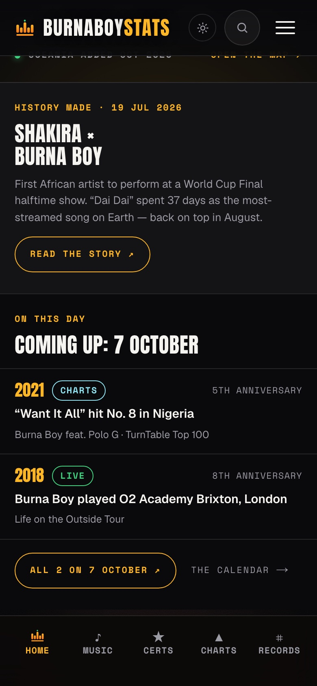 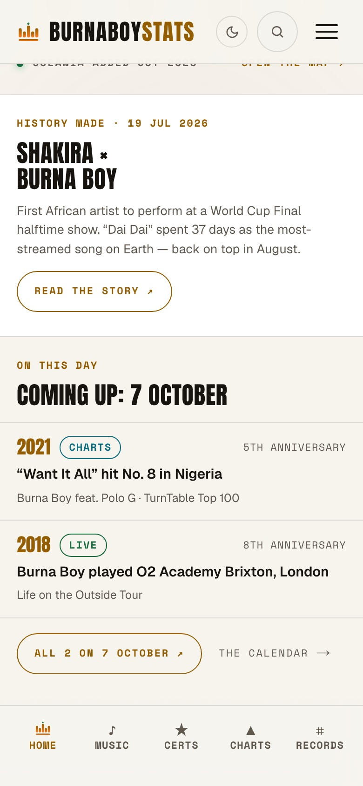
- **The title names a gap.** "ON THIS DAY" sits over "COMING UP: 7 OCTOBER", a date 11 days away. The biggest type on the card is a date with nothing attached, and this is the state shown on 199 days a year.
- **Every row looks the same.** A UK No. 1 and "played Reggies, Chicago" get identical year, pill, headline and detail.
- **Two equal gold actions.** History made's "READ THE STORY ↗" and this card's "ALL 2 ON 7 OCTOBER ↗" are the same gold outline pill, about 390 CSS px apart. The card's own stylesheet calls the gold pill "the screen's one action".
- "All 2 on 7 October" opens a page holding the same two rows the card already shows.
- **Gold is spent on data:** gold years, a gold kicker, and a gold Certification pill when it appears.
- The kicker is **gold on the phone** and **muted on desktop**. The same links use **↗** on the phone and **→** on desktop. The site rule is ↗ for a link to a sibling page.
- The card is the last block, about three screens down.
- The card offers **no route to the day's post card.**
- **Keep:** the row anatomy at 390, 44 px targets throughout, and a light theme that holds.

### 3.2 Home band, desktop: [`desktop-dark-home-band`](shots/desktop-dark-home-band.jpg), [`desktop-light-home-band`](shots/desktop-light-home-band.jpg)

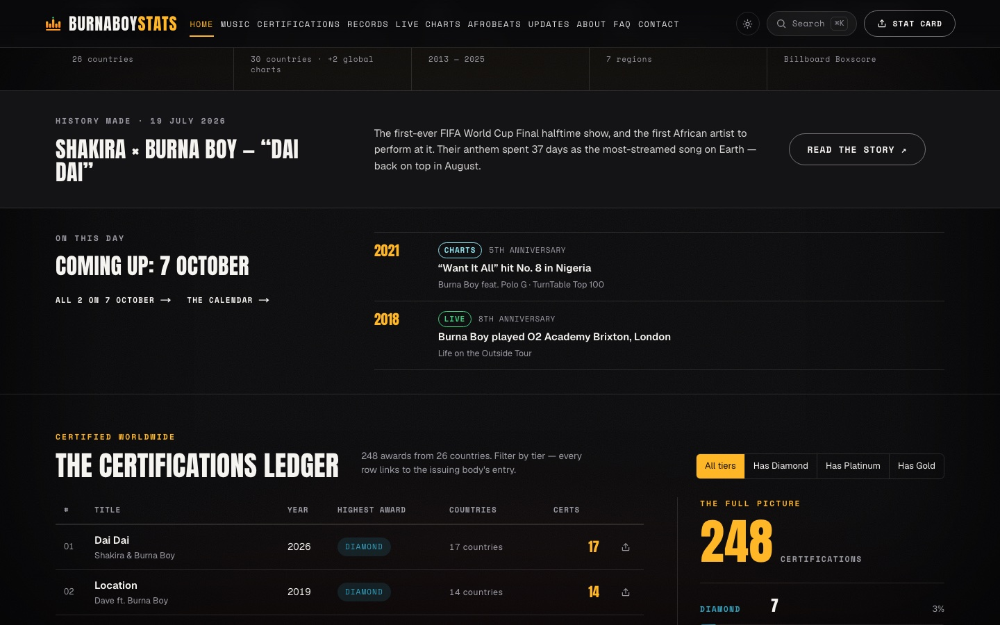 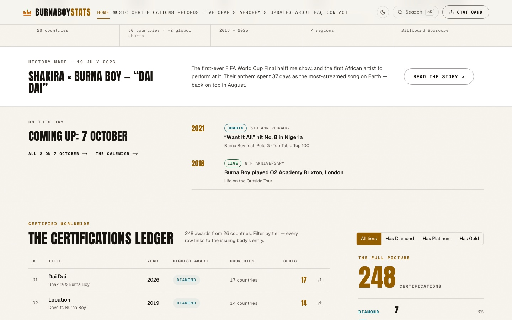
- **Same "Coming up" problem.** The title carries no content.
- **The band has no weight of its own.**
  - It sits on the page ground under History made's raised band.
  - Below it is the ledger's 40 px Anton heading and 248 hero figure.
  - At 32 px, the OTD title reads as a footnote to History made.
- **Empty space.** With two rows, the left column stops at its links, about 95 px above the list's last rule. The headlines end around x≈970 of 1360.
- **No primary link.** "ALL 2 ON 7 OCTOBER →" and "THE CALENDAR →" are identical mono text links.
- **No route to the post card.**
- **Tablet (901–1239).** History made steps to 28/32 px padding and the band stays at 34/40, so the two bands' edges drift apart by 8 px.
- **Keep:**
  - The list shares its left edge with the History made text (x=539), which locks the two bands together.
  - The muted kicker.
  - Three rows at most.

### 3.3 Calendar, phone: [`phone-dark-index-full`](shots/phone-dark-index-full.jpg)

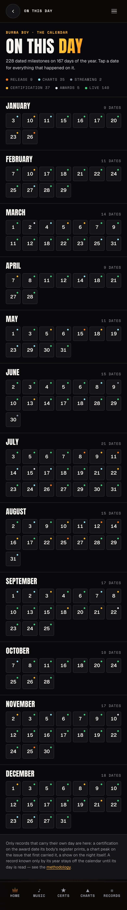
- **The chips look like a calendar but aren't one.**
  - Only dated days are drawn, packed seven to a row, so January reads "3 10 11 15 16 17 20 / 23 26".
  - It looks like weeks, but position means nothing and the empty days vanish.
- **No today, no next date, and no way to jump to a month.** The page is 2,784 CSS px, about 3.3 screens.
- **Every chip weighs the same.** 16 August (5 milestones) looks like 28 April (1). The count exists only for screen readers.
- **The 5 px dot is the only kind signal,** and the legend sits at the top, one to three screens away from most chips.
- **Tapping is blind:** no headline and no kind name before you tap.
- **The tally reads as both legend and statistic** ("LIVE 140"), with no hierarchy between label and number.
- **Keep:**
  - Real 44 px targets.
  - Anton month names with "N DATES".
  - The source note at the foot.
  - No sideways scroll.

### 3.4 Calendar, desktop: [`desktop-dark-index-full`](shots/desktop-dark-index-full.jpg), [`desktop-light-index-full`](shots/desktop-light-index-full.jpg), [`calendar-desktop-1024-dark`](shots/calendar-desktop-1024-dark.jpg)

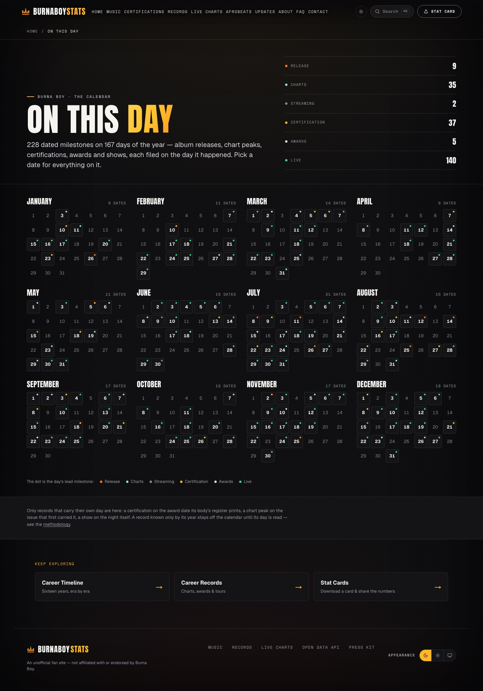 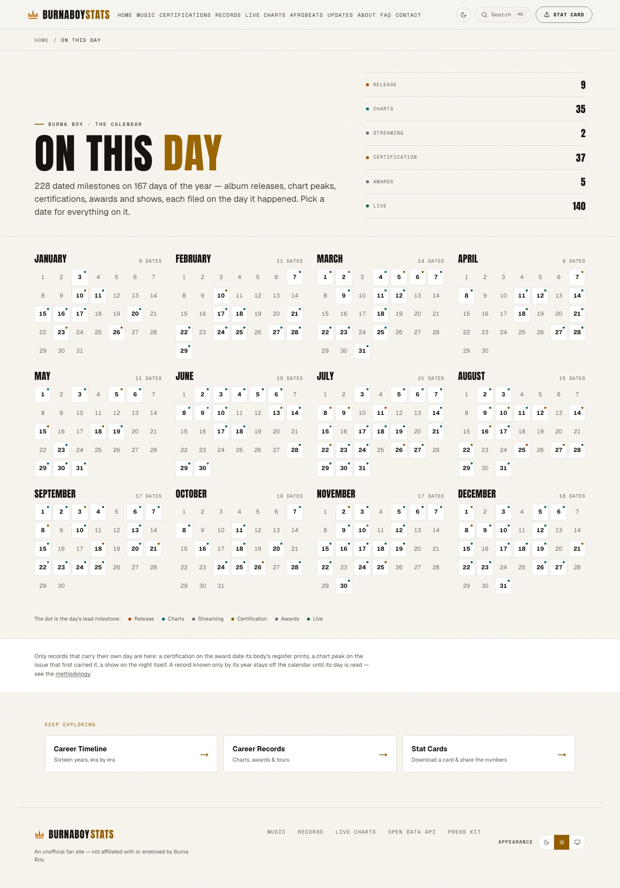 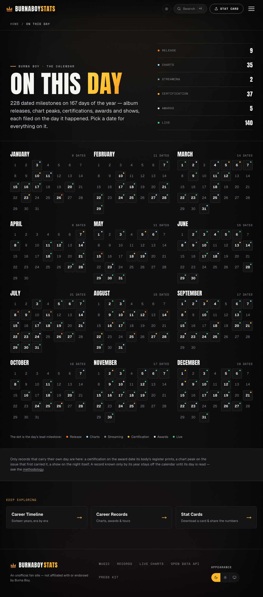
- **The hero pushes the calendar below the fold.**
  - The six-row tally is taller than the title column, and the hero aligns to the bottom, so the top-left is empty and the eyebrow starts at y≈285.
  - January starts at y≈600 of a 900 px screen.
- **The legend appears twice:** as the tally at the top and as the legend under December.
- **No today marker and no "next date" pointer.**
- **The lead headline is hover-only,** in a tooltip that keyboard and touch users never see.
- **1 vs 5 events look the same.**
- **The dots collide** (see §3.9). In light mode the legend shows Streaming and Awards in the same grey.
- The grids look like real months with weekdays but have none. Decide this on purpose.
- The page is mostly green, because Live leads 100 days.
- **Tablet:** the calendar drops to 3 columns at 1240 px and below. That includes 1240 itself, where the rest of the site is already desktop.
- **Keep:**
  - The four-up month grid, which scans well.
  - Linked days (bold, boxed) versus unlinked days (faint) separate at a glance in both themes.
  - "N DATES" per month.
  - The source note band.

### 3.5 Day page, phone: [`phone-dark-day-16-august-full`](shots/phone-dark-day-16-august-full.jpg), [`phone-dark-day-28-april-full`](shots/phone-dark-day-28-april-full.jpg), [`day-11-july-phone-light`](shots/day-11-july-phone-light.jpg)

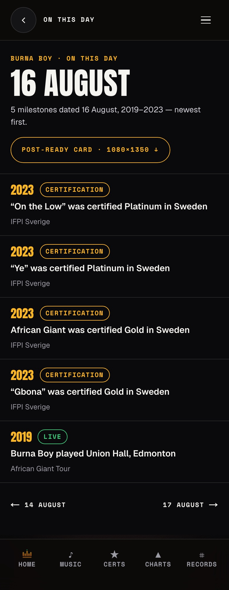 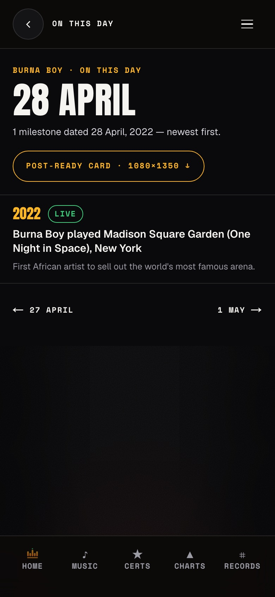 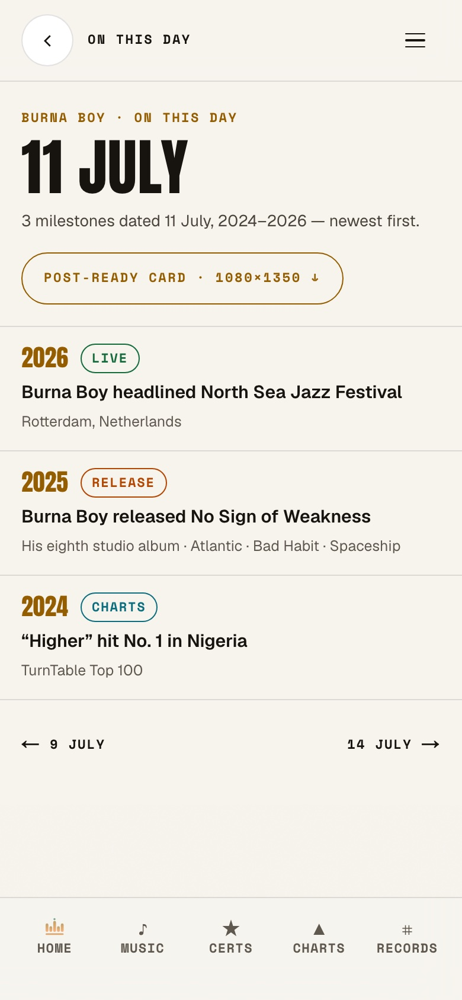
- **Same-day batches read as repetition.** 16 August prints "2023 / CERTIFICATION / …in Sweden / IFPI Sverige" four times.
- **Gold overload.** Each certification row has a gold year and a gold pill, under a gold call-to-action pill.
- **No lead and no stakes.** The h1 is the date, and nothing marks the event the card leads with. On 11 July the lead (the 2025 album) is the second row.
- **The card action is a spec, not a picture.** "POST-READY CARD · 1080×1350 ↓" shows no preview and offers no share sheet, on the screen people are most likely to post from.
- **A sparse day is thin.**
  - 28 April is one row, then the pager, then about 300 CSS px of empty background.
  - "newest first" describes a list of one.
  - The record line ("First African artist to sell out the world's most famous arena.") is the 12.5 px muted caption: the most important sentence on the page is its smallest.
- **Nowhere to go but the neighbouring dates.** There is no preview of what they hold, and no source note on the phone.
- **Keep:**
  - The back bar.
  - The 52 px Anton date.
  - The row anatomy.
  - 44 px pager targets.
  - The pager wrapping at the year end.

### 3.6 Day page, desktop: [`desktop-dark-day-16-august-full`](shots/desktop-dark-day-16-august-full.jpg), [`desktop-dark-day-28-april-full`](shots/desktop-dark-day-28-april-full.jpg), [`day-29-june-desktop-light`](shots/day-29-june-desktop-light.jpg)

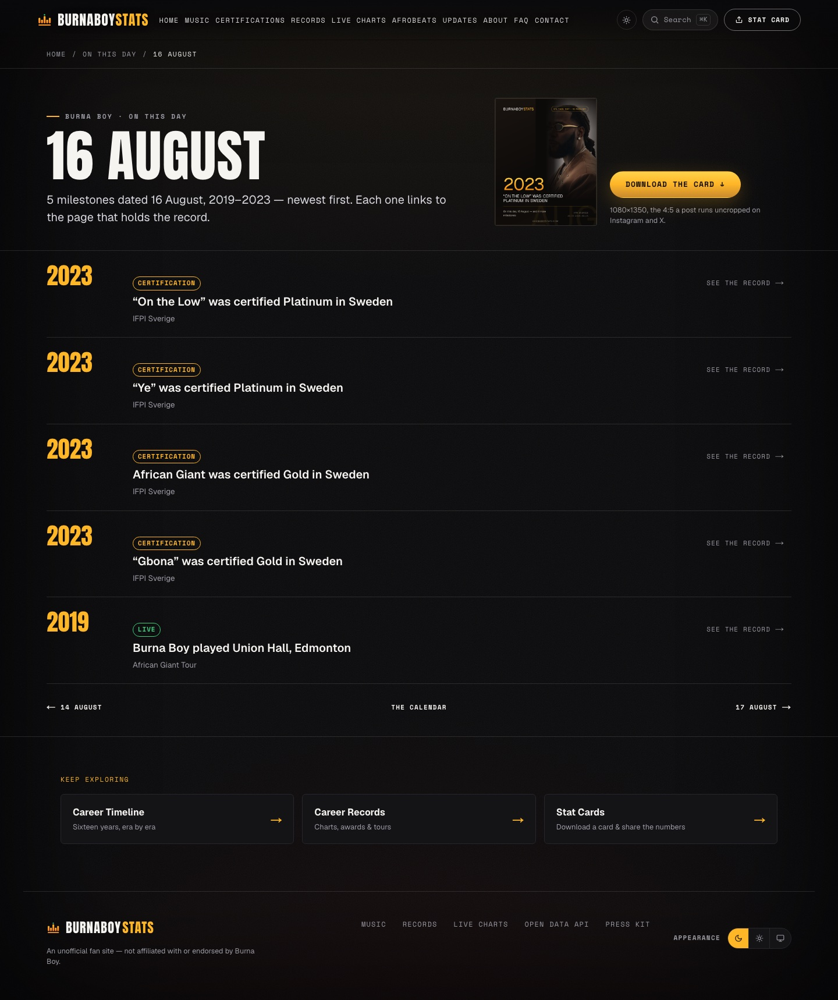 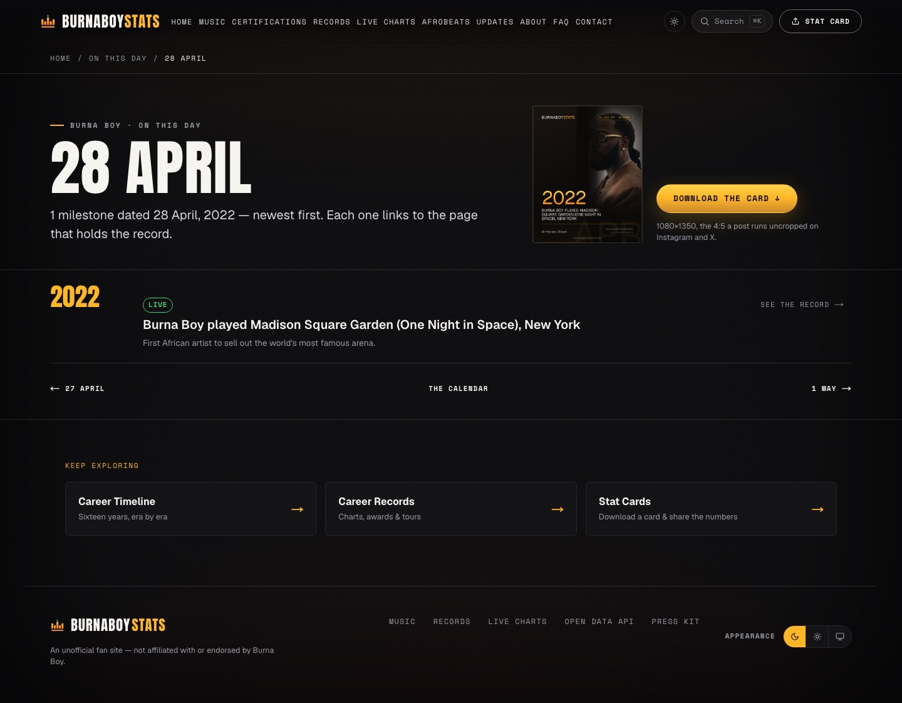 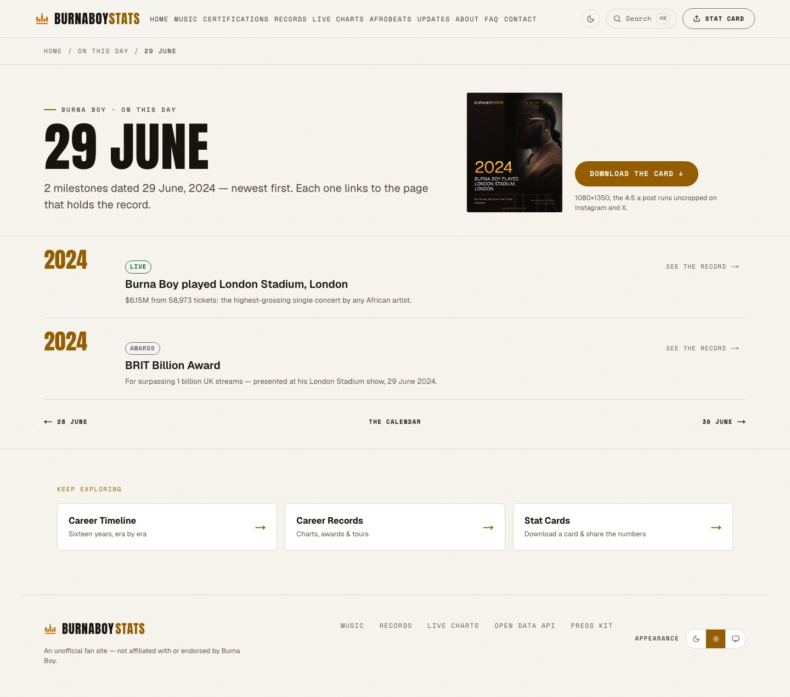
- **The year floats above its row.** The 40 px Anton year aligns to the small pill's baseline, not to the headline. Each row is about 148 px tall for two lines, so five rows take about 740 px.
- **"SEE THE RECORD →" repeats on every row,** about 540 px from the end of the headline. The whole row is already the link.
- **The card preview doesn't work as a preview.** At 176×220 its text can't be read, it loads the full 725 KB PNG, and it is lazy-loaded although it sits above the fold.
- **The card note is a spec, not a benefit:** "1080×1350, the 4:5 a post runs uncropped on Instagram and X."
- **The lede doesn't handle one event.** 28 April says "Each one links to the page…" about a single row.
- In light mode the Awards pill is the same grey as Streaming ([`day-29-june-desktop-light`](shots/day-29-june-desktop-light.jpg)).
- **Keep exploring ignores the feature.** It offers nothing about nearby days or other milestones of the same kind.
- **Keep:**
  - The filled gold "DOWNLOAD THE CARD ↓", the only filled control on the page, which is the right use of gold.
  - The breadcrumb.
  - The pager with THE CALENDAR centred.
  - Headlines that fit on one line.

### 3.7 Link previews: [`og-16-august`](shots/og-16-august.jpg), [`og-28-april`](shots/og-28-april.jpg), [`og-calendar`](shots/og-calendar.jpg), [`og-day-8-october`](shots/og-day-8-october.jpg), compared with [`compare-og-dai-dai`](shots/compare-og-dai-dai.jpg)

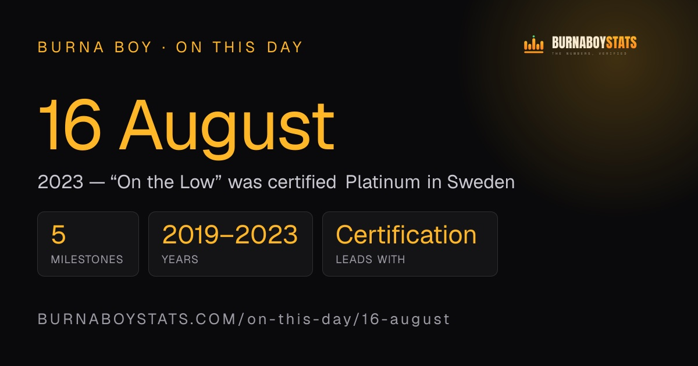 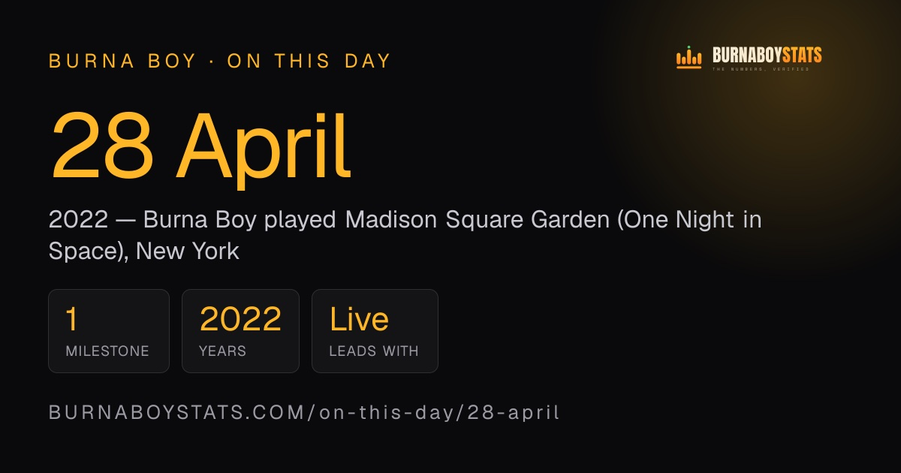 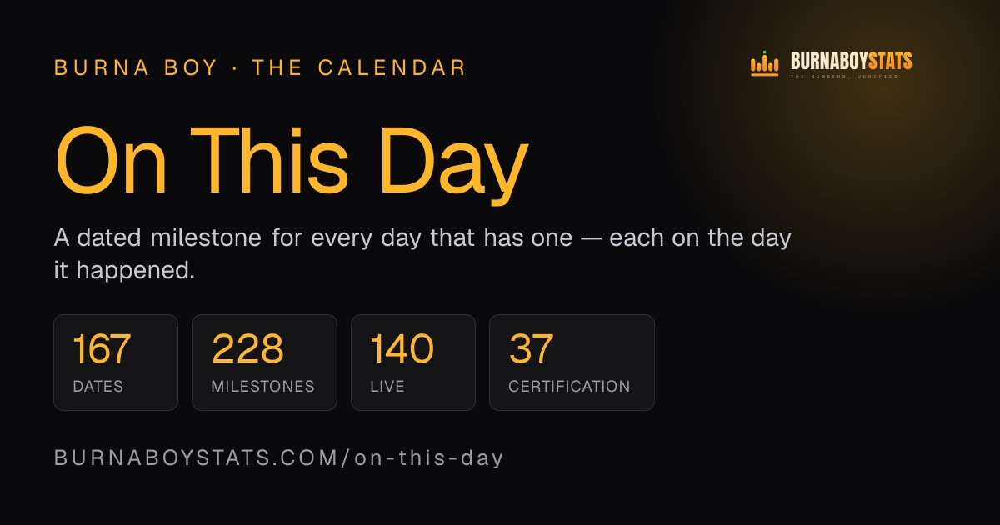 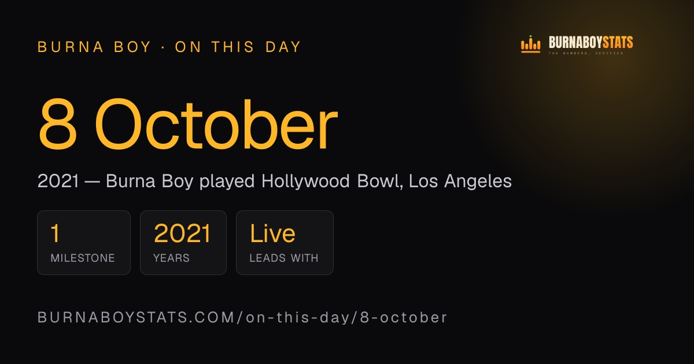 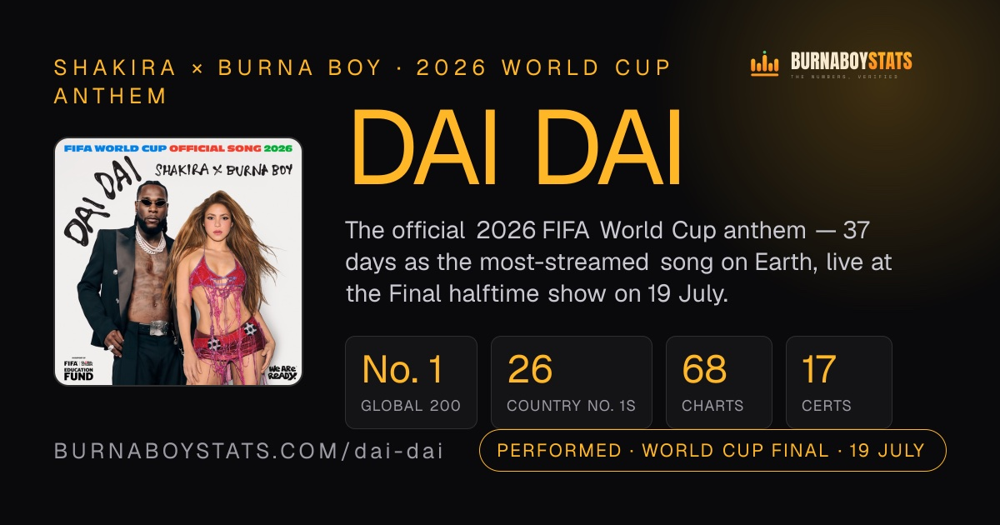
- **The date is the hero and the milestone is secondary.** The date is 120 px gold; the milestone is a 32 px grey line. At 250 pt only "16 August" can be read (see [`thumbs-share-images-1x`](shots/thumbs-share-images-1x.jpg), which comes with §3.8).
- **The tiles restate the date or use internal words.**
  - "LEADS WITH" is ranking vocabulary.
  - A one-event day reads `1 MILESTONE / 2021 YEARS / Live LEADS WITH`: a third of the card spent saying one thing happened in 2021, with a plural label on a single year.
- **No picture.** The existing Dai Dai card carries its cover art; day cards are text only. At feed size, all 167 look the same apart from the date.
- **Keep:** the lockup top-right, the gold glow, the URL footer and the 64 px frame. They match the site's link-preview family exactly.

### 3.8 Post card: [`card-16-august`](shots/card-16-august.jpg), [`card-28-april`](shots/card-28-april.jpg), [`card-11-july`](shots/card-11-july.jpg), compared with [`compare-stat-card-dai-dai`](shots/compare-stat-card-dai-dai.jpg) and [`thumbs-share-images-1x`](shots/thumbs-share-images-1x.jpg)

 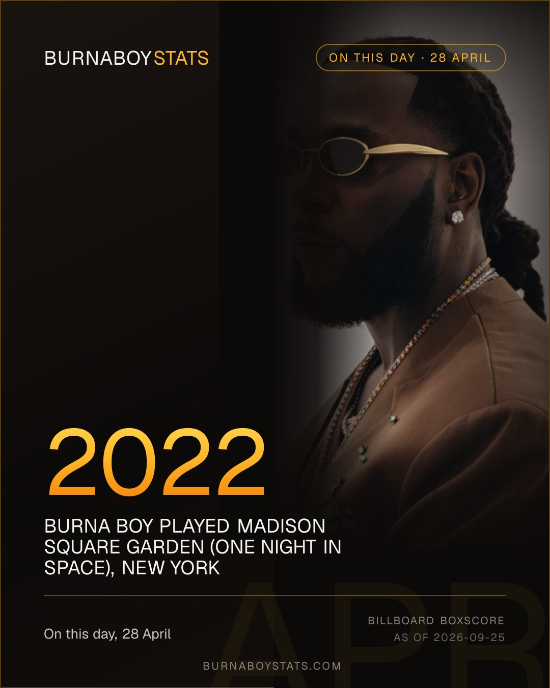  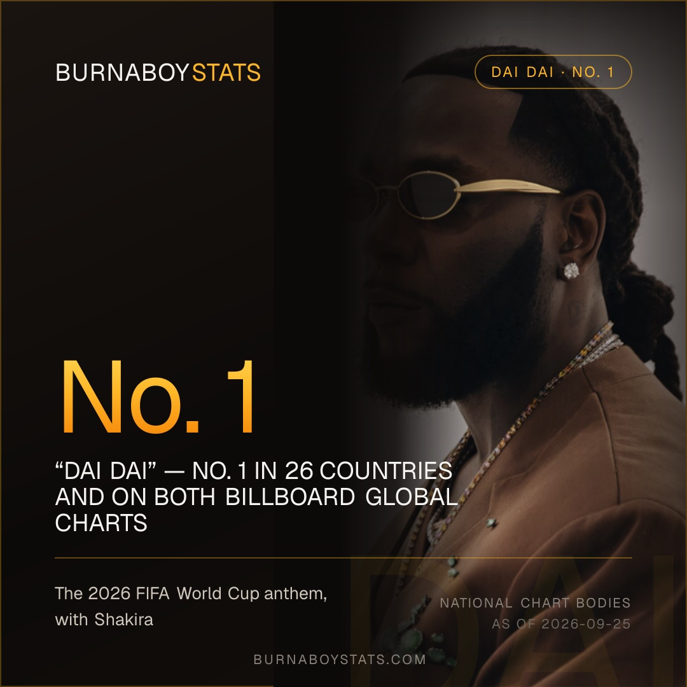 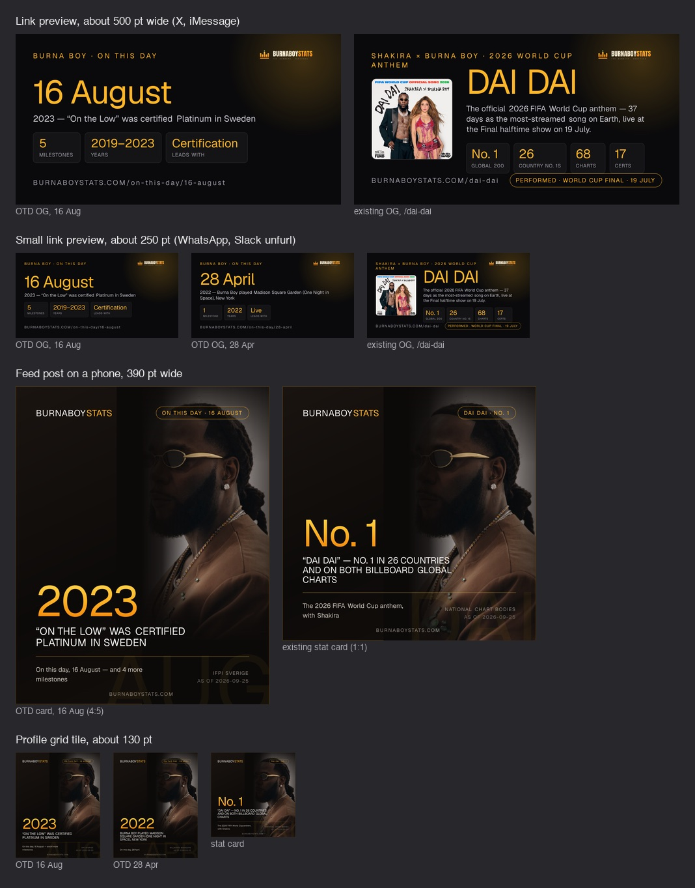
- **A year sits in the hero-number slot.** On a stat card the big number is the achievement. Here it is "2023", so at grid size a tile says "2023 + portrait" and nothing else.
- **Every card looks alike.** They share one portrait and one crop. At the 130 pt grid tile, 16 August, 28 April and the existing Dai Dai stat card are near-identical. The series has no identity.
- **The chip can't be read at 130 pt,** and it is the only thing that says "On this day".
- **The date prints twice** (chip and kicker). **The other milestones print nowhere.**
- **The top-left 55% is empty,** because the text block is pinned to the base.
- **"AS OF 2026-09-25"** sits oddly on the anniversary of a 2023 certification.
- **The watermark barely shows** (5% gold) and sits under the source line.
- **The source slot often prints a place, a tour or a record label** (§2.8).
- **A release day shows the portrait, not the album cover the site holds** ([`card-11-july`](shots/card-11-july.jpg)).
- **A vertical tone step at x≈432** runs the height of the photo, where the photo's dark fade begins. It is inherited from the stat card renderer.
- **Two brand treatments for one day.** The OG card carries the crown lockup; the post card carries a typed wordmark.
- **Keep:**
  - The family look: the warm face, gold frame, gradient figure, provenance line and stamp.
  - The 4:5 shape.
  - The printed source.
  - The label stepping down (the 69-character label still reads at feed size).

### 3.9 Across every surface
- **The kind colours collide:**
  - **Release vs Certification.** Orange `#ff7a1a` vs gold `#ffb627` in dark, and `#b34700` vs `#945e00` in light. They differ from each other by only 1.49:1 in dark and 1.01:1 in light, so as 5 px dots they are the same colour.
  - **Streaming vs Awards** are the **identical** `#6b6b74` in light.
  - Charts (cyan) and Awards (silver) borrow the site's **chart peak-band** colours, which the stylesheet marks "Top 10 peak band ONLY" and "Top 40 peak band ONLY". A No. 1 therefore wears the Top 10 colour.
  - Certification wears the brand gold.
- **"LIVE" in green already means *happening now* on this site:** the green-dot LIVE pill in the top band, and the green on the live-data card. Here it labels a 2018 club show. The updates feed calls this category "Tours".
- **Hover lowers pill contrast below AA in light mode.** On the light hover ground (`#e6e0d4`), the 11 px pill inks fall to Release 4.18, Certification 4.14, Streaming 4.01 and Awards 4.01. Text needs 4.5:1.
- **Shows set the tone.** They are 61% of events and lead 60% of days. With every kind styled the same, the feature's everyday face is a list of venues.
- **The detail line repeats the source** on 146 of 228 events.

### 3.10 What already works: keep it
- **Data honesty.** Only records that carry their own day appear, and every event traces back to a source field.
- **One server-side pick of "today"** that both layouts share: no flicker.
- **The row anatomy:** year, kind, headline, detail, and the whole row as the link.
- **44 px phone targets,** one h1 per layout, and screen-reader counts on calendar days.
- **Vocabulary borrowed from existing screens,** not invented: the back bar, the Anton h1, mono kickers and the pill shape.
- **The share images join existing families:** the link-preview family and the stat card family.
- **Readable URLs,** a sitemap entry per day, and a 404 for a day with nothing on it.

### Direction (your call)
- **Home, coming up.** Lead with the milestone, not the date: what is coming and how long until it. Any rewording goes on the change list.
- **Home, both states.** Give the lead row more weight than the others. Offer the day's post card from the card itself.
- **Calendar.**
  - A real month grid on the phone (it fits at 390, §2.5).
  - Show each day's count, not only its kind.
  - Put the lead headline on screen on focus or tap, not in a tooltip.
  - Mark today (with a "next: 7 October" pointer when today is empty).
  - Add month jump links on the phone.
- **Kinds.** Make the six separable without relying on colour: word, shape or position. Keep brand gold and the chart peak-band colours out of the kind palette, or say why not.
- **Day page.**
  - Group by year.
  - Mark "on the card".
  - Promote record lines ("First African artist…") above the plain detail.
  - Show a real, legible card preview on the phone, with save or share.
  - Make a sparse day feel complete, for example with the next and previous dated days previewed with their lead headline.
- **Link preview.** Make the milestone the hero, with the date as the kicker. Use a cover tile when the lead has art. Drop "Leads with".
- **Post card.**
  - Make the milestone the hero and the year or full date secondary.
  - Use the cover when the lead has 640 px art (47 days).
  - Name the other milestones or their count visibly.
  - Replace "As of" with the milestone's own date.
  - Print a source only when it is a real publisher.
  - Remove the tone step.

---

## 4. Design system: extend it, don't replace it

- **Don't invent a new visual language.**
- Design every screen in **both themes**. Dark is the default; light ("paper") is a full theme.
- **Draw desktop and phone as separate designs.** They are separate components, not one layout reflowed. A detail added to one (a glow, a marker, a share button) must be drawn for the other.
- **A new colour must be a light/dark pair,** and it must be flagged.

### Type

- **Anton 400 only,** always uppercase: display, headings, figures. It has no bold.
- **Geist:** all prose, headlines and table cells.
- **Space Mono 700:** labels only (kickers, buttons, pills, legends, counters), never a sentence.
- **Floor:** nothing below 11 px. Figures use tabular numerals.

| Token | Size / line height |
|---|---|
| `--type-lede` | 18 / 1.5 (20 at ≥900) |
| `--type-body` | 16 / 1.6 |
| `--type-small` | 13.5 / 1.5 |
| `--type-caption` | 12.5 / 1.45 |
| `--type-label` | 11 / 1.2, tracking 0.11em, Space Mono 700, uppercase |
| `--type-h-prose` | 20 / 1.3 |
| `--measure` | 62ch |

**Sizes this feature uses today:**

| Element | Desktop | Phone |
|---|---|---|
| h1 | Anton 96 / 0.88 | Anton 52 / 0.88 |
| Home title | Anton 32 / 1.05 (the same as History made) | Anton 26 / 1.05 |
| Month name | Anton 22 | Anton 22 |
| Row year | Anton 40 (day page), 20 (home) | Anton 20 |
| Headline | Geist 600, 20 / 1.3 (day page), 15 / 1.35 (home) | Geist 600, 15 |
| Detail | 13.5 / 1.5 (day page), 12.5 (home) | 12.5 |
| Pill | Space Mono 700, 11, tracking 0.08em, padding 2×8, 1 px border in the kind ink, 999 px, no fill | same, padding 3×9 |
| Kicker | Space Mono 700, 11.5, tracking 0.18em, muted | Space Mono 700, 11, tracking 0.11em, gold (home card, calendar and day page) |

### Colour (light | dark)

| Token | Light | Dark | Role |
|---|---|---|---|
| `--bg` | `#f7f4ee` | `#0a0a0b` | Page |
| `--bg-soft` | `#ffffff` | `#141416` | Card, band, calendar day |
| `--bg-soft-2` | `#efeae1` | `#1c1c21` | Well |
| `--bg-raised` | `#e6e0d4` | `#24242a` | **Hover and press** (it presses in on paper) |
| `--btn-face` | `#ffffff` | `#24242a` | Secondary button |
| `--scrim` | `rgba(247,244,238,.94)` | `rgba(12,10,9,.94)` | Fixed bars, 14 px blur |
| `--line` | `rgba(23,20,15,.12)` | `rgba(245,244,240,.12)` | Decorative hairline (1.31:1) |
| `--rule` | `rgba(23,20,15,.48)` | `rgba(245,244,240,.38)` | Structural line (3.3:1) |
| `--btn-edge` | `rgba(23,20,15,.55)` | `rgba(245,244,240,.42)` | Control outline |
| `--text` | `#17140f` | `#f5f4f0` | Ink |
| `--text-body` | `#4a443b` | `#cfc7bb` | Reading text |
| `--text-body-cool` | `#4a443b` | `#d8d8de` | Ledes |
| `--text-muted` | `#5f584f` | `#9b9ba3` | Secondary, kickers (6.39 / 7.17 on `--bg`) |
| `--dim` | `#6f685f` | `#85858e` | Days with no milestone (5.01 / 5.41) |
| `--gold` | `#945e00` | `#ffb627` | Gold ink |
| `--gold-bright` / `--gold-dim` | `#945e00` / `#945e00` | `#ffd24a` / `#c98a2e` | Ramp top and bottom |
| `--ink-on-gold` | `#ffffff` | `#14100a` | Label on a gold fill |
| `--display-ramp` a/b/c | `#945e00` ×3 | `#ffd24a → #ffb627 → #ff7a1a` | The gold word in an h1 |
| `--green` | `#146b3c` | `#3ed17f` | Live data |

- **Gold fill:** `linear-gradient(180deg, --gold-bright 0%, --gold-fill 48%, --gold-dim 100%)`. On paper it is flat `#945e00` with a white label.
- **Gold wash:** 10% gold, with its alpha multiplied by 0.42 on paper and 1 in dark.
- **Dark-only effects:** glows, vignette and grain.

**The kind inks today.** These are what §3.9 says to fix. The contrast figures are for the ink on each ground; text needs 4.5.

| Kind | Token | Light | Dark | On `--bg` L / D | On hover L / D |
|---|---|---|---|---|---|
| Release | `--ember` | `#b34700` | `#ff7a1a` | 5.01 / 7.59 | **4.18** / 5.92 |
| Charts | `--cyan` (Top 10 peak band) | `#0b6e7e` | `#8fe3f0` | 5.39 / 13.58 | 4.51 / 10.59 |
| Streaming | `--tier-silver-ink` | `#6b6b74` | `#848F9E` | 4.81 / 6.03 | **4.01** / 4.71 |
| Certification | `--gold` | `#945e00` | `#ffb627` | 4.96 / 11.28 | **4.14** / 8.80 |
| Awards | `--silver` (Top 40 peak band) | `#6b6b74` | `#dfe2e8` | 4.81 / 15.25 | **4.01** / 11.89 |
| Live | `--green` | `#146b3c` | `#3ed17f` | 5.98 / 10.02 | 5.00 / 7.81 |

**Data colours that keep their meaning.** Never recolour these to brand gold, and don't reuse them for a new meaning without saying so:
- **Certification tiers** (light | dark): Diamond `#0b6e7e` | `#31A1C0` · Platinum `#2f3a4e` | `#EFEDE6` · Gold `#945e00` | `#FBB417` · Silver `#6b6b74` | `#848F9E`.
- **Chart peak bands:** cyan = Top 10, silver = Top 40.
- **Green** = live data.

### Gold rules
- Gold marks **what is live and what is the action.** Nothing else.
- Above the home page's score strip, gold is exactly four things: the "Boy" in the wordmark, the live figure, the primary button, and links.
- **One gold action per screen.** On the home page that action is "View certifications". History made's "Read the story" button was **reset to an outlined secondary** because "the screen already has its one gold action". The On This Day card must not add a competing gold action.
- Figures on the home page are **ink at rest and gold on hover.**
- **What the first build does:**
  - Row years are gold. The home's Firsts list sets the precedent.
  - The Certification pill is brand gold.
  - The phone kicker is gold.
  - The h1's gold word follows the site pattern.

  Decide each one against the rule and list your decision.

### Shape, components, spacing
- **Radius:** 6 px for cards, 4 px small (calendar days), 999 px for pills.
- **Shadow:** dark `0 20px 50px rgba(0,0,0,.45)`, light `0 12px 32px rgba(23,20,15,.14)`.
- **Motion:** 0.15 / 0.2 / 0.3 s, easing `cubic-bezier(0.22,1,0.36,1)`. Under reduced motion the site already cuts every animation and transition to near zero.
- **Buttons:** 46 px tall, 26 px side padding, pill shape, Space Mono 700 13 px at 0.08em, uppercase.
  - **Primary:** the gold fill.
  - **Secondary:** `--btn-face` with a 1 px `--btn-edge`.
- **The link rule:** filled = the one primary action in a section · outlined = its secondary · arrow link ↗ = to a sibling page · bare text = utility.
- **Chips:** 44 px tall on the phone, 40 px on desktop (the `/updates` filter).
- **Tags:** Space Mono 11 px, padding 4×10.
- **Focus ring:** 2 px solid `--gold`, 2 px offset, 3 px corners.
- **Touch targets:** at least 44 px on a coarse pointer, 24 px on desktop.
- **Spacing scale:** 4 · 8 · 12 · 16 · 24 · 32 · 48 · 64 · 96 · 128. Please design on it.
- **Containers:**
  - Home and `/updates` bands: max 1360 px with 40 px gutters (32 px at ≤1239).
  - Page content: max 1280 px.
  - Phone: 18 px gutters.
- **Breakpoints:** phone ≤900 · tablet 901–1239 · desktop ≥1240. Use one breakpoint per control.

**The neighbours, so the card can sit with them:**
- **History made, desktop.** A `--bg-soft` band with a hairline under it. Inside: max 1360, padding 34/40, grid 1fr 2fr, gap 48, centred. Kicker Space Mono 700 11.5, 0.18em, muted ("History made · 19 July 2026"). Title Anton 32 / 1.05. Text 15 / 1.55. An outlined "Read the story ↗".
- **History made, phone.** Padding 22/18/26, `--bg-soft`, a hairline on top. Gold kicker Space Mono 11 ("History made · 19 Jul 2026"). Title Anton 26. Text 13.5 muted. A gold outline pill (44 px, Space Mono 700 11, 0.12em).
- **Certifications Ledger, below on desktop.** 1360 wide, padding 52/40/56, gold kicker "Certified worldwide", Anton 40 heading.
- **The Latest Updates list at `/updates`.** Use it if the home page gains that list.
  - Desktop rows: grid 190 px date · 150 px tag · 1fr text · arrow, gap 24, padding 16/8. Date Geist 13.5 muted ("23 September 2026"). Outlined category tag, Space Mono 700 11, 6 px dot. Text 15.5 / 1.5. A gold ↗. Hover `--bg-raised`.
  - Month heads: Anton 26.
  - Phone rows: padding 14/18, the tag on the left and the date on the right ("23 Sept", Geist 12.5), text 14.5 / 1.45, no arrow.
- **Phone chrome:**
  - A sticky back bar on `--scrim` with a 14 px blur, a hairline under it, and a 44 px round back button on `--bg-soft`.
  - The five-tab bar at the foot. Pages reserve 64 px plus the safe area for it.

### The share-graphics system

**The renderer sets the rules.** Every image is drawn by the site's image renderer, which is not a browser:
- **Flexbox only.**
- **No `ch` units:** widths are in px.
- **No masks or filters.** Fades are real gradient layers.
- **Clipped gradient text works.**
- **Remote images work** (the Spotify covers).
- **Avoid emoji flags.** They are fetched at render time, and a failed fetch breaks the image.

**Fonts in images: draw in Geist Regular.**
- Only regular-weight files are loaded, so **nothing renders bold.** Every 700 or 800 weight in the code prints as Geist Regular. A bold mock-up won't match the output.
- Anton and Space Mono appear **only inside the logo lockup.** Card text uses Geist in capitals with wide tracking where a page would use Space Mono.
- Loading Anton or a bold cut for card text is a renderer change. List it.

**Sizes:**
- Link preview 1200×630.
- Stat cards 1080×1080 (square) and 1080×1920 (story).
- The OTD post card 1080×1350 (4:5), new with this feature.

**Safe margins.** The code sets no platform-crop zone; these paddings are the margins:
- Bespoke link previews: 64 px.
- Template previews: 90 px.
- Square and 4:5 stat cards: 84 px (text column 669 px wide).
- Story stat card: 96 px.

**The lockup** (crown mark + "BURNABOY STATS" + "THE NUMBERS, VERIFIED"):
- It is always **44 px tall and 238 px wide.**
- On dated bespoke previews it sits **top-right at top 56, right 64** (x≈898–1136, y 56–100).
- A kicker on the same line is capped at **780 px** so it never runs under the mark. A test enforces this.
- Clear space: one bar width, about 5 px.
- The green dot is the only green and "STATS" is the only gradient text inside the lockup.
- Never stretch, rotate, outline, shadow or animate the mark. Never put the bare mark on a light ground.
- **Stat cards have no crown,** only the text row "BURNABOY" + gold "STATS".

**Ground and glow on link previews:**
- Flat `#0a0a0b`.
- One gold pool top-right: 560 px across at top −180, right −140, `rgba(255,182,39,.22)` fading to 0 at 70%.
- Photos appear only as bordered, rounded tiles, never full-bleed. The Dai Dai cover tile is 300×300, radius 18, with a 2 px `rgba(245,244,240,.16)` border and a 46–50 px gap to the text.

**Colour literals on link previews.** Images never theme, so they use the dark values:

| Literal | Role |
|---|---|
| `#0a0a0b` | Ground |
| `#f5f4f0` | Primary ink |
| `#ffb627` | Gold accents: kickers, titles, figures, pills, glow |
| `#9b9ba3` | Labels and footers |
| `#c9c9d0` | The sub line |
| `#141416` | Tile fill, with a 1 px `rgba(245,244,240,.12)` border |
| `#3ed17f` | The crown dot; live data only |

**Tiles:** padding 16×22, radius 12, figure 44–48 px gold, label 17–19 px `#9b9ba3` in capitals.

**Footer:** `BURNABOYSTATS.COM` in capitals, then the **path in lower case**, e.g. `BURNABOYSTATS.COM/on-this-day/16-august`. Paths are case-sensitive, so **never set a path in capitals.**

**Link previews stay gold for every artist.** This is the owner's decision of 22 Aug 2026. The one non-gold accent that shipped is green on the live-data card. Data colours keep their meaning on images too: a No. 1 chip is a gold 18% wash with gold text, a Top 10 is cyan.

**The stat card family** (the post card inherits all of this):
- **Face:** `linear-gradient(155deg, #1A1410, #0C0A09 55%, #140F0A)`.
- **Frame:** 2 px `rgba(255,182,39,.28)`.
- **Gold wash** from the top-right.
- **Portrait:** 540 wide, capped at 1080 tall on the 4:5 card, top-anchored, 90% opacity, faded out at left, top, right and bottom. On the 4:5 card, solid `#0C0A09` runs the last 270 px to the base.
- **Figure:** gradient `#ffd24a → #ffb627 → #f5890b`. Its base size is 210, stepped down by length: 3 characters or fewer print at 100%, 4 at 86%, 5 at 76%, 6–7 at 62%, and 8 or more at 52%.
- **Label:** capitals at 52/44/38 px.
- **Rule:** 2 px `rgba(255,182,39,.35)`.
- **Kicker:** 27 px `#CFC7BB`, max 482 px.
- **Source:** 21 px `#8A8279`. **Date:** `#6B655D`.
- **Stamp:** 21 px `#8a8279`, centred at the bottom.
- **Watermark:** 360 px at 5% gold.
- **The seam:** a visible tone step where the photo's solid fade begins, at x≈430 on the square card and x≈432 on the 4:5 card.

**How the site shows a card before saving it (desktop `/share`):**
- The preview is the real PNG on a `--bg-soft-2` stage with 26 px padding.
- Previews are at most 460 px (square) or 300 px (story) wide.
- "↓ Download PNG" is a 48 px gold pill. "Post on X ↗" and "WhatsApp ↗" are secondaries.

**What a change costs:**
- A link preview's URL carries a hash of every word it prints, so a data change re-versions it by itself.
- A **drawing** change with the same words needs the site-wide art version bumped. Otherwise X, WhatsApp and others keep showing the old picture.
- The owner has already settled the shared parts of existing cards: the tagline, the footer and the crown's dot size. On 8 Sep he rejected a redesign of them. **New OTD images may differ inside the family. Don't redesign the family.**

**Figures on images:**
- "No. 1" with a space.
- Thousands separators, e.g. "58,973".
- Every value comes from data.
- Dates on the stat card print in ISO form today ("AS OF 2026-09-25"). On pages the site writes "23 September 2026", or "23 Sept" in short.

---

## 5. Owner rules

- **Gold only for live or action:**
  - the one primary action per screen
  - links
  - live figures
  - the brand word in an h1

  Years, headings, figures at rest, kickers and pills go back to ink or to their data colour. Where you keep gold elsewhere, list it.
- **Dense lists, not accordions.** Keep the lists dense. **Ask before any new fold:** collapsing months, "show all" on a busy day, or hiding rows on the home card. List each one; don't assume it.
- **Every figure and date comes from data. Never type one.**
  - This covers 228, 167, the counts per kind and per month, years, spans, "N years ago", "Coming up: {date}", the tallies and every tile.
  - Draw each as a **slot sized for the longest real text** (§2.2).
  - Never bake a count into an image.
- **Burna Boy news only.** Every milestone must be his. Features on other artists' records count and are credited exactly as on the record. No other artist's milestones, and no site-feature announcements. The owner ruled this for the updates feed on 26 Sep 2026, and it holds here.
- **No stock imagery and no invented photos.** Use only the real cover art and the portrait the site holds (§2.10). There are no venue, crowd or award photos. No AI images and no illustration of Burna Boy.
- **Accessibility:**
  - AA contrast in **both** themes, **including the hover state**: 4.5:1 for text; 3:1 for large text (24 px and up), controls and data marks.
  - **A kind must never be shown by colour alone.**
  - 44 px tap targets on the phone.
  - Visible focus: 2 px gold ring, 2 px offset.
  - **Nothing that exists only on hover.**
  - Reduced motion settles to the final state.
  - Screen readers hear each calendar day as "16 August — 5 milestones".
  - One h1 per layout.
- **Desktop and phone are designed separately,** and anything added to one is drawn for the other.
- **Share images:**
  - Always dark and gold, for every artist.
  - Never a relative age on the post card.
  - "No. 1" with a space.
  - Lowercase paths.
  - Every figure from data.
- **Keep the facts as written.** Don't reword a "first African artist" line. Credits stay as on the record.
- **Propose; the owner approves.** Any change to content, structure, order or copy goes on the change list (§6, item 8).

---

## 6. Deliverables

1. **Artboards for every surface at 1440 and 390, in dark and light:**
   - The home card in context. On desktop, with History made above it and the Certifications Ledger below. On the phone, with History made above it and the tab bar below.
   - The calendar, `/on-this-day`.
   - A day page.
   - A **tablet note at 1024** for the calendar and the home band.
2. **Calendar states:**
   - **Today with no milestone:** 26 September, pointing to 7 October.
   - **Today with milestones:** 7 October.
   - Days with events, showing **1 event vs 5** in a way you can see.
   - Days without events.
   - Hover, focus and pressed on a day.
   - The lead headline shown without hover.
   - **Month navigation on the phone.**
   - The legend in light mode with six separable kinds.
3. **Day page variants, each at 1440 and 390:**
   - **Busy day:** 16 August, grouped by year (2023 × 4, then 2019).
   - **One-event day:** 8 October.
   - **Award day:** 29 June.
   - **Release day:** 11 July, where the lead isn't the newest row.
   - **Stress cases:** 28 April (the longest card label) and 16 January (the 161-character detail).
   - **Optional:** a page for a day with no milestone, such as 26 September. It would be a new route, so it goes on the change list.
4. **The home card in both states, on both layouts:**
   - Coming up: 26 Sep → 7 October, 2 rows.
   - Today: 7 October (2 rows), 8 October (1 row) and 8 December 2026 (3 rows, mixed years).
   - Also 16 August 2027, which shows 3 of 5.
5. **Share images:**
   - Link previews for **16 August** (busy) and **8 October** (one event), plus the calendar card.
   - Post cards for **16 August** and **8 October**, plus **11 July** to show cover art.
   - **Check each at thumbnail size:** 500 pt link preview, 250 pt unfurl, 390 pt feed post and 130 pt profile-grid tile. Deliver a sheet like [`thumbs-share-images-1x`](shots/thumbs-share-images-1x.jpg).
   - Draw in Geist Regular.
   - Mark each slot's longest real case: label 69, kicker 48, source 44, OG lead line 76.
6. **Interaction notes:**
   - How "today" is chosen (the London date, the hourly refresh) and how the calendar's today marker will get the date.
   - Hover, focus and press on rows and days.
   - Phone month navigation.
   - The card flow: save or share → download → open.
   - The card preview's image size. Don't load a 725 KB PNG for a 176 px preview; mark what loads eagerly above the fold.
   - Keyboard order.
   - What lives in the HTML rather than a tooltip.
   - Reduced motion.
7. **Slots:** mark every data-driven value as a slot, with its maximum length from §2.2.
8. **A change list for the owner to approve.** Every move, merge, removal or rewording, including at least:
   - The card's placement: under History made, or under a Latest Updates block if one is added.
   - The kind palette, and the "Live" label that reads as "happening now".
   - Gold on years, the Certification pill and the phone kicker.
   - Grouping by year, and the "on the card" marker.
   - The home card's row order (rank vs year).
   - The coming-up title copy.
   - The post card's layout: milestone vs year as hero, cover art, the "As of" line, the source slot, the tone step.
   - The link-preview tiles.
   - Any new font on the images.
   - The art version bump.
   - The calendar's today marker (a script or an hourly rebuild).
   - Relative ages on day pages.
   - Any new fold.
   - Any new route.
   - Any data copy fix (Xperience/Experience, the straight quotes, the detail lines that repeat the source).

---

## 7. Screenshots

Captured from the build on branch `feat/on-this-day` (PR #344) on 26 Sep 2026.

1. **phone-dark-home-card** 
2. **phone-light-home-card** 
3. **desktop-dark-home-band** 
4. **desktop-light-home-band** 
5. **phone-dark-index-full** 
6. **desktop-dark-index-full** 
7. **desktop-light-index-full** 
8. **calendar-desktop-1024-dark** 
9. **phone-dark-day-16-august-full** 
10. **phone-dark-day-28-april-full** 
11. **day-11-july-phone-light** 
12. **desktop-dark-day-16-august-full** 
13. **desktop-dark-day-28-april-full** 
14. **day-29-june-desktop-light** 
15. **og-16-august** 
16. **og-28-april** 
17. **og-calendar** 
18. **og-day-8-october** 
19. **compare-og-dai-dai** 
20. **card-16-august** 
21. **card-28-april** 
22. **card-11-july** 
23. **compare-stat-card-dai-dai** 
24. **thumbs-share-images-1x** 
25. **og-bespoke-timeline-1200x630** 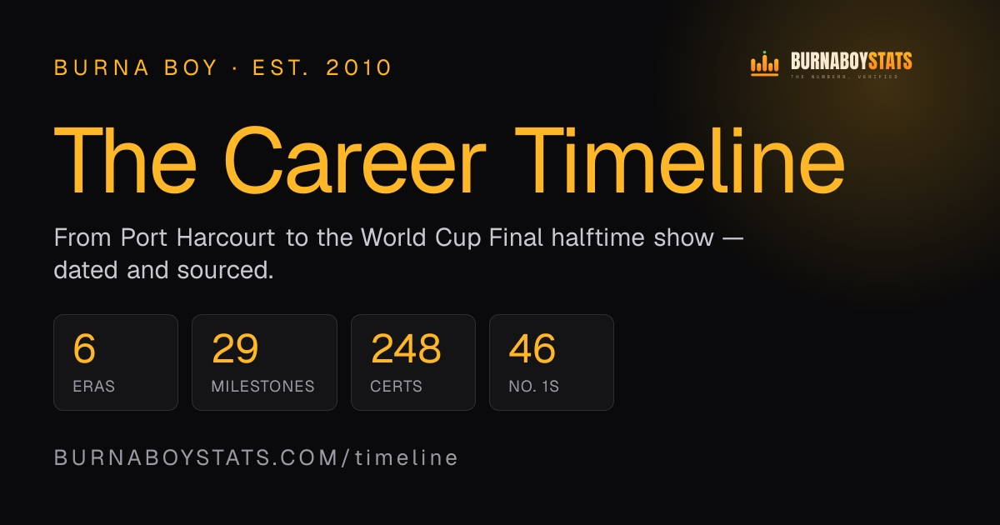

---

## Appendix A: every dated day, for drawing the calendar

Key: R = Release · Ch = Charts · St = Streaming · Ce = Certification · Aw = Awards · L = Live. The letter is the day's **lead** kind. A number in brackets is the day's total when it is more than one.

| Month | Dates | Events | Days |
|---|---|---|---|
| January | 9 | 12 | 3 Ch · 10 Ce · 11 Ch · 15 L · 16 L (2) · 17 L · 20 L · 23 Ce (3) · 26 R |
| February | 11 | 11 | 7 L · 10 Ce · 17 L · 18 L · 21 L · 22 L · 24 L · 25 L · 27 Ch · 28 L · 29 L |
| March | 14 | 15 | 1 L · 2 Aw (2) · 4 Ch · 5 Ce · 6 Ce · 7 L · 9 L · 11 L · 12 L · 18 L · 22 L · 23 L · 25 Ch · 31 Ch |
| April | 9 | 10 | 7 Ce · 8 L · 11 L · 12 L · 14 Ch (2) · 18 L · 21 L · 27 L · 28 L |
| May | 11 | 15 | 1 Ch (3) · 3 L · 5 Ce · 6 Ch · 15 R · 18 Ce · 19 Ch · 23 Ch (2) · 29 Ch · 30 L · 31 L (2) |
| June | 15 | 18 | 2 L · 3 L (2) · 4 L · 5 L · 6 L · 8 Ch (2) · 9 St · 10 L · 13 Ce · 14 L · 17 L · 18 Ch · 28 L · 29 L (2) · 30 St |
| July | 21 | 37 | 3 L (2) · 5 L · 6 L · 7 L · 8 R (2) · 9 Ce (2) · 11 R (3) · 14 Ch (4) · 15 Aw · 17 Ch (3) · 18 L · 19 L · 21 Ch (2) · 22 Ce (2) · 23 L (2) · 24 Ch (2) · 26 R (2) · 27 L · 29 L · 30 L · 31 L (2) |
| August | 15 | 24 | 2 L · 3 Ch · 9 L · 10 Ce · 11 Ch (2) · 12 R · 14 R (2) · 16 Ce (5) · 17 L · 22 Ce · 25 R · 27 Ce (2) · 28 L · 29 L · 31 Ch (3) |
| September | 17 | 22 | 1 Ch · 2 Ch · 3 Ce · 4 L · 6 L · 7 Ch · 8 Ce (3) · 10 L · 13 L · 15 L · 18 Ce (2) · 20 L (2) · 21 Ce · 22 Aw (2) · 23 L · 24 L · 25 L |
| October | 10 | 16 | 7 Ch (2) · 8 L · 11 L · 16 L (2) · 18 L · 20 L (2) · 24 L (3) · 25 L (2) · 26 Ce · 28 L |
| November | 17 | 25 | 2 Ce (2) · 3 L (3) · 5 Ch (2) · 6 L · 7 L · 9 L (2) · 10 Aw (2) · 12 L (2) · 15 L · 16 L · 17 L · 18 L (2) · 19 L · 22 L · 24 L · 25 R · 30 L |
| December | 18 | 23 | 1 Ce · 3 L · 5 L · 6 L · 8 Ce (3) · 9 L (2) · 10 L · 12 L (2) · 15 L · 17 L · 18 L · 19 L · 21 Ce · 22 L (2) · 23 Ch · 26 Ch · 27 L · 31 L |

Every event, with its exact wording, is in [`research/events.json`](research/events.json) and in [`research/inventory.md`](research/inventory.md), Appendix A.

---

*Sources (for the owner). Branch `feat/on-this-day` @ `21a7bc82` (PR #344). `main` @ `01b451f8`: its app code is unchanged from `93fedb07` except `data/updates.ts` and one certs stylesheet.*
- *Event model, kinds, labels, inks, the card builder and selection: `app/lib/onThisDay.ts:46-99`, `:394-470`, `:493-567`.*
- *Home band: `app/components/OnThisDayBand.tsx:19-66`, `onThisDayBand.module.css:1-95` (no tablet rule). History made at ≤1239: `app/page.module.css:785`.*
- *Phone: `app/components/MobileOnThisDayCard.tsx`, `MobileOnThisDayIndex.tsx:15-20`, `mobileOnThisDay.module.css:94-111`, `:229-259`.*
- *Pages: `app/on-this-day/page.tsx`, `app/on-this-day/[day]/page.tsx:80-112`, `onThisDay.module.css:83` (3 columns at max-width 1240px), `:184-230`.*
- *Tokens: `app/globals.css:23-74`, `:137-160`, `:202-217`, `:234-235`, `:282-297`, `:308`, `:396`, `:531`. Link rule: `:715-733`. Focus: `:1793-1802`. Reduced motion: `:1693-1700`.*
- *Home gold rule: `app/page.module.css:267-296`. Firsts year: `:669-673`. Live band: `app/components/LiveBand.tsx:7-26`.*
- *No updates list on the home page: `app/page.tsx:37-39` (main).*
- *Cover art: `app/lib/covers.ts`, `app/data/albums.ts`, `app/data/songs.ts`, `app/lib/artistImages.ts`.*
- *Share graphics: `app/lib/og-lockup.tsx:46-146`, `app/lib/og-image.tsx:50-133`, `app/lib/statCardImage.tsx:23-339`, `app/timeline/opengraph-image.tsx:54-117`, `app/dai-dai/opengraph-image.tsx:81-175`.*
- *Burna Boy news only: main commit `f3cbd27c`.*
- *Contrast figures were computed from the token hex values with the WCAG formula. Slot maxima, cover-art coverage and home-card states were computed by running the branch's own module (`tools/slots-probe.mts`, `covers-probe.mts`, `home-probe.mts`, `runs-probe.mts`, `cal-probe.mts`).*
- *Full citations: `inventory.md`, `audit.md` and `graphics-system.md`, beside this brief.*
