# Design review, 8 Oct 2026: seven jobs for Claude Design

**Site:** burnaboystats.com, an unofficial, verification-first Burna Boy stats site. It also runs the Afrobeats Board, a ranking of 20 African artists (Burna Boy and 19 others) counted under the same rules.
**Pages:** the whole site, about 56 pages plus the shared chrome. The jobs name their pages in §1.
**Source:** an independent design review of the live site, deployed 8 Oct 2026, with code at `main` `e4b0afc8`. Each page was measured in a real browser on a phone (390 × 844, touch), a laptop (1440 × 900) and the tablet band (1024 × 768), in light and dark.

You can't see the code, so everything you need is in this brief. The screenshots are in [`shots/`](shots/), one folder per review group, and are shown in place below. In this repo copy they were re-encoded as JPEG quality 50 at their original pixel size, so every coordinate in the notes still matches the image. The research notes are in [`research/`](research/), with a measurement or a `file:line` citation behind every claim:
- [`shell-home.md`](research/shell-home.md), [`certs-compare.md`](research/certs-compare.md), [`records.md`](research/records.md), [`board.md`](research/board.md), [`music.md`](research/music.md), [`tours.md`](research/tours.md) and [`content.md`](research/content.md): the seven group reviews;
- [`design-system.md`](research/design-system.md): the tokens, type, chrome and components as built, with every owner ruling that binds design.

You don't need the notes to do the work. They are there so the owner and Claude Code can check each claim. They mention scratchpad and `tools/` paths that hold the measuring scripts; those stayed in the reviewer's working folder, are not in this repo, and you can ignore them. The saved link-preview images that Job 6 points to are included, in [`shots/og/`](shots/og/) (Appendix C). Finding IDs (SH-05, CC-01, B-03 …) point into the notes.

**Live site:** https://burnaboystats.com

**Every number in this brief is a sizing example.** The site derives every figure from its data on every build. Draw every figure as a slot (§11, rule 6); never type one.

---

## 1. The ask

The review found the site in good shape, with real strengths to protect (§2):
- Text contrast passes AA in both themes almost everywhere at rest. The two real exceptions are small and are code fixes (Appendix A, QW13). Hover is weaker: his gold text on a hovered paper row drops to 4.14 : 1, which Job 0 panel 7 settles.
- A layout shift (CLS) of 0.000 on every page load.
- No sideways scroll at any width.
- Fast, text-first first paints.

It also found 180 issues. **About 70 are plain code or wording fixes that Claude Code can make without a design** (Appendix A lists them; **don't draw them**). The rest group into the seven jobs below. Priorities come from the owner's own reader test: a fan on a phone, a journalist checking a figure, and a search visitor arriving cold.

| Job | Priority | Pages | What you draw | Artboards: edit in place → new file |
|---|---|---|---|---|
| **0. The rules sheet** | **First** (small, unblocks the rest) | Site-wide | One sheet that settles 9 system questions: what gold may mark on each template, what each arrow means, selected states, colour roles, where mono is allowed, heading colour, the page frame and left edges, hover, and the **provenance component** used by Job 1 | Reference: `designs/mobile/Mobile Hero and Theming.dc.html` (token table "T", D1–D2), `Spec Addendum - Aug 11.dc.html`, `Design Pass - Aug 2026.dc.html` → new `designs/desktop/System Rules - Oct 2026.dc.html` |
| **1. The proof on every screen** | **Main** | Phone home · phone `/certifications` and every board artist's phone certifications · the `/certifications` dated log · `/records/africas-biggest` · the five tours pages · `/records/charts` (phone note) · `/records/by-the-numbers` · `/about` · `/faq` | The provenance component placed on each page, in both layouts; a "Latest" row on the phone home; dates on the dated log; a scope tag on every Africa's Biggest board; `/about` as an answer-first page with a portrait | Mobile 01, 02, 07, 08 · Deep Pages 10, 12, 13, 14, 16, 17, 20 · `Certifications.dc.html`, `Records - Africas Biggest.dc.html`, `Records - Tours.dc.html`, `Records - Festivals.dc.html`, `Records - Revenue Per Show.dc.html`, `Tour Map.dc.html`, `Records - By The Numbers.dc.html`, `About.dc.html`, `FAQ.dc.html` → new `designs/desktop/Proof.dc.html` |
| **2. Compare, answer first** | **Main** | `/compare/<a>-vs-<b>` (120 pair pages) · `/compare` · `/compare/in` · `/compare/in/<country>` (phone chrome only) | The pair page with the answer on a phone's first screen; the country table as a diverging (butterfly) table in both layouts; a "more pairs" row; footnotes; a pre-filled `/compare`; a "Leads" cell on `/compare/in`; the family's phone chrome as a change-list proposal | `Compare.dc.html` (superseded) → new `designs/desktop/Compare v2.dc.html` |
| **3. Ledgers that read in one line** | High | `/certifications` · `/records/charts` · `/afrobeats/<artist>` and its `/charts` and `/live` pages · the tour-date tables and hero panel on `/records/tours` · `/live-charts` (phone pills) | The desktop ledger row and a "Most certified" strip; pill labels; the switches beside the numbers they change; tier share bars; the charts country filter; the phone board-artist hero; a three-page artist switcher; tour dates with tickets and gross | `Certifications.dc.html`, `Records - Charts.dc.html`, `Afrobeats Artist.dc.html`, `Afrobeats Charts.dc.html`, `Afrobeats Live.dc.html`, `Afrobeats - Mobile Charts.dc.html`, `Afrobeats - Mobile Live.dc.html`, `Records - Tours.dc.html`, `Live Charts.dc.html` · Mobile 02, 05 · Deep Pages 10, 12 → new `designs/desktop/Ledgers.dc.html` |
| **4. Find your way** | High | Desktop masthead and footer · the phone menu sheet · `/records` · `/music` · the song and album template · the long pages: Africa's Biggest, awards, firsts, methodology, timeline, FAQ, updates, the open panel on live charts · phone tours | Masthead IA; a menu that shows it continues; the records hub as shelves with figures; album cards that open album pages; **one docking index** applied to every long page; the `/updates` reading pass; phone tours milestones | `Burna Boy Stats.dc.html` (masthead, footer), `Records.dc.html`, `Music.dc.html`, `Song.dc.html`, `Updates.dc.html`, `Methodology.dc.html`, `FAQ.dc.html`, `Records - Awards.dc.html`, `Records - Firsts.dc.html`, `Records - Africas Biggest.dc.html`, `Live Charts.dc.html` · Mobile 03–06, 08 · Deep Pages 11, 12, 15, 16, 22, 26 · **none** for the menu sheet or `/timeline` → new `designs/desktop/Wayfinding.dc.html` |
| **5. Charts and data modules** | Medium | `/records/visualized` · `/afrobeats` (hub) · `/music/listeners` · `/analysis` (phone) · the 500M board on Africa's Biggest · the home page's lower half · `/dai-dai` hero and chapter 02 chart (**owner sign-off**: approved design) | Readable phone charts and honest encodings; the hub ranking table, one action and a rescaled "shape of the field" with a phone form; an area-true listeners map with an insight row; phone charts on `/analysis`; the home's lower modules; the Dai Dai hero figure strip and an honest week chart | `Records - Visualized.dc.html`, `Afrobeats Board.dc.html`, `Afrobeats - Mobile Hub.dc.html`, `Analysis.dc.html`, `Burna Boy Stats.dc.html` (lower half), `Dai Dai Redesign.dc.html` (hero and chapter 02 only) · Mobile 01 · Deep Pages 19, 21, 25 · **none** for `/music/listeners` → new `designs/desktop/Charts and Modules.dc.html` |
| **6. Sharing** | Medium (the stat-card maker) · **Optional** (link previews, owner's yes) | `/share` (phone and desktop) · `/press` (two previews) · link previews for 13 routes | A stat-card maker whose phone first screen shows the stat; desktop actions above the fold; figure-first link previews in the existing "ladder" card family, still gold | `Share.dc.html`, Deep Pages 24, `Curator Press Correction.dc.html` (`/press`) · drawing template `OTD Link Preview.dc.html` → new `designs/desktop/Share Cards v2.dc.html` |

**Do Job 0 first.** It is a single sheet, and every other job draws to it. If the owner hasn't approved it by the time you draw Jobs 1–6, draw to your own recommendation in it and say so.

**Items marked OWNER?** need the owner's answer. If the brief reaches you before he answers, draw the default given and list the alternative in your change list. Section 11 lists the open questions.

**Where the artboards are.** Every artboard path is relative to your own project, the bundle you hand off as `design_handoff_burnaboystats/`:
- desktop: `design_handoff_burnaboystats/designs/desktop/<name>`;
- phone: `…/designs/mobile/Burna Boy Stats - Mobile.dc.html` ("Mobile", screens 01–09) and `…/designs/mobile/Burna Boy Stats - Mobile Deep Pages.dc.html` ("Deep Pages", screens 10–27), plus the four `Afrobeats - Mobile *.dc.html` files and `Cars - Mobile.dc.html`;
- responses and prompts: `…/docs-design/` and the bundle root.

The screen numbers come from the owner's copy of the bundle (design files dated **30 Sep 2026**):

| Mobile file | Screens |
|---|---|
| Mobile | 01 Home · 02 Certifications · 03 Music · 04 Records · 05 Live charts · 06 Updates · 07 About · 08 FAQ · 09 Contact |
| Deep Pages | 10 Official charts · 11 Awards · 12 Tours · 13 Festivals · 14 Revenue per show · 15 Firsts · 16 Africa's Biggest · 17 By the numbers · 18 Car collection · 19 Visualized · 20 Where he's performed · 21 Analysis · 22 Methodology · 23 Open data API · 24 Stat cards · 25 The Dai Dai story · 26 Song page · 27 Search |

If your copy differs, yours wins; say so in your response.

**Where the live site and your files disagree, the live site wins.** The owner closed the big redesign (rule 3). Where an artboard draws something the owner later changed, the screenshots in this brief show the decision:
- The masthead themes with the page; the logo artboards still show a dark island.
- Several screens shipped denser than drawn.

Draw from the live page, then change what the job asks.

**Phone width.** Draw every phone artboard at **402 wide**, in the bundle's 402 × 874 iPhone frame; the frame is the viewport. The screenshots and measurements were taken at **390 × 844**. Wherever a line must fit on one row, check it at **375** too. Desktop artboards are **1440**, with a **1024 check** wherever the job names one. The 901–1239 band has its own rules: a hamburger instead of the inline nav, display type ×0.73, and grids dropping a column.

**The phone's first screen, by chrome type.** These heights are fixed: don't redraw the bars, place content between them.

| Chrome on the screen | Fixed height | Reading window at 390 × 844 (the shots) | At 402 × 874 (your frame) |
|---|---|---|---|
| Back bar + five-tab bar | 69 + ≥87 | 688 | 718 |
| Back bar + action bar (75 + 34 home indicator) | 69 + 109 | 666 | 696 |
| Masthead + five-tab bar (home; the compare family today) | 69 + ≥87 | 688 | 718 |
| Masthead + the compare family's stacked "The Afrobeats Board ↗" bar + five-tab bar (pair pages today) | 69 + 69 + 87 | **619** | **649** |

**Who uses these pages:**
- **Fans on phones.** They want to know whether he's the biggest, whether he's No. 1 right now, and whether he played their country. They screenshot and share.
- **Journalists and fan pages.** They want a figure they can quote, with its source, its date and a way to download it.
- **Search visitors.** They arrive cold on a single page from a query. "burna boy real name" is the site's top query in Search Console and lands on `/about`. The pair pages and board artist pages are titled for searches like "burna boy vs wizkid" and "wizkid certifications", so that is how their readers arrive. Each page must say what it is, and give its answer, in about three seconds.

**What success looks like:**
- On a 402-wide phone, every page in Jobs 1–3 shows its answer, and a source with a date, on the first screen.
- A journalist can find any figure's source, read date and download from the page that shows the figure, on either layout.
- A reader on any long page can see where they are and jump on, without anything collapsing.
- Gold points at Burna Boy, at what is live and at the one action, so a reader learns what it means.
- Both themes pass WCAG AA, including hover. Every phone target is 44px. Nothing exists only on hover.
- The owner can approve your change list in one pass.

---

## 2. What to keep, on every page

**The strengths.** Protect these; most jobs build on them.
- **Provenance in the interface.** For example:
  - The desktop home's caption row reads "Sources RIAA · BPI · SNEP · IFPI | Verified 7 Oct 2026 | Open data API ↗".
  - `/methodology` has a "Claims checked and not published" section.
  - Gaps are drawn as gaps: a hatched "No reported box office yet" card, and an em dash for "not reported", never a zero.
  - The pair page says "27 countries checked · outside Nigeria · both registers read 2 October 2026".
- **The country board** (`/compare/in/<country>`) is the best template on the site. It reads in 3 seconds at both widths. Job 2 brings the pair page up to it.
- **Africa's Biggest's honesty.** Burna Boy's row is washed and gold wherever it falls, "He leads" appears only where he does, and one note says plainly that he doesn't lead a board.
- **The phone screens are phone designs.** The back bars carry live counts, the menu rows carry counts, and the On This Day calendar has 0 targets under 44px out of 208.
- **On This Day:**
  - no weekdays, honestly;
  - kinds shown by shape and word;
  - prev/next links;
  - a ready-to-post card on every day.
- **The Dai Dai story's chapter structure**, and its Spanish edition as a true parallel.
- **The gross pages** (`/records/tours/revenue`, `…/countries`) and their **ladder share cards**. They are the best data pages and the best previews on the site.
- **Art direction worth keeping:**
  - the car pages;
  - the hub photo wall in dark;
  - Ayra Starr's Starrgirl accent, which is page-only, restrained and AA in both themes;
  - the desktop listeners ranking: ink tabular numerals, an inline bar per city, gold only on the dated headline figure.
- **The keyboard layer.** A 2px gold focus ring at a 2px offset, a skip link first, and focus traps in the palette and the sheet.
- **Performance.** CLS is 0 everywhere, LCP is text, and no raster images load above the fold on most pages.

**The fixed parts:**
- **Chrome:**
  - the desktop masthead's parts (the wordmark, the one-tap theme flip, search with ⌘K, and the outlined **Box office** pill, which is deliberately not gold);
  - the breadcrumb;
  - the phone back bar, with its gold count badge;
  - the five-tab bar (Home, Music, Certs, Charts, Records);
  - the phone action bars.

  Job 4 proposes changes to the masthead's **links** and to the menu sheet's **layout** only. A change to any bar's label or destination goes on the change list.
- **Link-preview (OG) cards stay gold and dark**, for every artist, with the lockup, tagline and footer they have today. Job 6 adds figures inside that frame; it does not redesign the card.
- **Dense lists stay dense.** No new accordion, fold or "show more". The existing approved folds stay:
  - the phone certifications "Compare with…" and "Certified units by country…";
  - "All 93 releases";
  - the picker's "+ 12 more";
  - "Show all ↓".
- **Approved designs stay approved:**
  - the home's upper half (#238; its hero/panel alignment is padding-fragile);
  - On This Day (26 Sep);
  - the Dai Dai redesign (26 Sep, #350). Job 5 touches only its hero and one chart, with owner sign-off;
  - the tour map (1 Oct, #384). Its whole map must stay on the first screen at 1440 × 900, with the frame foot at or above y 905;
  - the gross pages (3–4 Oct);
  - the phone certifications density pass (Job 3 of 3 Oct).
- **SEO:**
  - one visible h1 per layout, with headings in order;
  - all text in the HTML at every width. Both layouts are in the HTML at once, and each has its own h1.

---

## 3. Job 0: the rules sheet

### 3.1 What exists today (measured)

The system is sound, but the build stopped following several of its own rules. Every figure below is counted across all 118 stylesheets and 239 components, or measured on the live pages ([`design-system.md`](research/design-system.md) §11).

- **Gold is meant to mark three things:** what is his, what is live, and the one action (rule 12). Measured gold text elements per page:

  | Page | Gold text elements |
  |---|---|
  | Africa's Biggest | 94 (desktop and phone) |
  | Phone awards | 101 |
  | Desktop firsts | 61 |
  | Desktop festivals | 59 |
  | Desktop tours | 53 |
  | Desktop records hub | 37 |
  | Phone listeners | 82 (desktop: 8) |
  | Song and album pages | 21–27 each |

  The home's upper half holds the rule: 7 gold elements, all of them his or an action. Specific breaks:
  - Every section h2 on song and album pages is gold; the same h2s on `/music`, `/dai-dai` and `/live-charts` are ink.
  - Every year on the tours and festivals lists is gold Anton.
  - Stat-strip figures are ink on `/records` and gold on `/records/by-the-numbers`, the phone Africa's Biggest and the phone awards.
  - The phone `/api` and `/embed` h2s are gold; `/press` and `/curator` are ink.
  - The `/afrobeats` eyebrow and its cadence sentence are gold.
  - A 178-character sentence on `/certifications` is set in gold.

  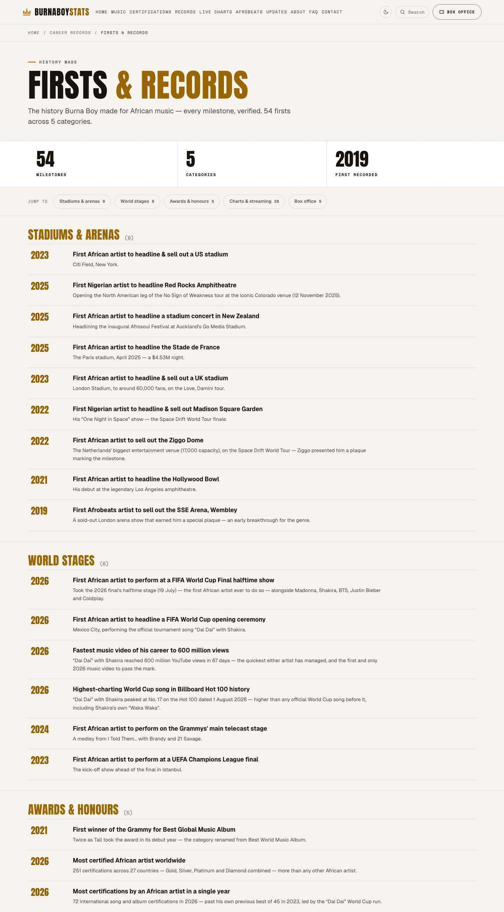

- **Arrows have no stable meaning.**
  - The written rule above `.btn` says: filled = the one action; outlined = its secondary; ↗ = go to a sibling page; bare text = utility.
  - As built, **26 of 40 filled buttons carry an arrow**, some ↗ and some →.
  - ↗ marks internal links ("Live board ↗", "All ↗"), while → marks others ("Explore the music →").
  - The board artist page's onward row has six buttons, two of them gold.
- **Selected states.**
  - Phone chips use N2 (ember edge, ember wash, ink label; rule 16), and desktop filter chips are a gold edge and wash as built (rule 17).
  - Outside those, each control picks its own: the theme control's selected segment is a **solid gold fill**; the phone tour-map view chips are an **ink fill** (Claude Code is moving them to N2 under rule 16, QW12); the desktop year tabs on `/certifications` are a **solid gold fill**; the compare mode control is an **ink fill**.

  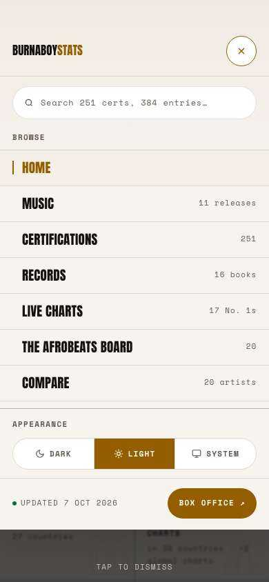

- **Colour roles leak:**
  - Phone tour dates print venue capacity in `--cyan`, the Top-10 peak-band colour.
  - `/timeline` kinds borrow certification-tier colours: a teal "FIRST" reads as Diamond, a gold "ALBUM" as Gold.
  - "At No. 1" is green in one place and gold in another on `/live-charts`.
  - The `/updates` tags are teal for CHARTS and green for TOURS.
  - "Record" is a gold pill on the phone and a green outline on desktop.
  - Single-series charts paint every bar gold.
- **Mono carries sentences.**
  - The `/afrobeats` cadence line is set in 11px uppercase mono.
  - The `/records/visualized` captions are mono sentences.
  - The desktop awards page sets 473 mono text elements (its work titles), against 268 in Geist.
  - On phone festivals, 76 of about 120 text nodes are 11px mono.
- **Left edges.** At 1440:
  - the masthead content starts at x≈64;
  - the breadcrumb and `.wide` content at x 80;
  - Keep exploring at x 104;
  - the footer at x≈90.

  Page bodies then start at their own x:

  | Content starts at x | Pages |
  |---|---|
  | 80 | `/certifications`, `/records`, firsts, awards, `/about`, `/faq`, `/contact`, `/timeline`, `/naija66` |
  | 120 | the car page |
  | 140–143 | Africa's Biggest, visualized, by-the-numbers, cars, the tour map, `/records/charts` |
  | 170 | `/methodology`, `/api`, `/embed`, `/share`, `/analysis` |
  | 184 | the compare family |
  | 310 | `/press`, `/curator` |

  Going from Certifications to Compare moves the headline 103px sideways. On `/press` the eye goes 80 → 310 → 104 down one page.
- **Hover:** 50 hovers press to `--bg-raised` (the Task C rule) and about 31 use a gold wash. Gold text on a hovered paper row measures **4.14 : 1**, which fails AA for small text.
- **Edges and contrast on paper:**
  - Chip and card edges use `--border`/`--line` at about 1.3 : 1, against the 3 : 1 the site sets itself for controls (`--btn-edge` is 3.96).
  - On paper, gold `#945e00`, ember `#b34700` and `--dim` all sit at about 5.0 : 1, so only hue separates them.
  - "Other artist" bars measure 2.87 : 1 on their track.
- **Source notes** (the trust layer): 58 rules in 10 sizes (11–16px), with measures from 38ch to 104ch; 41 have no measure at all. The desktop source notes run 100–104ch against the 62ch reading measure.
- **Display sizes:** 81 distinct Anton sizes; 13 fixed desktop h1 sizes plus 4 `clamp()` sizes; 10 phone title sizes.

### 3.2 The problem

Readers stop learning what gold means when it marks labels as often as it marks Burna Boy. Each arrow, selected state and left edge is a small inconsistency, but together they make sibling pages feel like different products. And there is no single provenance pattern for Job 1 to place.

### 3.3 What to decide, one panel each

For each question, draw the rule, one correct example and one "today" example, and write the rule in one sentence. A recommendation is given; it is your call.

1. **Gold budget per template.** Make a table with one row per template (home, hub, data board, entity page, story, reading page, tool) and columns for what may be gold.
   - **Recommended:** his row marker and his figures; a live figure; the one primary action; text links; the h1 split word (ruled); back-bar badges and Keep exploring arrows (ruled).
   - **Not gold:** section h2s, kicker text, years, tags, counts at rest, stat-strip figures.
   - **Exceptions that stand:** the `/afrobeats` hub rails, which stay exactly as they are today (ruled; rule 18), and Ayra Starr's purple, which is page-only (rule 19). Her section headings are gold as built, like every board artist's; if your budget turns h2s to ink, hers follow, and that goes on the change list.
   - Show the before/after census for Africa's Biggest, phone awards, a song page and desktop festivals.
2. **Arrows.**
   - Option A, the site's own written rule, clarified: ↗ for a link or button to another page; → for a whole card or row that is a link; ↓ for a download; no glyph for an action on this page. Filled vs outlined says importance, not destination.
   - Option B, the web convention: → for this site; ↗ for leaving it.
   - **Recommended: A.** It is the rule the tour-map round already followed, and it changes the fewest labels.

   Either way, list every label that changes. "Read the story ↗" (filled and arrowed) is the parked case from the home pass.
3. **Selected states outside phone chips.**
   - Decide segmented controls (the theme Appearance control, the compare mode control) and tabs (the desktop year tabs).
   - Settled already: every selected chip on a phone is N2 (owner, 5 Oct). That includes the phone tour-map view chips (World/Europe/Africa/Caribbean), which the tour-map round drew as an ink fill; Claude Code moves them to N2 (QW12), so don't redraw them.
   - Desktop filter chips are a gold edge and wash as built. The 5 Oct ruling covered phone screens only. Leave them gold unless you argue for N2 on desktop too; if you do, it is a change-list item.
   - Pick one state per control type, say why, and keep the screen's one gold fill for its action.
4. **Colour roles.** Write one table: gold, green, ember, `--cyan`/`--silver` (peak bands), tier inks, the peak ramp (choropleths only) and red inks. It must settle:
   - capacity is not cyan;
   - timeline kinds use On This Day's ink shape-and-word kinds. The tour-map response, item 79, deferred the `/updates` and `/timeline` tag colours to "Job 5"; this is that job;
   - "No. 1" on `/live-charts` is one colour;
   - one record treatment;
   - single-series charts use a neutral bar, with gold only for his bar or the live year;
   - the `--other` bar on paper: today 2.87 : 1; `#7a7c85` would give 3.47 : 1, but it cuts the gold/other separation from 1.58 to 1.31.
5. **Mono for labels only.** Name what may be mono: kickers, chips, buttons, table heads, badges and short meta tokens. Name what must move to Geist: any sentence, captions, work titles, and tour and festival meta lines. Give the phone info pages one h2: ink, one size.
6. **Page frames.** Define one outer edge shared by the masthead, breadcrumb, h1, content, Keep exploring and footer.
   - **Recommended:** x 80 at 1440. Then either one reading frame (prose capped at 62ch from that edge) or a named second frame for tools.
   - Show how `/certifications`, `/compare`, `/records/charts`, `/methodology` and `/press` sit in it.
   - **Constraint:** the tour map's frame is 1240 wide so that the whole map fits at 1440 × 900 (foot at or above 905). If you widen it, show the map still fits.
7. **Hover.** Choose `--bg-raised` everywhere (the Task C rule) or name where a gold wash stays. His gold text must keep 4.5 : 1 on its hover surface; the box office uses a `--hover` mix for this.
8. **Control edges.** Say which edges are controls (they need `--btn-edge`, ≥3 : 1) and which are decoration (`--line`).
9. **The provenance component.** Job 1 places it; you define it here, in three sizes. Each size gets a **desktop form and a phone form, drawn separately** (rule 2): Claude Code builds one desktop component and one phone component from your spec, never one shared component scaled between them.
   - **P1, the hero line.** Sources, check date, "How this is counted →" and the data link, on one line under the hero actions. Today's desktop home row is the desktop model: mono 700 11px, 44px tall. The phone form is yours to draw for a 402 column (it may wrap to two lines, or drop the method link into P3).
   - **P2, the board or section footer.** The source name and read date, always visible, in one ink line. The method may sit behind a tap. That is a disclosure of method, not a list fold; list it on the change list either way.
   - **P3, the page foot.** The method note at the 62ch measure, plus a **data line**: "Download CSV ↓ · JSON ↗ · CC BY 4.0 · cite as burnaboystats.com". Claude Code is adding the plain data line now (Appendix A, QW5); you style it.

   Give each size its face, size, colour, measure, date format (one format site-wide; today there are "7 Oct 2026", "7 October 2026" and "October 2026") and the "Data last reviewed" green-dot variant used on `/press`, `/curator`, `/analysis` and `/methodology`.

**Optional:** a display scale of 5–6 steps to replace the 81 Anton sizes. Mark it OPTIONAL; it is churn without a reader-facing gain unless you argue one.

### 3.4 Constraints

- Tokens only. A new colour is a `light-dark()` pair in the global stylesheet, with a reason; a test fails any colour literal in a module (rule 13).
- Don't change the rulings in §11. Where a panel would, it becomes an OWNER? question.

### 3.5 States to draw

- Each panel in **light and dark**, at desktop 1440 and phone 402.
- The provenance component in all three sizes, both themes, with:
  - the longest real source list (`/certifications` names 27 bodies);
  - a single-source case (Billboard);
  - an "as of" month-only case (`/faq`);
  - the green-dot reviewed variant.

### 3.6 Acceptance criteria

- [ ] Every one of the 9 questions has a one-sentence rule, a correct example and the "today" example.
- [ ] The gold budget table covers all seven templates, with the before/after census for four pages.
- [ ] Every colour pairing on the sheet has its contrast ratio written beside it, in both themes, hover included.
- [ ] The provenance component is specified in three sizes, each with a desktop form and a phone form, so Claude Code can build one desktop and one phone component with no per-page variants.
- [ ] Every panel is drawn at desktop 1440 and phone 402, each on its own terms, in both themes.
- [ ] The frame panel shows the tour map still fitting at 1440 × 900, or keeps its 1240 frame.

---

## 4. Job 1: the proof on every screen (main)

### 4.1 What exists today (measured)

**The desktop shows its evidence; the phone mostly doesn't.**

**Home.**
- **Desktop:** above the fold it carries the provenance row ("Sources RIAA · BPI · SNEP · IFPI | Verified 7 Oct 2026 | Open data API ↗"), "UPDATED 7 OCT 2026" on the live panel, and a live band carrying the newest verified change ("'Dai Dai' is 19× Platino in the US · 7 October 2026").
- **Phone:** it has none of these. Its only date is in the menu sheet's foot.
  - The hero says "sourced line by line, updated the day it changes" and shows no evidence.
  - On a phone, `/updates` (337 entries) is reachable only from row 8 of the menu sheet.

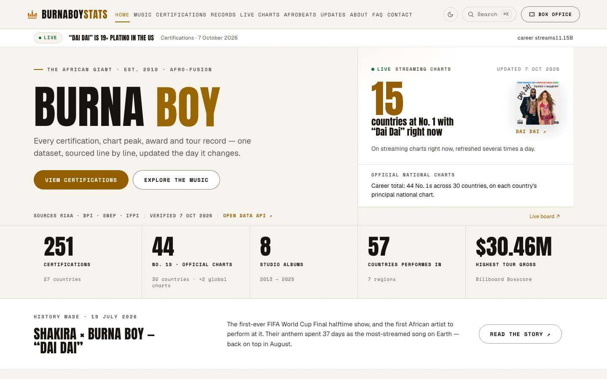
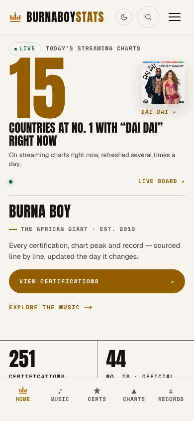

**Phone `/certifications`** (the `MobileCerts` screen, also used for every board artist's certifications).
- No visible link to `/methodology` or `/api`, no source note and no "checked on" date. All four such links are in the hidden desktop tree or the hidden footer.
- The page ends on log rows, then the action bar.
- Desktop has a Sources paragraph naming all 27 bodies, "most recently on 7 October 2026", and a "Methodology ↗" button at y 595.
- Board artist phone screens do show a date ("Last verified 4 October 2026") but no sources.

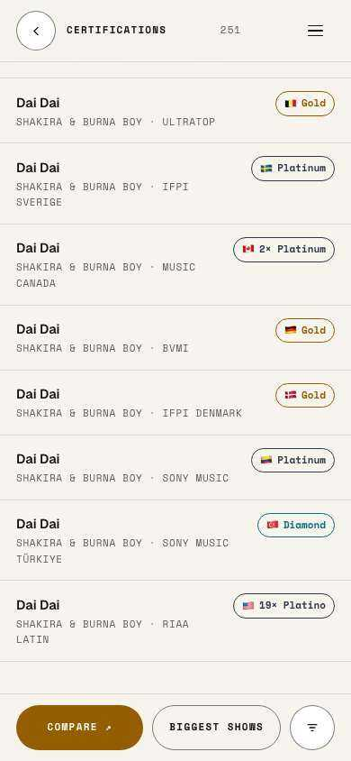

**"The dated log" on `/certifications`** (both layouts) **has no dates.**
- The 4,593px desktop section contains 0 date strings.
- Rows run oldest first, so 2026's 72 rows end with the newest plaques (Dai Dai CO Platinum, TR Diamond and RIAA Latin 19×, from 6–7 Oct), about 4,300px down the desktop list and at the very bottom of the phone page.
- The lede promises "Each international announcement as it landed".
- With "lead credits only" switched on, the hero reads 125, the "New in 2026" tile 62, and the log still "2026 · 72" with a featured row first. That is documented behaviour; it needs a visual cue (CC-21).

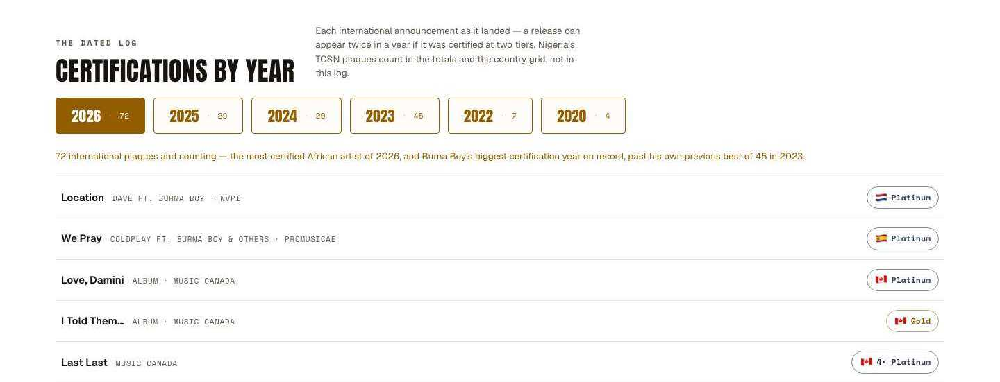

**Africa's Biggest** (20 boards).
- **Phone:** none of the boards has a source. The phone footnote reads: "Each board cites its own source and date on the desktop page." The desktop is the same URL with that layout hidden, so a phone reader can never reach it.
- **Desktop:** every source is folded behind an 11px "SOURCE ▾". The read date shows in the meta line on some boards only: "SPOTIFY · AFRICAN ARTISTS · AS OF 6 OCTOBER 2026" against "TOP 5 · AFRICAN ARTISTS".
- **Scope:**
  - Two boards are Nigerian-only. "Highest peak on Spotify's Global Weekly Top Artists chart" says so in its own note ("this is a NIGERIAN ranking… Tyla is absent").
  - Three rank all artists worldwide, among them "Fastest music video to a billion YouTube views" (Adele, Ed Sheeran, Luis Fonsi…).
  - The scope is carried only by 11px mono meta and prose, under an "Africa's Biggest" h1.

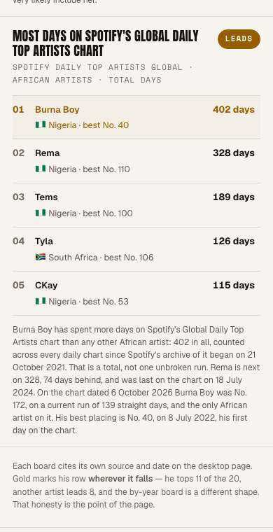
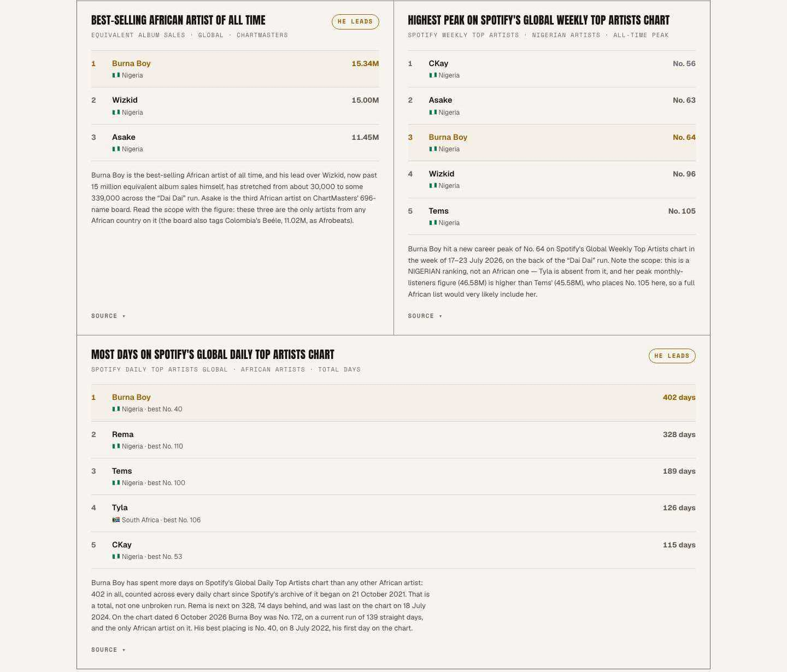

**The tours family** (tours, map, revenue, countries, festivals).
- The map prints no date anywhere.
- Phone tours and phone festivals print no date.
- Revenue and countries say "as of October 2026" only in the foot note, after 82 rows (desktop y≈5,612; phone y≈5,686).
- No page links to `/api/v1/tours` (which exists, dated `updated: 2026-10-07`).

**Elsewhere:**
- **`/records/charts`:** the phone footnote has no "as of" date.
- **`/records/by-the-numbers`:** freshness varies cell by cell with nothing per cell. "11.15B" streams is auto-published daily; "4.0B" YouTube was "counted by hand on 14 September"; "No. 94 … where he currently sits" has an undated "currently".
- **`/about`:** the landing for the site's top query, "burna boy real name". The h1 "About the Giant" and its lede never say "Burna Boy" or "real name"; the answer first appears in body text at y 424. There is no reviewed row and no source on the page (the only source is a 12px desktop-footer line, and phones have no footer). There is no image of the artist anywhere.
- **`/faq`:** its provenance is month-only ("as of October 2026"), in a 12.5px note at the very bottom.

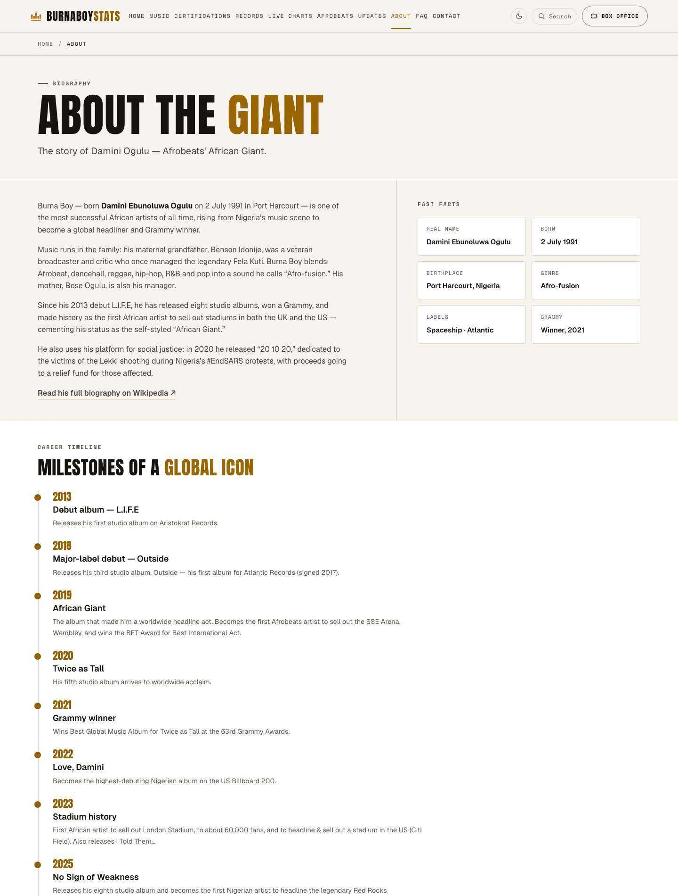
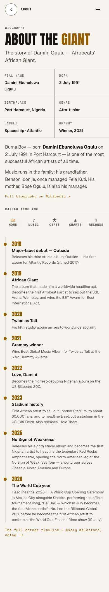

### 4.2 The problem

Verification is the site's moat, and the review's strongest praise was for the provenance shown on desktop. But on phones, where fans read and take their screenshots, the home, the flagship certifications screen and all 20 Africa's Biggest boards show no source and no date. "The dated log" shows no dates. A fan who screenshots the Nigerian-only board under "Africa's Biggest" is mis-stating it.

### 4.3 Goals

1. Every page in this job shows a **source and a date on its first screen**, on both layouts, using the Job 0 component.
2. The phone home gets a one-row **"Latest"** strip from the newest `/updates` entry, linking to `/updates`, and a date stamp on its live figure.
3. "The dated log" either carries dates, newest first, or stops promising them.
4. Every Africa's Biggest board says its **scope** (AFRICA / NIGERIA / WORLD) in a fixed position, in ink, and its **source and read date**, always visible, on both layouts.
5. A journalist reaches the CSV or JSON from the page whose data it is.
6. `/about` answers first, carries its sources, and shows the artist.

### 4.4 Placements to draw

Every figure, count and date in the "Draw" column is today's value, given for sizing. Draw each as a slot (rule 6), sized for its longest real value; the source lists and dates come from the data too.

| Page | Layout | Today | Draw |
|---|---|---|---|
| Home | Phone (Mobile 01) | Nothing (above) | P1 under the hero buttons, e.g. "Verified 7 Oct 2026 · RIAA · BPI · SNEP · IFPI"; a Latest row from `updates[0]` (e.g. "Latest · 'Dai Dai' 19× Platino (US) · 7 Oct →"); a date on the live figure ("Updated 7 Oct"). **The hero's figure-first order is ruled and test-guarded: add below the buttons.** |
| Home | Phone | No disclaimer on phones (OWNER? SH-09) | Only if the owner says yes: one muted 12px line at the end of the home, above the tab bar ("An unofficial fan site — not affiliated with or endorsed by Burna Boy · Artwork: Spotify") |
| `/certifications` + board artists | Phone (Mobile 02; the board artist screens share it) | No sources, method or date | P2 after the dated log: "Read at each body's register: RIAA, BPI, SNEP, Music Canada + 23 more · last check 7 Oct 2026" · "How this is counted →" · "Download CSV ↓" · one line for the label-issued rule (Colombia, Turkey) |
| `/certifications` | Both | The dated log, undated | (a) Where the data holds a date, start the row with it ("6 Oct", muted), newest first; undated rows follow under a small "Date not published" divider. (b) Otherwise rename the kicker ("Year by year"). Draw both; Claude Code will report how many rows have dates. On the phone the year label sticks inside the list (a label, not a fold). With a switch off, show a state chip on the year rail ("All announcements · switches don't apply") or dim featured rows |
| Africa's Biggest | Both (Deep 16; `Records - Africas Biggest.dc.html`) | Sources folded (desktop) or absent (phone); scope in 11px mono | Per board: a scope tag (AFRICA / NIGERIA / WORLD) in the same place on every board, in ink; P2 with the source name and read date (e.g. "Billboard · chart dated 3 Oct 2026", "kworb (Spotify plays) · 6 Oct 2026"); the method may sit behind a tap. Rewrite the phone footnote. Optionally regroup: Billboard / Spotify / YouTube & Apple / "Burna on the world boards" |
| Tours family | Both (Deep 12, 13, 14, 20; the tours, festivals, revenue and tour-map artboards) | Dates only in foot notes, or nowhere | P1 under each hero: "Reported box office · TouringData (Billboard Boxscore, Pollstar) · checked Oct 2026 · How we verify →". For the map: "Documented shows · updated 7 Oct 2026", placed **without pushing the map below y 905 at 1440 × 900**. P3 data line → `/api/v1/tours` |
| `/records/charts` | Phone (Deep 10) | Footnote without a date | P3 with "as of" |
| `/records/by-the-numbers` | Both (Deep 17) | No per-cell freshness | An "as of" micro-line per cell, in the Job 0 date format; a fixed-height number slot so the label baselines line up (today the highlighted cells' labels sit about 11px lower) |
| `/about` | Both (Mobile 07; `About.dc.html`) | No answer-first lede, no sources, no image; at 1024 Fast facts come after all four bio paragraphs | The answer-first lede (copy is being changed in code, Appendix A: "Burna Boy's real name is Damini Ebunoluwa Ogulu …"). The reviewed row with its sources under Fast facts ("Sources: Wikipedia · Grammy.com · Billboard · checked 7 Oct 2026"). A **portrait in the hero, on a `photoTile`** (it stays dark in light mode), drawn separately for desktop and phone; use the site's existing Burna portrait, nothing new. Use the empty right column on desktop (e.g. a studio-albums list linking to each album). At 1024, Fast facts before the bio |
| `/faq` | Both (Mobile 08) | Month-only date at the foot | A day-precise P1 in the hero |

### 4.5 Constraints

- **The home upper is approved** (#238). Change nothing above the scoreboard on desktop.
- **The phone home's running order is ruled** (live figure first, then the h1) and guarded by `tests/mobileHeroOrder.test.ts`. The phone hero itself is the approved Task A design (7 Sep, `designs/mobile/Mobile Hero and Theming.dc.html`), so the trust row and the Latest row go under its buttons, and each is a change-list item.
- **The `/about` portrait** adds an image above the fold where today the text paints first (§2, Performance). Keep it modest in size, and say in your response if it would become the page's largest element.
- **Map rule:** the tour map's lede was cut to two lines so the map's foot sits at y 905 at 1440 × 900. Nothing you add may push it lower.
- **Gross pages:** the 3–4 Oct designs are approved. A P1 line under their hero is a change-list item.
- **Sources per row on the box-office boards** stay unprinted (ruling). OWNER? R-1 asks to reconsider; the lightest option (sources in the CSV) needs no drawing.
- **Mono is for labels only.** A sentence in a provenance block is Geist caption.
- **No new folds on lists.** The Africa's Biggest method disclosure is the only tap-to-reveal allowed, and it goes on the change list.

### 4.6 States to draw

- **Phone home** (402, light and dark):
  - the trust row and the Latest row on the first screen;
  - Latest with the longest real entry headline;
  - a day with no chart change. Today the status row shows a lone green dot; Claude Code is fixing the dot, and you draw the sentence, e.g. "No chart changed in the last 24 h".
- **Phone certifications end block** (402, light and dark): Burna Boy, and one board artist (Tyla, with its label-plaque exceptions note).
- **The dated log**, desktop 1440 and phone 402: (a) dated and (b) undated, plus the switches-off state.
- **Africa's Biggest:** one board of each scope, at desktop 1440 and phone 402, both themes, with the method disclosure open and closed.
- **Tours:** each of the five heroes with P1, desktop 1440 and phone 402. The map at 1440 × 900 shows the whole map.
- **By the numbers:** a cell with a daily figure, a cell counted by hand, and the "currently" cell.
- **`/about`:** desktop 1440, the 1024 check, and phone 402, in both themes.
- **The 404 and empty states** are not in this job.

### 4.7 Acceptance criteria

- [ ] At 402 × 874, the phone home shows a date and at least one source without scrolling, and `/updates` is one tap from the home.
- [ ] Every Africa's Biggest board shows its scope tag, and its source and read date without a tap, at both 1440 and 402.
- [ ] Phone `/certifications` shows sources, a method link, a check date and a CSV link on the page.
- [ ] "The dated log" either starts every dated row with its date, newest first, or its kicker no longer promises dates; both versions are drawn.
- [ ] Each tours page shows P1 on its first screen at 1440 × 900 and at 402 × 874; the map foot stays at or above y 905.
- [ ] Every `/records/by-the-numbers` cell shows its own "as of" date, and the cell labels share one baseline.
- [ ] Every page in this job carries the P3 data line on both layouts, wherever a download exists for its data.
- [ ] Every provenance instance is one of the Job 0 sizes, in its desktop or phone form, with no per-page variant.
- [ ] `/about`'s first screen says "Burna Boy" and "real name" on both layouts, with a source and date.
- [ ] No new fold on any list.

---

## 5. Job 2: compare, answer first (main)

### 5.1 What exists today (measured, `/compare/burna-boy-vs-wizkid`)

**Desktop works.**
- Two 72px Anton totals (32,297,660 vs 42,290,770), with proportion bars; the trailing side is in lighter ink.
- The verdict "Wizkid leads by at least 9,993,110 certified units — a floor 1.3× the size of Burna Boy's" sits at y 849.
- The scope line reads "27 countries checked · outside Nigeria · both registers read 2 October 2026".

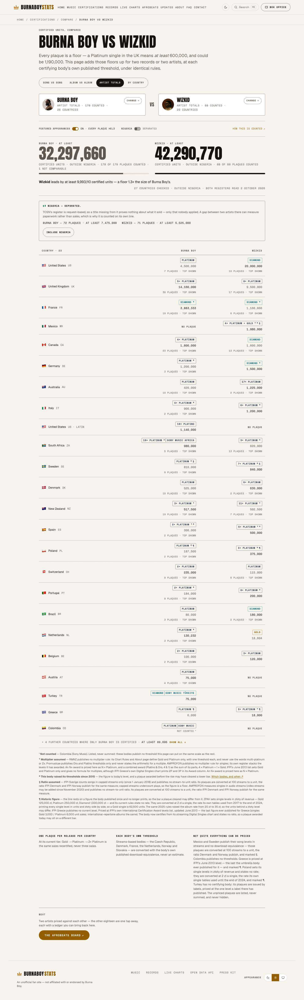

**On a phone the answer is below the first screen.** At 390 × 844:
- The totals sit at y 949–980 and the verdict at y 1,052–1,089.
- The reading window is **619px**: the 69px sticky masthead, the fixed "THE AFROBEATS BOARD ↗" bar (69px, top 688) and the tab bar (87px, top 757).
- Above the answer:
  - a breadcrumb wrapping to 2 lines (to y 131);
  - a kicker that repeats the breadcrumb;
  - the h1;
  - a **6-line generic lede, identical on `/compare` and on all 120 pair and country pages**;
  - the 4-mode control;
  - two 110px artist cards;
  - two switch rows.
- The Wizkid card is cut by the bars.

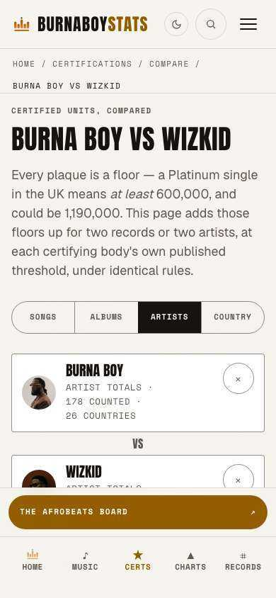
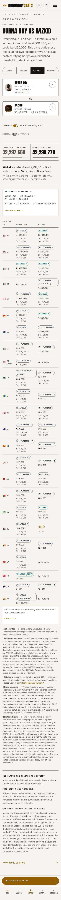

**The country table never shows who wins each market.**
- 23 rows: about 100px each on desktop, about 105px on the phone.
- Each cell stacks a tier pill, the units, and "N PLAQUES · TOP SHOWN"; that phrase is repeated in 40+ cells.
- The winner shows only as ink against grey type ("4,500,000" grey vs "20,000,000" ink for the US).
- At 1440 the country name sits about 600px from its first figure.
- Answering "where does Burna Boy beat Wizkid?" means reading 46 numbers.

**Footnotes and method.**
- Desktop footnotes are 1,072px wide at 12.5px: 140–187 characters a line. The ¶ note alone is about 120 words.
- The three-column method block is lopsided (column 1 is 2 lines, column 3 is 14). It names Mexico, Sweden, Colombia, Greece, Poland and Turkey even on the US board.
- On the phone, the footnotes and method take about 1,500px (y≈3,980–5,480 of 5,697).

**`/compare` opens on two empty pickers.**
- The first number takes two taps.
- On the phone, the head-to-head shortcuts start at y≈1,270, below the second picker.

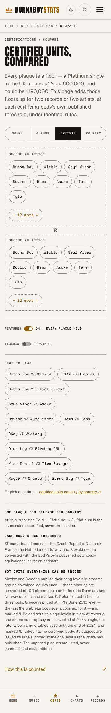

**`/compare/in`** (the country index) hides who leads each market.
- Rows read "Nigeria NG · 20 ARTISTS · 672 PLAQUES · TURNTABLE (TCSN) · 70,500,000 →". About 400px per row is empty at 1440.
- Its lede ("The rest of this page asks who has more. This asks who has more where…") was written for a `/compare` mode.

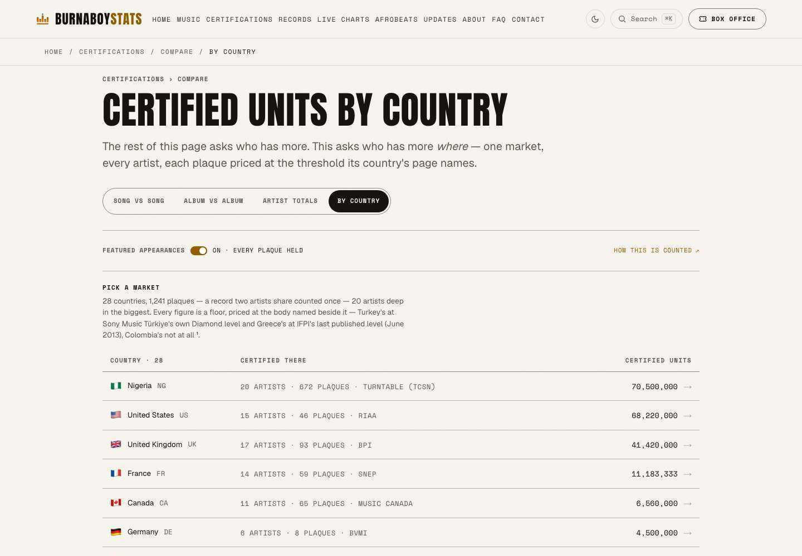

**Phone chrome changes between sibling pages.**
- `/certifications` and `/records/charts` open with the phone back bar ("‹ CERTIFICATIONS 251") and an action bar.
- The compare family opens with the full masthead, a wrapping breadcrumb (on `/compare/in/united-states`: "… COMPARE /" with a trailing slash, then "BY COUNTRY / UNITED STATES"), a kicker that repeats it, and the tab bar. That costs about 130px of every compare first screen.
- The owner gave `/curator`, `/press` and `/analysis/spotify-unmerge` a phone back bar with the tab bar kept (30 Sep). That is the precedent.

**The model to match:** the country board.

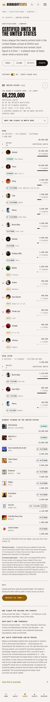

### 5.2 The problem

A search visitor who typed "burna boy vs wizkid" sees no number on their phone's first screen. The table that should answer "who wins where" makes them do arithmetic. The site's most original product loses its readers before the answer.

### 5.3 Goals

1. **The phone pair page answers first.**
   - Suggested order: h1 → one pair-specific line (derived, e.g. "Burna Boy holds twice the plaques (178 vs 88); Wizkid's are worth more units") → both totals with bars and the verdict → the switches → a compact "Burna Boy · change / Wizkid · change" row with the mode control → the table.
   - The generic "Every plaque is a floor…" lede moves into the method block.
2. **The butterfly table**, in both layouts, each drawn on its own terms.
   - Each row: the country, then one bar per side scaled to the row's larger value; the winner's bar in ink and the other muted. Keep the tier pill and the figure.
   - Explain once, in the header, that the pill is the top plaque. Print "7 plaques" in the cell.
   - Target about 56px rows on desktop and about 72px on the phone.
   - A derived summary above the table: "Burna Boy leads N of the 23 markets".
   - Country names link to `/compare/in/<country>`. Claude Code is adding the links; you draw the affordance.
3. **A "More with Burna Boy" row** above "Next" (vs Davido · vs Rema · vs Tems …), plus one for the other artist.
4. **Footnotes:** two 62ch columns on desktop, printing only the marks the page uses. On pair and country pages, the repeated method trio becomes the one-line "How this is counted →"; keep the trio on `/compare` and `/methodology`.
5. **`/compare` pre-filled.**
   - Side A is Burna Boy (the pair pages already put him first); or open on the title's own pair, Burna Boy vs Wizkid, with "Change" on both sides.
   - On the phone, the head-to-head row comes above the pickers.
6. **`/compare/in`:**
   - a "Leads" cell (avatar, name, units) in the empty middle;
   - a thin bar for each market's share of the largest (70.5M down to Slovakia's 23,502);
   - a rewritten lede (Claude Code will set your words).
7. **The family's phone chrome (OWNER?).**
   - Propose a back bar ("‹ COMPARE", "‹ BY COUNTRY", "‹ BURNA BOY VS WIZKID"), with no breadcrumb, no repeated kicker, and the tab bar kept.
   - Ask whether the stacked "The Afrobeats Board ↗" bar stays (156px of fixed chrome today with the tab bar).
   - Draw your recommended state; list both questions.

### 5.4 Constraints

- **Pricing:** today's certification levels price every plaque (ruling). Colombia is the only unpriced market ("Not counted ¹"), and it is listed, never dropped.
- **Nigeria:** shown separated or included through the switch, with its TCSN note. The footnote marks ¹ † ‡ § ¶ each keep their definition.
- **Pair pages** carry an h1 naming the pair (ruling). The scope line's figure is labelled coverage ("26 countries checked · outside Nigeria", 6 Oct ruling); draw it as a slot.
- **Tier colours** are data colours, never gold. Gold = Burna Boy's figures, live states and the action.
- **Lead and featured credits** follow Rule C (rule 30). "co-lead" is a tag. The switch words stay: "on · every plaque held" / "off · lead credits only"; "included" / "left out".
- **No fold added.** The existing picker "+ 12 more" stays.
- **The switch states deep-link** (`#feat=0&home=0`). Draw how a deep-linked view first appears. Claude Code is fixing the pre-hydration flash so the hidden figures don't show the default first.

### 5.5 States to draw

- **The pair page, phone 402**, light and dark:
  - Burna Boy vs Wizkid (he trails);
  - a pair where he leads (pick it from the data);
  - Nigeria included vs separated;
  - features off;
  - a country where one side has "No plaque" (Mexico for Burna Boy today);
  - Colombia unpriced;
  - the longest pair name in the 120 (Claude Code will report it; size the h1 slot for it at 375).
- **The pair page, desktop 1440** and the 1024 check: the butterfly table with 23 rows, the summary line and the "more pairs" row.
- **Song vs song and album vs album** modes, one each (the table shape changes).
- **`/compare`:** pre-filled, at phone 402 and desktop 1440.
- **`/compare/in`:** with the Leads cell, desktop 1440 and phone 402.
- **The family's phone chrome:** your proposal for `/compare`, `/compare/in/united-states` and a pair page.

### 5.6 Acceptance criteria

- [ ] At 402 × 874, under the chrome you propose and also under today's chrome (649px window), both totals and the verdict are on the first screen of the pair page.
- [ ] In the butterfly table, a reader can say who wins each of the 23 countries without reading a number. Every figure is still printed.
- [ ] Desktop rows are about 56px or less, and phone rows about 72px or less, with the tier pill and plaque count kept.
- [ ] The generic lede appears once (in the method), not above every pair's answer.
- [ ] Every country name in the pair table is drawn as a link.
- [ ] `/compare` shows a figure on its first screen.
- [ ] Every row on `/compare/in` names the artist who leads that market.
- [ ] Bars pass 3 : 1 against their track in both themes; the winner and loser bars are told apart by more than colour.

---

## 6. Job 3: ledgers that read in one line (high)

### 6.1 What exists today (measured)

**The desktop ledger row** is shared by `/certifications`, `/records/charts` and every board artist's certifications and charts pages.
- At 1440 each row puts the cover and title at x≈88–300 and **right-aligns the pills to x≈1,352**, as the designer's `Certifications.dc.html` drew it.
- Most rows carry one pill:

  | Page | Rows with one pill |
  |---|---|
  | Wizkid | 65 of 87 |
  | Ayra Starr | 21 of 27 |
  | Rema charts | 54 of 66 |

  Each of those rows reads as a title and a lone pill about 1,050px apart, in a 75–86px row.
- Multi-pill rows wrap from the right, so they share no start line.
- **The pages are long:**
  - Wizkid is 10,817px at 1440 and **15,165px at 1024**.
  - Burna Boy's singles run about 6,800px.
  - The Wizkid hero's claim, "'One Dance' is Diamond in five countries", first appears at **y 6,690** (y 10,037 at 1024).
- At 1024 the same chips **left-align under the title**, which reads far better.

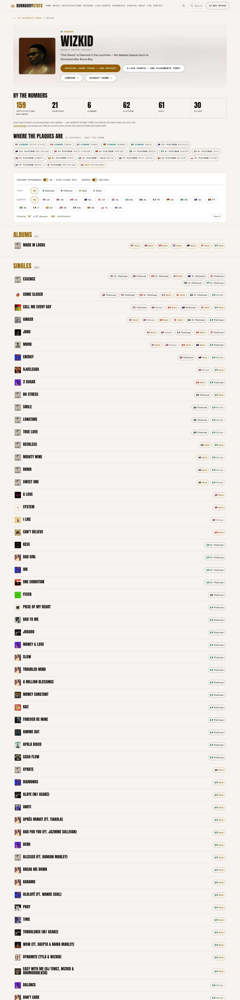
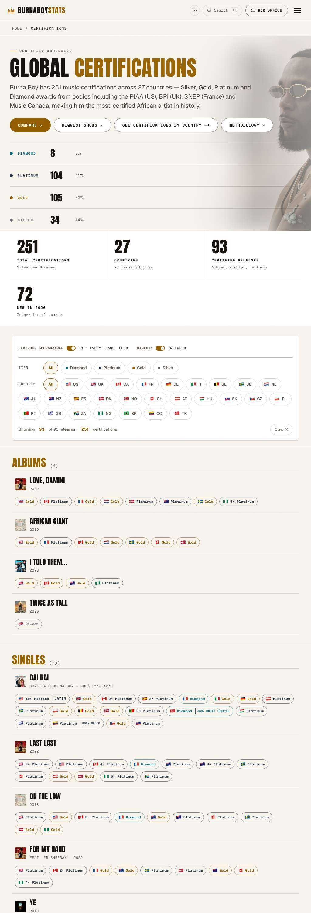

**Chart pills identify 55 territories by flag alone.**
- For example "🇲🇩 #2", "🇱🇧 #2", "🇰🇿 #2".
- The two Billboard global charts are told apart only by 🌍 against 🌐.
- The filter chips print codes (MD, LB, KZ, GLB, GLBX), but the pills don't.
- Country names live only in a `title` attribute: 161 elements at 1440 and 120 on the phone, which touch screens never show.
- The phone pills on `/live-charts` drop the platform, so one release shows the same country twice (African Giant: 🇳🇬 #29 ▲2 · 🇳🇬 #31 ▲1), and it reads as duplicated data.

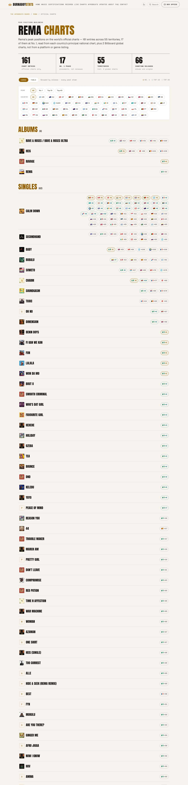

**`/certifications` desktop.**
- The two switches (207 × 44 and 103 × 44) sit at y 895–939, **at the fold**. They are about 700px below the kicker, lede, tier rows and stat tiles they rewrite, so flipping one changes the hero off-screen.
- The phone moved its switches under the lede on 4 Oct; the desktop brief left this as a question.
- The hero's tier rows (Diamond 8 · 3%, Platinum 104 · 41%, Gold 105 · 42%, Silver 34 · 14%) leave about 300px empty between count and percent at 1440, and about 700px at 1024. The phone draws a tier-coloured share bar on each row.

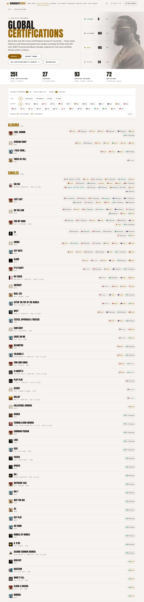

**`/records/charts` desktop.**
- No release shows on the first screen. A 71-chip country filter (plus "All") fills six rows (about 330px, y≈710–990), so "ALBUMS" sits at y 1,047 and the first release at y≈1,150.
- The phone uses a scrolling chip rail and shows its first release at y≈848.

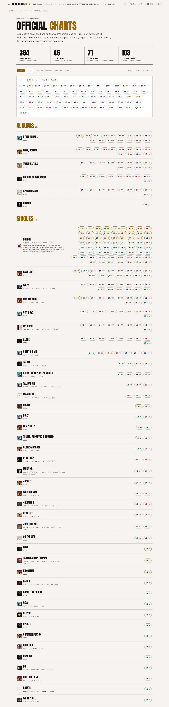

**Board artist pages on a phone** (`MobileCerts`, the same screen as Burna Boy's `/certifications`) **never show the artist's name at display size.**
- The visible headline is "159" (Anton, about 86px) under "CERTIFIED WORLDWIDE".
- The name appears at 11px in the back bar ("WIZKID") and once inside the lede.
- The portrait is a dissolved wash at the hero's right edge; in light mode it reads as a grey smudge.
- The h1's accessible name runs together as "159Awards21 countries" (a code fix, Appendix A QW15).
- Ayra Starr's purple name has nowhere to live on the phone.
- The desktop gets it right: a 220px portrait and a 76px name.

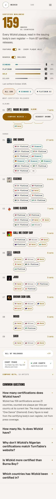
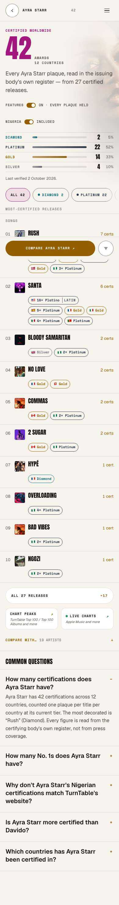

**An artist's three pages don't link as a set.**
- Each board artist has plaques (`/afrobeats/<artist>`), official charts (`…/charts`) and live now (`…/live`).
- The desktop charts page's onward row is "← Rema · The Afrobeats Board ↗ · Burna Boy's charts ↗", with no link to Rema's own live board.
- The phone charts screen has no action bar, so its only way out is back.
- The phone artist page shows charts and live as two small cards at the very end (y≈2,450 on Wizkid).

**Tours** (`/records/tours`).
- **Tour-date tables print venue capacity next to nights whose real tickets and gross the site already holds.** The I Told Them… table lists 24 dates under Date / Venue / City / Country / Capacity. The board holds 18 single I Told Them nights and 2 runs with tickets and gross:

  | Night | Capacity shown | On the board |
  |---|---|---|
  | BMO Stadium, 3 Nov 2023 | 22,000 | 10,684 tickets, $1,224,617 |
  | TD Garden, 2 Mar 2024 | 19,580 | 13,219 tickets, $1,592,684 |

  The phone labels the column "Venue capacity", in Top-10 cyan.
- **The hero's one gold action is a generic US Ticketmaster page**, and the phone repeats it as the fixed action bar on every scroll position. None of the three announced items is on sale:
  - an NFL halftime show (no ticket of his);
  - Apple Music Hall ("On-sale details are still to come");
  - London Stadium ("No date announced yet").
- The panel is titled "Upcoming dates & tickets", but the dates sit 300px lower.
- At 1024 the panel stacks into a 944 × 46px gold slab.
- The Announced entries run together with no divider (about 16px between entries, the same as inside one).

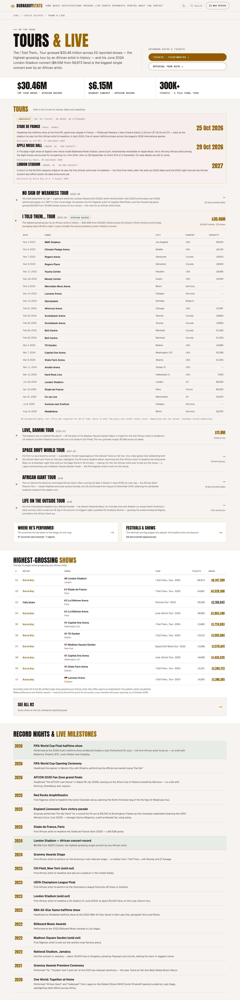
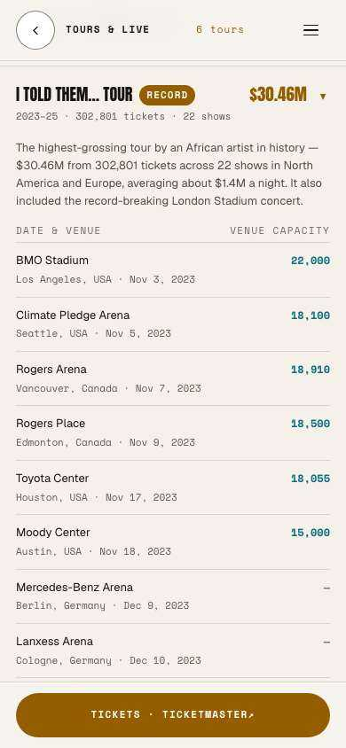

### 6.2 The problem

On desktop, every fact on the ledgers costs a 1,000px eye movement. The pages run so long that the hero's own claim appears 6,700px down. Flags stand in for names. The switches change numbers the reader can't see. On phones, a search visitor can't tell whose page they're on.

### 6.3 Goals and direction

1. **One desktop ledger row** for `CertExplorer` and `ChartExplorer`: a fixed title column of about 300–360px (cover plus Anton title), with **pills starting at its edge and flowing left to right**, in today's order.
   - Single-line rows drop to about 52–56px. Keep every row; this is not a collapse.
   - **Optional:** a "Grid" view, a country-column matrix (27 columns, tier as a coloured dot), desktop only.
2. **A "Most certified" strip** under "Where the plaques are": the top 3–5 records by plaque count, derived, each linking to its row. Check it against `/certifications` too.
3. **Pill labels:**
   - flag + the two-letter code the filter chips already print + the peak, e.g. "🇲🇩 MD #2";
   - the global charts by the chips' own codes (GLB, GLBX);
   - the live-charts phone pills get a 2-letter platform mark (AM, iT, SP, YT, DZ, SZ), or group by platform.
   - Draw the phone and desktop separately. If codes don't fit on the phone, a tapped pill opens a real popover.
4. **Desktop switches in the hero**, under the lede and above the CTA row, in the same 30 × 16 knob style. Or show a slim sticky summary ("125 · Outside Nigeria · Lead credits") once the hero leaves view. Tier and country filters stay in the filter card.
5. **Desktop tier share bars:** a 2px bar in the tier's colour across the empty gap, filled to the share. It is the desktop's own drawing, not the phone's.
6. **`/records/charts` filter:** group the 71 chips by continent, or put a type-to-filter field before the 12 most-charted chips. Every country stays one tap away; nothing folds. Tighten the hero so a release shows on the first screen at 1440 × 900.
7. **The phone board-artist hero** (a prop on `MobileCerts`, so Burna Boy's own screen is untouched unless you choose otherwise):
   - a visible name line in Anton at 36–44px between the back bar and the total; Ayra's takes the Starrgirl gradient;
   - a sharp portrait chip (48–56px, rounded);
   - the total stays the hero figure;
   - the switches, tier bars and N2 chips stay under it.
8. **The artist switcher:** three segments with counts, e.g. "Plaques 159 · Charts 240 · Live 298" for Wizkid today. Each count is a slot from the data, sized for the largest on the board. It sits at the top of all three pages.
   - Desktop: under the breadcrumb, aligned to the hero card.
   - Phone: a non-pinned row directly under the back bar. It may replace the two cards at the foot.
   - The current segment uses N2 on the phone (ruled). On desktop it follows your Job 0 panel 3 (desktop filter chips are gold as built).
9. **Tour-date tables:**
   - **Desktop:** add Tickets and Gross columns, filled from the board by venue, year and date. A run's figure prints once, spanning its nights, **never split** (owner rule). The board rank ("No. 6") links to that row. Capacity can stay as a quiet last column.
   - **Phone:** a second line under the venue, e.g. "13,219 tickets · $1.59M · No. 6 →" (all three are slots; a dash where the board has no row).
10. **The tours hero panel (OWNER? for the bar):**
    - It becomes the Announced list itself, with hairline dividers and 20–24px between entries.
    - Each announced show gets its own "Tickets ↗" only when it has an on-sale URL.
    - "Official tour site ↗" stays as the secondary.
    - The page's gold action goes to something on-site while nothing is on sale. On the phone bar that could be "Highest-grossing shows" or "Where he's performed"; the owner decides.
    - At 901–1239, keep the panel beside the lede, or size the buttons to their content.

### 6.4 Constraints

- **Shared components:** `charts.module.css` and `mobileOfficialCharts.module.css` serve every board artist. A change needs a scoping prop, and it lands on Burna Boy's pages and all 19 board artists' pages at once (rule 26).
- **Don't revive `Afrobeats - Mobile Artist.dc.html`.** That artboard draws a **tier accordion that the owner declined** (dense-screens ruling). The live board-artist phone screen is the shared phone certifications screen (Mobile 02 grammar). Draw on the live screen.
- **Headings and tags:** "Singles" / "Featured" stay; "co-lead" is a tag (Rule C, rule 30).
- **Ayra Starr:** her purple is page-only and her link previews stay gold (ruled, rule 19). Today it marks her name, her header button, her headline figure and the phone ALL pill; her section headings are gold as built. Whether her phone action bar turns purple is OWNER? (QW12).
- **Box office:** every row names its artist, Burna Boy's included, in the same position (3 Oct rule). Runs are never split into nights.
- **Tier fills** are the same in both themes; text on paper uses the tier inks.
- **N2 on phone chips.** Never two stacked bottom bars on a board artist page: only the Compare bar (12 Sep).
- **A show whose date has passed** moves out of "Announced" (Claude Code is adding the rule; QW1). Draw how that row reads: "Played · awaiting a box-office report".

### 6.5 States to draw

- **The desktop ledger** at 1440 and 1024, light and dark:
  - a 1-pill row;
  - an 8-pill row;
  - the 17-pill rows (Wizkid's "Essence" and "One Dance");
  - a row with a label-issuer marker (Dai Dai's "SONY MUSIC TÜRKIYE", set at **11px**, not today's 9px);
  - the "Most certified" strip.
- **Chart pills:** desktop and phone, including the two globals and a flag pair people confuse (🇳🇴/🇩🇰, 🇦🇺/🇳🇿).
- **`/certifications` hero with switches:** default, features off, Nigeria left out, both off.
- **`/records/charts`:** the first screen at 1440 × 900 with a release visible; the filter at work (one continent, a typed query, no match).
- **The phone artist hero**, 402, light and dark: Wizkid (long figures), Tyla (the exceptions note), Ayra Starr (the gradient name), and Seyi Vibez (102 plaques in one country).
- **The artist switcher** on each of the three pages, both layouts, with the current segment shown.
- **Tour tables:** desktop 1440 and phone 402. A run spanning two nights (Scotiabank Arena, Toronto); a night with no board row (a dash for "not reported", never zero); a played show still awaiting a report.
- **The tours hero panel:** nothing on sale; one show on sale; 1024.

### 6.6 Acceptance criteria

- [ ] At 1440, a one-pill row's pill starts within about 400px of the row's left edge, and every multi-pill row starts at the same x.
- [ ] The hero's own claim (e.g. One Dance's Diamonds) is visible within the first two screens of a board artist page at 1440.
- [ ] Every chart pill names its territory in visible text (a code) on both layouts.
- [ ] Flipping a `/certifications` switch changes figures visible on the same screen, at 1440 × 900.
- [ ] A release shows on the first screen of `/records/charts` at 1440 × 900.
- [ ] On a board artist's phone page, the artist's name is visible at display size on the first screen.
- [ ] The three artist pages link to each other from the top of each, on both layouts, with no second pinned bar on the phone.
- [ ] No tour-date row shows capacity as its only number where the board holds tickets.
- [ ] One gold fill per screen.

---

## 7. Job 4: find your way (high)

### 7.1 What exists today (measured)

**The desktop masthead** (1240px and up) carries 13 controls:
- the ten links Home, Music, Certifications, Records, Live Charts, Afrobeats, Updates, About, FAQ and Contact;
- the theme flip, search and Box office.

Items sit **9–11px apart**, about the same as the word space inside "LIVE CHARTS" (about 8.4px), so the row reads as about 12 equal words. "Home" duplicates the wordmark. About, FAQ and Contact take 3 of the 10 slots, while **Compare** (120 pair pages) and **On This Day** have no slot. Compare is not in the desktop chrome at all: on the home page its only link is a row in the phone sheet, and a desktop reader reaches it only through the body of `/certifications` or an artist page. The footer sitemap is missing Compare and the Press kit; Claude Code is adding them (QW10).

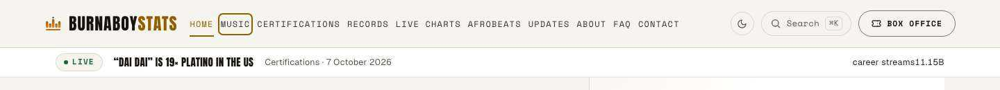

**The phone menu sheet** opens at 390 × 844 with **7 of its 30 rows** visible (Home → Compare). Measured, top to bottom:

| Part | y range | Height |
|---|---|---|
| Head | 0–111 | |
| Search | 125–173 | |
| List window (scrollHeight 1,699) | 173–592 | 419px |
| Appearance (pinned) | 592–693 | 101px |
| Foot (pinned) | 693–768 | 75px |
| Dismiss strip | 768–844 | 76px |

The list window ends exactly on a row boundary, with no fade. "Browse" reads as the whole menu, and the 23 "Deep data" and "The site" rows go unseen. The sheet's own code comment calls it the only way into 17 pages. No artboard in the 30 Sep bundle draws the sheet as built.

**The `/records` hub** is 16 title-plus-one-line "books" with no figures:
- 8 rows of 2 at 1440;
- one 944px column at 1024;
- about 1,450px of cards on the phone.

It mixes top-level destinations already in the nav (Live Charts, The Afrobeats Board) with four Tours sub-pages. Africa's Biggest is described as one of its own 20 boards. The lede promises "16 record books, each one sourced and dated", and nothing on the hub is dated. Meanwhile, the Keep exploring cards on the same page do carry figures ("384 chart entries · 46 No. 1s").

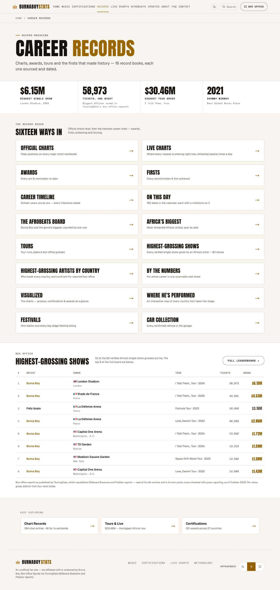

**`/music`:**
- Each desktop album card shows cover, title, year, the label chain and "15 TRACKS ↗". "Atlantic · Bad Habit · Spaceship" repeats on 6 of 8 cards.
- A click opens the tracklist dialog. The 8 album pages are a second click away.
- The phone orders albums newest first and the desktop oldest first. The phone says "16 trk" in gold.
- The home's 16 album links all go to `/music`. Claude Code is pointing them at the album pages (QW2).

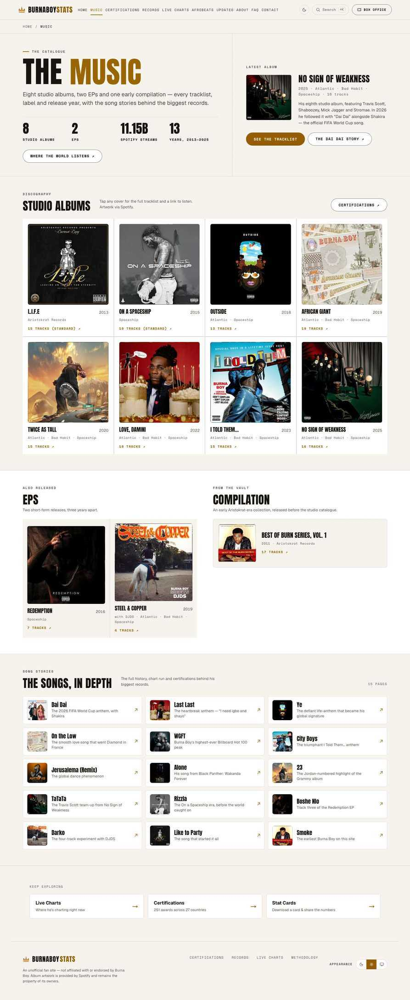

**The song and album template (desktop):**
- The hero card spans 1,160px, but WGFT's content stops at about x 850 (Love, Damini's at about x 977), leaving 300–450px of tinted, empty card.
- The "All 15 song pages" rail is 2,394px of chips in a 1,160px window, clipped on both edges with no fade or arrows.

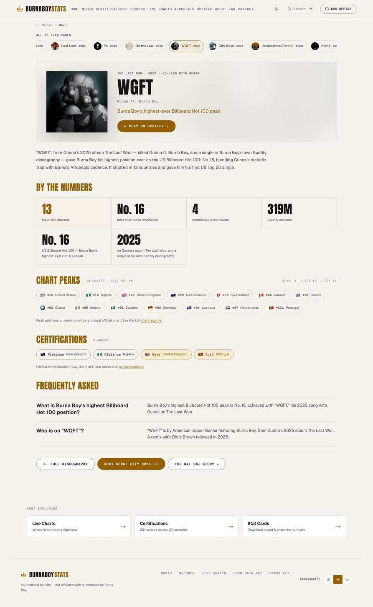

**Long pages with nothing that stays with you:**

| Page | Length (desktop / phone) | Today |
|---|---|---|
| Africa's Biggest | 11,060 / 13,413 | 20 boards. Phone: only the back bar sticks; the three filter chips scroll away after the first board. Desktop: a jump nav with three anchors |
| Awards (phone) | 22,974 | Bodies sorted by most wins (the design's rule). **The Grammy is the 35th of 48 bodies, at y 15,906, about 19 screens down**, though the hero, lede, stat strip and two of four FAQs lead with it. The only controls are All / Wins only / Nominated |
| Firsts (desktop) | 7,204 | The jump rail is not sticky; one category has 29 rows (about 3,000px). Every row leads with a 28px gold year, so the column reads "2023, 2025, 2025, 2025, 2023, 2022…", which looks like a sorting bug next to the owner's headline-first order |
| Methodology | 14,379 / 18,674 | 11 h2 sections, no index, back-to-top only. On the phone the back bar is lost after 27% (Claude Code is fixing that, QW3) |
| Timeline | 6,429 / 8,424 | Era chips at the top only |
| FAQ | 4,999 / 6,312 | Jump chips at the top only; on the phone the chip rail scrolls away |
| Updates | 30,438 / **53,901** | 337 entries. Desktop entries run about 118 characters a line; each row is a 2–3 line paragraph with no lead, so the fact sits mid-sentence. The filter bar and month heading scroll away, and each row repeats the full date under its month. The phone list (about 64 screens) has no month or year markers. At 1024 the first screen shows no entry at all (the filter row at y≈745 of 768) |
| Live charts (phone, a release opened) | 5,555 → 16,686 | Opening Dai Dai adds 11,131px. At scroll 5,000 the screen shows rows like "#15 🇲🇹 Malta ▼4" with no release or platform visible, and closing means scrolling back thousands of pixels |

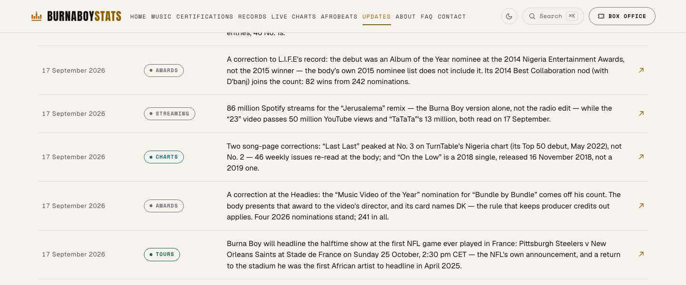
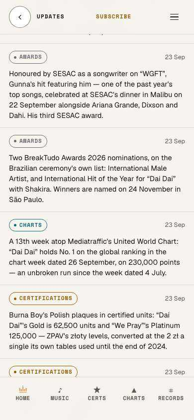
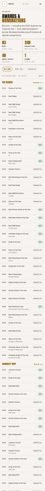
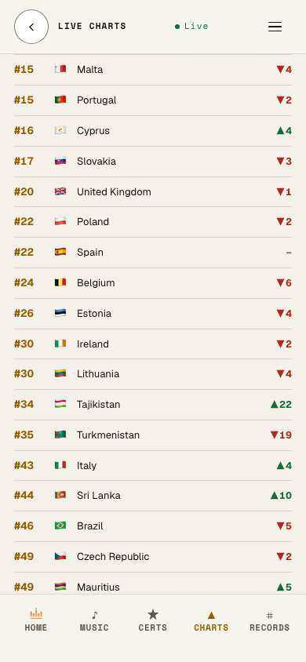

**The precedent to reuse:** the countries page (`/records/tours/revenue/countries`) already has **sticky continent chips on the phone** and a **sticky "Jump to" rail on desktop**. Both are approved and live.

**Phone tours** ends after "More from the road" and a footnote: 2,032px against the desktop's 6,652. It leaves out the 17 "Record nights & live milestones": the World Cup Final halftime show, the Grammys main stage, Citi Field, the UCL final and the NBA All-Star Game.

### 7.2 The problem

The site is deep: 30 menu destinations, pages of 20,000px and more, and 337 updates. But a reader can't see what's in the menu, can't see where they are on a long page, and hubs send them to the wrong place or show no reason to click. The tour-map round left "long-page wayfinding" (its Job 5) for later at the owner's request. This job is that job, widened.

### 7.3 Goals and direction

1. **Masthead IA** (desktop 1440 and 1240, the tightest width):
   - 6–7 section links with gaps of at least 20px at 1240, and no tracking squeeze;
   - drop Home (the wordmark is home);
   - put About/FAQ/Contact under one item, or leave them to the footer and sheet;
   - **Compare placed, or explicitly not placed (OWNER?)**;
   - keep the Box office pill, the theme flip and search.
2. **The menu sheet** (phone 402 × 874 and 375 × 667):
   - Either everything under the head scrolls as one column at every height (search, all groups, then Appearance and the foot at the end), or the pins stay and you add a bottom fade plus an "N more ↓" cue on the last visible row.
   - Nothing collapses. Box office can stay in the foot.
   - The selected theme segment follows Job 0 panel 3.
3. **The `/records` hub** (desktop 1440 and 1024; phone Mobile 04):
   - four shelves: Charts & streaming / Awards & firsts / On the road / Off stage (cars);
   - each card gets one derived figure in ink and its "as of" date (the Job 0 format);
   - the Tours sub-pages move inside "On the road";
   - Africa's Biggest gets an accurate description, derived, e.g. "20 leaderboards — he leads 11".
4. **`/music` album cards** (desktop and Mobile 03):
   - a card click goes to the album page, and a secondary "N tracks" control opens the dialog;
   - the label chain is replaced by two derived figures (e.g. "Best No. 2 · 8 certifications"; the noun follows CP2);
   - one album order on both layouts (newest first suits the "Latest album" hero);
   - "16 tracks" spelled out, and muted.
5. **The song and album template** (desktop, `Song.dc.html`):
   - the hero's right third carries the three lead figures (countries · best peak · plaques) or the blurb at 62ch;
   - the picker rail gets edge fades and ‹ › buttons at ≥901;
   - **optional:** tracklist rows carry per-track facts, or go two-column at ≥1024.
6. **One docking index pattern per layout**, each drawn on its own terms and then applied to every long page:
   - **Phone:** a horizontally scrolling N2 chip row that docks under the back bar (the countries-page pattern).
   - **Desktop:** a sticky rail under the masthead, or in a gutter where the page frame (Job 0) leaves one. Not the phone row widened.
   - Nothing collapses. Draw its z-order and anchor clearance (today `[id]` clears 88px; a docked rail needs more).
   - Apply it to:

     | Page | What the index holds |
     |---|---|
     | Africa's Biggest | Board short names |
     | Awards (phone) | A body-name rail, and/or a "Majors" block (Grammy, BET, BRIT, MOBO, Billboard Music Awards, AMAs) before the most-wins order. The order is the designer's call |
     | Firsts (desktop) | The sticky jump rail. Plus: the year demoted to an ink label after the title or right-aligned, so the order reads as importance, and a small "proof →" link per row |
     | Methodology | Desktop: a sticky section list. Phone: a section chip rail |
     | Timeline | A sticky era indicator |
     | FAQ | The phone chip rail stays reachable |
     | Updates | Below |
     | Live charts | The open panel gets a sticky sub-header ("DAI DAI · YOUTUBE · 95") that changes as each platform block passes, and a "Close Dai Dai ↑" row at the end of the panel |

7. **`/updates`:**
   - **Desktop:** cap entry text near 68ch, with the category tag under the date. Set the clause before the first colon in weight 500 (most entries read "X: detail"). Make the month heading and filter row one sticky 48px strip under the masthead. Short row dates ("17 Sep").
   - **Phone:** a 28px sticky month label ("SEPTEMBER 2026 · 89 entries", the count derived) that hands over as you scroll. Optionally a back-to-top above the tab bar after the first 20 entries. **OWNER?** Screen 06 was drawn with no month headings.
   - **1024:** the digest card beside the lede (about 380px), or one inline row (email field + Subscribe), so an entry shows on the first screen.
8. **Phone tours milestones:** a phone-native block in the dense row grammar the phone already uses (year · title · one line; no accordion), or a fourth "More from the road" row to a milestones view. Phone only; not a copy of the desktop.
9. **OWNER? Open the two folded phone screens.**
   - Phone firsts (Deep 15) folds 45 of its 54 milestones and drops every detail line.
   - Phone festivals (Deep 13) folds 26 of its 58 appearances behind "+".
   - Both came from the designer's file and run against the owner's dense-lists preference. Draw them open only if he says yes; otherwise leave them.

### 7.4 Constraints

- The five-tab bar's set of destinations doesn't change. The menu sheet hides the tab bar while open.
- **One breakpoint per control.** The hamburger and the sheet it opens share one breakpoint. Test the 901–1239 band (ruling 4).
- **Dense lists:** no accordion, fold or "show more". A docked index is a jump aid, not a fold.
- **Firsts:** the headline-first order in every category is ruled (6 Oct). You change the year's treatment, not the order.
- **Awards:** the phone sorts bodies by most wins (the design's rule). A Majors block or a rail is your call; list it.
- Keep exploring's label stays muted, with gold arrows (ruled).
- The selected state on phone chips is N2 (ruled). Desktop filter chips are gold as built; any change goes through your Job 0 panel 3 and the change list.
- The Box office pill is outlined, not gold, and stays.

### 7.5 States to draw

- **Masthead:** 1440, 1240 and 1500, light and dark. The active link state. Your IA's About/FAQ/Contact item open, if it opens.
- **Menu sheet:** 402 × 874 and 375 × 667, opened and scrolled to the end, light and dark.
- **`/records`:** desktop 1440, the 1024 check, and phone 402.
- **`/music`:** a card at rest, on hover/focus, and the "N tracks" dialog trigger, desktop and phone.
- **The song template:** WGFT (a short record) and a long one, desktop 1440 with the rail scrolled mid-way.
- **The docking index:**
  - on Africa's Biggest (phone 402 and desktop 1440), mid-page, with a board in view and its chip current;
  - the awards Grammy route;
  - methodology mid-page on both layouts;
  - updates mid-list on both layouts and at 1024;
  - the live-charts open panel mid-way on the phone;
  - reduced motion (the jump is instant).
- **Phone tours:** the end of the page with milestones.

### 7.6 Acceptance criteria

- [ ] At 1240, the gap between masthead items is at least 2× the word space, and every sheet destination is reachable from the desktop chrome or the footer.
- [ ] At 402 × 874 the menu sheet shows at least 10 rows, or an explicit "more" cue, on opening.
- [ ] Every `/records` card carries one derived figure and a date.
- [ ] An album card opens its album page.
- [ ] On every long page in the table, from any scroll position, the reader can see where they are (section, board, month or release) and jump to another, on both layouts, with nothing collapsed.
- [ ] On the phone, the awards page reaches the Grammy in one tap from its first screen.
- [ ] At 1024 × 768, `/updates` shows an entry on the first screen.
- [ ] The docked index never covers the first row of the section it jumps to.

---

## 8. Job 5: charts and data modules (medium)

### 8.1 What exists today (measured)

**`/records/visualized`.**
- **On the phone:** 29 of 32 SVG labels render under 11px (median 7.4px, min 6.9px: "47.38M", "Spotify · monthly listeners", "1 Jul"), because each viewBox scales its text. On desktop the same labels render at a median of 17.7px and a max of 37.4px.
- The phone page has 1 link in main against 32 on desktop, so none of its 14 charts routes to its proof page.
- Captions are mono sentences ("Gold is Burna Boy — 32 of the 82 verified nights.").
- **Encodings:**
  - (a) "Climb to sixty million" is an area chart on a truncated axis with non-round ticks (47.38M, 53.76M, 60.13M). The fill implies magnitude. Africa's Biggest's hero deliberately draws from zero "so a 25% climb reads as a 25% climb".
  - (b) "Fifteen years of winning" draws discrete yearly counts as a filled line with only 2012, 2019 and 2026 labelled, so the second peak (17 wins) has no year.
  - (c) The wins donut's centre reads "35% WIN RATE" while its legend reads "Won 83 · 33%": two denominators for one 83.
  - (d) Single-series charts paint every bar gold; the phone bars are an orange-to-gold gradient.
  - (e) "Pace of the plaques" skips 2021.
  - (f) The light peak map's caption says "gold = higher", but No. 1 is dark brown, and the 41+ salmon sits close to the no-data tone.
- **The tickets-vs-gross scatter** spends about 80% of its area on four outliers: about 70 of 82 shows sit in its bottom-left fifth, overlapping. On the phone it sits in a sideways scroller (460px in 354px), with London Stadium off-screen.

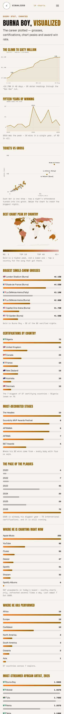
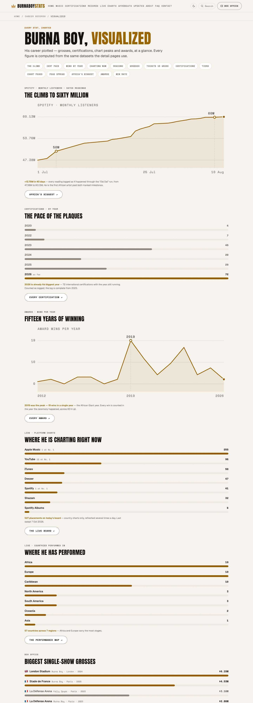

**The 500M board** on Africa's Biggest has 14 rows:
- 7 read "1" (Rema, Tems, Tyla, CKay, Ayra Starr, Burna Boy and Moliy, two songs each) and 7 read "8".
- The tie order is unexplained (it is combined streams: Rema 2.73B … Moliy 1.13B).
- Its most interesting fact, "Dai Dai" at 499.4M and about to make Burna Boy the outright leader, is buried in the note.

**The `/afrobeats` hub:**
- At 1440 the first screen shows four artists; the photo grid takes 2,030px (2,740px at 1024).
- The sort key is never stated, and tiles carry no rank. There are ties: Tems and Tyla at 76, Fireboy DML and Kizz Daniel at 36.
- Chart entries and live placements appear only in two pill rails, 3.3 screens down.
- The hub has **no primary action**, and **nothing on it links to `/compare`** except one row in the phone sheet.
- Each tile's editorial hook is `opacity: 0` until mouse hover. Keyboard focus doesn't reveal it, and touch never does.
- **"The shape of the field"** (≥1240 only, by ruling):
  - a linear y from 0 to 260 in about 242px (0.93px per plaque), so 18 of 20 dots sit below 40% of the height;
  - 14 hand-placed leader lines;
  - no y ticks;
  - its key says "TOP-LEFT = DEEP AT HOME (SEYI VIBEZ)", but Seyi sits at 39% height, lower left. A square-root scale would put Seyi at 63% and leave 8 dots below 40%, not 18.
- Phones and the 901–1239 band get no version of the chart at all.

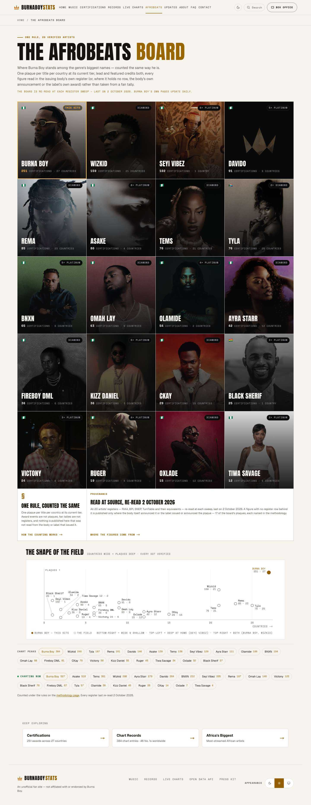
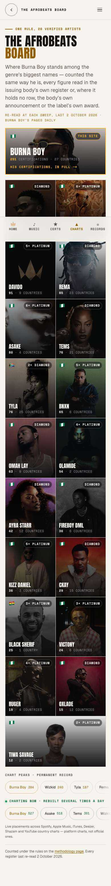

**`/music/listeners`:**
- **Dot area understates the data.** The radius is 2.6 + 6.6·√(listeners/max), so Lagos (1,439,126) is r 9.2 and Auckland (143,427) about r 4.7: 3.9× the area for 10× the listeners.
- No city is labelled.
- The phone map is 352 × 184px. About 20 European dots and the 4 Nigerian dots merge into two blobs, and about 25% of the map's height is ocean and Antarctica.
- The page's sharpest facts sit in its last paragraph at 13px and 123 characters a line: "The 50 cities hold 15,087,851 of his 45.97M monthly listeners on 2 October 2026 — 33%. Nigeria's four cities hold … 20%, and 42 of the 50 are outside Africa."
- The phone paints all 50 city counts and all 29 country totals gold (82 gold text nodes, against 8 on desktop), and mixes "1.44M" with "3,045,070" on one screen.

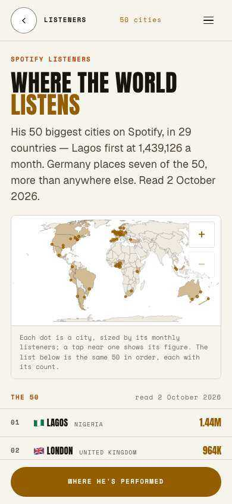
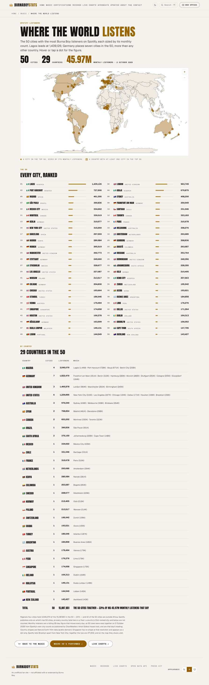

**`/analysis` on a phone:** 4,399px of text with no chart. The four desktop bar charts are desktop-only by design. The phone has 12 gold figures (a gold census of 38 on the phone against 17 on desktop).

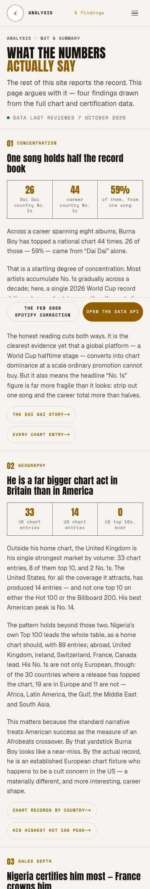

**The home's lower half (desktop):**
- **The certifications ledger** prints the same number in "Countries" and "Certs" on all 15 rows (one record per country), and the louder copy is a gold numeral.
- **The No. 1 board** promises "with the song that did it", but 19 of its 24 covers are the same 26px Dai Dai thumbnail, with the song only in alt text. Its columns are uneven.
- **The On This Day band's** middle column holds one row, then about 210px of empty space.
- **The globe** in light mode is still a black sphere in dark-theme yellow, the only `#ffb627` on the paper page. It has been flagged before without a decision.

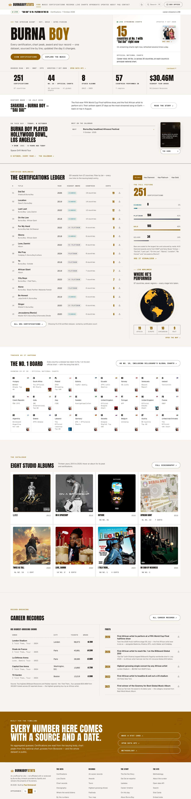

**Dai Dai** (approved 26 Sep, #350):
- The first screen shows no achievement figure. On the desktop it holds the kicker, the 88px h1, the lede, "Skip to the numbers", EN/ES and the cover. The first large figure is the release date "15 MAY 2026", in chapter 01's card, which repeats the hero cover 330px lower.
- On the phone, the first achievement card ("7 weeks at No. 1") starts at y 798, under the tab bar (y 766).
- The link preview already does what the page doesn't: four stat tiles.
- In chapter 02's "Billboard Global 200 · week by week", weeks 2–6 ("no reading held") are hatched bars **at the same full height as the No. 1 weeks**. At a glance the chart reads as 13 tall bars, implying the song led from week 2: the one inference a careful reader must not make, on the site's flagship claim.
- The same 26 No. 1 countries are drawn four times on desktop: the chapter 03 flag grid, the 68-cell takeover grid, the replay's peak map and the replay ranking chips.

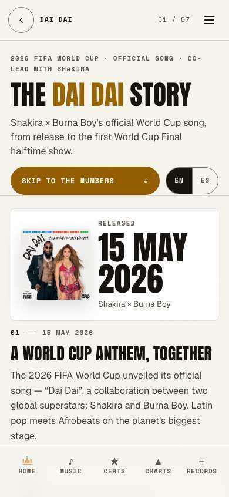
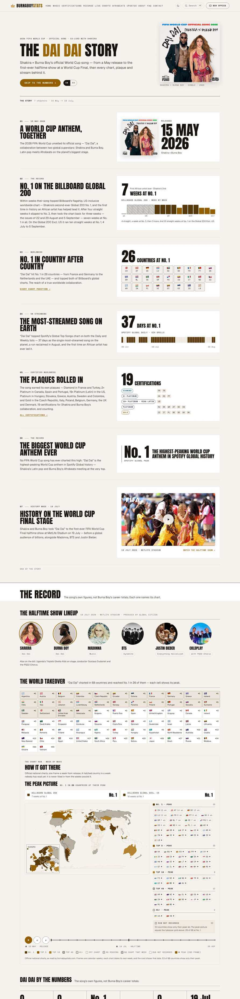

### 8.2 The problem

Several charts either can't be read on a phone or suggest something the data doesn't say. The board hub, the home's lower modules and Dai Dai's hero show pictures where readers need the ranking or the result.

### 8.3 Goals and direction

1. **Phone charts are drawn for the phone.**
   - Labels at fixed CSS px (11–12px labels, 13px values) that don't scale with the viewBox.
   - A route row per chart to its proof page, in phone styles.
   - Captions in Geist.
2. **Honest encodings on `/records/visualized`:**
   - line-only (no area fill) for the climb, or a zero-based axis;
   - bars for yearly counts, every year labelled;
   - one denominator per donut;
   - neutral bars for single-series charts, with gold only for his bar or the live year, and a key;
   - incomplete years marked;
   - the map caption worded by darkness.
   - The scatter uses a log scale or a zoomed inset of the cluster, labels his top five, and fits 354px on the phone with fixed-size labels.
3. **The 500M board:**
   - group rows by tier ("2 songs" / "1 song"), with the song lines under each name;
   - state the in-tier order ("ordered by combined streams");
   - add a "Next to cross" row showing the nearest song against the 500M line, with its empty state for when no song is close.
4. **The hub:**
   - **(a)** A Cards / Table toggle, reusing the chart boards' own toggle. The table has one row per artist: rank (joint ranks, per the cars precedent), artist, plaques, countries, top plaque, chart entries, No. 1s and live now; Burna Boy's row gold; sortable. A "Ranked by plaques" caption either way.
   - **(b)** One primary action, "Compare any two ↗" (or per your Job 0 arrow rule), in the hero beside the cadence line on desktop, and under the door on the phone.
   - **(c)** Hooks always visible (two lines max under the stat; check the 1/1.12 tile ratio), or revealed on `:hover` **and** `:focus-visible`, and carried in the Table view.
   - **(d)** The scatter: a square-root y with ticks derived from the data's maximum (today that gives 0, 25, 50, 100, 150, 200 and 250), or a break above about 170; 420–460px tall; the reading key derived from where the dots fall; consider placing it above the photo wall. Its connector lines stay (owner, 24 Sep).
   - **(e)** A phone and 901–1239 form designed for its width, not the scatter scaled down: e.g. "wide vs deep" rows with a plaques bar and a countries bar, or two short ranked lists ("Widest reach" / "Deepest at home").
5. **Listeners:**
   - dot area proportional to listeners, with a 2px floor;
   - the top 5 cities labelled;
   - the map cropped below about 58°S;
   - on the phone, quick-zoom chips (Europe · West Africa · Americas) that drive the existing +/−;
   - tapping a row in "The 50" highlights its dot;
   - a three-figure insight row under the hero (33% in the top 50 · Nigeria 20% · 42 of 50 outside Africa; derived, with the read date);
   - ink numerals on the phone (Job 0), one number format per screen.
6. **`/analysis` phone:** a small chart per finding from the same data (top 5 as thin full-width bars, labels ≥11px, gold only on the highlighted bar). The figures at rest are ink, as on desktop.
7. **The home's lower half (desktop; and the phone where it has the same module, drawn on the phone's own terms, not the desktop's shrunk):**
   - the ledger replaces the duplicate "Countries" column with something the row doesn't already say (the top market's flag and tier, the first-cert year, or a mini bar), and sets the count in ink;
   - the No. 1 board gets one mono line per cell with the song title, a derived header summary when one song dominates ("19 of 23 with 'Dai Dai'"), and equal columns;
   - the On This Day band lists the next three dated days, or shows a 7-day week strip with kind marks;
   - **the globe:** decide between (a) a photo-like island that stays dark, with a 1px edge, and (b) a themed globe (paper ocean, `#945e00` land, ink borders). Write the decision down.
8. **Dai Dai (OWNER? sign-off: it edits the approved design):**
   - **Hero strip:** four figures, each a jump link to its chapter, e.g. today: No. 1 Billboard Global 200 (7 wks) · 37 days No. 1 on Spotify Global · No. 1 in 26 countries · 19 certifications. Every figure is a slot from the Dai Dai data (the plaque count and the No. 1 counts still move). On desktop, under the lede and left of the cover; on the phone, a 2×2 under the lede, above Skip. The figures are ink (gold only if live). Chapter 01's duplicate cover goes, or the strip replaces it. Spanish copy included.
   - **Chapter 02:** unread weeks drawn as a baseline-height hatched stub or an outline cell, with a "not read" tick label. Bar height is reserved for real positions. The same rule applies to the replay's hatched countries.
   - **OPTIONAL (OWNER?):** the replay's end frame (the peak picture) absorbs the standalone takeover grid, or the takeover grid becomes the replay's static state. Chapter 03's flag beat stays.

### 8.4 Constraints

- **Scatter:** 11px type, and the chart hidden below 1240 (ruled 7 Oct, option b). The hand-placed label method stays.
- **Hub:** the rails stay exactly as they are today, gold for the permanent rail and green for the live one (ruled, rule 18). Hub plaque-count tiles are gold only for Burna Boy. Photo tiles are a dark island in both themes. Burna Boy's tile keeps its 2px gold frame; **a focus ring must not look like it** (Claude Code is fixing the ring, QW13).
- **Maps:** no mapping library. The site draws its own maps from one file of country shapes (Natural Earth 110m, Equal Earth, 900 × 470 box). **The listeners map shares `map.module.css` with the tour map; its +/− buttons must stay.** The nearest-dot 22px tap rule stays.
- **Dai Dai:**
  - official charts only in the replay, gaps drawn;
  - "Charts · 15";
  - no fold on the phone ranking;
  - keep the phone section order and the long dated rows;
  - `/dai-dai/replay` and the video are held;
  - the inset is fixed at 200 × 172 from 901 up;
  - the largest paint was accepted as the hero cover on desktop and chapter 01's sentence on the phone (26 Sep); say in your response if the strip changes either.
- **Peak bands and tier colours** are data colours; a sequential ramp is for choropleths only (Job 0 panel 4).
- **The home upper is untouched.** The home's On This Day card has no gold action (ruled).
- **Every figure is a slot.** Ties use joint ranks.

### 8.5 States to draw

- **Visualized:** every chart that changes, phone 402 and desktop 1440, light and dark; the scatter at both widths.
- **The 500M board:** today's tie; one artist alone at the top; no song within reach of the line.
- **The hub:** Cards and Table, desktop 1440 and 1024, light and dark; the Table sorted by a second column; the phone Table or ranked form; the scatter rescaled at 1440; the phone "shape" form at 402 and 1024.
- **Listeners:** phone 402 (World and one zoom chip, a row tapped) and desktop 1440, light and dark.
- **`/analysis`:** the phone with all four charts.
- **Home lower half:** 1440, light and dark (the globe in both, per your decision).
- **Dai Dai:** the hero strip at 1440, 1024 and 402, EN and ES, light and dark; chapter 02's chart at both widths.

### 8.6 Acceptance criteria

- [ ] No chart label renders under 11px at 402.
- [ ] Every phone chart links to its proof page.
- [ ] No area or bar implies a magnitude the data doesn't hold (truncated fills, full-height unknowns).
- [ ] Every chart's single-series bars are neutral unless they mark his bar or a live value.
- [ ] The hub states its ranking key, shows ranks with joint ranks for ties, and offers one gold action to Compare.
- [ ] In the scatter, fewer than half the dots sit in the bottom 40%, and the reading key matches where the dots fall.
- [ ] On the listeners map, Lagos's dot area is about 10× Auckland's.
- [ ] Phone `/analysis` shows one chart per finding, with labels at 11px or more.
- [ ] The home ledger has no column that repeats another, and the globe decision is written down.
- [ ] Dai Dai's first screen at 402 × 874 shows at least one achievement figure, and its week chart can't be read as a 13-week run at No. 1.

---

## 9. Job 6: sharing (medium; the link previews are optional)

### 9.1 What exists today (measured)

**`/share` on a phone:**
- The preview `` is 354 × 629 at y 307–936, and the fixed action bar covers y 714–844 (130px).
- On the story card, the figure ("251") sits at 65–76% of the card's height, y≈716–785: **entirely under the bar**.
- The Story/Square switch is at y 952, below the fold.
- The first screen of the stat-card maker shows a portrait and a logo, not a stat.

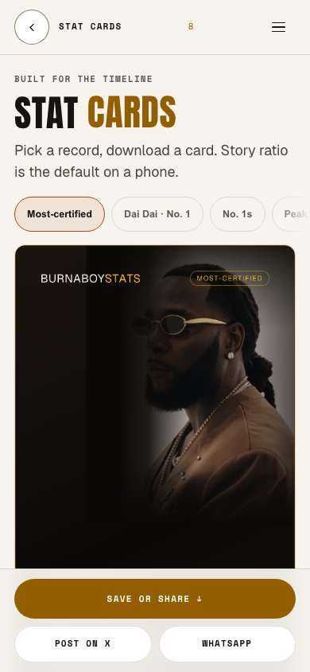

**`/share` on desktop:**
- "↓ Download PNG" is at y 1,033, below the 900px fold.
- "By the numbers ↗" is a second filled gold button at y 1,203.
- With the gold "Square" segment, that is three gold fills in one view.

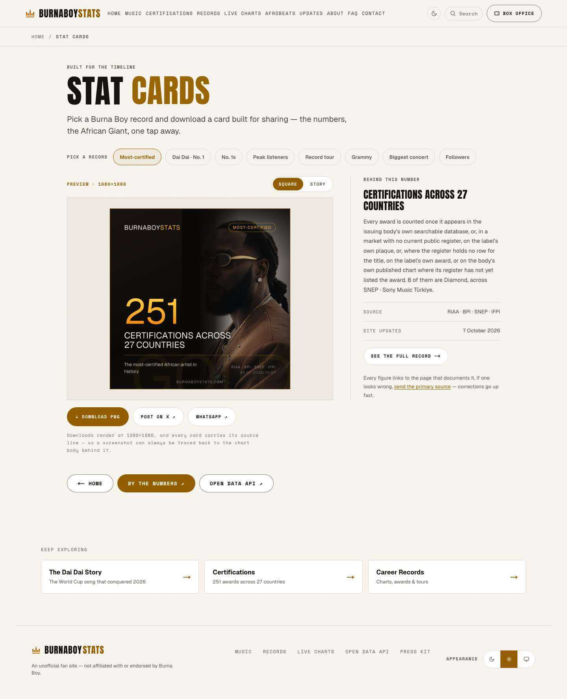

**`/press`** describes its two most shareable assets, "Ready-made stat cards" and "Live stat boxes for your site", in prose paragraphs with a mid-sentence link.

**Link previews** (1200 × 630, permanently dark and gold, with the lockup):
- **The generic template** (33 routes): a gold kicker 28px, a title in Geist at 108px, a muted sub at 34px, and the domain foot.
- **The "ladder" template** (2 routes: revenue and countries): an Anton 64 title, an Anton 76 figure (gold if his), mono labels and bars. The best previews on the site.
- **Route-specific cards** also exist and are not in this job: the English Dai Dai card and `/timeline` (a row of stat tiles), and On This Day (the faded portrait, ruled).
- **See them:** Appendix C, Job 6, lists the saved images.
- **Where the generic template fails:**

  | Route | Its preview today |
  |---|---|
  | `/` | "BURNA BOY STATS — The African Giant — by the numbers", with no numbers |
  | `/updates` | Names no update |
  | `/certifications`, `/records/charts`, pair pages, country boards | The headline figure is a small grey caption, about 9px tall at a 500px timeline width |
  | `/records/tours/map` | No map |
  | `/records/tours`, festivals | Text only |
  | `/dai-dai/es` | Text only: no cover, no figures. The English card has four stat tiles |
  | `/music/listeners` | No map |
  | `/music` | One line, about 60% empty |
  | `/live-charts` | "527 charts"; the page calls them placements |

### 9.2 Goals and direction

1. **The `/share` phone screen:**
   - size the preview to the room between the chip rail (bottom ≈291 at 390) and the bar (top 714 at 390; 744 at 402 × 874): about 236 × 420 for a story preview;
   - put Story/Square above it;
   - downloads stay 1080 × 1920 and 1080 × 1080.
2. **The `/share` desktop:**
   - Download / Post on X / WhatsApp go into the right column under "Behind this number" (that column starts at y≈450), or next to Square/Story;
   - "By the numbers" becomes secondary;
   - one gold fill.
3. **`/press`:** show one real stat card (an existing `/stat-card` URL) with "Open stat cards →", and one live box (an existing `/embed/<widget>` iframe) with "Get an embed →".
4. **OPTIONAL (OWNER?): figure-first previews** in the ladder family. Every figure below is today's value, drawn as a slot. Each route keeps the footer it has today: the generic cards' "BURNABOYSTATS.COM" foot does not become a page path, even inside a ladder-style body (the 8 Sep rejection, rule 35). For:
   - home: three derived figures, certifications · No. 1s · streams;
   - `/updates`: the newest entry's headline and date;
   - `/certifications`: "251" in Anton gold at about 220px, with "certifications · 27 countries";
   - `/records/charts`;
   - pair pages: both totals side by side, with proportion bars and the verdict;
   - country boards: the market total and the top three names;
   - tour map: the world silhouette with played countries in gold, plus "57 countries · 7 regions" (the paths exist; the card renderer draws SVG paths);
   - tours: $30.46M with a six-tour bar strip (a dash where not reported);
   - festivals: "32 headlined" with a strip of years;
   - `/dai-dai/es`: parity with the English card, in Spanish;
   - listeners: the dot map, the top 3 named, and "33% of 45.97M in 50 cities";
   - `/music`: a strip of the 8 covers;
   - `/live-charts`: the platform split and "17 at No. 1 now", with the noun "placements".
5. **OWNER? (C-25):** `/share`'s own preview becomes the default stat card (square, cropped to 1200 × 630). That page only.

### 9.3 Constraints

- **Gold and dark** for every artist (ruled). Ayra Starr's purple stays page-only.
- **The 8 Sep rejection:** the owner rejected a card redesign that dropped the tagline, swapped the footer for the page path and enlarged the crown dot. Keep the tagline, the footer and the lockup exactly as they are. You change only what sits in the body.
- **The faded portrait** is for On This Day previews only (ruled), except C-25 if the owner agrees.
- **Fonts:** Geist must stay first in the card font list, or every card resets into Anton (a test guards it). Anton is loaded and already used by the ladder cards.
- **Versioning:** card ids come from their text. An art change needs the version key bumped; a data change doesn't.
- **URLs:** footer URLs are lower-case (a test guards it).
- **Size:** 1200 × 630, legible at a 500px timeline width. No text under about 28px on the card.
- **Every figure is a slot**, sized for its longest value.
- **Already being fixed in code; don't draw:** the uneven word gaps on the generic cards and the `/updates` double space (QW9); Rema's chart card cutting its second chip row (QW15).

### 9.4 States to draw

- **`/share`:** phone 402 (story and square), and desktop 1440 and 1024, light and dark.
- **`/press`:** the two previews, desktop 1440 and phone 402.
- **Previews** (if the owner says yes): each route above at 1200 × 630, plus a 500px-wide thumbnail of each to show legibility. Include the longest pair name and the longest update headline.

### 9.5 Acceptance criteria

- [ ] At 402 × 874, the `/share` first screen shows the card's figure, fully visible above the bar.
- [ ] At 1440 × 900 the download action is above the fold, with one gold fill.
- [ ] `/press` shows one real stat card and one live box, each with its link, on both layouts.
- [ ] Every redrawn preview keeps the lockup, the tagline and the footer unchanged.
- [ ] Every redrawn preview's headline figure is legible at 500px wide.

---

## 10. Out of scope

- **Anything in Appendix A.** Claude Code is fixing it, or it is copy Claude Code will set. If a screenshot shows one of those bugs, draw the page as if it were fixed.
- **The fixed chrome,** beyond the masthead links and the menu sheet's layout (Job 4) and the compare family's phone chrome (Job 2, as a proposal).
- **A rebrand, a new font, a new palette or a new mapping library.** A job may argue for a new token pair (light/dark) with a reason.
- **On This Day's calendar and day pages**, **the tour map** (beyond Job 1's P1 line), **the gross pages** (beyond P1) and **the car pages.** The owner closed the car list.
- **Dai Dai beyond Job 5's hero and chapter 02** (and the optional item).
- **Not in this round** (left out as small): R-23, R-24, R-28, SH-17, SH-18, SH-19, SH-23, SH-24, MU-09, MU-26, MU-32, T-14, T-19 and C-21. In plain words:
  - the car page's sources card and its marque pills;
  - one long FAQ answer;
  - a dangling dash in the home's history-band title;
  - the On This Day legend line and its list headlines;
  - "right now" said twice in the home hero;
  - the 404's extras;
  - word tiles on song pages;
  - the Dai Dai breadcrumb and "15 · 1 · 1";
  - a duplicate button on phone box office;
  - Nigeria's thin map card (research, not design);
  - Naija @ 66's repeated line.
- **Dropped because it touches a closed ruling:** B-12 in `research/board.md` (the desktop hub's live-rail numerals in gold). The owner ruled the hub rails stay exactly as they are (rule 18). Don't draw it.

---

## 11. Owner rules (binding)

These are one line each, with the source the owner and Claude Code can check (paths are in the owner's notes and repo). **Never propose reversing one as a normal suggestion.** Where your design needs one changed, put it in your change list as a question, with your default.

**Process**
1. Don't redesign what a handoff drew; read the design file, don't infer from a sibling. (`memory/feedback-design-handoff-rules.md`)
2. Desktop and phone are separate designs and components, split at 900px. Never scale or copy one into the other; a treatment added to one is drawn for the other, or listed as one-layout-only. A few pages are one responsive page in code today (the compare family, song and album pages, `/dai-dai`, `/timeline`, `/search`); draw their two layouts separately all the same. (same; `feedback-both-layouts-get-the-treatment.md`)
3. Where handoff prose and a mockup disagree, the mockup wins; where old handoff prose and the live site disagree, the live site wins. The big redesign is closed. (`feedback-design-handoff-rules.md`)
4. A control and what it opens share one breakpoint; test the 901–1239 band. (`feedback-one-breakpoint-per-control.md`)
5. Every new route gets its own link preview, sitemap entry, breadcrumb label, links and search entry. (`feedback-new-page-og-image.md`)
6. Figures are derived from data, never typed. Draw each as a live-data slot: a dashed magenta outline, sized for its longest real value. A fixed past literal is drawn as given and labelled fixed. (`feedback-derive-figures-from-data.md`)

**Density and structure**

7. No accordions, folds or "show more" on dense list screens. Ask before any screen whose core move is collapsing a list. (`feedback-dense-screens-over-accordions.md`)
8. The approved folds stay: phone certifications "Compare with…" and "Certified units by country…"; "All 93 releases"; the picker's "+ 12 more"; "Show all ↓".
9. On This Day's phone one-day panel is not a fold, and there is no page for an empty day. (`project-on-this-day.md`)
10. Half-empty last rows in the song/album grids and the `/music` EPs grid stay as designed (D-10/D-11). OWNER? asks about "By the numbers" (MU-29). (`feedback-debug-rulings-2026-09-24.md`)
11. Board pages keep the five-tab bar; a board artist page shows only the Compare action bar, never two stacked bars; the story pages and cars keep the five tabs; `/curator`, `/press` and `/analysis/spotify-unmerge` keep the five tabs. (`app/lib/mobileScreens.ts`; `project-tour-map-design-handoff.md`)

**Colour**

12. Gold marks what is his, what is live, and the action. Data colours (tier fills, peak bands, live deltas) are never gold. (`project-home-upper-design-pass.md`; `rulings.md`)
13. Light mode has one gold, `#945e00`, fills included, with white ink on gold fills. Tokens only; no colour literal in a module. (`project-burnaboystats-light-mode-sweep.md`; `tests/cssColourTokens.test.ts`)
14. Three theme modes, dark by default; the masthead themes with the page. (`project-burnaboystats-theming.md`)
15. A photograph is not a theme: anything over a photo stays dark (`photoTile`).
16. Selected chips on every phone screen are N2: ember edge, ember wash, ink label, never a gold fill. (owner, 5 Oct; `feedback-chip-and-rail-gold-rulings.md`)
17. Desktop filter chips are a gold edge and wash as built. The 5 Oct ruling covered phone screens, so they were left gold (7 Oct). This is the current state, not a separate owner ruling: a change goes through Job 0 panel 3 and the change list. (`project-full-site-debug-1005.md`)
18. The `/afrobeats` hub rails stay exactly as they are today, gold for the permanent rail and green for the live one, for every artist; don't raise their colours again. The hub plaque-count tiles are gold only for Burna Boy. (owner, 5 Oct: "it is ok the way it is now"; `feedback-chip-and-rail-gold-rulings.md`)
19. Link-preview cards stay gold for every artist. Ayra Starr's purple is page-only: today it marks her name, her header button, her headline figure and the phone ALL pill. (`feedback-og-cards-stay-gold.md`)
20. On This Day kinds are shape + word in ink (■ Release ▲ Charts ◆ Streaming ○ Certification ★ Awards ● Show); "Live" is "Show"; the home OTD card has no gold action. (`project-on-this-day.md`)
21. The h1's split word stays gold, and only the split word. (30 Sep, `project-tour-map-design-handoff.md`)
22. Keep exploring's label is muted site-wide, with gold arrows; back-bar badges are gold. (30 Sep)
23. Phone shows hero (`/records/tours/revenue`): the top gross (a slot, $6.147M today) at 36px with ink tiles; the countries phone hero is ink. (#420; `rulings.md`)

**Type and rhythm**

24. The reading scale is `--type-*`; the measure is 62ch; mono is for labels only, never a sentence; table heads are mono and cells Geist 13.5 tabular. The type floor is 11px. (`project-burnaboystats-reading-scale.md`)
25. Hover is `--bg-raised` (it presses on paper). One signature per family sits on the kicker's tick, never on its text or a button: records ember, live-charts and updates green, reading pages none. (`project-burnaboystats-rhythm.md`)
26. Don't recolour the shared charts stylesheets without a scoping prop; they serve every board artist. (same)
27. Tour map: the 16px two-line lede keeps the whole map on the first screen at 1440 × 900, with the foot at or above y 905. The Dai Dai inset is fixed at 200 × 172 from 901 up. (`project-tour-map-design-handoff.md`)

**Copy and labelling that shapes layout**

28. `/records/firsts` is headline-first in every category; the box-office title is derived ("Highest-Grossing African Shows — <No. 1> Leads"); the Dai Dai table is "Charts · 15"; the compare scope line is labelled coverage. (`feedback-debug-rulings-2026-10-06.md`)
29. Pair pages carry an h1 naming the pair; tied cars show joint ranks. (`feedback-debug-rulings-2026-09-24.md`)
30. List headings stay "Singles" / "Featured"; co-billed songs get a small "co-lead" tag; song pages carry a role tag. The filing follows "Rule C", the rule ChartMasters uses: a song is his lead when it sits on one of his own releases or he is billed first; otherwise it is featured. (`project-lead-featured-roles.md`)
31. The nav pill is "Box office": outlined, not gold. (7 Oct)
32. The certifications hero's primary is "Compare"; the box-office nights button sits beside it. (4 Oct)
33. Box office: every row names its artist, his included, in the same position; runs are never split into nights; sources are kept in the data, not printed per row (OWNER? R-1 asks to reconsider). (3 Oct; `tests/revenueSources.test.ts`)
34. `/compare` prices at today's levels; Colombia is the only unpriced market. (`feedback-compare-today-levels.md`)

**Share images**

35. The 8 Sep card redesign (no tagline, a page-path footer, a bigger crown dot) was rejected. Cards keep their tagline and footer, plus the lockup. Bump the art version for art changes only, never for data. (`project-burnaboystats-og-lockup.md`)
36. The faded portrait appears only on On This Day post cards and their previews. (`project-on-this-day.md`)

**Scope and identity**

37. The site stays a Burna Boy site; the board lives at `/afrobeats`. `/updates` carries only Burna Boy stories. (`project-stay-burnaboystats.md`; `feedback-updates-burna-only.md`)
38. Dai Dai's replay uses official charts only, with gaps drawn; `/dai-dai/replay` and the video are held. (`project-dai-dai-redesign.md`)
39. Fixed bars appearing mid-page in full-page screenshots are capture artefacts. Judge the viewport frames. (`rulings.md`)

**Accessibility, for every job**
- AA contrast in both themes, **including hover and pressed**: 4.5 : 1 for text; 3 : 1 for large text, controls and data marks (a bar against its track).
- 44px targets on the phone; 24px with a mouse.
- A visible focus ring that never looks like a data mark (the hub's anchor frame).
- Nothing that exists only on hover.
- Reduced motion settles to the final state; jumps are instant.
- "No. 1" with a space in prose.

**OWNER? questions open at hand-off** (draw the default; list the alternative):

| # | Question | Default to draw |
|---|---|---|
| 1 | SH-09: a one-line disclaimer at the end of the phone home | Not drawn; show it as an alternative frame |
| 2 | Compare family phone chrome (back bar instead of the masthead; whether the stacked "The Afrobeats Board" bar stays) | Your recommendation |
| 3 | Compare in the desktop masthead | Your recommendation |
| 4 | The phone `/updates` sticky month label (screen 06 has none) | Drawn |
| 5 | Open the folded phone firsts and festivals lists | Not drawn |
| 6 | The tours page's gold action while nothing is on sale | Your recommendation |
| 7 | Dai Dai hero strip and chapter 02 (an edit to an approved design) | Drawn |
| 8 | Dai Dai takeover-grid merge | Not drawn; optional |
| 9 | Figure-first link previews | Drawn only if the owner says yes |
| 10 | `/share`'s own preview as a stat card | Not drawn |
| 11 | MU-29: "By the numbers" half-empty last rows | Not drawn |
| 12 | Ayra Starr's phone action bar in purple | Listed only |
| 13 | The one noun for plaques (CP2) | "certifications"; size labels for it |
| 14 | R-1: per-row sources on the box-office boards (rule 33) | Not drawn; the lightest option (sources in the CSV) needs no drawing |

---

## 12. Deliverables

**Every artboard in light and dark**, unless marked. Phone artboards are **402 wide**, in the bundle's 402 × 874 frame, with 375 checks where a line must fit. Desktop artboards are **1440**, with **1024** checks where asked.

**Where the artboards go.** Paths are from the bundle root. "Edited in place" means you change that file and nothing else in it. "Superseded" means the old file stays, with a one-line note at its top naming its replacement.

| Job | New file | Existing files |
|---|---|---|
| 0 | `designs/desktop/System Rules - Oct 2026.dc.html` | None edited |
| 1 | `designs/desktop/Proof.dc.html` (the component in place, every state in §4.6) | Edited in place to the new default state, each with a pointer to `Proof.dc.html`: Mobile 01, 02, 07, 08; Deep Pages 10, 12, 13, 14, 16, 17, 20; `Certifications.dc.html`, `Records - Africas Biggest.dc.html`, `Records - Tours.dc.html`, `Records - Festivals.dc.html`, `Records - Revenue Per Show.dc.html`, `Tour Map.dc.html`, `Records - By The Numbers.dc.html`, `About.dc.html`, `FAQ.dc.html` |
| 2 | `designs/desktop/Compare v2.dc.html` (desktop, phone and entry points, one canvas, as the original) | `Compare.dc.html`: superseded |
| 3 | `designs/desktop/Ledgers.dc.html` | Edited in place: `Certifications.dc.html`, `Records - Charts.dc.html`, `Afrobeats Artist.dc.html`, `Afrobeats Charts.dc.html`, `Afrobeats Live.dc.html`, `Afrobeats - Mobile Charts.dc.html`, `Afrobeats - Mobile Live.dc.html`, `Records - Tours.dc.html`, `Live Charts.dc.html`, Mobile 02 and 05, Deep Pages 10 and 12. `Afrobeats - Mobile Artist.dc.html`: add a note at its top that the tier accordion was declined, and point to `Ledgers.dc.html` for the phone artist hero |
| 4 | `designs/desktop/Wayfinding.dc.html` (the masthead, the menu sheet, the docking index and its applications, `/timeline`) | Edited in place: `Burna Boy Stats.dc.html` (masthead, footer), `Records.dc.html`, `Music.dc.html`, `Song.dc.html`, `Updates.dc.html`, `Methodology.dc.html`, `FAQ.dc.html`, `Records - Awards.dc.html`, `Records - Firsts.dc.html`, `Records - Africas Biggest.dc.html`, `Live Charts.dc.html`, Mobile 03–06 and 08, Deep Pages 11, 12, 15, 16, 22 and 26 |
| 5 | `designs/desktop/Charts and Modules.dc.html` (including `/music/listeners`, which has no artboard) | Edited in place: `Records - Visualized.dc.html`, `Afrobeats Board.dc.html`, `Afrobeats - Mobile Hub.dc.html`, `Analysis.dc.html`, `Burna Boy Stats.dc.html` (lower half), Mobile 01, Deep Pages 19, 21 and 25. `Dai Dai Redesign.dc.html`: hero and chapter 02 only, marked OWNER? |
| 6 | `designs/desktop/Share Cards v2.dc.html` (`/share`, the `/press` previews, and the previews if approved, marked OPTIONAL) | Edited in place: `Share.dc.html`, Deep Pages 24, `Curator Press Correction.dc.html` (`/press` only) |

**Africa's Biggest is touched by three jobs** (1: provenance and scope; 4: the index; 5: the 500M board). Draw it once, on `Records - Africas Biggest.dc.html` and Deep Pages 16, carrying all three, and say so in each job's section of your response.

**Other files more than one job edits.** Draw each once, carrying every job's change, and name the jobs at the top of the artboard:

| File | Jobs |
|---|---|
| `Records - Tours.dc.html`, Deep Pages 12 | 1 (P1), 3 (date tables, hero panel), 4 (phone milestones, Deep 12 only) |
| `Certifications.dc.html`, Mobile 02 | 1 (provenance, dated log), 3 (ledger row, switches, tier bars) |
| `Burna Boy Stats.dc.html` | 4 (masthead, footer), 5 (lower half) |
| Mobile 01 | 1 (trust and Latest rows), 5 (home modules) |
| `FAQ.dc.html`, Mobile 08 | 1 (P1), 4 (index) |
| `Live Charts.dc.html` | 3 (pills), 4 (open-panel sub-header) |
| Deep Pages 10 | 1 (P3 note), 3 (ledger, pills) |

**In every job:**
1. **Slots.** Every figure is drawn as a slot, sized for its longest real value. The only figures without a slot are fixed literals, drawn exactly as given and labelled fixed.
2. **A design response**, written by you: `design_handoff_burnaboystats/docs-design/design-response-design-review-1008.md`, in the shape of the earlier ones (`design-response-on-this-day.md` and `design-response-tour-map-and-phone-screens.md` are your templates). It holds:
   - the reasoning per job, with the alternatives you explored for Jobs 1 and 2 (two or three thumbnails each, at 1440 and 402, dark);
   - the Job 0 rules as written;
   - each new token, with its light and dark values and contrast;
   - the longest real case per slot;
   - interaction notes (docking, deep links, focus order, reduced motion);
   - **a numbered change list for the owner to approve:**
     - every move, merge, removal or rewording;
     - every gold → ink change (with the census);
     - every arrow-glyph change;
     - every chrome label or destination change;
     - every OWNER? item with your default;
     - every typed figure to derive;
     - every new fold (there should be none, except the Africa's Biggest method disclosure if you choose it);
     - every test that has to change;
   - any place your copy of an artboard differed from what this brief describes.
3. **A paste-ready prompt for Claude Code**, written by you, in the style of the earlier ones: `design_handoff_burnaboystats/PROMPT-DESIGN-REVIEW-1008.md`. Use one commit per job, Job 0's rules first; say what each commit must pass. The template is `PROMPT-ON-THIS-DAY.md`. **Write it once the owner has approved the change list**, and add a `START-HERE.md` entry pointing to the canvases, the response and the prompt.

---

## 13. Self-check before you hand back

Tick every line on your response's first page. If one fails, say which and why.

- [ ] Job 0's sheet exists, and every other job's artboards follow it (gold budget, arrows, selected states, frames, the provenance component).
- [ ] Two or three directions were explored for Jobs 1 and 2, one was chosen, and the reasoning is written.
- [ ] At 402 × 874, every page in Jobs 1–3 shows its answer and a dated source on the first screen.
- [ ] Desktop and phone are drawn as separate designs, each in light and dark, with the 1024 checks and the 375 checks named.
- [ ] No figure is typed; every figure is a slot sized for its longest real value.
- [ ] Gold appears only where the Job 0 budget allows, and each screen has at most one gold fill.
- [ ] No accordion, fold or "show more" added. Nothing hidden behind hover.
- [ ] AA in both themes, hover and pressed included, with the ratio written beside every new colour pairing; 44px phone targets; a visible focus ring.
- [ ] The fixed chrome is untouched, except the masthead links and the menu sheet layout (Job 4), and the compare family chrome as a proposal (Job 2).
- [ ] Link previews (if drawn) keep gold, the lockup, the tagline and the footer.
- [ ] The tour map still fits at 1440 × 900 (foot at or above y 905). The home upper is unchanged. The Dai Dai edits are limited to the hero and chapter 02 (plus the optional item, marked).
- [ ] Nothing in Appendix A is drawn as a design change, and B-12 (§10) is not drawn.
- [ ] Every file that more than one job edits (§12) is drawn once, carrying each job's change.
- [ ] Every OWNER? item is drawn as its default and listed with its alternative.
- [ ] The change list is numbered and complete, including test changes.

---

## Appendix A: already being fixed in code, don't draw

Claude Code is making (or, once the owner says go, will make) these changes without a design. **Draw each page as if they were done.** IDs point into `research/`.

**Quick wins (code):**
- **QW1, T-02:** announced shows leave "Announced" once their date passes, with a test.
- **QW2, SH-02:** home album covers link to album pages.
- **QW3, C-01:** the phone `/methodology` back bar spans the whole page, and the phone-only sections use phone type (16px body, one h2 size).
- **QW4, MU-02:** the Dai Dai count-up never leaves "0" in the page; print shows final values.
- **QW5, CC-07, T-11:** a plain data line ("Download CSV ↓ · JSON · CC BY 4.0") in the source notes of `/certifications`, `/records/charts` and the tours pages, plus a `tours.csv`. Job 0 styles it.
- **QW6, CC-09, R-12, T-13, T-20, MU-27:** rows link where a page exists:
  - release titles in the ledgers;
  - pair-table countries;
  - board artist names (with a 24px+ hit area);
  - map card deep links to the country's shows;
  - record-night rows;
  - tracklist dialog rows.
- **QW7, MU-05, C-02, CC-14, B-19:** 44px hit areas for the FAQ toggles (26px today), the methodology register links (26px), and the "+N" pills (28–30px). The visual size is unchanged.
- **QW8, MU-06, B-14, C-08, R-26, T-09, CC-12:** prose capped at `--measure` (62ch); the hub lede on `--type-lede`.
- **QW9, C-03:** link-preview word gaps (unkerned Geist), the `/updates` double space, and the art version bumped.
- **QW10, SH-01, SH-04, SH-07:** "career streams 11.15B" gets its space; the lone status dot is hidden when there is no sentence; the footer gains Compare and Press & data kit.
- **QW11, SH-03, CC-23, R-14, R-10, C-22, MU-18:** the tablet band:
  - the menu panel full height;
  - stat strips 4-up or 2×2, not 3+1;
  - Records cards 2-up;
  - Africa's Biggest two columns down to 901;
  - `/faq` jump row;
  - live-charts seven tiles.
- **QW12, B-13, T-06, T-07, MU-18, T-15, B-18:**
  - the artist onward row gets one gold primary;
  - tour capacity in ink, not cyan;
  - one "African record" treatment;
  - one "No. 1" colour on `/live-charts`;
  - N2 on the phone tour-map view chips (rule 16);
  - Ayra Starr's phone bar in purple if the owner confirms.
- **QW13, R-08, MU-28, B-09, CC-11:**
  - the year-chip rank numerals at full `--text-muted`;
  - the live-charts no-move dash at full muted;
  - the board tile focus ring made unmistakable from the anchor frame and resolved against the page theme;
  - 9–10.5px text raised to 11px.
- **QW14, C-05:** the `/share` preview uses a small image; the full PNG is for download only.
- **QW15, a sweep:**
  - R-06 and R-07: back-pill labels and awards FAQ card padding;
  - R-09: "IN PROGRESS" no-wrap;
  - R-22: the car page breadcrumb;
  - B-16: the "By the numbers" heading gap;
  - B-17: the phone hub's last tile;
  - B-20: Rema's preview chip row;
  - C-15: the `/analysis` button gap and index 05;
  - C-16: the `/api` sample box and field notes;
  - C-19: the contact error colour and its repeated kicker;
  - C-20: the `/share` badge "8 cards" and the "No. 1s" no-break;
  - MU-07: duplicate song tiles;
  - MU-14: the listeners ranking reads down;
  - MU-22 and CC-15: separators and kickers never open a line;
  - MU-30: Dai Dai phone hero padding;
  - MU-31: the tab bar lights Music on `/dai-dai`;
  - CC-22: deep-linked certification views don't flash the default figures;
  - B-01 (code part): the phone artist h1's accessible name gets real spaces (today it reads "159Awards21 countries").

**Copy (Claude Code sets the words; the layouts above must fit them):**
- **CP1, C-10:** `/about` opens with "Burna Boy's real name is Damini Ebunoluwa Ogulu …".
- **CP2, B-10, MU-24:** one noun for plaques, never "awards". The owner picks the word; the default is "certifications" (the page name and the search word), with "certs" only where space is tight. Size every label for "certifications", the longer word.
- **CP3, B-11, T-12, MU-08, B-22:**
  - "chart entries", not "chart peaks", for counts;
  - a basis line under each box-office share;
  - one name per festival category;
  - Alone's counts reconciled;
  - the two artist-page dates named.
- **CP4, CC-16, MU-23:** a visible "co-lead" legend line; the tag focusable.
- **CP5, C-13:** timeline days taken from On This Day, or the "every milestone dated" promise reworded.
- **CP6, C-18, C-17:** one voice (the default is first person singular, since one person runs the site; the owner confirms, and whether "portfolio project" goes); one credit line plus a dated variant; one Copy button component.
- **CP7, SH-20:** one search placeholder built from live counts; one section taxonomy matching the menu sheet; language editions ranked below their canonical page.

---

## Appendix B: the design system as built (extend it, don't replace it)

The full, cited version is [`research/design-system.md`](research/design-system.md). What follows is what the jobs need.

### B.1 Type

| Face | Weights | Used for |
|---|---|---|
| **Anton** | 400 only (never bold) | h1, h2, figures, ranks, totals; uppercase by default |
| **Geist** | variable | Prose, row titles, table cells, meta lines, captions |
| **Space Mono** | 400, 700 | Labels only: kickers, chips, buttons, table heads, nav links, back-bar labels, badges |

Numerals are tabular on tables and on any `stat`/`num` class.

| Token | Size / line height |
|---|---|
| `--type-lede` | 18px / 1.5 (20px at ≥900) |
| `--type-body` | 16px / 1.6 |
| `--type-small` | 13.5px / 1.5 |
| `--type-caption` | 12.5px / 1.45 |
| `--type-label` | 11px / 1.2, 0.11em, Space Mono 700 uppercase, "never a sentence" |
| `--type-h-prose` | 20px / 1.3 |
| `--measure` | 62ch |

**Display sizes:**
- Desktop h1s run 64–108px (×0.73 at ≤1239).
- Phone titles run 30–56px.
- Section h2s run 26–44px.
- The home scoreboard figure is 52px; the phone stat strip is 32px; the phone home live figure is 140px (gold ramp).

### B.2 Colour (light | dark)

**Surfaces and lines:**

| Token | Light | Dark | Role |
|---|---|---|---|
| `--bg` | `#f7f4ee` | `#0a0a0b` | Page |
| `--bg-soft` | `#ffffff` | `#141416` | Card, panel |
| `--bg-soft-2` | `#efeae1` | `#1c1c21` | Well, track |
| `--bg-raised` | `#e6e0d4` | `#24242a` | Hover/pressed (darker on paper, lighter on black) |
| `--hover` | 40% page → raised | = raised | Box-office row hover (keeps his gold at 4.62 : 1) |
| `--btn-face` | `#ffffff` | `#24242a` | Secondary button |
| `--scrim` | `rgba(247,244,238,.94)` | `rgba(12,10,9,.94)` | Masthead and every phone bar, 14px blur |
| `--line` | ink 12% | paper 12% | Decorative hairline (≈1.3 : 1) |
| `--rule-soft` | ink 30% | paper 24% | Secondary structure (≈1.97 : 1) |
| `--rule` | ink 48% | paper 38% | Structural (≈3.3 : 1) |
| `--border` | `#dcd9d3` | `#26262b` | Card and field edge, **not a control edge** |
| `--btn-edge` | ink 55% | paper 42% | Control edge (3.96 / 3.78 : 1) |

**Text:**

| Token | Light | Dark | On `--bg` (L / D) | On `--bg-raised` (L / D) |
|---|---|---|---|---|
| `--text` | `#17140f` | `#f5f4f0` | 16.7 / 18.0 | |
| `--text-body` | `#4a443b` | `#cfc7bb` | 8.77 / 11.82 | 7.33 / 9.22 |
| `--text-muted` | `#5f584f` | `#9b9ba3` | 6.39 / 7.17 | 5.33 / 5.59 |
| `--dim` | `#6f685f` | `#85858e` | 5.01 / 5.41 | **4.18 / 4.22 (fails)** |

**Gold and signatures:**

| Token | Light | Dark | Role |
|---|---|---|---|
| `--gold` / `--gold-fill` / `--gold-display` | `#945e00` | `#ffb627` | His figures, links, fills. On paper: 4.96 on `--bg`, 5.44 on `--bg-soft`, 4.54 on `--bg-soft-2`, **4.14 on `--bg-raised`** |
| `--gold-bright` / `--gold-dim` | `#945e00` | `#ffd24a` / `#c98a2e` | The fill ramp's top and bottom |
| `--gold-hit` | `#5f3c00` | `#ffd24a` | Hover and active fill on maps |
| `--ink-on-gold` | `#ffffff` | `#14100a` | Label on a gold fill (5.44 / 10.8 : 1) |
| Washes | `#945e00` × `--wash-strength` 0.42 | `#ffb627` × 1 | `color-mix(... calc(N% * var(--wash-strength)))` |
| `--ember` | `#b34700` | `#ff7a1a` | The records signature on the kicker tick; the N2 chip edge |
| `--chip-on-edge` / `-wash` / `-ink` | ember / ember 10% / `--text` | ember / ember 16% / `--text` | N2, the selected phone chip |
| `--green` / `--green-dot` | `#146b3c` / `#1f9a5a` | `#3ed17f` | Live, verified, positive delta |
| `--red` | `#c0392b` | same | Ambient wash only, never text |
| `--red-ink` family | `#b3261e` | `#e0796d` … | Negative delta, error |
| `--other` | `#888a93` | `#74747e` | Other artists' bars (2.87 : 1 on track in light) |
| `--hatch` | ink 10% | paper 10% | Not-reported cells |

**The gold fill:** `linear-gradient(180deg, --gold-bright, --gold-fill 48%, --gold-dim)`. On paper it is flat `#945e00` with white ink.

**Data palettes (never gold-substituted):**
- **Tier fills** (both themes): Platinum `#EFEDE6`, Gold `#FBB417`, Diamond `#31A1C0`, Silver `#848F9E`.
- **Tier inks on paper:** Platinum `#2f3a4e`, Gold `#945e00`, Diamond `#0b6e7e`, Silver `#6b6b74`. In dark, each ink is its fill.
- **Peak bands:** `--cyan` Top 10 (`#0b6e7e` / `#8fe3f0`), `--silver` Top 40 (`#6b6b74` / `#dfe2e8`), `--peak-rest`.
- **The peak ramp** (`--peak-band-*`) runs dark → light on paper and bright → dim in dark.
- **Map tokens:** `--map-played` (3.44 / 3.73 : 1 against land), `--map-land`, `--map-border`, `--map-sea`.
- **Muted marks:** `--bar-muted`, `--dot-muted` (3 : 1).

**Dark-only atmosphere:** the warm wash, vignette, grain and glows fade out on paper. Photo tiles are a dark island in both themes (`photoTile`). **Ayra Starr** has `[data-brand="starrgirl"]`, on her own pages only.

### B.3 Shape, spacing, layers, motion

- **Radius:** pills 999px (buttons, chips, tags, back circles); cards 6px; small 4px. Rows are full-bleed bands separated by `--line`.
- **Containers:**
  - `.wide` is 1360 max with a 40px gutter (32px at ≤1239);
  - Keep exploring's `.container` is 1280 with 24px;
  - the masthead is 1360 with 40px, and 24px at ≤1500;
  - the phone gutter is 18px.
- **Spacing:** the `--sp-*` scale (4 · 8 · 12 · 16 · 24 · 32 · 48 · 64 · 96 · 128) exists but has 0 uses. Please design on it.
- **Motion:** 0.15 / 0.2 / 0.3s, with `cubic-bezier(.22,1,.36,1)`; a global reduced-motion switch.
- **Layers (z):** back bar 5 → action bar 40 → back-to-top 45 → masthead 50 → tab bar 60 → nav sheet 61 → search and skip link 200.
- **Anchor clearance:** `[id]` 88px.
- **Breakpoints:** ≤900 phone · 901–1239 tablet (hamburger, display ×0.73, a dropped column) · ≥1240 inline links · 1240–1280 the tightest nav · ≤1500 the masthead gutter narrows · `pointer: coarse` sets a 44px floor.

### B.4 Chrome (don't redraw except where Job 4 says)

| Part | Spec |
|---|---|
| Masthead | 69px sticky. Crown + "BURNABOY**STATS**" (STATS gold) → ten links (mono 12–12.5px, 0.07–0.12em) → one-tap theme flip (34px, 44px hit) → search pill with ⌘K → outlined "Box office" pill (38px) → hamburger below 1240. Active link: gold text + a 2px gold underline. It themes with the page |
| Breadcrumb | Desktop only on deep pages. Mono 11.5px / 0.12em uppercase, muted links, current page in `--text`, "/" separators, a 1px `--line` bottom |
| Phone back bar | 69px sticky, `--scrim` + blur. A 44px back circle (`--btn-edge` ring); the label in mono 700 11px / 0.11em; a gold count badge on the right; a 44 × 44 menu button |
| Five-tab bar | ≥87px fixed. Home (crown), Music ♪, Certs ★, Charts ▲, Records ⌗. Anton 15 icon over a mono 700 11px label; muted at rest, gold when active |
| Action bar | About 75px plus the safe area, fixed. One 50px gold pill (mono 700 11px / 0.12em), with an optional outlined 50px secondary and a 50px icon circle. It replaces the tab bar on deep screens |
| Menu sheet | Drops from the top. Head (17px Anton brand + a 44px gold-ringed close); a 48px search pill; grouped 52px rows (Anton 19, a count on the right; the active row gold with a 2px rule); Appearance (three 44px segments); a foot (updated date + Box office); a 76px dismiss strip |
| Footer | Desktop only. Five columns on the home (with the disclaimer at 38ch); compact elsewhere. Both carry the Appearance control |

### B.5 Controls

- **Buttons:**
  - 46px tall, 26px side padding, pill, mono 700 13px / 0.08em uppercase.
  - Primary: the gold ramp with `--ink-on-gold`. Secondary: `--btn-face` with a `--btn-edge` border. Ghost: transparent with a gold label. Icon: 36px (44px on touch).
  - Every button keeps the **iPhone guard** (a pinned text fill and a compositing fix); keep it on any new button.
  - The written link rule: filled = the one action; outlined = its secondary; ↗ = go to a sibling page; bare text = utility. As built, 26 of 40 filled buttons carry an arrow (Job 0, panel 2).
- **Phone rail chip:** 44px min, `0 15px` padding, pill, a 1px `--line` edge, mono 700 11px / 0.1em; the rail scrolls with edge fades. Selected = N2.
- **Desktop filter chips:** a gold edge plus a 16% × strength gold wash.
- **Tags:** mono 11px / 0.1em pill. Tier badges: tier ink on paper. The issuer marker inside a tier pill is 9px today (being fixed to 11px).
- **Segmented control:** a selected gold fill today (Job 0, panel 3). The compare switch: a 30 × 16 track, gold when on, with a state word beside it.
- **Inputs:** `--bg-soft`, `--border`, radius 4. Focus is a gold border plus a 2px gold ring.

### B.6 Content components

- **Desktop eyebrow:** mono 700 11.5px / 0.18em `--text-muted` after a 22 × 2 tick. The tick carries the family signature (records ember; live-charts and updates green; reading pages none; certs and home gold). **Phone kicker:** mono 700 11px / 0.11em.
- **Hero:** eyebrow → h1 with one gold split word → lede (`--type-lede`, ≤62ch) → button row with one primary.
- **Home scoreboard:** 5 cells, an Anton 52 figure in **ink** (gold only on hover), a label, and a source line. **Phone stat strip:** hairline seams, an Anton 32 value, a mono label.
- **Phone row:** a grid with `14 18` padding and a `--line` bottom; rank, title (600 14.5), sub (12px muted), value. His lead row gets a 6% × strength gold wash, with gold rank, title and value.
- **Desktop table:** mono 11px heads with a 2px rule; Geist 13.5 tabular cells; a hover wash.
- **Keep exploring:** a muted mono label; cards (`--bg-soft`, `--border`, radius 6) with gold → arrows.
- **Source notes:** the trust layer, today in 10 sizes. Job 0 panel 9 replaces them with one component.
- **"Not reported":** an em dash in `--dim`, never zero, with hidden text for screen readers.
- **App states** (404, error, empty): one shell. A centred stack, a mono kicker, an Anton headline, one sentence, at most two actions.
- **Share images:**

  | Kind | Spec |
  |---|---|
  | Link previews | 1200 × 630, dark and gold, the lockup top-left |
  | Generic | A Geist 108 title, a 34px sub, the domain foot |
  | Ladder | An Anton title and figure, with bars |
  | Stat cards | 1080² and 1080 × 1920, with a Burna Boy portrait |
  | Versioning | Bump the art version for art changes only |

### B.7 Tests your designs must keep passing (or name the one to change)

- `cssColourTokens`: no colour literal in modules.
- `mixStrengths`: every `color-mix()` strength is pinned.
- `tierColourParity`.
- `phoneChipsN2`.
- `keepExploringLabel`: the label is muted and the arrows gold.
- `mobileLinkParity`: a link on one layout exists on the other.
- `mobileHeroOrder`.
- `seoAudit`: one visible h1 per layout.
- `goldMarksHisRows`, `showsHeroGold`, `recordNightGold`.
- `switchTrackContrast`.
- `hubScatterType`: 11px in the scatter.
- `ogLockup`: Geist first.
- `ogFooterCase`: lower-case URLs.
- `revenueSources`: no per-row sources printed.
- `revenueRowsNameArtist`.
- `updatesBurnaOnly`.

---

## Appendix C: screenshots, by job

All were captured from the live site on 8 Oct 2026. Phone = 390 × 844, desktop = 1440 × 900, tablet = 1024 × 768. Light unless the name says dark. Full-page shots are capped at 6,000px; some music shots are scaled to 62% (1440) or 70% (1024), so their pixel positions are given in CSS px in the text. Fixed bars appearing mid-page in full-page shots are capture artefacts. On the revenue board's full-page shot the bars look empty; that is a capture artefact too (the real page draws them; see `shots/tours/revenue-1440-light-fold.jpg`). The live page wins if a shot and the page disagree.

**Job 0:**
- `shots/records/firsts-1440-light.jpg`
- `shots/records/by-the-numbers-1440-light.jpg`
- `shots/records/awards-390-light.jpg`
- `shots/music/song-wgft-1440-light.jpg`
- `shots/tours/festivals-1440-light.jpg`
- `shots/shell-home/menu-sheet-390-light.jpg`
- `shots/shell-home/footer-1440-light.jpg`
- `shots/content/press-1440-light.jpg`
- `shots/content/methodology-1440-light.jpg`
- `shots/content/timeline-1440-light.jpg`
- `shots/tours/map-390-light.jpg` (ink-fill view chips)

**Job 1:**
- `shots/shell-home/home-1440-light-fold.jpg`
- `shots/shell-home/home-390-light-fold.jpg`
- `shots/shell-home/home-390-light.jpg`
- `shots/shell-home/home-390-dark-fold.jpg`
- `shots/shell-home/footer-390-light.jpg`
- `shots/certs-compare/certifications-390-light.jpg`
- `shots/certs-compare/certifications-390-light-pageend.jpg`
- `shots/certs-compare/certifications-1440-light-datedlog.jpg`
- `shots/certs-compare/certifications-switches-off-390-light.jpg`
- `shots/certs-compare/certifications-switches-off-1440-light.jpg`
- `shots/records/africas-biggest-390-light.jpg`
- `shots/records/africas-biggest-390-light-crop-days-board-and-desktop-only-sources.jpg`
- `shots/records/africas-biggest-1440-light.jpg`
- `shots/records/africas-biggest-1440-light-crop-scope-and-days-board.jpg`
- `shots/records/africas-biggest-1440-dark.jpg`
- `shots/tours/tours-1440-light.jpg`
- `shots/tours/map-1440-light.jpg`
- `shots/tours/revenue-1440-light-fold.jpg`
- `shots/tours/countries-390-light.jpg`
- `shots/tours/festivals-390-light.jpg`
- `shots/records/by-the-numbers-390-light.jpg`
- `shots/content/about-1440-light.jpg`
- `shots/content/about-1440-dark.jpg`
- `shots/content/about-1024-light.jpg`
- `shots/content/about-390-light.jpg`
- `shots/content/faq-1440-light.jpg`
- `shots/board/tyla-1440-light.jpg`

**Job 2:**
- `shots/certs-compare/compare-pair-burna-boy-vs-wizkid-390-light-firstscreen.jpg`
- `shots/certs-compare/compare-pair-burna-boy-vs-wizkid-390-light.jpg`
- `shots/certs-compare/compare-pair-burna-boy-vs-wizkid-390-dark.jpg`
- `shots/certs-compare/compare-pair-burna-boy-vs-wizkid-1440-light.jpg`
- `shots/certs-compare/compare-pair-burna-boy-vs-wizkid-1440-dark.jpg`
- `shots/certs-compare/compare-390-light.jpg`
- `shots/certs-compare/compare-1440-light.jpg`
- `shots/certs-compare/compare-1024-light.jpg`
- `shots/certs-compare/compare-in-1440-light.jpg`
- `shots/certs-compare/compare-in-united-states-390-light.jpg`
- `shots/certs-compare/compare-in-united-states-1440-light.jpg`

**Job 3:**
- `shots/board/wizkid-1440-light.jpg`
- `shots/board/wizkid-1024-light.jpg`
- `shots/board/wizkid-390-light.jpg`
- `shots/board/tyla-390-light.jpg`
- `shots/board/ayra-starr-390-light.jpg`
- `shots/board/ayra-starr-390-dark.jpg`
- `shots/board/ayra-starr-1440-light.jpg`
- `shots/board/ayra-starr-1440-dark.jpg`
- `shots/board/rema-charts-1440-light.jpg`
- `shots/board/rema-charts-390-light.jpg`
- `shots/certs-compare/certifications-1440-light.jpg`
- `shots/certs-compare/certifications-1440-dark.jpg`
- `shots/certs-compare/certifications-1024-light.jpg`
- `shots/certs-compare/records-charts-1440-light.jpg`
- `shots/certs-compare/records-charts-390-light.jpg`
- `shots/music/live-charts-390-light.jpg`
- `shots/tours/tours-1440-light.jpg`
- `shots/tours/tours-1440-dark.jpg`
- `shots/tours/tours-1024-light.jpg`
- `shots/tours/tours-390-light.jpg`
- `shots/tours/tours-390-light-open-itt.jpg`

**Job 4:**
- `shots/shell-home/focus-1440-light-tab4.jpg`
- `shots/shell-home/home-1024-light.jpg`
- `shots/shell-home/menu-sheet-390-light.jpg`
- `shots/shell-home/menu-sheet-390-dark.jpg`
- `shots/shell-home/menu-sheet-1024-light.jpg`
- `shots/shell-home/footer-1440-light.jpg`
- `shots/records/records-1440-light.jpg`
- `shots/records/records-1024-light.jpg`
- `shots/records/records-390-light.jpg`
- `shots/music/music-1440-light.jpg`
- `shots/music/music-390-light.jpg`
- `shots/music/song-wgft-1440-light.jpg`
- `shots/music/album-love-damini-1440-light.jpg`
- `shots/records/awards-390-light.jpg`
- `shots/records/firsts-1440-light.jpg`
- `shots/records/firsts-390-light.jpg`
- `shots/content/methodology-1440-light-deep.jpg`
- `shots/content/methodology-390-light.jpg`
- `shots/content/timeline-1440-light.jpg`
- `shots/content/timeline-390-light.jpg`
- `shots/content/faq-390-light.jpg`
- `shots/content/faq-1024-light.jpg`
- `shots/shell-home/updates-1440-light.jpg`
- `shots/shell-home/updates-1440-light-mid.jpg`
- `shots/shell-home/updates-1024-light.jpg`
- `shots/shell-home/updates-390-light.jpg`
- `shots/shell-home/updates-390-light-mid.jpg`
- `shots/music/live-charts-390-light-open-mid.jpg`
- `shots/music/live-charts-1440-light-open.jpg`
- `shots/tours/countries-390-light.jpg` (the sticky chip precedent)
- `shots/tours/countries-1440-light.jpg`
- `shots/tours/festivals-390-light.jpg` (the folded list)

**Job 5:**
- `shots/records/visualized-390-light.jpg`
- `shots/records/visualized-1440-light.jpg`
- `shots/records/africas-biggest-1440-light.jpg` (the 500M board)
- `shots/board/afrobeats-1440-light.jpg`
- `shots/board/afrobeats-1440-dark.jpg`
- `shots/board/afrobeats-1024-light.jpg`
- `shots/board/afrobeats-390-light.jpg`
- `shots/board/afrobeats-390-dark.jpg`
- `shots/music/listeners-390-light-firstscreen.jpg`
- `shots/music/listeners-390-light.jpg`
- `shots/music/listeners-1440-light.jpg`
- `shots/content/analysis-390-light.jpg`
- `shots/content/analysis-1440-light.jpg`
- `shots/shell-home/home-1440-light.jpg`
- `shots/shell-home/home-1440-dark.jpg`
- `shots/shell-home/home-390-light-mid.jpg`
- `shots/music/dai-dai-390-light-firstscreen.jpg`
- `shots/music/dai-dai-390-light.jpg`
- `shots/music/dai-dai-1440-light.jpg`
- `shots/music/dai-dai-1440-dark.jpg`
- `shots/music/dai-dai-1024-light.jpg`
- `shots/music/dai-dai-es-390-light.jpg`

**Job 6:**
- `shots/content/share-390-light-fold.jpg`
- `shots/content/share-390-light.jpg`
- `shots/content/share-1440-light.jpg`
- `shots/content/share-1024-light.jpg`
- `shots/content/press-1440-light.jpg`
- `shots/content/press-390-light.jpg`

The current link previews (1200 × 630) and the default stat card, fetched live on 8 Oct, are saved in [`shots/og/`](shots/og/), re-encoded as JPEG for this repo copy:
- [`shots/og/tours/sheet.jpg`](shots/og/tours/sheet.jpg): the tours, map and festivals generic cards beside the two ladder cards ([`revenue.jpg`](shots/og/tours/revenue.jpg), [`countries.jpg`](shots/og/tours/countries.jpg) in the same folder);
- [`shots/og/content/og-sheet.jpg`](shots/og/content/og-sheet.jpg): 11 generic cards and the timeline card;
- [`shots/og/content/statcard-sq.jpg`](shots/og/content/statcard-sq.jpg), [`statcard-story.jpg`](shots/og/content/statcard-story.jpg): the default stat card (1080 × 1080 and 1080 × 1920);
- [`shots/og/board/hub.jpg`](shots/og/board/hub.jpg), [`wizkid.jpg`](shots/og/board/wizkid.jpg), [`ayra.jpg`](shots/og/board/ayra.jpg), [`rema-charts.jpg`](shots/og/board/rema-charts.jpg): the board's cards.

Routes with no saved image (home, `/updates`, `/certifications`, `/records/charts`, the compare family, `/dai-dai/es`, `/music`, `/music/listeners`, `/live-charts`) are described in §9.1.

---

*Sources: the seven group reviews in [`research/`](research/) (8 Oct 2026, live site at `e4b0afc8`), each with its method, measurements and file citations, and [`research/design-system.md`](research/design-system.md) for the tokens, components and owner rulings. All figures are sizing examples; the build derives the real values.*
