# Tour map, map links and three phone screens: brief for Claude Design

**Site:** burnaboystats.com, an unofficial, verification-first Burna Boy stats site.
**Pages:** `/records/tours/map` (the main job) · `/records/tours` · `/records/tours/festivals` · the home map teaser · `/curator` · `/press` · `/analysis/spotify-unmerge` · `/dai-dai` and `/dai-dai/es` (one fix) · optional: `/updates`, `/timeline`, `/faq`.
**Source:** read from the live site and the code on 29 Sep 2026 (code at `main` `6aae00c8`).

You can't see the code, so everything you need is in this brief. The screenshots are in [`shots/`](shots/) (index: [`shots/INDEX.md`](shots/INDEX.md)) and are shown in place below. The research notes, with a `file:line` citation for every claim, are in [`research/`](research/): [`tour-map.md`](research/tour-map.md), [`countries.md`](research/countries.md) (all 57 countries: what each card can say and where it links), [`pages.md`](research/pages.md) and [`design-system.md`](research/design-system.md). You don't need them to do the work. They are there so the owner and Claude Code can check each claim. Excerpts of every artboard this brief names are in [`artboards/`](artboards/README.md) (§1).

**Live site:** https://burnaboystats.com/records/tours/map

---

## 1. The ask

A design review of 46 pages on 29 Sep 2026 found the site in good shape, with one weak page and a handful of phone gaps. This brief turns its map and phone findings into five design jobs. Every number the review gave was measured again for this brief. Where the new number differs, the brief uses the new one and says so.

| Job | Priority | Pages | What you draw | Existing artboards |
|---|---|---|---|---|
| **1. The tour map** | Main job | `/records/tours/map` | A map people can use on a phone, a country card that goes somewhere, headline figures, a list joined to the map, readable colours in light, keyboard use | Desktop `designs/desktop/Records - Tour Map.html` · phone `Mobile Deep Pages`, screen 20 |
| **2. Getting to the map** | High | `/records/tours`, `/records/tours/festivals`, home teaser | Links into the map from the pages that should have them | `Records - Tours.dc.html`, Deep Pages 12 · `Records - Festivals.dc.html`, Deep Pages 13 · `Mobile.dc.html` screen 01 (teaser) |
| **3. Three phone screens** | High | `/curator`, `/press`, `/analysis/spotify-unmerge` | A phone design for each. Today they show the desktop masthead | **None**, for either layout |
| **4. Dai Dai map fix** | Small | `/dai-dai`, `/dai-dai/es` (desktop) | A new place for the Europe inset, and padding in the stat strip | `Dai Dai Replay Module.dc.html` + `dai-dai-replay-map.html`; `Dai Dai Redesign.dc.html` |
| **5. Keep your place** | **Optional** | `/updates`, `/timeline`, `/faq` (phone) | Controls that stay with the reader on very long pages | `Updates.dc.html`, Mobile 06 · `FAQ.dc.html`, Mobile 08 · `/timeline` has none |

**Where the artboards are.** Every artboard path in this brief is relative to your own project, the bundle you hand off as `design_handoff_burnaboystats/`. You wrote its `START-HERE.md` entries and its design responses, so the files are yours to edit there. In full:
- desktop: `design_handoff_burnaboystats/designs/desktop/<name>` (for example `…/designs/desktop/Records - Tour Map.html`);
- phone: `design_handoff_burnaboystats/designs/mobile/Burna Boy Stats - Mobile Deep Pages.dc.html` ("Deep Pages", screens 10–27) and `…/designs/mobile/Burna Boy Stats - Mobile.dc.html` ("Mobile", screens 01–09);
- responses and prompts: `design_handoff_burnaboystats/docs-design/` and the bundle root.

The line numbers in this brief come from the owner's copy of the bundle, dated 26 Sep 2026. So that you can check you are looking at the same version, [`artboards/`](artboards/README.md) in this folder holds a read-only excerpt of every cited line range, full copies of the Dai Dai map files Job 4 edits and of the tour-map file Job 1 replaces, and the two On This Day files to use as templates (`artboards/templates/`). If your copy differs from an excerpt, yours wins; say so in your response. Which file each job edits, and which new file it creates, is in §11.

**Who uses these pages:**
- **Fans on phones** tap a country to see if he played there, and when.
- **Journalists** want a figure they can quote, with its source and date.
- **Search visitors** arrive on questions such as "where has Burna Boy performed" or "Burna Boy concerts in Ghana".

**The owner rules in §9 bind every job.** Read them before you start. The three that shape this brief most:
- **Phone and desktop are separate designs.** Draw each one; never scale one into the other.
- **No invented data, no typed figures.** Every number is a slot filled from the site's data, and the data is incomplete in ways §3.3 spells out.
- **Gold marks only live figures and actions.** Today's split titles set one word of the h1 in gold, which rule 3 doesn't allow for; §9 says what to draw until the owner rules on it.

**Phone width.** Draw every phone artboard at **402 wide**, in the bundle's 402 × 874 iPhone frame, as the mobile files do: the frame is the viewport. The screenshots and the live measurements in §3.1–3.2 were taken at 390 (375 where marked), so they describe today's site. Every size you draw to is restated at 402 (§3.5 A, §3.7). Where a line must fit on one row, it is checked at 375 as well, the narrowest phone the site is measured at.

---

## 2. What to keep, on every page in this brief

- **Chrome:**
  - the desktop masthead (theme control included) and its breadcrumb;
  - the phone back bar;
  - the phone five-tab bar (Home, Music, Certs, Charts, Records);
  - the phone action bars where a page has one.

  Don't redraw any of them. You place content between them.
- **Link previews (OG cards) stay gold** and are not part of this brief.
- **The site's own maps.** The site draws every map itself from one file of country shapes (Natural Earth, 110m, Equal Earth projection, 175 shapes in a 900 × 470 box). The tour map, the listeners map and the Dai Dai map all use it. **No mapping library** and no map tiles.
- **Dense lists.** The region table (desktop) and the region rows (phone) stay as dense as they are. No accordions and no "show more".
- **The approved designs.** The Dai Dai design (approved 26 Sep, #350) changes only in Job 4. On This Day is untouched.
- **SEO:** one h1 per page, headings in order, and all text in the HTML at every width. Both layouts are in the HTML at once today, and each has its own h1, with the other layout hidden. Don't add a second visible h1.

---

## 3. Job 1: the tour map, `/records/tours/map`

### 3.1 What exists today

The page is one route with two layouts in the HTML. Each layout has its own map. The split is at 900px.

#### Desktop (above 900px)

Column 1240px wide with 40px side padding. From the top:

1. **Breadcrumb:** "Home / Career Records / Tours & Live / Where He's Performed".
2. **Head:**
   - Kicker **"Live worldwide"** (mono 11px, gold).
   - h1 **"Where he's performed"**, with "performed" in gold ink. Anton 78px, 57px from 1239px down.
   - Lede, verbatim: **"Every country Burna Boy has taken to the stage — from arena tours and stadium nights to festival headline sets. Hover or tap a highlighted country to see shows there."**
   - Counts line: **"57"** (gold, Anton 58px) **"COUNTRIES"**, a hairline, **"7"** (ink) **"REGIONS"**.
3. **The map**, in a 1px-bordered frame on `--bg-soft`. Every played country gets one flat gold wash. Eight small places are dots. The **+** and **−** buttons sit top-right inside the map.
4. **Legend** (under the map): a square swatch + **"Countries with a confirmed Burna Boy performance"**, then a round swatch + **"Territories too small to shade at 110m"**. The second string is checked by a test (§3.7).
5. **By region:** kicker **"By region"**, h2 **"Seven regions, six continents"** (both numbers derived).
   - Column heads **"Region · Count · Countries"**.
   - One row per region, in this order: Africa, Europe, Asia, North America, South America, Caribbean, Oceania.
   - Each row holds all its countries as **one text string**, "flag name · flag name · …". The names are not links or buttons.
   - Footer row **"Total · 57 · 7 regions"**.
6. **Note**, verbatim: **"Compiled from his tours, festivals and one-off shows, cross-checked against press and setlist records. Only verified shows are listed. For the full itinerary with dates, venues and grosses, see the Tours page. Country shapes are Natural Earth 110m data (public domain)."**
7. **Buttons:** **"← Back to tours"** (secondary) · **"Festivals & shows ↗"** (primary, gold) · **"Revenue per show ↗"** (secondary).

**The card.** Hover, focus or click on a played country opens a floating card:
- 230px wide, with an arrow pointing at the country.
- flag and name (Anton 17px), then the region (mono 11px, gold);
- at most **two** events, each a hand-written line such as "London Stadium (2023 & 2024)";
- then **"…and more"** if someone set a flag by hand.
- It can't hold a link: it ignores the pointer.

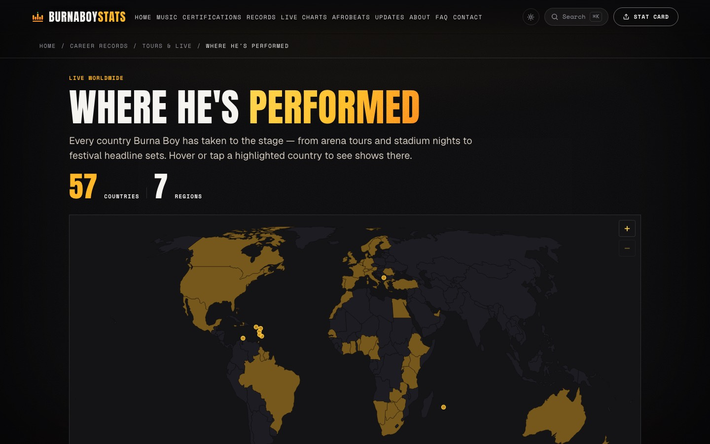

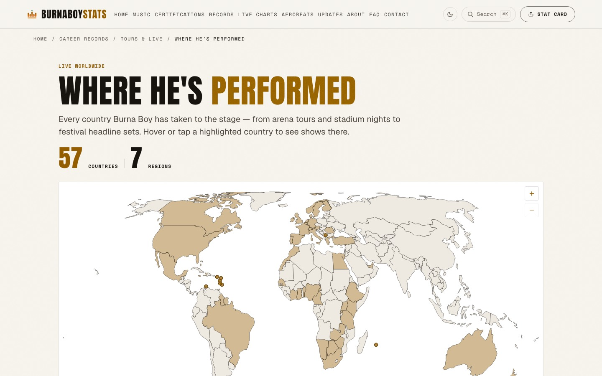

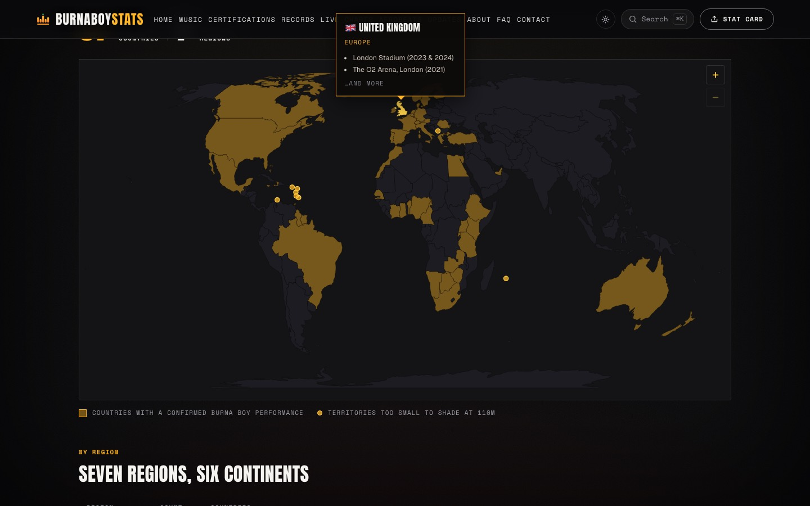

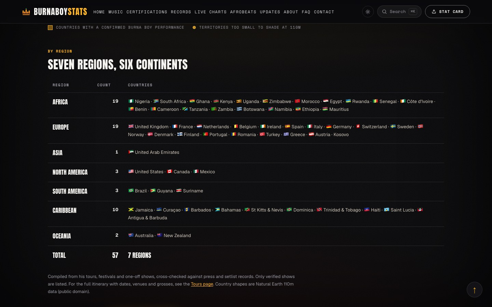

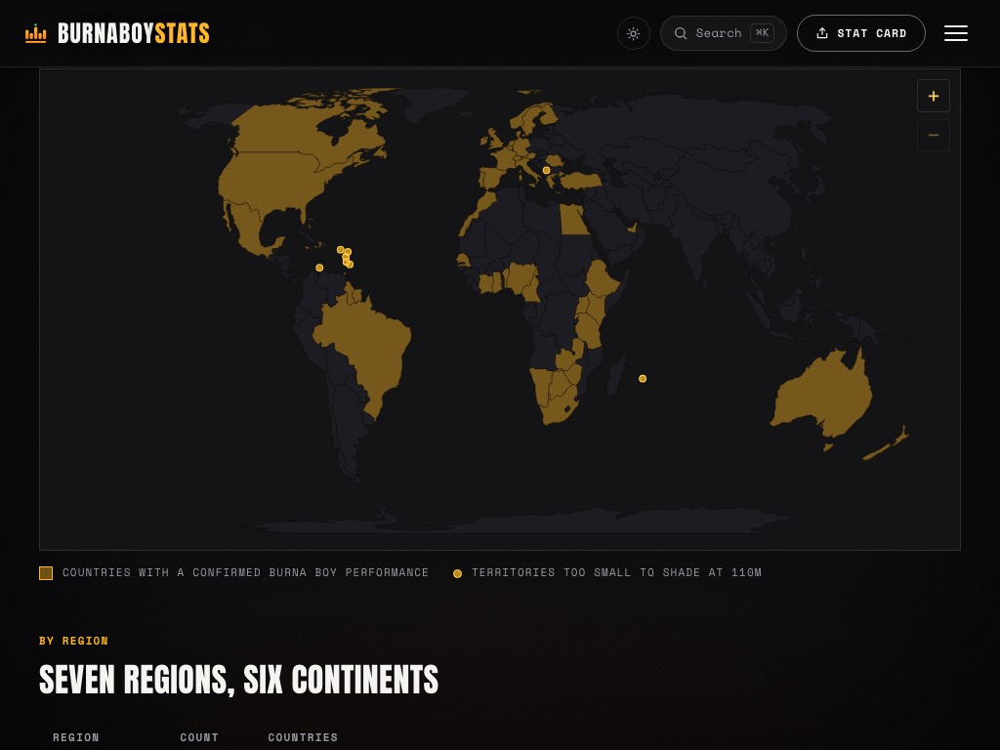

#### Phone (900px and below): Deep Pages screen 20, as built

The side gutter is 18px. From the top:

1. **Back bar** (sticky): a 44px round back button to `/records/tours`, the label **"TOUR MAP"**, a bare gold badge **"57"**, and the menu button.
2. **Hero:**
   - Kicker **"Live worldwide"**, in ember (not gold).
   - h1 **"Where he's performed"**, 40px.
   - Lede **"57 countries across 7 regions."**
3. **Map card:** the same map, in a framed card 352 × 184px at 390 wide (337 × 176 at 375). The **+** and **−** buttons are 44px each and sit inside the map, top-right. Under the map is a hint strip, a mono sentence, verbatim: **"Same Natural Earth geometry as desktop, fitted to the viewport. Tap a country for its shows."**
4. **Region rows:** each has the name (Anton 17px), the count on the right (gold, Anton 19px), and the countries as one mono 11px paragraph.
5. **Footnote**, verbatim: **"Regions and counts are derived from the same 57-country list the desktop map shades. Eight territories have no usable shape at 110m resolution and are plotted as markers rather than filled — the region list above is the accessible equivalent."** A test reads this sentence (§3.7).
6. **Fixed action bar** instead of the five tabs: one gold pill, **"Festivals & shows"**. There is no revenue link on the phone.

The phone card is the desktop card: it floats over the page.

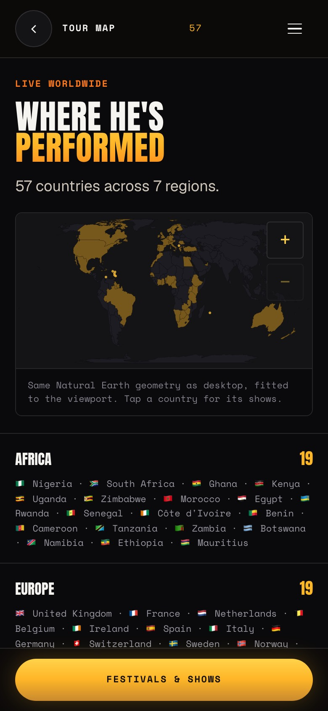

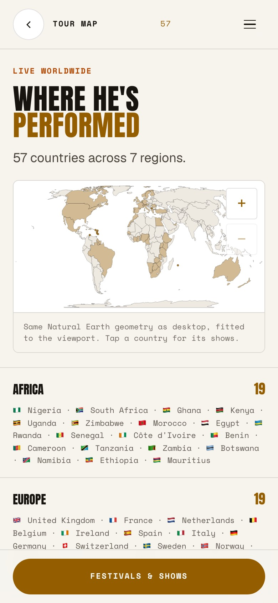

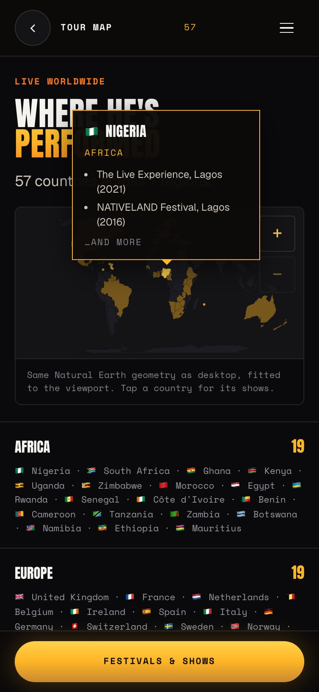

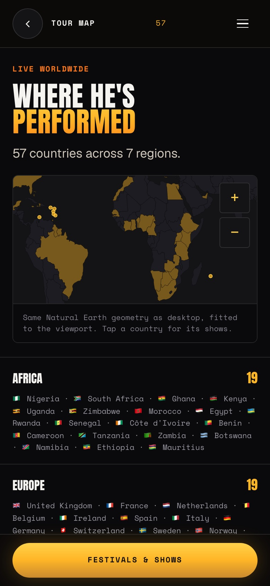

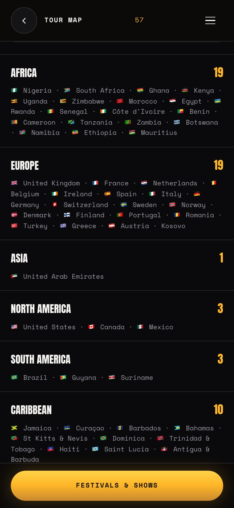

Two more views of the same faults, from a parallel measuring pass:
- 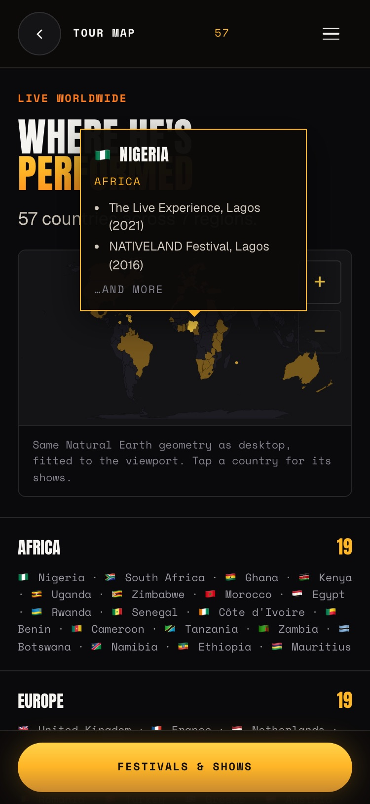
- 

**Where the current strings came from.** The artboards wrote the developer-sounding lines:
- the hint "Same Natural Earth geometry as desktop…" and the footnote are on the phone artboard (Deep Pages screen 20);
- that artboard also says "Ten small island nations" are dots, but the data has **eight**, and one of them, Kosovo, is not an island;
- the desktop artboard (`Records - Tour Map.html`) is **dark-only**, so the light map was never designed.

### 3.2 What is wrong today

Numbers below were measured on the live site on 29 Sep 2026. The phone was measured at 375 wide; the 390 values are computed from the same shapes. Each phone figure says which width it is. These describe today's site; the sizes to draw to, at 402, are in §3.5 A and §3.7.

#### Phone

- **Most places are too small to tap.** At 390 wide:
  - The map is 352 × 184px.
  - **46 of the 57 countries** are under 12px on one side, and 39 are under 12px both ways (40 at 375).
  - The dots are **2.5px** across (2.4 at 375).
  - The smallest shapes are Trinidad & Tobago (1.1 × 1.2px), Jamaica (2.0 × 1.1px), Rwanda (1.8 × 2.3px), Belgium (2.9 × 2.0px), the Netherlands (2.9 × 2.7px) and Switzerland (3.6 × 2.2px).
  - Only 11 countries are 12px or more both ways (at 375 and at 390): Canada, the US, Brazil, Australia, Mexico, Norway, New Zealand, Morocco, South Africa, Namibia and Ethiopia.
- **A near miss doesn't count.** Measured at 375:
  - A tap 4px off Barbados, Dominica, St Kitts & Nevis or Mauritius lands on the sea and **closes** the card.
  - 4px off Belgium opens Germany or France, and 4px off Jamaica opens Haiti.
  - A tap on a country he hasn't played does nothing at all.
- **Zoom doesn't rescue it.** Measured at 375:
  - Each **+** press recentres the view on the middle of the map, 0° N 0° E, in the Gulf of Guinea ([09](shots/09-tour-map-phone-dark-zoomed.jpg), taken at 390 after two presses with no scrolling, shows where it lands).
  - At 2.5×, Belgium is 7.0 × 4.8px and **out of view**, and Trinidad is 2.6 × 2.8px.
- **The controls sit on the map.** The two 44px buttons run from 10 to 104px down the map (176px tall at 375, 184 at 390), down its right-hand 44px (East Asia and the Pacific).
- **The card covers the page.** At 375, Nigeria's card (230 × 184px) covers the h1 and the top 35% of the map it was opened from.
- **The card leads nowhere.** It shows at most two hand-picked events, then "…and more", which is set by hand and is not a link.
- **Reader copy reads like a developer note:** "Natural Earth geometry", "110m", "the desktop map". The hint is a sentence set in mono. The badge is a bare "57".
- **Flags break away from their names** (Benin, Botswana), and names split mid-name ("Trinidad / & Tobago", "Antigua / & Barbuda").

#### Desktop

- **The card covers the masthead.**
  - The masthead is 69px tall and sticky.
  - The card flips below a country only when the country's top edge is within 174px of the top of the window, and it ignores the masthead.
  - So a card covers the nav whenever a country's top edge is between 174px and (78px + the card's height) from the top. Card heights run from 105px to 184px.
  - While the page is scrolled 141–367px (the range in which the whole map is on screen), **22 countries** can do this, mostly northern ones: Canada, the Nordics, the UK, Ireland, Benelux, France, Germany and more.
  - It is not every scroll position, as the review implied, but it is the normal way to view the map on a 1440 × 900 laptop.
- **The first screen cuts the map.**
  - The map runs from y 436 to y 1041 on a 900px-tall screen, so the fold cuts through Oceania and southern Africa.
  - Below all land except Antarctica is an empty band: 13.7% of the frame's height.
  - Cutting that band (§3.7) makes the frame shorter but doesn't lift Oceania: it sits above the band, so New Zealand stays at about y 883 on a 900px screen (checked 30 Sep). Getting the whole map onto the first screen at 1440 × 900 needs less height above the map, or a smaller map. Your call; show the result at 1440 × 900.
- **Small places on desktop too.** At 1440, 21 countries are under 12px on a side: 8 in Europe (Belgium 9.7 × 6.6, the Netherlands, Ireland, Switzerland, Denmark, Portugal, Austria, Kosovo), all 10 in the Caribbean, and Rwanda, Benin and Mauritius. At 1024 it is 24.
- **The Caribbean dots overlap on desktop.** Each dot is 8.2px across at 1440, but Barbados and Saint Lucia are 5.3px apart, centre to centre. The review said "about 9.5px apart", but that is only true of St Kitts and Antigua.
- **Keyboard:**
  - There are 57 Tab stops, in the order of the shapes file: Tanzania, Canada, United States, Kenya, Haiti, Bahamas, Norway…
  - Focus shows only as a change of fill, which can't be seen on a 4px island.
  - There is no skip link.
- **Alignment:**
  - The three buttons sit at x 100, 40px left of the content at x 140.
  - The COUNT heading is left-aligned over right-aligned numbers.
  - Flags split from names (Norway, Antigua & Barbuda).

#### Both layouts, both themes

- **It says one thing.** "57 countries · 7 regions" is the whole headline, and every country gets the same wash. A country known from one festival set looks the same as the US with 50 dated shows.
- **Played vs not played is too weak.** Computed from the tokens:

  | | Light (paper) | Dark |
  |---|---|---|
  | Ground (`--bg-soft`, the sea) | `#ffffff` | `#141416` |
  | Played (gold wash at 42%) | `#d2bb94` | `#77581d` |
  | Not played (`--bg-soft-2`) | `#efeae1` | `#1c1c21` |
  | **Played : not played** | **1.55 : 1** | **2.58 : 1** |
  | Not-played land : sea | 1.20 : 1 | 1.08 : 1 |
  | Border (a fixed near-black) : not-played land | **13.5 : 1** | 1.15 : 1 |
  | Hover fill (`--gold-hit`) : played | 5.29 : 1 | 4.56 : 1 |
  | Wash strength that would reach 3 : 1, same colour | 80% (`#a97e33`) | 48% (`#85621e`) |

  On paper the borders shout and the data whispers. In dark, unplayed land barely separates from the sea, so the borders are what draw the continents.

- **The list and the map are strangers.** Hovering or tapping a region or a country name does nothing on the map, and nothing on the map points back to the list.

**Review claims that changed on re-measuring:**
- **Festival and one-off rows:** 59, not 76. The 76 added the 17 "live moments".
- **Nights with a ticket count:** 26 single nights plus 2 two-night stands, not 28 nights.
- **Shapes that aren't interactive:** 126, not 118. Of the 57 played countries, 49 are shapes and 8 are dots.
- **The review's desktop Europe inset "at about 9× world scale, Belgium 35 × 24px":** a corner box small enough to hide nothing he played (≤260px wide) magnifies Europe only **1.5–2.6×** (§3.5, piece D).
- **The review's "Caribbean dots about 9.5px apart at 1440":** only St Kitts and Antigua are. Barbados and Saint Lucia are 5.3px apart, so their 8.2px dots overlap.

### 3.3 The data

Everything below is **derived from the site's data files**. Draw every figure as a slot (§9, rule 7). The build will fill the slots. The numbers here are for sizing slots and choosing real examples. The method and the full tables are in [`research/tour-map.md`](research/tour-map.md), §2, and every one of the 57 countries, with what its card can say and where it links, is in [`research/countries.md`](research/countries.md).

#### What the site holds

| Source | Rows | What it has | What it lacks |
|---|---|---|---|
| The map's country list | 57 countries | Name, region, flag, 1–2 hand-written event lines ("NATIVELAND Festival, Lagos (2016)"), and a hand-set "more" flag on 12 countries | Any count. The year is inside the event text |
| Tour itineraries | 98 dated shows in 6 tours | Date, venue, city, country, venue capacity (80 of 98) | Attendance. **Itineraries start in 2018.** One tour (Space Drift) is marked partial |
| Festivals and one-offs | 59 rows: 32 headlined + 13 other + 14 solo concerts | Year (31 have a day), name, location as free text | **A country field.** Three rows name no city |
| Live moments (the Tours page calls them "live milestones") | 17 | Ceremonies, award shows, record nights | A location field. 7 repeat a show above; 6 add a placed appearance |
| Box office | 26 of his single nights with tickets, plus 2 two-night stands | Tickets and gross in USD, per night | A per-night split for the two stands (Toronto, Montreal, Feb 2024) |
| City coordinates | 50 cities | Only the Spotify top-50 listener cities | Coordinates for most tour and festival cities |

#### The counting rules (one set, for the headline, the card and the panel)

1. **Tour dates:** one per dated row. A row is one night.
2. **Festival and one-off appearances:** one per row. Rows, not nights: FITZ Madrid ("two nights") and Coachella 2019 ("both weekends") count once each. A row that is the same night as a tour date counts **once, as the tour date**. Today that is one row: the concerts row "Burna Boy: The Live Experience", Lagos, is the tour date of 27 Dec 2021.
3. **Live milestones:** a live-moments row that names a place and repeats no show. There are six: the World Cup opening ceremony (Mexico), the AFCON fan-zone finale (Morocco), the Champions League final (Turkey), the Lionesses' parade (UK), the NBA All-Star Game and the Billboard Music Awards (US). They count on the card, not in the headline "shows".
4. **Cities:** distinct names across 1–3, as each record spells them.
5. **Years:** every year in 1–3, plus every year written in the map's own event lines. The documented line appears only when a country has at least one row in 1–3. The nine countries known only from the map's event lines show those lines, which carry their own years, and no documented line.
6. **Biggest line:** the country's single night with the most reported tickets. Where a country has only two-night stands (Canada), the bigger stand, labelled as a stand and never split. One biggest line per country.

The reference implementation is `research/tour-map-method/card_counts.py`.

#### Totals (29 Sep 2026)

| Figure | Value | Caveat to carry |
|---|---|---|
| Countries | **57** (49 shapes + 8 dots) | |
| Regions | **7** (six continents) | |
| Tour dates | **98**, in **13** countries | US 50 · Canada 14 · UK 10 · Germany 5 · Australia 4 · Netherlands 3 · Belgium 3 · Switzerland 3 · France 2 · Sweden 1 · Denmark 1 · Nigeria 1 · Barbados 1 |
| Festival and one-off appearances | **58** (59 rows in 41 countries, less the Lagos row that repeats a tour date) | Entries, not nights (rule 2) |
| **Documented shows** (the headline figure, §3.5 F) | **156** = 98 tour dates + 58 appearances | Dates and entries, not nights. It leaves out the live milestones |
| Live milestones with a place | **6** | On the card only (rule 3) |
| Cities | **96** distinct names across tour dates, appearances and placed milestones (51 from tour dates alone) | Counted as each record spells them: "Inglewood", "Elmont, NY", "Irving" and "Morrison, CO" count apart from Los Angeles, New York, Dallas and Denver. The caveat line under the headline says so (§3.5 F) |
| Years documented | **2014–2026** | Rule 5. 2014 comes only from Uganda's event line "Club MegaFest, Namboole Stadium (2014)"; the earliest row is NATIVELAND, Lagos, 22 Dec 2016; tour dates run 2018–2026. **These are the years the site documents, not the years he played** |
| Biggest night | **London Stadium, 29 Jun 2024: 58,973 tickets** ($6,147,209, I Told Them… Tour) | Label it **"by reported tickets"**. London Stadium 2023 had "about 60,000" in press prose, with no ticket count |

#### How uneven it is, by region

| Region | Countries | Dots | Tour dates | Festival and one-off appearances | Countries with a tour date |
|---|---|---|---|---|---|
| Africa | 19 | 1 | **1** | 14 | 1 |
| Europe | 19 | 1 | 28 | 25 | 8 |
| Asia | 1 | 0 | 0 | 1 | 0 |
| North America | 3 | 0 | 64 | 7 | 2 |
| South America | 3 | 0 | 0 | 3 | 0 |
| Caribbean | 10 | 6 | 1 | 7 | 1 |
| Oceania | 2 | 0 | 4 | 1 | 1 |
| **Total** | **57** | **8** | **98** | **58** | **13** |

Africa has as many countries as Europe but one tour date against Europe's 28. **A map sized or shaded by show count would make Africa, and Nigeria, his home, almost disappear.** That reflects what the site has documented, not where he has played. Keep "played here" as the main mark, and treat any count as secondary and labelled "documented".

#### Real countries to draw (the edge cases)

Use these when you draw the card, the panel and the find box. Each line is what the rules above produce today; the build derives them. The chart peak is the best one on that country's official chart in `charts.ts`, features included (as the site's No. 1s tally counts them). "Board" is the country's certifications board, `/compare/in/<country>`.

| Country | Documented line | Biggest line | Chart peak · plaques · board | Drawn as | Why it's a useful case |
|---|---|---|---|---|---|
| 🇺🇸 United States | 50 tour dates · 7 festival and one-off appearances · 2 live milestones · 30 cities · 2018–2025 | Biggest reported night · Capital One Arena, Washington, D.C. · 8 Dec 2022 · 14,688 tickets | No. 14 on Billboard Hot 100 / 200 (the album Love, Damini) · 8 · board | shape | The densest case; 6 tours. Its biggest reported night is an arena, because Citi Field 2023 has no box-office row. Its years end in 2025: the 2026 World Cup Final halftime show names no place in the tour data |
| 🇬🇧 United Kingdom | 10 tour dates · 3 festival and one-off appearances · 1 live milestone · 6 cities · 2018–2026 | Biggest reported night · London Stadium, London · 29 Jun 2024 · 58,973 tickets | No. 1 on the Official Charts Company chart · 30 · board | shape | Every field filled. Tours: 5 |
| 🇨🇦 Canada | 14 tour dates · 4 cities · 2019–2025 | Biggest reported stand · Scotiabank Arena, Toronto · 24–25 Feb 2024 · 29,579 tickets over 2 shows | No. 3 on Billboard Canada · 23 · board | shape | Only two-night stands, never split. Montreal's stand (26,303 tickets over 2 shows) is smaller, so it is not shown |
| 🇫🇷 France | 2 tour dates · 1 festival or one-off appearance · 1 city · 2021–2025 | Biggest reported night · Stade de France, Paris · 18 Apr 2025 · 43,881 tickets | No. 1 on SNEP · 19 · board | shape | Box office also has La Défense Arena 2023 (36,585), which is **not** in any itinerary |
| 🇳🇬 Nigeria | 1 tour date · 1 festival or one-off appearance · 1 city · 2016–2021 | none | No. 1 on TurnTable · 72 · board | shape | His home country has **one** tour date. The concerts list holds the same night again (counted once, rule 2); the one appearance is NATIVELAND 2016. A count must not look complete |
| 🇵🇹 Portugal | 6 festival and one-off appearances · 2 cities · 2019–2026 | none | No. 1 on AFP · 8 · board | shape | Known only from festivals, but many of them |
| 🇬🇭 Ghana | 1 festival or one-off appearance · 1 city · 2025 | none | none | shape | One festival row, nothing else |
| 🇺🇬 Uganda | 1 festival or one-off appearance · 1 city · 2014–2019 | none | none | shape | Its years start in 2014, from its own event line, two years before the earliest row on the site (rule 5) |
| 🇧🇯 Benin | none: only the event line "WeLoveYa Festival, Cotonou (2025)" | none | none | shape | **Known only from the map's own event line.** Eight more are like this: Cameroon, Tanzania, Zambia, Botswana, Ireland, Austria, Haiti, Antigua & Barbuda |
| 🇲🇽 Mexico | 1 live milestone · 1 city · 2026 | none | none. A Mexico board exists, but it holds none of his plaques, so the card doesn't link it | shape | **Known only from a ceremony** (FIFA World Cup Opening Ceremony, Mexico City 2026). Turkey is the other (UEFA Champions League final 2023) |
| 🇧🇧 Barbados | 1 tour date · 1 city · 2022 | none | none | **dot** | A dot with a tour date |
| 🇲🇺 Mauritius | 1 festival or one-off appearance · 2025 | none | none | **dot** | A dot whose festival row names no city, so the line has no city count |
| Kosovo | 1 festival or one-off appearance · 1 city · 2024 | none | none | **dot** | **No flag emoji exists.** Not an island |

**Across all 57** ([`research/countries.md`](research/countries.md)):
- 8 countries have a single-night box-office figure; Canada has only stands; 48 have none.
- 28 have a Burna chart peak, and 21 hold at least one of his plaques. 29 have neither.
- 22 have a certifications board; 21 of those hold a plaque of his (the card links only those). Mexico's board holds none.
- 9 have no row at all, only the map's event lines.

**Longest real strings, for slot sizes:**
- country name: "United Arab Emirates" (20 characters);
- event line: "FIFA World Cup Opening Ceremony, Mexico City (2026)" (51);
- city: "San Antonio, Ibiza" (18);
- documented line: the US's, "50 tour dates · 7 festival and one-off appearances · 2 live milestones · 30 cities · 2018–2025" (94);
- venue in a biggest line: "Capital One Arena" (17); the longest whole biggest line is Canada's stand (97 characters, above);
- the line breaks where you choose; say where in the response.

#### The eight dots

| Place | Why a dot | Region |
|---|---|---|
| Mauritius | island | Africa |
| Kosovo | small, landlocked, no shape at this scale, no flag emoji | Europe |
| Curaçao, Barbados, St Kitts & Nevis, Dominica, Saint Lucia, Antigua & Barbuda | islands, all inside a patch about 30 × 18 map units (11 × 7px on a 375 phone) | Caribbean |

### 3.4 Direction (your call)

- **Make the phone map a set of region views, not a zoom.** Regions are the unit people think in, the list is already grouped by region, and the site has already approved the pattern: the Dai Dai phone map opens on a Europe crop with a World toggle.
- **One selection, shown everywhere.** Whether the reader picks a country on the map, in the list, in the find box or through a `?country=` link, the same country lights up in each place, and the same card or panel opens.
- **The card answers "what did he play here, when, and how big", then sends you on.** It gives a documented summary and links, not a full itinerary. The map page was built on purpose not to repeat the Tours page's lists. Whether a country's full list of appearances shows on the map page is your call; if you do it, it is a dense list, not a fold.
- **Say more at a glance, honestly.** Put the documented totals beside "57 countries · 7 regions", each labelled "documented", with one line saying tour itineraries start in 2018.
- **Colour for the data, not the borders.** Played countries must clearly outrank political borders in both themes.
- **Use what the site has.** The listeners map, the Dai Dai map and the charts pages already contain every part this job needs (§8.6).

### 3.5 The new pieces, specified

Each piece lists what it is, both layouts, its states, and the constraints the code puts on it.

#### A. Region views (phone), with chips

**What the data says about which regions need a view.** Every big country is already tappable at world scale on a phone: the US, Canada, Mexico, Brazil, Australia and New Zealand are each 12px or more both ways. The small ones cluster in three places: **Europe** (18 of its 19 are small), **Africa** (15 small), and **the Caribbean** (all 10). Asia has one country, the UAE, and it sits inside an Africa view drawn wide enough to take in Mauritius. So the data supports **World · Europe · Africa · Caribbean**. An "Americas & Caribbean" view, as the review proposed, buys nothing for the big four and squeezes the Caribbean dots.

What each candidate view does on a 402-wide phone, where the map frame is 364px wide (402 − 2 × 18 gutter − 2px border). "World" is 0.404px per map unit. Each view is a longitude/latitude box, projected the way the Dai Dai Europe box is: its width is taken at the latitude nearest the equator, and it is widened in one direction to fit the frame, so the scale is the smaller of frame width ÷ box width and frame height ÷ box height. Sizes are bounding boxes. "Closest dots" is centre to centre, and it is always Barbados and Saint Lucia, 4.08 map units apart. The script is `research/tour-map-method/region_views.py`, and its output, with a 390 run for comparison with the screenshots, is `region-views.md` beside it.

| View | Box (lon, lat) | Same box in map units (x, y, w, h) | Frame 364 × 190 (today's proportion) | Frame 364 × 260 | Frame 364 × 300 (the Dai Dai phone map's height) |
|---|---|---|---|---|---|
| Europe, all 19 incl. Turkey | −11° to 45°, 34° to 71° | 423.2, 31.0, 129.7, 92.4 | 5.1× · Belgium 15 × 10px | 6.9× · Belgium 21 × 14 | 6.9× (width-limited) · 21 × 14 |
| Europe, the Dai Dai box: **cuts Turkey in half** | −11° to 32°, 35° to 71° | 423.4, 31.0, 99.0, 89.3 (the Dai Dai build widens it to 103.9 for its 1 : 0.86 inset) | 5.3× · Belgium 16 × 11 | 7.2× · 22 × 15 | 8.3× · 25 × 17 |
| Africa + Mauritius | −18° to 58°, −35° to 37.5° | 403.3, 112.7, 191.9, 237.7 | 2.0× · Rwanda 4 × 5 | 2.7× · Rwanda 5 × 7 | 3.1× · Rwanda 6 × 8 |
| **Caribbean only** | −80° to −59°, 9.5° to 27.5° | 248.1, 143.7, 52.7, 59.4 | 7.9× · closest dots 13.1px · Trinidad 9 × 10 | 10.8× · 17.9px · 12 × 13 | 12.5× · 20.6px · 14 × 15 |
| Caribbean + Guyana & Suriname | −80° to −53.5°, 1° to 27.5° | 246.8, 143.7, 66.9, 88.2 | 5.3× · 8.8px · Trinidad 6 × 7 | 7.3× · 12.0px · 8 × 9 | 8.4× · 13.9px · 10 × 10 |
| Americas & Caribbean (Mexico to Suriname) | −118° to −53.5°, 1° to 33° | 150.8, 126.5, 162.8, 105.5 | 4.5× · 7.3px · Trinidad 5 × 5 | 5.5× · 9.1px · 6 × 7 | 5.5× (width-limited) · 9.1px · 6 × 7 |
| The whole Americas | −168° to −34°, −34° to 83° | 24.6, 16.6, 338.3, 330.7 | 1.4× · 2.3px | 1.9× · 3.2px | 2.2× · 3.7px |

These values replace the ones in the first version of this brief, which came from boxes it did not state. They are close: at 390 the Caribbean view's closest dots are 12.6px apart at today's height (the first version said "≥13px").

What this means for the design:
- **Africa is tall and the frame is wide.** Africa gains least from a view. Rwanda, sitting between Uganda and Tanzania (both played), stays the hardest target, so the nearest-tap rule (piece C) matters most there. In a 190px frame the Africa view is widened so far that it also shows the Caribbean dots, Brazil and the US; at 260 or 300 it shows Africa, southern Europe's edge, the UAE and the tip of Brazil.
- **Frame height is a real decision.** Today's proportion (190px at 402) limits every view. The Dai Dai phone map is 300px tall for this reason. Pick **one height for every view**, so the list below doesn't jump when a chip is tapped. The World view in that frame is letterboxed; say how.
- **Guyana and Suriname** (South America) are small at World (4.8 × 9.6 and 4.2 × 5.7px at 402). Either include them in the Caribbean view, at the cost of dot spacing, or rely on nearest-tap at World. Your call; the chip's label must match what the view is framed on.
- **Played countries from another region inside a view stay lit and tappable.** A view is a crop of one map, and a played country drawn as unplayed would be false. The chip names the region the view is framed on, not every country in it: Morocco shows in both Europe views; southern Spain, Portugal, Italy, Greece, Turkey's coast, the UAE and Brazil's tip show in the Africa view; Florida and the Yucatán show in the Caribbean view. Selecting one of them keeps the view and opens that country's own panel, which names its own region.
- **Each country has one home view:** Europe, Africa or Caribbean for those regions, and World for Asia, North America, South America and Oceania. The UAE's home view is World, although it also shows in the Africa view. A region row, a deep link and a keyboard move all use the home view (pieces E, G and H).
- **Region rows without their own view.** When the reader taps the Asia, North America, South America or Oceania row (piece G), show World with that region's countries lit. The UAE is 4.5 × 4.7px at World, so the lit state must carry the selection outline (piece H), not a fill change alone.

**Chips:**
- A row of four above the map card, 44px tall, on one line at 402 wide.
- With today's phone chip (mono 700 11px, 0.1em tracking, 15px side padding, 8px gaps), "WORLD · EUROPE · AFRICA · CARIBBEAN" comes to about 356px. That fits the 366px a 402 phone has, but not the 339px at 375. Say what happens at 375 (tighter padding, a shorter label or a sideways-scrolling row).
- One is always current.
- For the on-state, the nearest precedent is the Dai Dai phone map's "Europe | World" toggle ([36](shots/36-dai-dai-map-phone-dark-toggle.jpg)): an ink fill with a `--bg` label, not gold. The site's filter chips use a gold wash instead. Pick one and give your reason (the gold rule, §9 rule 3).

**States to draw:** World (default) · Europe · Africa · Caribbean · a view with a country selected · a view reached from a region row · reduced motion (the view changes instantly, with no animated zoom).

**Code constraints:**
- The views are fixed longitude/latitude boxes, projected like the rest of the map.
- The Dai Dai Europe box exists already; the others are new boxes, not new data.
- Dots keep a steady screen size in every view (the listeners map does this). They don't balloon as the view zooms.

#### B. Controls out of the map (phone)

- Move **+** and **−** out of the map, for example into the strip under it, where the hint is today.
- If you think the region views make them unnecessary, propose dropping them. That goes on the change list.
- If they stay, zoom must centre on the current view, not on the Gulf of Guinea. That is code, but your artboard should show where the view lands.
- Rewrite the hint in reader terms and in the body font, not mono (for example, "Tap a country for its shows"). Your wording wins over the code pass's.

#### C. Nearest tap (phone and desktop)

- A tap or click picks the **nearest** played country or dot within **22 screen px**. For a dot, "nearest" is measured to its edge. For a shape, it is measured to its outline.
- A miss beyond 22px dismisses, as today. A tap on land he never played does the same.
- The listeners map already works this way ([17](shots/17-listeners-map-phone-dark.jpg)).
- The reach is invisible, so the design must make the result obvious. The selected country gets its selection outline (piece H), and the panel or card updates at once.

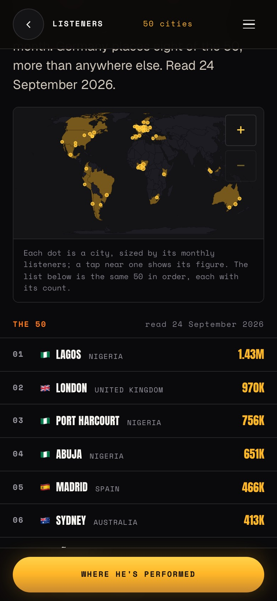

#### D. A close-up for the small places (desktop)

The review asked for a Europe close-up box that hides nothing he played. The numbers, tested at 1440 and 1024, with the frame uncropped (today) and cropped to the planned Antarctica crop (§3.7). The script is `research/tour-map-method/closeup_and_inset.py`; its output, `closeup-and-inset.txt`, lists every box at every corner.

**Where a box can sit** (inside the map frame, 9px from its edges):

| Corner | 200 × 172 and 260 × 224px | 300 × 258px |
|---|---|---|
| **Bottom-left** | **no played country, no dot**, at both widths, cropped or not | at 1024: covers 18% of Brazil uncropped; with the crop, Jamaica, Haiti, 42% of Mexico, 18% of Brazil and two dots (Curaçao, St Kitts & Nevis) |
| **Top-right** | **no played country, no dot** | no played country. The desktop **+/−** sit here today |
| Bottom-right | always covers New Zealand and most of Australia | same |
| Top-left (for the card, piece E) | 200 × 172: nothing at 1440; parts of the US, Canada and Mexico at 1024. 260 × 224: parts of all three at both widths | covers the US, Canada and Mexico |

Bottom-left covers western South America, which he hasn't played, but it still hides geography. Placing the close-up **outside** the frame (beside or under it) avoids hiding anything. Your call.

**How much it magnifies** (map units to pixels, against the world at 1440, 1.287px per unit). The close-up's drawing area is the box less a 1px border and 4px padding, as the Dai Dai inset is built:

| What the close-up shows | 200 × 172 box | 260 × 224 box |
|---|---|---|
| All of Europe, Turkey included | 1.1× · Belgium 11 × 7px | 1.5× · Belgium 14 × 10px |
| The Dai Dai Europe box (cuts Turkey) | 1.4× · Belgium 14 × 9px | 1.9× · Belgium 18 × 12px |
| **Only the small countries**: Ireland to Kosovo, Denmark to Portugal (map units x 426–501, y 56–118) | 2.0× · Belgium 19 × 13px | **2.6× · Belgium 25 × 17px** |

So a corner box helps only if it frames just the cluster that needs it. The UK, France, Germany, Italy and Spain come along. Norway, Sweden, Finland, Romania, Greece and Turkey are already big enough at 1440 and can stay on the world map.

**The Caribbean is the other desktop cluster.** Its ten places are all under 12px, and its dots overlap (§3.2). Nearest-tap is the plan's answer. A second close-up is your call; if you draw one, test its placement the same way and say so in your response.

**Close-up behaviour:**
- A hairline outline on the world map marks the area the close-up shows.
- Hover or focus in either the close-up or the world map lights the same country in both.
- The close-up takes clicks like the world map. It **shares the world map's one Tab stop** and adds none (piece H): a focused country inside the close-up's area shows its focus ring in both places.
- Its label (for example "Western Europe") is mono 11px, muted.

**States:** default · a country hovered inside the close-up (lit in both) · a country pinned from the close-up · 1024 check.

#### E. The country card (desktop) and panel (phone)

**Content, top to bottom.** Every figure is a slot. A line disappears when its data is absent: never print a zero, and never print "not reported" for a missing box-office figure. The site's convention for a figure that exists but wasn't reported is an em dash in `--dim`. The recommended default here is to leave a missing line out; if you use the em dash anywhere, say where. The counting rules are in §3.3, and every country's result is in [`research/countries.md`](research/countries.md).

1. **Flag and name.** Kosovo has no flag. Then the **region**, in muted ink.
2. **Documented line.** The word "documented" must be visible with it (for example a label "Documented" in front). Its segments, each left out when it is zero, with these exact strings:
   - "1 tour date" / "N tour dates";
   - "1 festival or one-off appearance" / "N festival and one-off appearances";
   - "1 live milestone" / "N live milestones" (the Tours page's own word for them);
   - "1 city" / "N cities";
   - the years, "2018–2026" or a single "2025".

   The UK reads "10 tour dates · 3 festival and one-off appearances · 1 live milestone · 6 cities · 2018–2026". Draw the Nigeria case, "1 tour date · 1 festival or one-off appearance · 1 city · 2016–2021": the concerts row that repeats the tour date is counted once, so Nigeria has two rows but one appearance. It must not read as complete. The nine countries with no row (Benin and eight more) have no documented line; their event lines are the content.
3. **Biggest line.** Two fixed labels, one line per country:
   - "Biggest reported night · <venue>, <city> · <date> · <tickets> tickets", for example "Biggest reported night · London Stadium, London · 29 Jun 2024 · 58,973 tickets". The date comes from the matching tour date; where none matches, the year. Eight countries have one.
   - "Biggest reported stand · <venue>, <city> · <dates> · <tickets> tickets over <n> shows", for Canada only: "Biggest reported stand · Scotiabank Arena, Toronto · 24–25 Feb 2024 · 29,579 tickets over 2 shows". Montreal's smaller stand is not shown. A stand is never split into nights.
   - Draw the none-state too, which is the common one (48 countries): the line is absent.
4. **Events:** the map's own 1–2 lines, and for countries with no row, the only content. **"…and more" goes, and no "+N more" replaces it.** There is no honest N: the event lines are free text and aren't joined to rows. Ireland's line, "3Arena, Dublin (Mar & Dec 2022)", has no row at all, and the UK's two lines overlap its ten dates, so any "N more" would count some shows twice. The documented line above is the count, and the link rows are the way on. Nothing here expands. Dropping "…and more" changes a test (§8.7); list it.
5. **Links,** as rows (the whole row is the link, so each ends in →, §8.5):
   - **"Tour dates on the Tours page →"**: only for the 13 countries with tour dates. It goes to `/records/tours` at that country's marker, which the code adds. (Not "All dates": nothing on the page may claim completeness.)
   - **"Festivals & shows →"** to `/records/tours/festivals`: where the country has at least one festival or one-off appearance.
   - **"Certifications in <country> →"** to `/compare/in/<country>` (the country's certifications board): only where Burna Boy holds a plaque there, 21 countries. The UK and the US read "the UK" and "the US".
   - **"Chart peak here: No. <n> →"** to `/records/charts`, with the chart's name from data under it (for example "Official Charts Company"): only where he has an official-chart peak, 28 countries. The peak is the best one on the chart `charts.ts` names for that country. `/records/charts` has no per-country anchor today; the code adds one, as it does on the Tours page.
6. **Caveat line**, once, in `--type-caption`: "Documented shows only. Tour itineraries on this site start in 2018." The year is a slot.

**The eight cases to draw, with their link rows in order:**

| Case | Link rows |
|---|---|
| United States | Tour dates on the Tours page → · Festivals & shows → · Certifications in the US → (`/compare/in/united-states`) · Chart peak here: No. 14 → (Billboard Hot 100 / 200) |
| United Kingdom | Tour dates on the Tours page → · Festivals & shows → · Certifications in the UK → (`/compare/in/united-kingdom`) · Chart peak here: No. 1 → (Official Charts Company) |
| Canada | Tour dates on the Tours page → · Certifications in Canada → (`/compare/in/canada`) · Chart peak here: No. 3 → (Billboard Canada). No festival row, so no festivals link |
| Nigeria | Tour dates on the Tours page → · Festivals & shows → · Certifications in Nigeria → (`/compare/in/nigeria`) · Chart peak here: No. 1 → (TurnTable Top 100 / Top 100 Albums) |
| Benin | none. The event line and the caveat are the whole card |
| Mexico | none. Its documented line is "1 live milestone · 1 city · 2026". A Mexico board exists but holds none of his plaques |
| Barbados | Tour dates on the Tours page → |
| Kosovo | Festivals & shows → |

**Desktop behaviour:**
- **Hover or focus previews; click or Enter pins.** A pinned card holds links, so it takes the pointer, and it has a close button. Escape closes it. A click on the sea or on another country moves the pin.
- **Never over the masthead, never over the selected country.**
  - The Dai Dai map puts its card **inside** the map frame at a fixed corner, which solves the masthead problem outright.
  - A fixed corner can land on the chosen country, though: top-left covers Canada.
  - Choose the placement, show it with a northern country (UK) and a corner one (Canada), and say how it avoids the selection.

**Phone behaviour:**
- **A panel in the page flow, directly under the map card.** Nothing floats over the heading or the map.
- Links are 44px rows. The event list is dense rows, with no accordion.
- Tapping another country swaps the panel.
- A close control clears it, and so does the browser's back button once `?country=` is in the address (below).
- The panel must stay clear of the fixed action bar (75px + the home-indicator inset).

**Deep link `?country=gb`:**
- `/records/tours/map?country=gb` opens with that country selected: the card pinned on desktop; on the phone, the panel open with the map on the country's **home view** (piece A: Europe, Africa or Caribbean for those regions, World for the rest; Europe for the UK, World for the UAE).
- **A real country he has no documented show in** (for example `?country=pe`, Peru; Lima is a top-50 Spotify city with none): the page opens on World with nothing selected, and one line sits where the card or panel would: "No documented show in Peru." It has a close control and no links. It is the find box's wording (piece G).
- **A code that isn't a country** (`?country=xx`): the page opens as if there were no parameter: World, nothing selected, no note. The build drops the parameter from the address.
- Draw both layouts in their on-load state for `gb`, and the phone for `pe`.
- Code note: the site's chart data spells the UK "UK", but ISO says "GB". The build picks one. The design shows `gb`.

**States to draw:** preview (desktop hover) · pinned: the US (dense), the UK (full), Canada (stand), Nigeria (one date), Benin (event line only), Mexico (ceremony only), Barbados (dot), Kosovo (no flag) · deep-linked on load (`gb`, and `pe` on the phone) · the phone panel for UK, Nigeria, Benin and Barbados · both themes.

**SEO / accessibility:** whatever the card says must also be reachable without the map. Today the region list is "the accessible equivalent" (the footnote says so). Say where each country's details live for a reader who never touches the map.

#### F. Headline figures

Beside **"57 COUNTRIES │ 7 REGIONS"** on desktop, and in the phone hero. Values from §3.3, under its counting rules:

| Figure | Today | Label | What it counts |
|---|---|---|---|
| **Documented shows** | 156 | "documented shows" | 98 tour dates + 58 festival and one-off appearances. Dates and entries, not nights; the Lagos night that is in both lists counts once; live milestones are left out. Draw it as one slot, or as two slots with the breakdown ("98 tour dates · 58 festival and one-off appearances"), or both |
| **Cities** | 96 | "cities" | Distinct city names across tour dates, appearances and placed live milestones, as spelt (the caveat line says so) |
| **Years documented** | 2014–2026 | "years documented" | Rule 5 in §3.3, the same rule every card uses |
| **Biggest night** | London Stadium · 29 Jun 2024 · 58,973 tickets | "Biggest night, by reported tickets" | Rule 6 in §3.3, across all countries |

**The caveat line**, once, under the figures, in `--type-caption`, exactly: "Documented shows only. Tour itineraries on this site start in 2018, and cities are counted as each record names them." The year is a slot.

**Rules for these figures:**
- All of them are slots, all labelled "documented" (the caveat line carries the word for the row).
- Never "since 2018", "first show" or "and counting" language on the page. The link preview's "and counting" stays, as the preview is out of scope.

**Desktop:** the existing figure-and-label pairs, extended. The Dai Dai "By the numbers" strip ([20](shots/20-dai-dai-numbers-desktop-dark.jpg)) is the nearest figure-strip grammar on the site.

**Phone:** the lede, or a compact stat grid like the phone Tours page ([13](shots/13-tours-phone-dark-top.jpg)). The map must stay on the first screen, measured like this:
- **In the 402 × 874 artboard:** the whole map frame, with the chips above it, ends at or above **y 765** (874 − the 75px action bar − a 34px home indicator).
- **On the live site at 390 × 844:** the same rule gives **y 735**. That is the viewport the build is checked at.
- Today the map card starts about 253px down at 390 and its map ends about y 437. The chips add about 56px (44 + a 12px gap). A 2 × 2 stat grid like the Tours page's adds about 175px. With both, a 260px frame ends near y 745 and a 300px frame near y 785 at 390: both too low. So the figures, the chips and the frame height are one decision. Show the sum on the artboard.

**Gold.** Every item below is gold today and at rest. List each with your keep-or-move decision in the change list; the default is the move shown:

| Item | Today | Default |
|---|---|---|
| The "57" count figure (desktop) | gold, Anton 58px | ink |
| The phone region counts | gold, Anton 19px | ink |
| The phone badge | a bare gold "57" | muted, reading "57 countries" |
| The card's region label | gold, mono 11px | muted |
| The desktop kicker "Live worldwide" | gold text | muted text, with the ember tick (the Records family's signature, §8.2) |
| The map card's border and arrow | 1px `--gold` border and a gold arrow | a neutral edge (`--rule`); keep gold only if you mark the pinned card as the live selection, and say so |
| The legend swatches' borders | 1px `--gold` and `--gold-bright` | whatever the new map fills are (piece H): a swatch shows the fill it explains, not gold |
| The h1 word "performed" | gold ink | the open question in §9 rule 3: ink by default, listed for the owner |

#### G. List ↔ map

**Desktop:**
- Hovering or focusing a region row lights that region's played countries and dims the rest.
- Each country name in the table becomes a button: it selects the country, brings the map into view and pins the card.
- **"Find a country or city"**: a one-line field near "By region" that filters the rows. A city match selects its country and says, for example, "Toronto · Canada · 5 documented tour dates" (tours.ts:65, 66, 107, 108 and 188; Toronto has no festival or one-off row). The line follows the documented line's strings (§3.3), with zero segments left out. The city names come from tour dates, appearances and placed live milestones, as spelt.
- Draw these states: empty; typing "Tor"; a city match; a country match; no match ("No documented show in 'Lima'" is honest: Lima is a top-50 Spotify city with no documented show).

**Phone:**
- Each region row becomes a button that switches the map to that region's view (or World with the region lit) and scrolls up to it.
- Country names stay as text, so the list doesn't swell.
- Rows stay as dense as today.

**Both:**
- A flag stays on the same line as its name (code).
- The rows keep their order: Africa, Europe, Asia, North America, South America, Caribbean, Oceania.

#### H. Colour, focus and keyboard

**Played vs not played: at least 3:1, in both themes.**
- The same colour at a stronger wash reaches it (80% on paper, 48% in dark, §3.2). A ramp re-derived for paper also works: the peak map on `/records/visualized` already has one.
- Softer borders on paper: today's are a fixed near-black at 90%, which is 13.5:1 against unplayed land.
- In dark, keep enough edge that land still reads as land against the sea.
- New colours must be token pairs (light | dark) with a reason (§8.2).

**Hover and selection:**
- Hover keeps `--gold-hit` (it is an action).
- A selected country gets an **outline drawn on top of its neighbours but under its own fill**, as the Dai Dai map does. Switzerland keeps its colour and still shows as picked.

**Focus ring:**
- Visible on a 4px island and on a dot, in both themes. A fill change alone is not enough.
- The site's global ring is 2px `--gold` at a 2px offset.
- Draw focus on Belgium, on Barbados and on a country in the close-up.

**Keyboard:**
- **One Tab stop** into the map. On desktop the close-up shares it and adds no stop of its own; when the focused country is inside the close-up's area, its ring shows in the close-up and on the world map together.
- Arrow keys move through all 57 countries in region order, then by name.
- **On the phone**, when the next country is outside the current view, the map switches to that country's home view (piece A) and the matching chip becomes current. The switch is instant under reduced motion. A country from another region that is already visible in the current view doesn't switch it.
- Home and End jump. Enter pins. Escape clears.
- The Dai Dai ranking chips work this way already.
- Write the screen-reader line pattern, for example "Nigeria, Africa: 1 tour date, 1 festival or one-off appearance, 1 city, 2016 to 2021", and what is announced when the view switches (for example "Europe view").

**Skip link:** **"Skip to country list"**, before the map, visible on focus. The site's skip-link style is the gold ramp, 44px tall.

**Legend:**
- Draw it in both themes.
- Name the dots in reader words ("Small islands and Kosovo, shown as dots", or better).
- A test currently looks for "Territories too small to shade". If you change the wording, say so; the test changes with it.

### 3.6 What not to do

- **No "watch his reach grow" animation**, and no "first show in each country". Itineraries start in 2018, so any "first" would be false (§10).
- **Don't size or colour countries by show count** as the main mark. It would erase Africa, which is a gap in the documentation, not in his career.
- **Don't imply completeness.** No "every show", "all dates" or "complete". Nigeria has one tour date.
- **No "…and more" and no "+N more"** on the card or panel (piece E), and nothing that expands.
- **No typed figures**, including in the headline, the card, the find-box result and the legend.
- **No new mapping library**, no tiles and no 3D globe on this page.
- **No accordion** in the phone panel or the region rows.
- **No card over the masthead or the back bar**, and no card over the h1.
- **Don't make countries he hasn't played interactive one by one.** They become one static background layer (§3.7): they can dim or brighten as a group, not individually.
- **No mono sentences.** Mono is for short labels only.

### 3.7 Code work already planned (constraints, not design)

These are being fixed in code. Design around them. Don't draw the old faults.

| Planned code change | What it means for your artboards |
|---|---|
| Card flips below using the masthead's real bottom edge | Moot if your card lives inside the map or panel. Either way, never over chrome |
| Buttons re-aligned to x 140; COUNT heading right-aligned; flags kept with names | Draw them aligned |
| **Antarctica band cropped** (map box y 10–415 of 470) | Draw the map **without** the empty band: frame about 1158 × 521 at 1440, 942 × 424 at 1024, and **364 × 164 at 402** for the World view (352 × 158 at 390), unless you choose a taller fixed frame (§3.5 piece A) |
| Reader copy for the hint, legend and footnote; the phone badge reads "57 countries" | Your wording wins if you give it. The phone footnote must still contain a sentence of the form "Eight territories have no usable shape at 110m" **or** a replacement sentence that the test is changed to read, with the number still derived |
| Roving Tab stop, arrow keys, the join that counts dates per country, per-country anchors on the Tours page and on `/records/charts`, a country field on festival rows | Draw the behaviour; the build supplies it |
| **The map ships once** (a cached background of the 126 unplayed shapes + the 57 interactive ones) | Unplayed countries are one static layer: one fill, one stroke, and any dimming applies to all of them together |

### 3.8 Artboards this job updates

The exact file names, and whether each existing file is edited or superseded, are in §11. In short:
- **Desktop:** `designs/desktop/Records - Tour Map.html` (plain HTML, dark only; excerpt: [`artboards/records-tour-map-FULL.html`](artboards/records-tour-map-FULL.html)) has no light version and no states. It is **superseded** by a new canvas, `designs/desktop/Tour Map.dc.html`, which holds every Job 1 artboard, desktop and phone. The old file stays, with a one-line pointer to the new one at its top.
- **Phone:** `designs/mobile/Burna Boy Stats - Mobile Deep Pages.dc.html`, screen **20** ("Where he's performed", lines 670–715; [`artboards/deep-pages-20-tour-map-lines-670-715.html`](artboards/deep-pages-20-tour-map-lines-670-715.html)), is **edited in place** to the new default state (World view, nothing selected), with a note that the states are on `Tour Map.dc.html`.
  - Its bar says "Open the map". The build changed it to "Festivals & shows", because a bar that opens the page you're on goes nowhere.
  - Keep the build's choice, or propose another in the change list.
- **Tablet (1024):** no artboard exists. The 1024 check goes on `Tour Map.dc.html` (§11).

---

## 4. Job 2: getting to the map

### 4.1 What exists today

**Desktop `/records/tours`:**
- Hero: kicker "On the road", h1 "Tours & Live". The lede carries live figures ("$30.46 million across 22 reported shows", "58,973 fans"). It also carries one **typed** date: "his June 2024 London Stadium concert". The venue is live and "June 2024" is written into the code beside it, so it would go stale if the biggest night changed. It belongs on the change list, derived from the matching tour date (29 Jun 2024).
- Beside the hero, the **"Upcoming dates & tickets"** panel holds three stacked buttons:
  1. **"Tickets · Ticketmaster ↗"** (gold, external)
  2. **"Official tour site ↗"** (external)
  3. **"Where he's performed ↗"** (internal)
- The third button is **the only map link in the page body**. It sits in a panel about tickets, under two links that leave the site, in the same style. Its ↗ is correct by the site's link rule (§8.5): ↗ marks a link to another page. What misleads is where it sits, not the arrow.
- After the six tours comes a **full-width "Festivals & shows" jump card**: "Every festival & big stage he's played — the headline sets and beyond" and →. It shows **no count**.
- The footer ("Revenue · Festivals · Tour map · Firsts") is the only other map link.

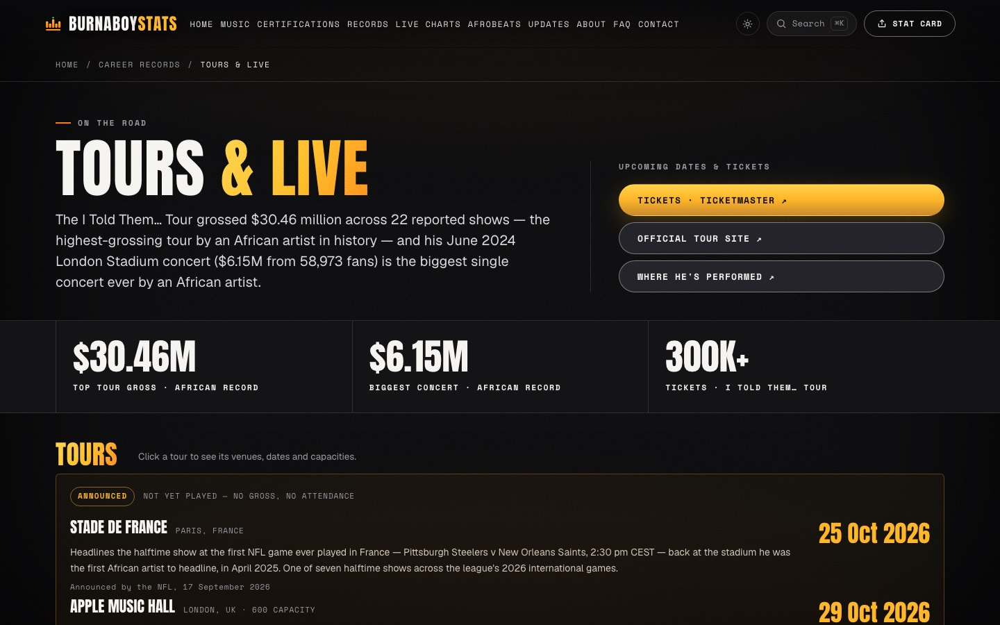

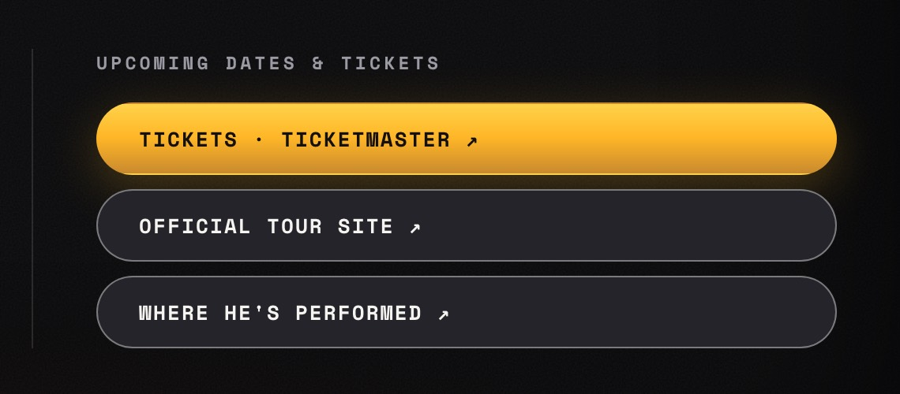

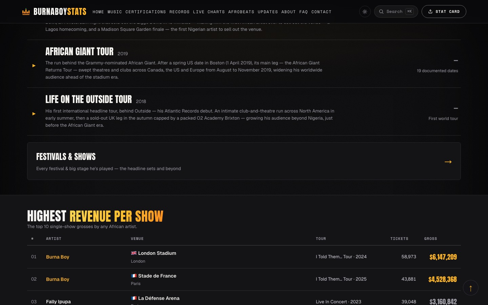

**Phone `/records/tours`:**

The page is **1,936px tall**. It has **zero links** to the map, the festivals page or the revenue page. The phone component never had them.

1. Back bar "Tours & live", gold badge "6 tours".
2. Hero: kicker "On the road", h1 "Tours & live", lede "Six tours, and live shows in 57 countries — and the highest-grossing tour by any African artist. Tap a tour for its dates."
3. A 2×2 stat grid: 6 Tours · $30.46M Top gross · **57 Countries** (7 regions) · 58,973 Biggest night.
4. The "Announced" card (3 shows).
5. Six expandable tour rows.
6. A footnote.
7. The fixed bar "Tickets · Ticketmaster ↗".

The "57 Countries" tile doesn't link to the map.

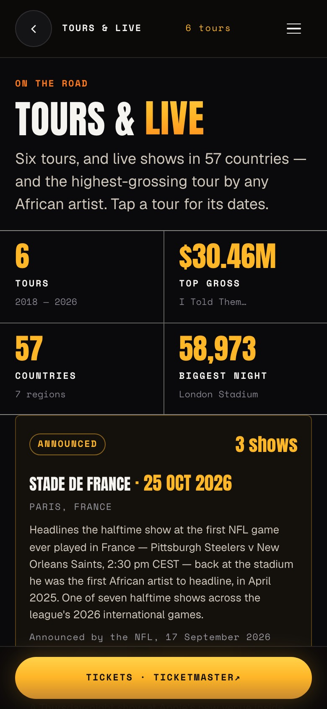

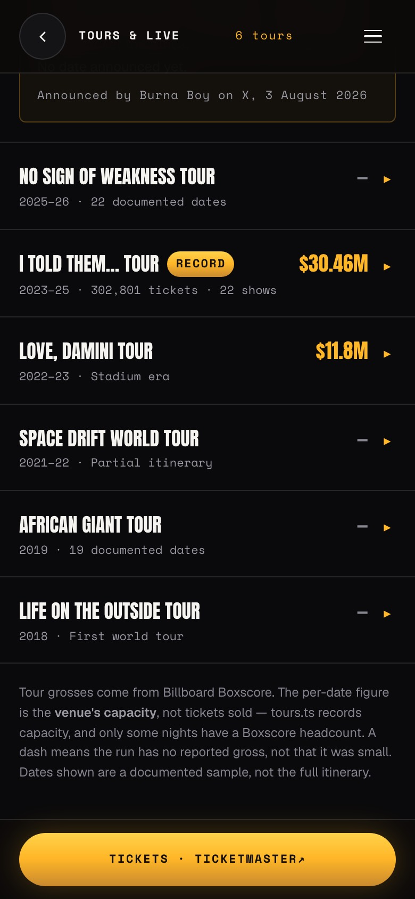

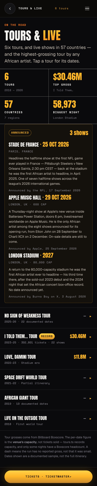

**`/records/tours/festivals`:** "59 appearances across three categories" (32 headlined · 14 solo concerts · 13 other). There is **no map link** in the body on either layout.

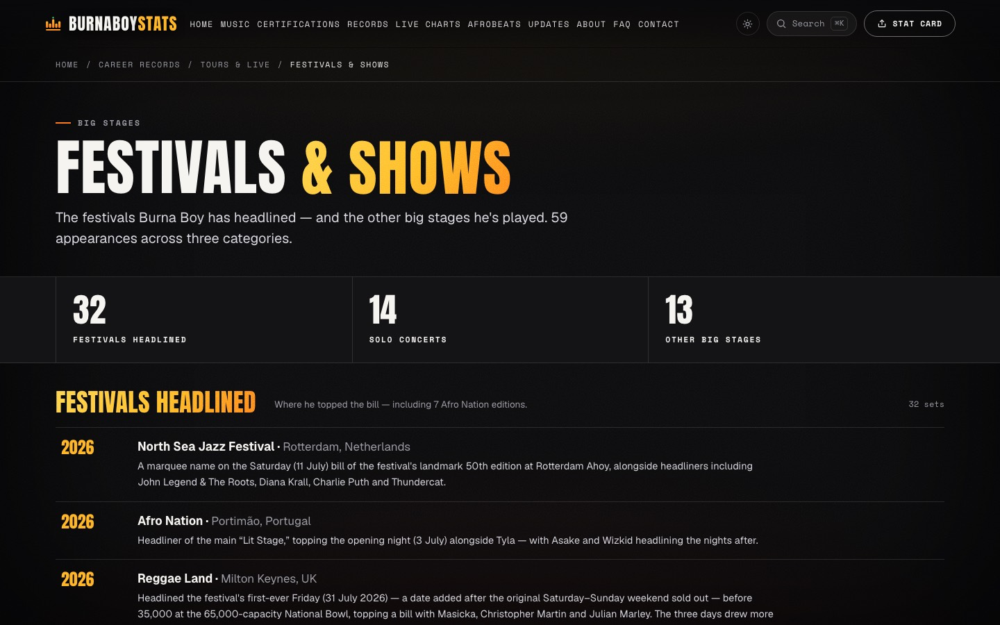

**Phone `/records/tours/festivals`** (Deep Pages screen 13, as built), from the top:
1. Back bar: back to `/records/tours`, the label **"FESTIVALS"**, a gold badge **"59"**, and the menu button.
2. Kicker **"Festival stages"**; h1 **"Festivals & shows"** ("shows" in gold).
3. Lede, verbatim and live: **"Fifty-nine documented appearances — 32 festivals headlined, including seven Afro Nation editions. Tap a section to open it."**
4. A 2 × 2 stat grid: **32** Headlined · **7** Afro Nation · **14** Solo shows · **59** Total.
5. Three sections that open and close, as designed for this screen: "Festivals headlined (32)", open on load; "Solo concerts (14)"; "Other appearances (13)". Opening one closes the others. Each row shows the year in mono, the name, and the place under it. These are existing, approved behaviour: leave them as they are (rule 2 is about new folds).
6. Footnote, verbatim: "From each festival's own line-up archive. tours.ts records no capacity field, so sections run newest-first rather than by size." (The file name in reader copy is a code fix, §10.)
7. **No bottom bar and no tab bar**, by design ("No bar. The screen is the full list."). The screen ends at the footnote with no onward link at all.

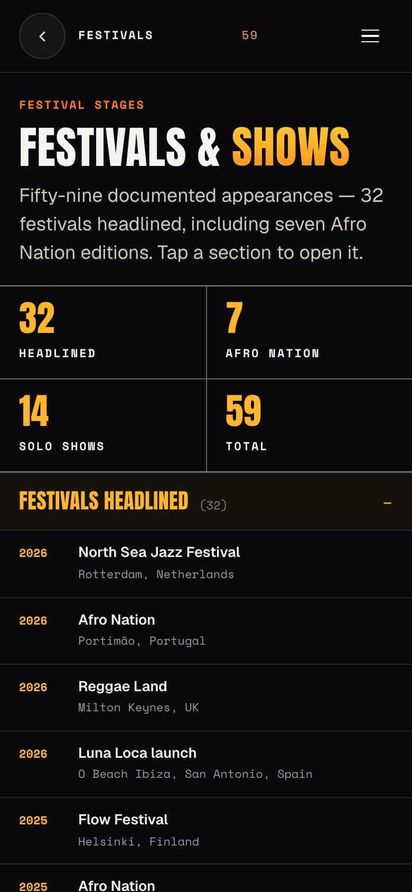

**Home map teaser** (one component on both layouts; the whole block is **one link** to the map):
- kicker "Live worldwide";
- title "Where he's / performed";
- lede "57 countries, seven regions — every stage he's taken.";
- a rotating globe;
- four cells, **19 Africa · 19 Europe · 10 Caribbean · 9 Rest**;
- foot "Oceania added Oct 2025" · "Open the map ↗" (in gold: an action).

Notes on the teaser:
- "Rest" hides four regions: North America 3, South America 3, Oceania 2, Asia 1.
- "Oct 2025" is **typed**.
- The desktop home artboard has **no** globe. The build reused the phone design (Mobile screen 01) on desktop.
- The review notes the globe stays bright yellow on a black sphere in light theme.

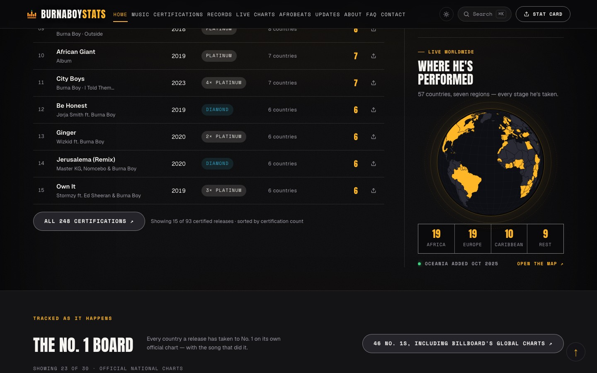

### 4.2 What to design

1. **Phone Tours: a "More from the road" group** (the missing links).
   - Three rows, **map first**, then revenue, then festivals.
   - They sit in the tour rows' list rhythm, but they are links, not expanders: each takes the link cue (the whole row is the link, it ends in →, and it presses to `--bg-raised`), **not** the tour rows' ▸ caret.
   - Each has a title and a sub-line. The sub-lines are in Geist (`--type-small`, muted), not mono, because they run to phrases and one to a sentence. Verbatim, with every figure a slot:

   | Row title | Sub-line, verbatim (today's values) |
   |---|---|
   | Where he's performed | "57 countries documented · 7 regions" |
   | Revenue per show | "His 26 of the 41 biggest reported single-show grosses by an African artist" (the board ranks every African artist, so "41 shows" alone overclaims) |
   | Festivals & shows | "59 documented appearances · 32 headlined" |

   - Place it where a reader finishing the tour list meets it. Your call.
   - The "57 Countries" tile **stays unlinked** in this job: §4.3 keeps the stat grid as it is, and this group is the route to the map. If you think the tile should link, list it as a separate change; don't draw it.
   - Draw both themes.
2. **Desktop Tours: a "Where he's performed" card beside "Festivals & shows".**
   - Two cards share the row, in the Festivals card's existing style (title, description line, →).
   - The new card: title **"Where he's performed"**; description **"The countries he has taken to the stage, on one map"**; sub-line slot **"57 countries documented · 7 regions"**.
   - The Festivals card keeps its title and its description line ("Every festival & big stage he's played — the headline sets and beyond") and gains a sub-line slot, **"59 documented appearances"**. Its "Every festival" is a completeness claim that §3.6 wouldn't allow on the map page; propose a rewording in the change list, or leave it and say so.
   - The tickets panel then drops its map button. That is a removal, so it goes on the change list.
   - Draw both themes and a 1024 check.
3. **Festivals: a "Where he's performed ↗" link near the top, on both layouts.**
   - It is a stand-alone link to another page, so it takes ↗ (§8.5).
   - On the phone it goes between the 2 × 2 grid and the first section (see [15a](shots/15a-festivals-phone-dark-top.jpg)), unless you find a better place in the top screen. The phone festivals screen has no bar by design, so the link lives in the page.
   - On desktop it goes in the hero or beside the count strip ([15](shots/15-festivals-desktop-dark-top.jpg)).
   - Optional: once festival rows carry a country (code), a row's place could link to `?country=`. Mark it optional.
4. **Home teaser (optional).** Either split "Rest" into its regions, all derived, or make each region cell open the map on that region.
   - The block is one link today, so separate cell links mean it can't stay one link. Show how.
   - "Oceania added Oct 2025" is typed and there is no "added" date in the data. Propose dropping it (change list).
   - The desktop teaser has no artboard; draw one if you touch it.
   - The globe's colour in light theme is out of scope unless you redraw the teaser.

### 4.3 What not to do

- Don't add the phone Tours page's other missing sections (the revenue top 10 and "Record nights"). The artboard had them and the build never did. They're a separate question: list them if you think they belong.
- Don't restyle the phone Tours stat grid, the Announced card or the tour rows in this job. That includes linking the "57 Countries" tile.
- No new fold. No typed counts.

### 4.4 Artboards this job updates

All **edited in place**; the file list is in §11. Excerpts are in [`artboards/`](artboards/README.md).
- `designs/desktop/Records - Tours.dc.html`: tickets panel lines 112–116, Festivals card lines 181–184 (excerpt lines 104–186).
- Deep Pages **12** ("Tours & live", lines 222–328). Its artboard already had a "Where he's performed ↗" pill under the lede. The build left it out.
- `designs/desktop/Records - Festivals.dc.html` and Deep Pages **13** (lines 329–375). Their counts are typed and stale (57 / 30 and "58"; the data holds 59 / 32). Where you touch them, make them slots.
- Teaser: `designs/mobile/Burna Boy Stats - Mobile.dc.html`, screen **01** (globe block at lines 190–222). There is **no desktop artboard**; if you draw one, it goes on the Job 2 canvas (§11).

---

## 5. Job 3: phone screens for `/curator`, `/press` and `/analysis/spotify-unmerge`

### 5.1 What exists today

None of the three has a phone design or a phone component. At 390 wide:

- the **desktop masthead** stays (69px: wordmark, theme, search, menu);
- a **breadcrumb bar** follows (45px): "HOME / ABOUT THE CURATOR", "HOME / PRESS & DATA KIT", "HOME / ANALYSIS / THE SPOTIFY CORRECTION";
- the **five-tab bar** shows (87px), and **no tab is lit**. In every shot the Home crown looks half-lit: it is drawn in its brand colours at opacity .55 whenever Home is not current, and is never recoloured (the logo rules forbid it). That is not a lit state. Recolouring it is the owner's call, not this brief's;
- the body is the desktop page in one column, and "Keep exploring" shows at the end.

Page heights: `/curator` **3,001px**, `/press` **4,236px**, `/analysis/spotify-unmerge` **5,767px**. None scrolls sideways.

**Their siblings open with the phone back bar:** `/about`, `/faq`, `/api`, `/analysis`, `/methodology`, `/embed`. The back bar is:
- sticky, on the scrim;
- a 44px round back button, a mono 11px label, an optional badge on the right, and the menu button.

A kicker, a split title and a lede follow. Prose siblings add a green-dot "Data last reviewed <date>" line. `/embed` got a phone screen with no artboard by following the API screen's pattern. That is the precedent here. On these back-bar screens the theme control is not on the bar: it is in the menu sheet the hamburger opens (the full three-way control, 44px segments). So dropping the masthead keeps rule 9: the theme control stays where every phone back-bar screen has it.

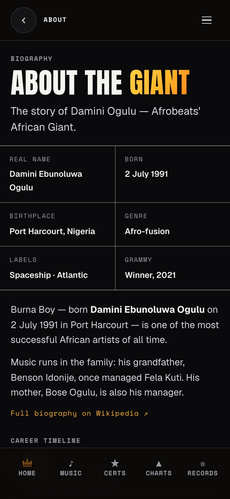

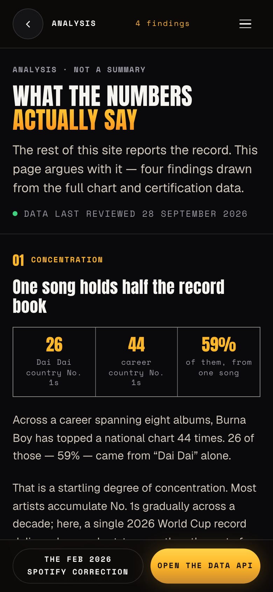

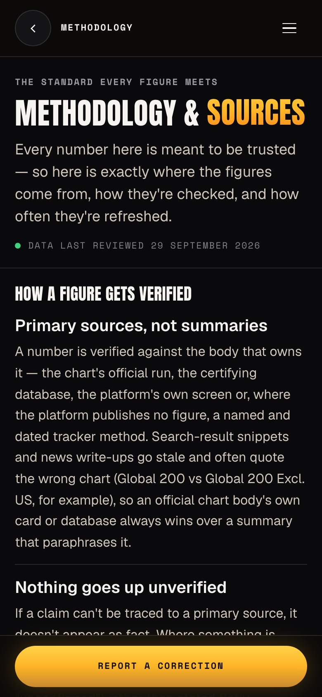

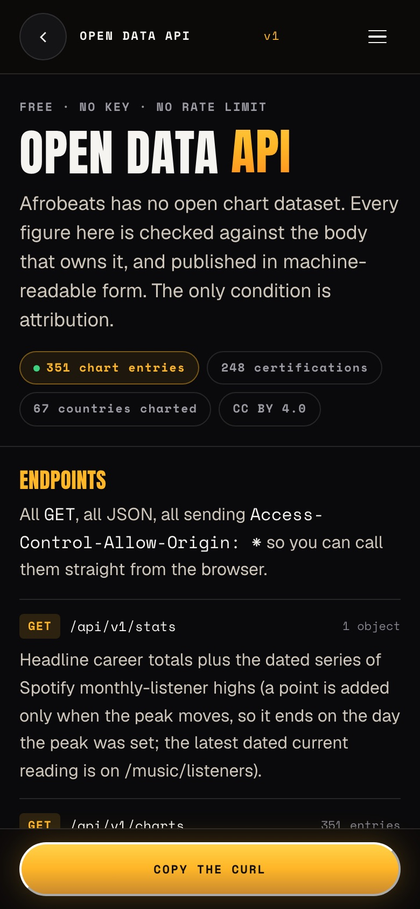

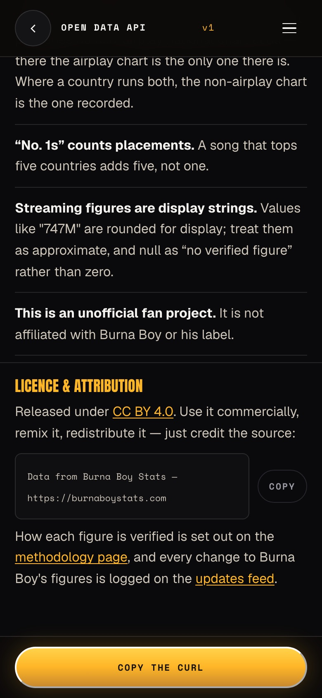

#### `/curator`, "About the Curator"

Content, in order:
1. Kicker "The person behind the numbers"; h1 "About the Curator" ("Curator" in gold ink).
2. Lede: "I'm **Ukpaka Emmanuel** — Paul, on X — and Burna Boy Stats is researched, verified and maintained by me, one figure at a time."
3. "Data last reviewed **28 September 2026**" (live).
4. Five text blocks, each an h2 and one paragraph: **Who I am** · **Why this site exists** · **How I work** · **Independence** · **Use the data**.
   - "Why this site exists" holds five live figures mid-sentence: "248 certifications across 26 countries, 351 official chart entries with 46 No. 1s, and 83 award wins".
   - "How I work" is one paragraph of about 150 words (17 lines on a phone). It sets out which source wins for each kind of figure: certification → the certifying body; chart peak → the chart owner; streaming → the platform's own screen; career total → kworb, anchored on a dated ChartMasters read.
5. **Reach me**: two paragraphs with no gap between them. They link his X handle, TikTok, the contact page, the press kit, the methodology and the GitHub repo.
6. Keep exploring: the default list (The Music · Certifications · Career Records).

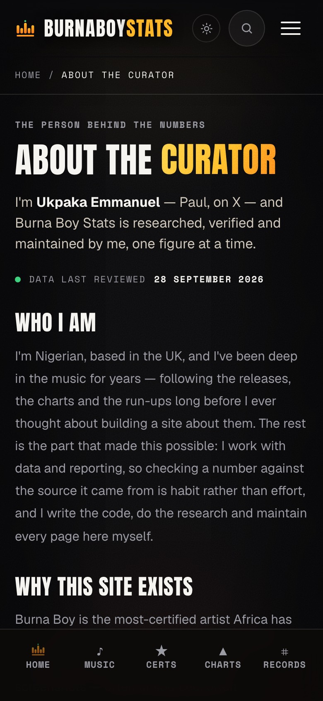

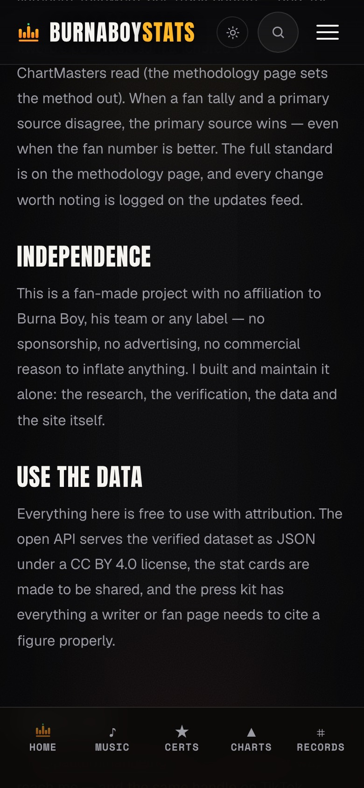

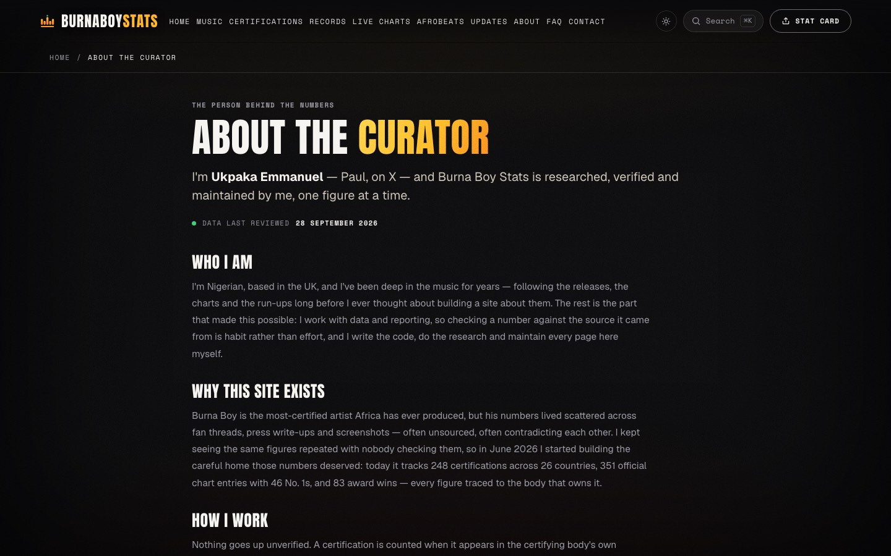

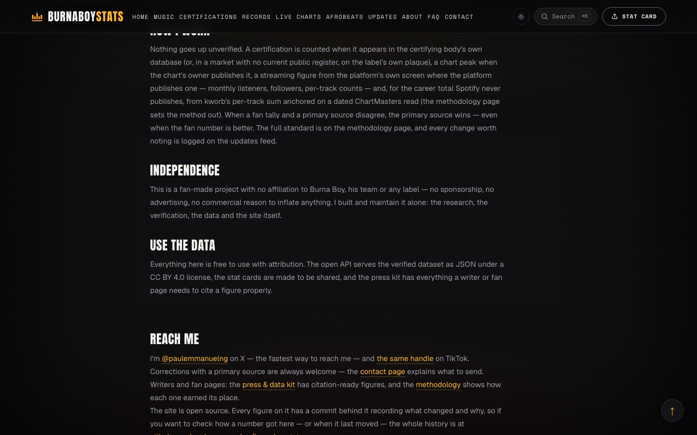

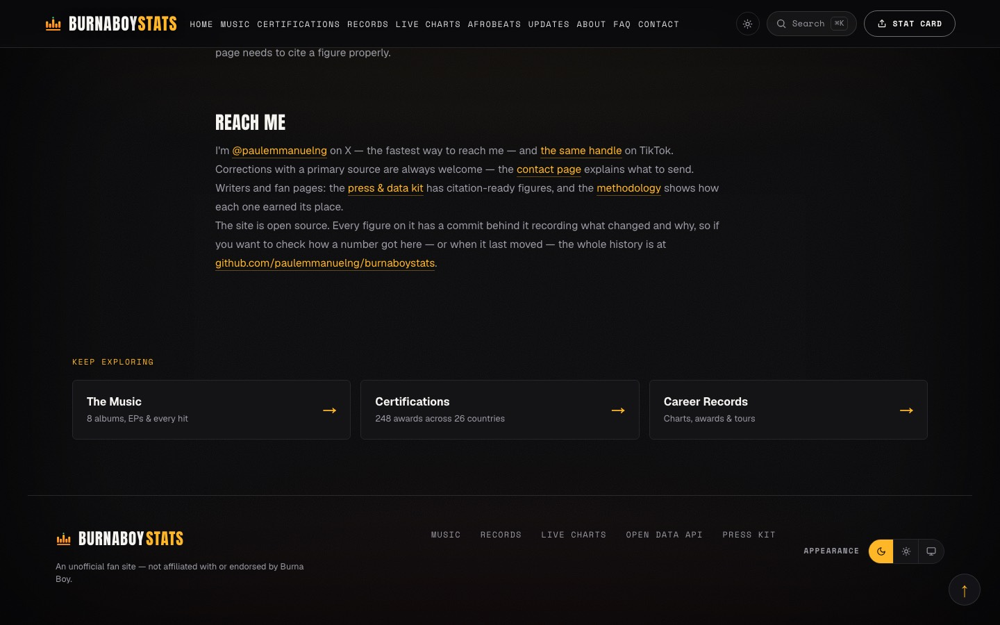

#### `/press`, "Press & Data Kit"

Content, in order:
1. Kicker "For journalists, bloggers & fan pages"; h1 "Press & Data Kit" ("Data Kit" in gold ink).
2. Lede: "Every figure on this site is verified against primary sources and free to use — all we ask is a credit with a link. This page has everything you need to cite, embed or build on the data."
3. "Data last reviewed 28 September 2026".
4. **The headline figures**: six live tiles, each a link with **no arrow**.

   | Value | Label | Sub | Links to |
   |---|---|---|---|
   | 248 | Certifications | 26 countries | /certifications |
   | 351 | Chart entries | 67 countries | /records/charts |
   | 46 | No. 1 placements | worldwide | /records/charts |
   | 83 | Award wins | 248 nominations | /records/awards |
   | 11.10B | Career streams | Spotify, all credits | /records/by-the-numbers |
   | 57 | Countries performed in | 7 regions | /records/tours/map |

5. **How to credit**: two code boxes, "Data: Burna Boy Stats (burnaboystats.com)" with **Copy**, and the HTML version with **Copy HTML**.
6. **The open API**: one paragraph.
7. **Download the data**: three rows, each a code-style box plus a **Download** button that looks like the Copy button:
   - "certifications.csv · 1,322 plaques"
   - "chart-peaks.csv · 2,143 chart entries"
   - "awards.csv · 248 nominations"

   Then "How to cite", with a copyable dated source line, and a long small-print note.
8. **Ready-made stat cards** and **Live stat boxes for your site**: one paragraph each. No card or box is shown.
9. **Why the numbers hold up**: one paragraph of links.
10. Keep exploring: the default list.

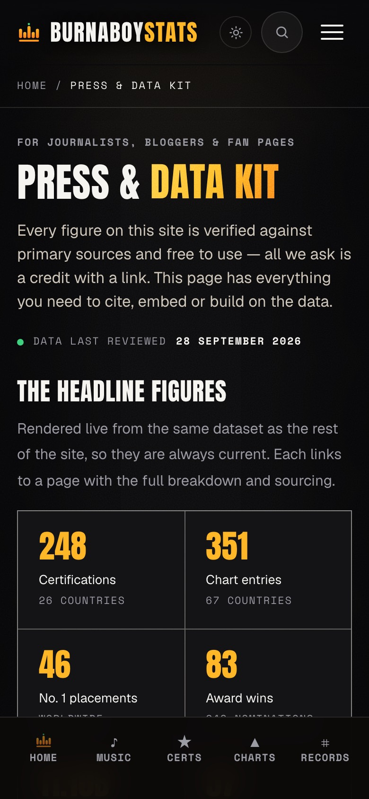

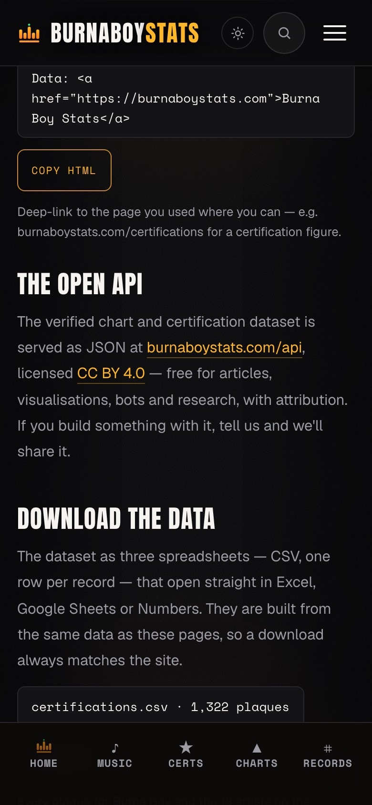

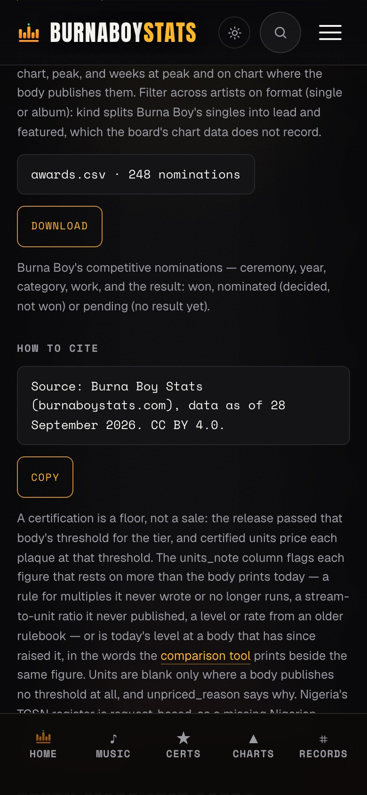

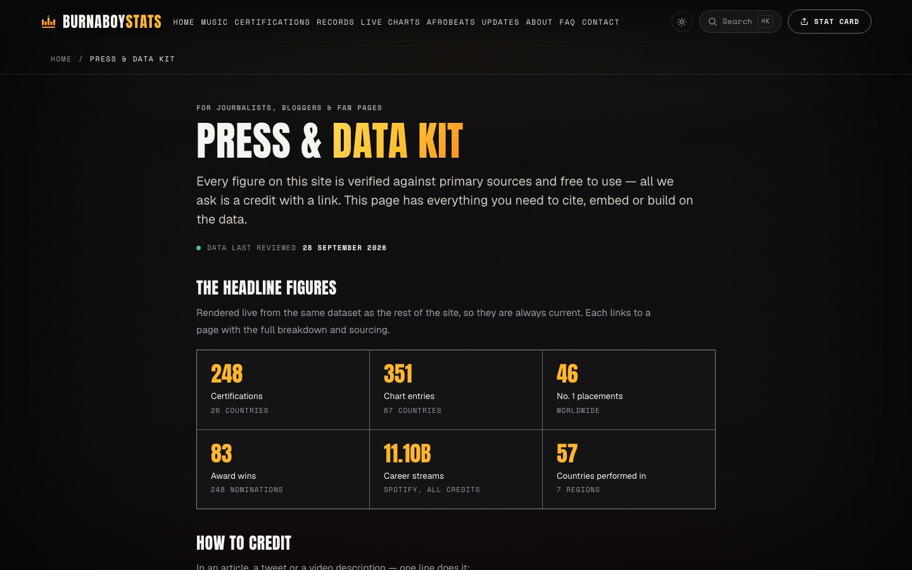

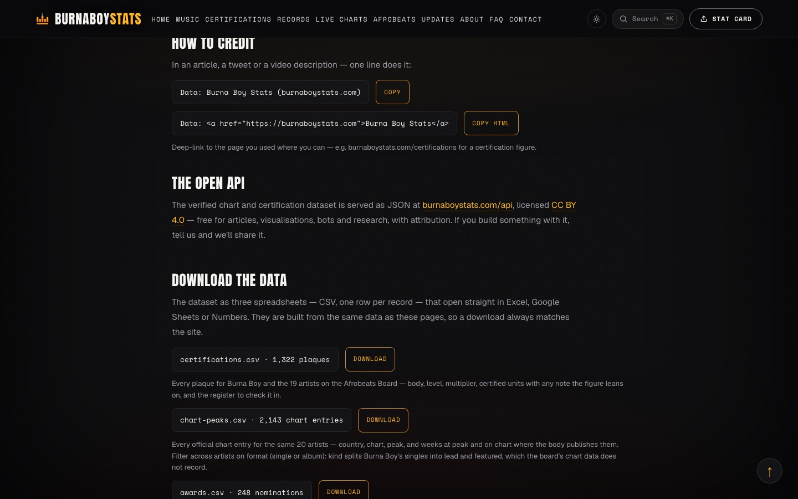

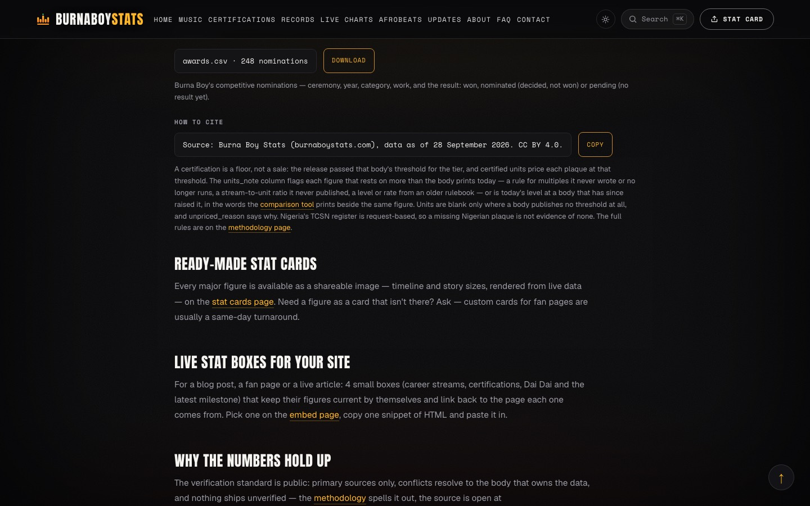

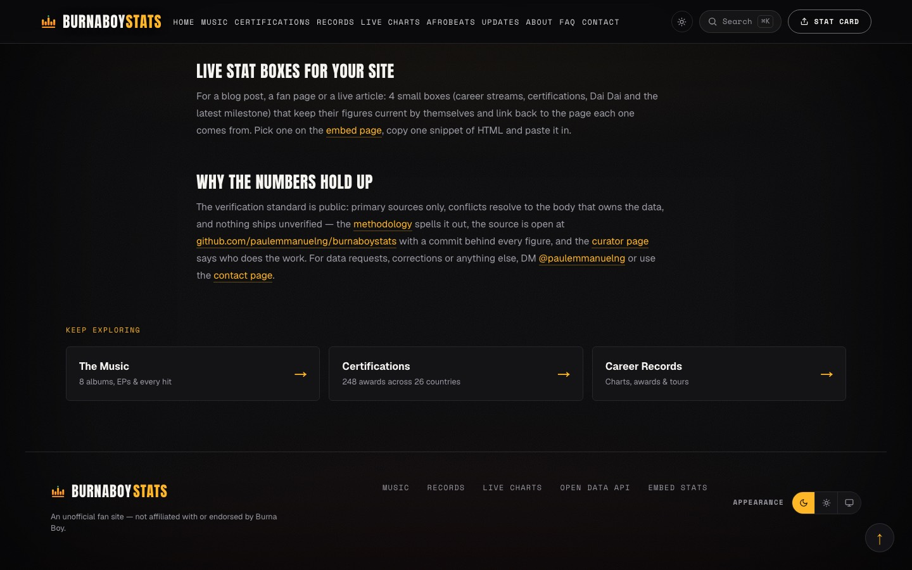

#### `/analysis/spotify-unmerge`, "The Spotify correction"

Content, in order:
1. Kicker "The February 2026 correction"; h1 "Did Burna Boy lose Spotify streams to bots?" ("to bots?" in gold ink).
2. The answer, the largest body text: "**No.** In February 2026 Spotify un-merged two remixes whose play counts had been wrongly combined with the original recordings, and about **309 million streams moved to those originals**. Nothing was deleted, and nothing was flagged as artificial — a reallocation and a purge look the same on a running total, and are not the same event."
3. The sub-line: "Verified against Spotify's own per-track counts on 17 September 2026…"
4. **What actually happened**: two paragraphs.
5. **The arithmetic**: the intro "These are fixed points, not live figures — which is why they are written down rather than derived." Then a nine-row ledger, label on the left, value in **gold mono** on the right. On the phone each row stacks.

   | Label | Value | Note |
   |---|---|---|
   | Career Spotify streams, 31 December 2025 | 9,508,991,024 | as his counter then read |
   | "Enjoy Yourself — Remix", before the correction | 232,346,699 | |
   | "Enjoy Yourself — Remix", after | 50,077,530 | moved to the original: 182,269,169 |
   | "Finders Keepers — Remix", before | 130,244,873 | |
   | "Finders Keepers — Remix", after | 3,075,692 | moved to the original: 127,169,181 |
   | Total reallocated to the original recordings | 309,438,350 | not deleted — moved |
   | His true 2025 closing total | 9,199,552,674 | 9,508,991,024 − 309,438,350 |
   | His counter on 12 February 2026 | 9,438,600,171 | |
   | Actual streams gained in 2026 by then | +239,047,497 | 9,438,600,171 − 9,199,552,674 |

6. **Where that leaves him today**: the page's **one live input**, the career total (11,103,140,399 on 29 Sep), and the figures derived from it: its rounded form (11.10B), the gain since the corrected 2025 close (1,903,587,725) and that gain in billions ("about 1.90 billion", then "1.90 billion" in the next paragraph). The paragraphs disappear if the value can't be read. The fifth FAQ answer repeats the total, its rounded form and the exact gain.
7. **How to check it yourself**.
8. **Common questions**: six h3 questions with their answers. They feed structured data (FAQPage and ClaimReview), so the answers stay in the HTML.
9. Keep exploring: Chart Analysis · By the Numbers · Methodology.

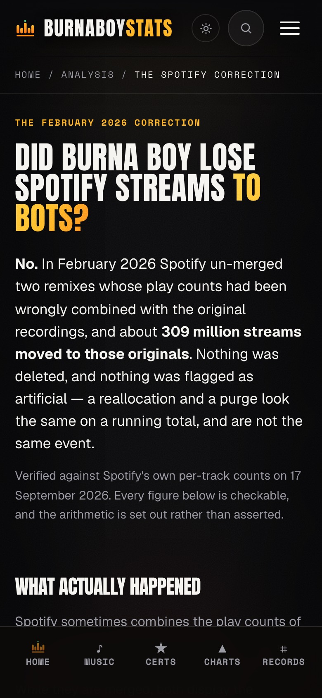

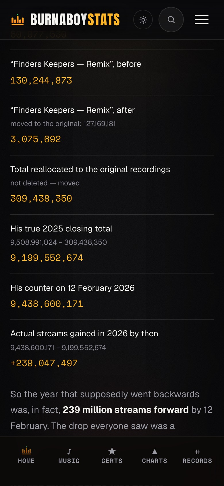

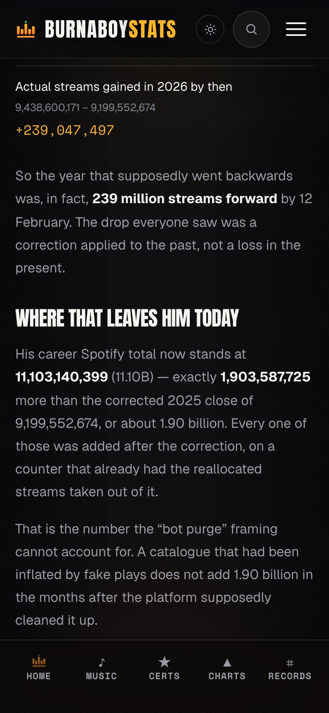

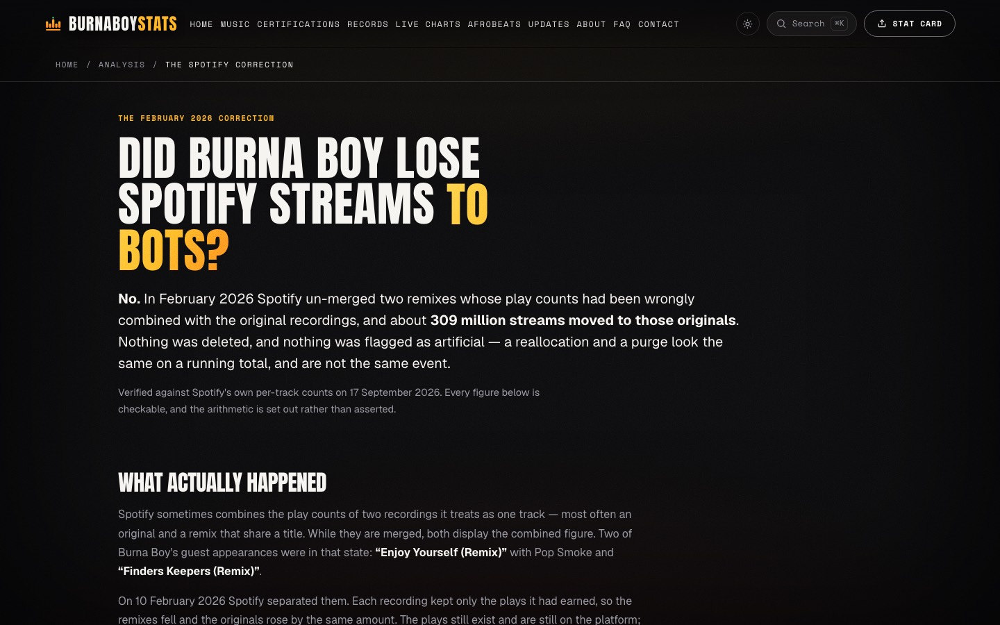

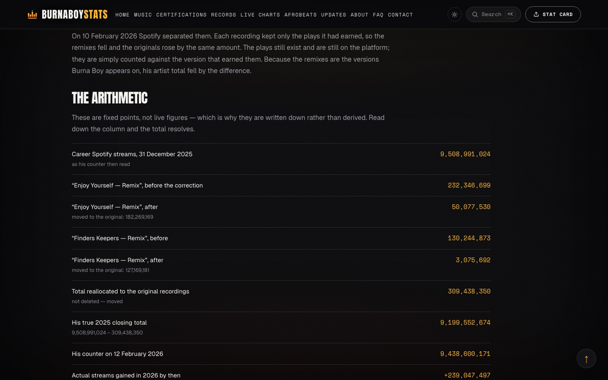

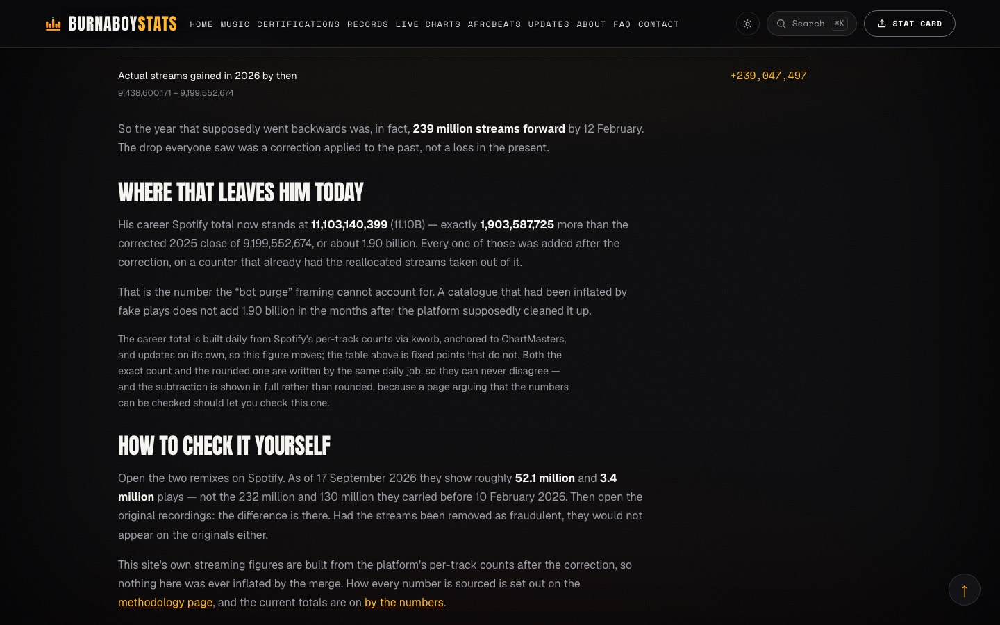

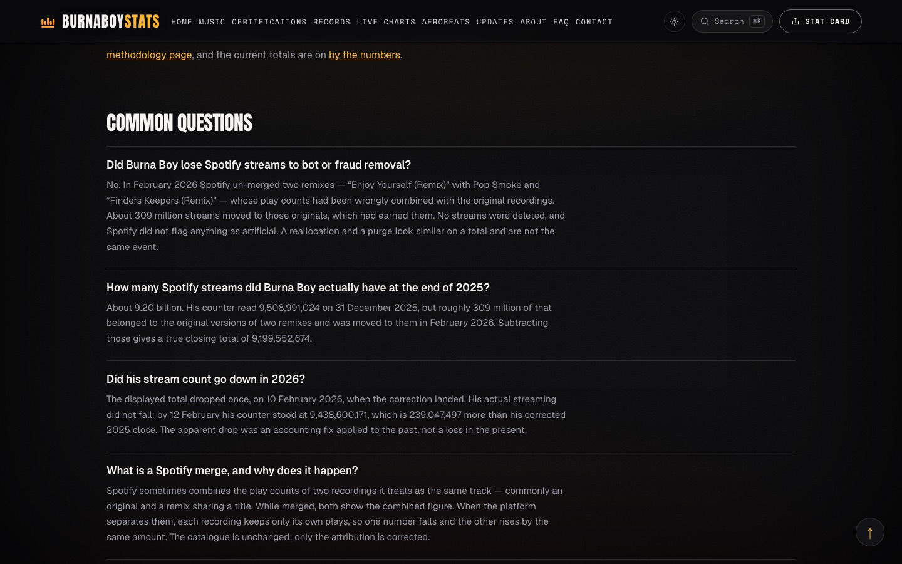

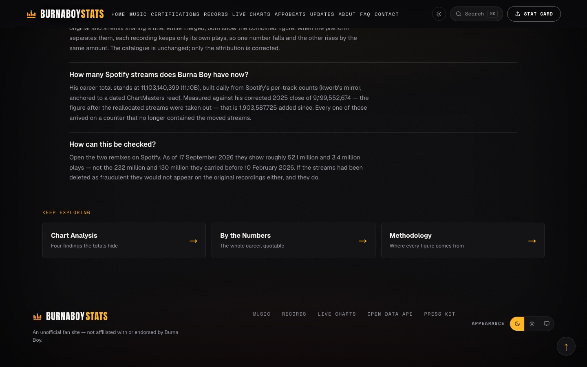

#### Every figure on the three pages

Four kinds, each drawn its own way:
- **Live slot:** read from site data. Dashed magenta slot. Its colour depends on how it moves:
  - a figure that **updates on its own** (the daily career total) is a *live figure*, gold where it is set as a figure (rule 3);
  - a figure that changes only when the data is edited (a count of plaques) is a *figure at rest*, in ink or muted. The Dai Dai strip shows the difference: five white figures beside one gold one ([20a](shots/20a-dai-dai-numbers-1024-dark.jpg)).
  - Inside a sentence, either kind stays in the sentence's ink.
- **Derived slot:** computed from a live figure. Dashed magenta slot, in ink, so that one figure per block carries the gold. If you gild one, say why.
- **Fixed literal:** a fixed point on purpose (a past date, a ledger value). Ink, **no slot**. Draw it exactly as given.
- **Typed, flag it:** written into the page by hand, and it can go stale. Ink, no slot, and it goes on the change list.

| Page | Figure (value on 29 Sep) | Kind | Source | Colour at rest |
|---|---|---|---|---|
| Curator | "Data last reviewed **28 September 2026**" | live slot | the newest date in the updates feed (it read 29 September on 30 Sep) | ink, with the green "live" dot |
| Curator | 248 certifications · 26 countries · 351 chart entries · 46 No. 1s · 83 award wins, mid-sentence in "Why this site exists" | live slots, at rest | certification, chart and awards data | ink, in the sentence or in a figure strip (the proposal in §5.2) |
| Curator | "in June 2026 I started building" | fixed literal | when the site began | ink |
| Press | "Data last reviewed 28 September 2026" | live slot | updates feed | ink, green dot |
| Press | the six tile values: 248 · 351 · 46 · 83 · 11.10B · 57 | live slots; only 11.10B updates on its own (daily) | as the tile table above | 11.10B gold; the other five ink (figures at rest). Each tile is a link, so its → cue is gold. All six are gold today: list the five moves |
| Press | tile subs: 26 countries · 67 countries · 248 nominations · 7 regions | derived slots | the same data | muted. "worldwide" and "Spotify, all credits" are plain text |
| Press | download counts: 1,322 plaques · 2,143 chart entries · 248 nominations | live slots | the download files' own counts | ink, inside the code-style boxes |
| Press | download descriptions: "the 19 artists on the Afrobeats Board", "the same 20 artists" | live slots | the board's artist list | muted |
| Press | "How to cite": "data as of 28 September 2026" | live slot | the dataset's date | ink, inside the box |
| Press | "4 small boxes (career streams, certifications, Dai Dai and the latest milestone)" | live slot (count and names) | the embed widget list | body ink |
| Correction | "Verified … on **17 September 2026**" and "roughly **52.1 million** and **3.4 million**" (the two remixes as read that day) | typed, flag it | written into the page with their date, on purpose: they move daily and are re-read together | ink. List them as typed figures the owner re-reads, not as slots |
| Correction | the nine ledger values and their notes (182,269,169 · 127,169,181 · the two subtractions) | fixed literals | the arithmetic | ink, in display numerals (§5.2) |
| Correction | "about **309 million**", "**239 million** streams forward", 10 February, 12 February, 31 December 2025, and the fixed figures in FAQ answers 1–4 and 6 | fixed literals | the arithmetic | ink |
| Correction | **11,103,140,399** | live slot | the daily career total | **gold**: the page's one live figure |
| Correction | (11.10B) | derived slot | the same total, rounded | ink |
| Correction | 1,903,587,725 | derived slot | the total − 9,199,552,674 | ink |
| Correction | "about 1.90 billion", "1.90 billion" | derived slots | the gain in billions | ink |
| Correction | FAQ answer 5: 11,103,140,399 (11.10B) and 1,903,587,725 | live and derived slots | as above | ink: an answer is prose, and it stays in the HTML word for word |

### 5.2 What to design

A **phone design for each page**, in both themes.

**Chrome and hero:**
- The back bar; the page opens straight into it, with no masthead and no breadcrumb.
- The theme control goes with the masthead from these three screens and is reached, as on every back-bar screen, through the menu sheet (§5.1). Rule 9 holds.
- Then kicker, h1 and lede in the sibling pattern. The h1's split word ("Curator", "Data Kit", "to bots?") is gold today; its colour is the open question under §9 rule 3 (ink by default, listed for the owner).
- The **five-tab bar stays**.

**Back bar details** (defaults from the siblings; change them if you have a reason):

| Page | Back goes to | Label | Badge (optional, from data only) | Nearest sibling artboard |
|---|---|---|---|---|
| `/curator` | `/` | "About the curator" | none, like About | Methodology, Deep Pages 22 (prose + "Data last reviewed"): shot [34](shots/34-methodology-phone-dark-top.jpg), excerpt [`artboards/deep-pages-22-methodology-lines-770-818.html`](artboards/deep-pages-22-methodology-lines-770-818.html) |
| `/press` | `/` | "Press & data kit" | optional, e.g. "6 figures" | Open data API, Deep Pages 23 (code boxes + Copy): shots [35](shots/35-api-phone-dark-top.jpg) and [35a](shots/35a-api-phone-dark-code-box.jpg), excerpt [`artboards/deep-pages-23-api-lines-819-883.html`](artboards/deep-pages-23-api-lines-819-883.html) |
| `/analysis/spotify-unmerge` | `/analysis` | "Spotify correction" | optional, e.g. "6 questions" | Analysis, Deep Pages 21: shot [28](shots/28-analysis-phone-dark.jpg), excerpt [`artboards/deep-pages-21-analysis-lines-716-769.html`](artboards/deep-pages-21-analysis-lines-716-769.html) |

**Content:** carry the desktop page's content, not its layout, dense, with no accordions. The review suggested these. Each is a content change, so it goes on the change list, and it would apply to desktop too:

- **Curator:**
  - The five mid-sentence figures as the site's figure strip, from data, as on `/press`.
  - "How I work" as four short rows: kind of figure → which source wins.
  - A gap between the two "Reach me" paragraphs.
- **Press:**
  - The six tiles get the site's link cue for a card that is itself the link: → at the tile's end and the `--bg-raised` press state (§8.5).
  - The downloads become a proper download list: filename and count, a one-line description, and a **↓ Download** in a fixed position, with the whole row as the link.
  - **The three copy boxes all stay**, with their contents verbatim. "One Copy button style" means one layout for box and button, not fewer boxes. The three Copy buttons and the three Download buttons already share one class; on the phone they don't line up, though: the HTML credit wraps to three lines ([22a](shots/22a-press-phone-dark-scrolled.jpg)) and each Download button stacks under its box ([22b](shots/22b-press-phone-dark-scrolled.jpg)). Give all six one phone layout, like the API screen's box and pill ([35a](shots/35a-api-phone-dark-code-box.jpg)). The boxes:
    - "Data: Burna Boy Stats (burnaboystats.com)", button "Copy";
    - `Data: <a href="https://burnaboystats.com">Burna Boy Stats</a>`, button "Copy HTML";
    - under "How to cite": "Source: Burna Boy Stats (burnaboystats.com), data as of 28 September 2026. CC BY 4.0." (the date is a live slot), button "Copy".

    Nothing is removed. If you do want to merge the two credit boxes, that removes "Copy HTML" and goes on the change list as a removal.
  - Optionally, one real stat card and one live box shown, each with its button.
- **Spotify correction:**
  - The ledger follows the gold rule. The nine values are fixed, so they go in **ink**, in display numerals; the **live career total** is the gold figure (the inventory above says which figure is which).
  - The kicker "The February 2026 correction" is gold text today; it is a label, so it goes to muted (change list).
  - Show − before subtractions and = before results, with a heavier rule above each result.
  - Group each remix's before and after rows.
  - On desktop, narrow the table so values sit near their labels.

**Keep exploring:** these pages show it on the phone only because they have no phone component. Decide whether it stays. If it goes, their onward links must live somewhere on the screen. The review suggests their own lists instead of the default one: curator → methodology, API, share; press → share, API, methodology. Its label, "KEEP EXPLORING", is gold text today (shots 24b, 25c, 26d). It is a label, so by rule 3 it goes to muted; but it is one shared component used site-wide, so list it as a site-wide gold → muted item for the owner rather than changing it only here. Its → arrows are actions and stay gold.

**Which tab is lit:** none today. Propose one for each page or none (a question for the owner). `/on-this-day` lights Records by a special case. The Home crown's half-lit look is not a lit state (§5.1); leave it.

**Copy buttons (press):** draw the rest, pressed and "Copied" states.

### 5.3 What not to do

- Don't bring the desktop masthead or breadcrumb onto the phone.
- Don't replace the five-tab bar with an action bar. The owner rule keeps the tabs on these three pages.
- Don't reword the correction's answer or its questions. They are quoted and they feed structured data.
- Don't type any figure. Figures that are fixed on purpose (the ledger) stay exactly as the data holds them.

### 5.4 Artboards

**None exist**, for either layout of any of the three. Nothing in the design bundle mentions `/curator` or `/press`, and `Analysis.dc.html` has no correction section. Phone artboards are required. Desktop artboards are optional: draw them only for the content changes you propose. They go on new canvases, and no existing file is edited (§11).

---

## 6. Job 4: the Dai Dai map inset and stat strip (desktop)

### 6.1 What exists today

**The Europe inset:**
- On desktop `/dai-dai` and `/dai-dai/es`, "The peak picture" world map has a **EUROPE** inset in its **bottom-left** corner.
- The inset is 31% of the map box's width, at an aspect of 1 : 0.86, 8px from the edges, with an opaque `--bg` fill and a 1px `--rule` border.
- It takes hover and taps like the world map.
- It comes straight from the approved artboard: `dai-dai-replay-map.html` places it at `x 8, y = H − ih − 8, width 31%`.
- The phone has no inset. There, the Europe crop **is** the map, with a Europe · World toggle. **The phone doesn't change.**

**What it hides** (the share of each country's area under the inset, with its Dai Dai peak):

| Country | Peak | Hidden at 1440 (inset 231 × 199px) | Hidden at 1024 (inset 274 × 236px) |
|---|---|---|---|
| Panama | **No. 1** | 0% | **100%** |
| Ecuador | **No. 1** | 21% | **100%** |
| Colombia | **No. 1** | 1% | **57%** |
| Costa Rica | 5 | 0% | 47% |
| Peru | 23 | **95%** | 68% |
| Chile | 14 | 35% | 0% |
| Bolivia | 25 | 26% | 0% |
| Brazil | 27 | 7% | 0% |

The review's wording ("hides Ecuador and part of Colombia") is right at 1024. At 1440 the loss is mostly Peru and a third of Chile. At 1024 the world is drawn height-limited (797 × 416px, with about 38px empty at each side), which is why the inset takes a bigger bite. Because the inset is a share of the box, and the box grows from 763 to 1101px across 901–1239, the loss moves around the band: at 1100 the inset (298 × 256px) covers Honduras, Costa Rica and Nicaragua whole, 68% of Panama and 51% of Ecuador (`research/tour-map-method/closeup-and-inset.txt`, part C).

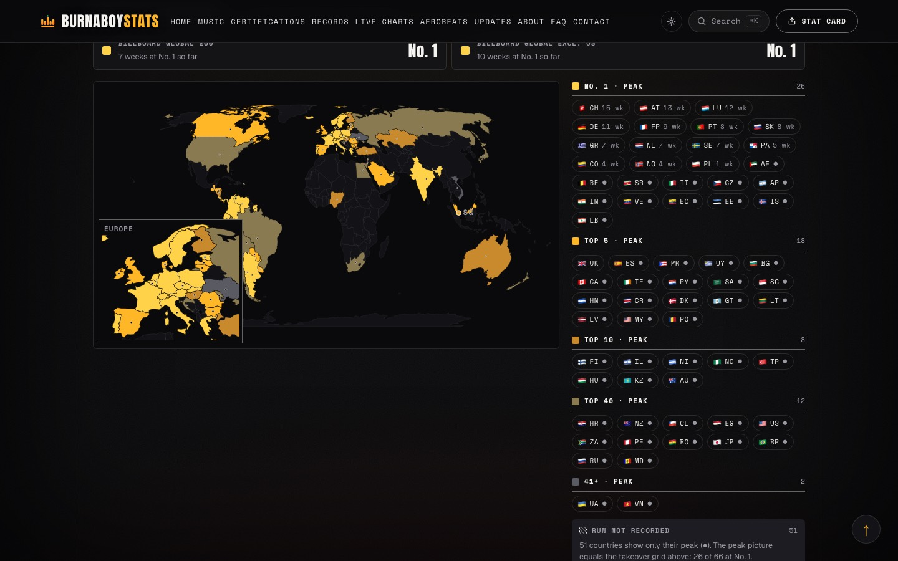

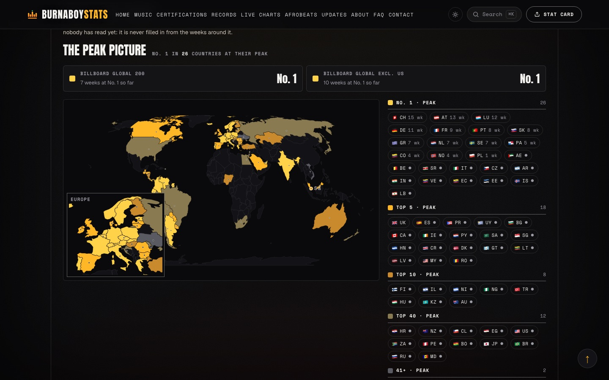

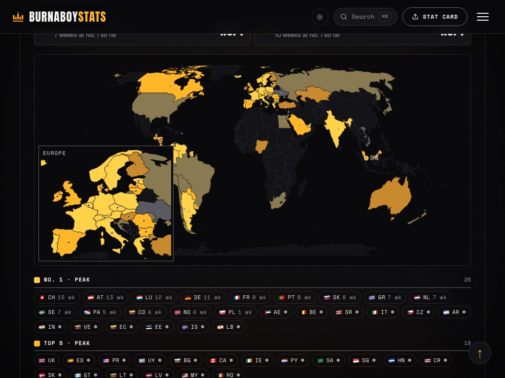

**The stat strip:**
- "Dai Dai by the numbers" has six hairline cells: 68 · 26 · No. 1 · 481M on 29 Sep (gold, live, "refreshed several times a day"; 483M a day later) · 17 · 19 Jul. All six are slots in the approved artboard.
- Each cell's padding is `22px 18px 20px 0`: **no left padding**. So in cells 2–6 at 1440, and in the 2nd and 3rd columns of the 3 × 2 grid from 901 to 1239px, the figure starts **0px** from its divider, and the cells read as one run-on line.
- This value is in the approved artboard too (`Dai Dai Redesign.dc.html`, the numbers section).
- `/es` is the same component. The phone rows are fine.

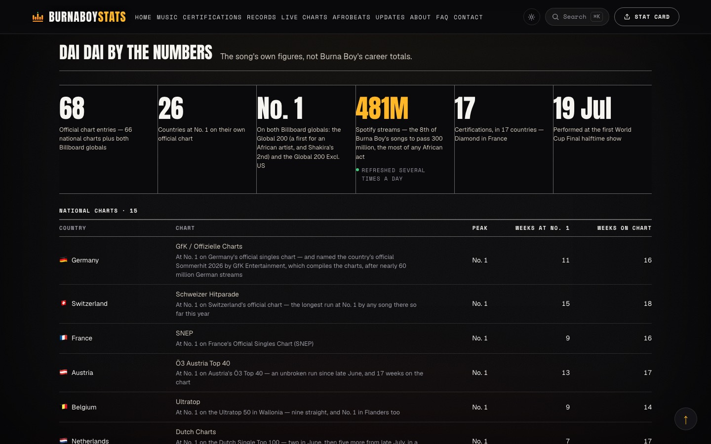

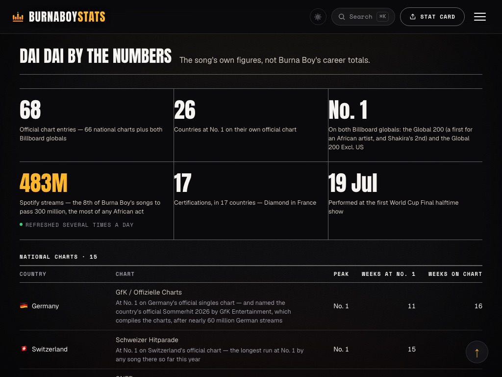

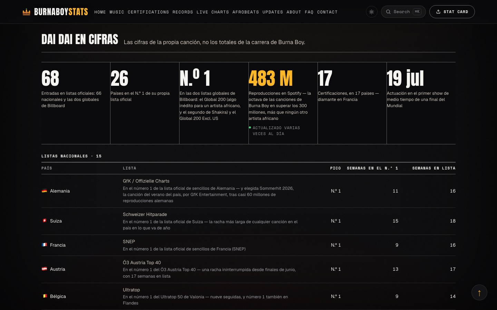

The `/es` captions, verbatim (the figures above them are the same slots; on 30 Sep they read 68 · 26 · N.º 1 · 483 M · 17 · 19 jul):
1. "Entradas en listas oficiales: 66 nacionales y las dos globales de Billboard"
2. "Países en el N.º 1 de su propia lista oficial"
3. "En las dos listas globales de Billboard: el Global 200 (algo inédito para un artista africano, y el segundo de Shakira) y el Global 200 Excl. US"
4. "Reproducciones en Spotify — la octava de las canciones de Burna Boy en superar los 300 millones, más que ningún otro artista africano", then the live mark "ACTUALIZADO VARIAS VECES AL DÍA"
5. "Certificaciones, en 17 países — diamante en Francia"
6. "Actuación en el primer show de medio tiempo de una final del Mundial"

The third caption is the longest in either language (144 characters, against 120 in English), so it sets the cell height.

### 6.2 What to design

1. **A new place for the inset.** The options, tested at both widths:

   | Option | Result |
   |---|---|
   | (a) Bottom-right, "open ocean east of Australia", about 200px wide (the review's first idea) | **Hides Australia and New Zealand** at 1440 and 1024 (both charted). There are only 38px of sea between New Zealand's east edge and the inset's 8px margin at 1440 |
   | (b) Out of the map box, beside or under the map (the review's second idea) | Hides nothing. Costs layout room, so show where it goes at 1440 and at 1024, where the ranking already drops under the map |
   | (c) **Today's corner, smaller: a fixed 200 × 172px** | **Hides no charted country** at any of nine widths tested from 901 to 1440 (901, 1000, 1024, 1100, 1180, 1239, 1240, 1280, 1440). Europe draws a little smaller: 2.2× the world scale at 1440 (2.05–2.3× across the widths), against 2.6× today at 1440 and 2.9× at 1024 |
   | Top-right, today's size | Hides India (No. 1), Japan and Vietnam, and most of Malaysia |

   Recommend one. **The owner confirms.** Draw it at 1440 and 1024, in both themes. Keep everything else about the inset: its label, its border and the way it takes hover.
   - If you recommend (c), specify it as a **fixed 200 × 172px at every width from 901 up, not a percentage.** A percentage grows with the box through 901–1239 and brings Central America back under it. The arithmetic, and the Europe scale at each width, is in `research/tour-map-method/closeup-and-inset.txt`, part C.
2. **Stat-strip padding:** **24px** on each side of every cell (a value on the spacing scale), except the left side of the first cell in each row, which sits on the column edge and keeps 0. Draw it at 1440 (6 across, [20](shots/20-dai-dai-numbers-desktop-dark.jpg)) and at 1024 (3 × 2, [20a](shots/20a-dai-dai-numbers-1024-dark.jpg)), and check `/es` at 1440 with the Spanish captions above ([20b](shots/20b-dai-dai-es-numbers-desktop-dark.jpg)).

### 6.3 What not to do

The Dai Dai design is approved. **Nothing else changes.** The review also raised these, and they are **not** in this brief:
- the replay controls sitting about 370px below the map;
- the phone World view being a thin strip in a tall frame;
- the week-slider labels breaking mid-phrase;
- the missing bottom padding under the phone hero.

Don't touch them.

### 6.4 Artboards this job updates

All **edited in place**, and nothing else in them changes (§11). Full copies are in [`artboards/`](artboards/README.md).
- `designs/desktop/dai-dai-replay-map.html` (the inset's geometry: `iw = Math.round(W * 0.31)` and the lines after it, lines 72–80) and `designs/desktop/Dai Dai Replay Module.dc.html` (the map module that frames it; the inset is switched by its `inset` parameter, line 76).
- `designs/desktop/Dai Dai Redesign.dc.html` (the numbers section's cell padding, `padding:22px 18px 20px 0` at line 126).
- `designs/desktop/Dai Dai Replay States.dc.html` also shows the map with the inset (line 49, `inset=1`). It reads `dai-dai-replay-map.html`, so it follows the change; check it.

---

## 7. Job 5 (optional): keeping your place on long pages

**Do this job only if the first four are done.** Mark every artboard in it **OPTIONAL**. The rule for all of it: **every list stays fully open.** The fix is to make the controls these pages already have stay with the reader, not to fold anything.

**Tag colours are out of scope here.** The filter band and the rows carry gold at rest: the Certifications category pill and its dot on `/updates` ([30a](shots/30a-updates-desktop-dark-filter-bar.jpg)), and the ALBUM and LIVE tags on `/timeline` ([32a](shots/32a-timeline-desktop-dark-scrolled.jpg)). Rule 3 would move them to ink, but they are category colours shared across the site, not this job's controls. Draw them as they are, and list them in the response as a site-wide gold question for the owner. The LIVE → "Show" rename is a code fix (§7.2).

### 7.1 `/updates`

**Today:**
- **326 entries**: September 87, August 99, July 140. Categories: Charts 124 · Streaming 105 · Certifications 47 · Firsts & Records 18 · Awards 15 · Tours 12 · Lifestyle 5.
- **Desktop** (about 29,000px, the review's figure, not re-measured):
  - The filter band (FILTER · All 326 · Charts 124 · … · 326 entries) scrolls away with the page.
  - Every row repeats the full "24 September 2026" under a "SEPTEMBER 2026" heading.
- **Phone** (list 51,756px, page **52,319px**):
  - The filter chips scroll sideways and then scroll away.
  - There are **no month headings**, and dates read "28 Sept", with **no year**.
  - There is no back-to-top and no end marker on the screen.
  - No tab is lit.
- The phone artboard (Mobile 06) drew dates **with** the year.

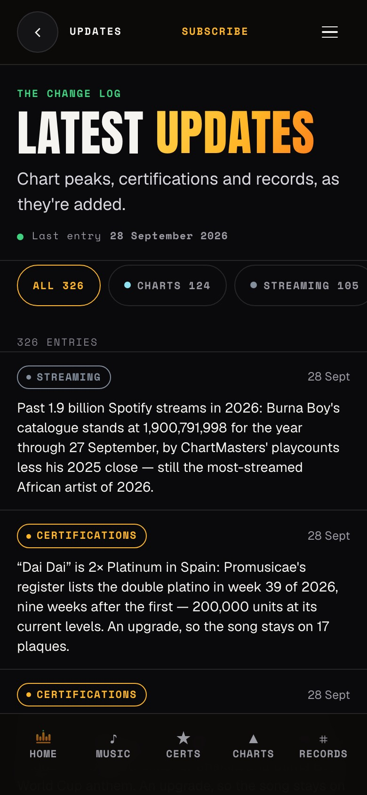

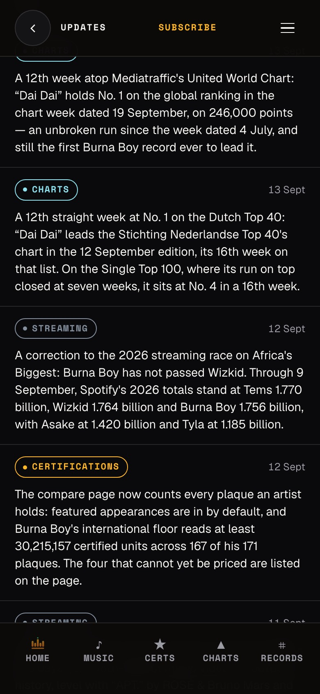

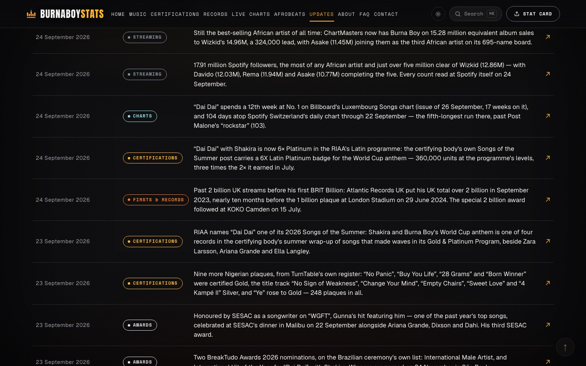

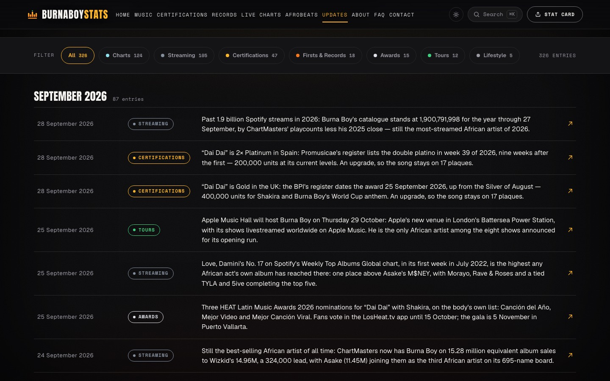

**Design:**
- **Desktop:** the filter band stays under the masthead as you scroll (it is one row). Rows drop to "28 Sep" under their month heading.
- **Phone:**
  - A small month row stays under the back bar, for example "AUGUST 2026 · 99 entries", with the count from data.
  - Dates carry the year.
  - A back-to-top control sits above the tab bar.
  - An end marker closes the list.
- Draw both themes.

### 7.2 `/timeline`

**Today:**
- One responsive page, with **no artboard** for either layout.
- 29 dated milestones in 6 eras.
- Era chips (2010 – 2015 · 2017 – 2019 · 2020 – 2021 · 2022 – 2024 · 2025 · 2026) appear only at the top.
- On the phone the chips wrap to **three rows**, with "2026" alone on the last. The page is **8,400px** tall. The back button is 34px, against 44px on the siblings.
- On desktop the page is about 6,400px (the review's figure).

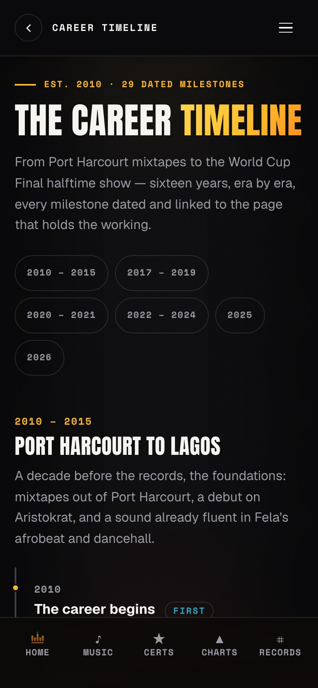

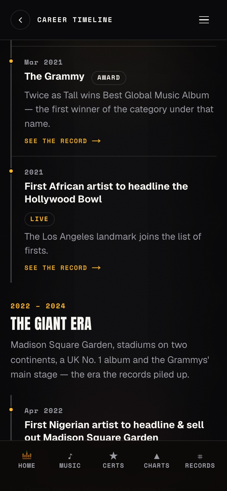

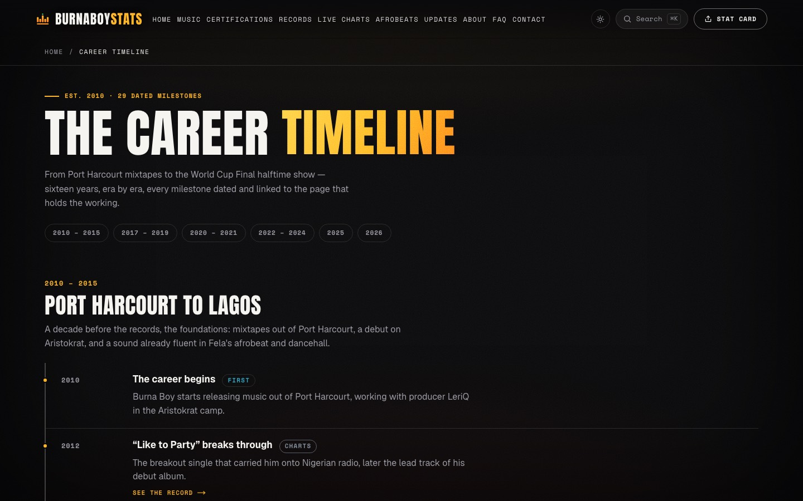

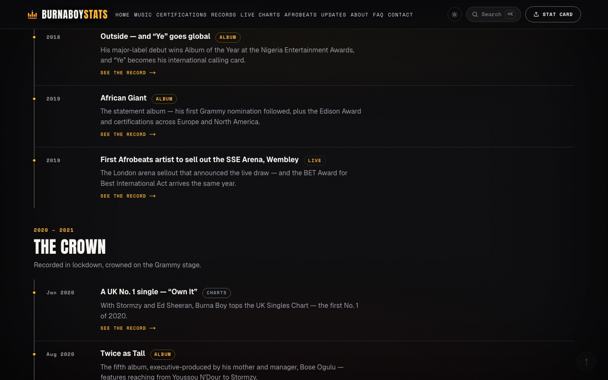

**Design:**
- The era chips on **one row** that stays with the reader: a side-scrolling row on the phone, sticky under the bar on both layouts.
- The current era shows as current.
- Optional: a 44px back button and a count badge from data ("29 milestones").
- **Leave the "LIVE" tag alone.** The rename to "Show", in neutral ink, is a code fix (top priority 11).

### 7.3 `/faq` (phone)

**Today:**
- 22 questions in 6 groups.
- The category row ("BURNA BOY, THE ARTIST 5 · THE WORLD CUP 3 · …") scrolls sideways (1,152px wide in a 390px screen), shows no current chip, and exists only at the top of a **6,287px** page.
- The back-bar badge "22 questions" is plain text, not a control. The review says it "does nothing"; this pass did not re-test it.
- The phone artboard (Mobile 08) used short chip labels ("Who he is 5 · World Cup 3 · Awards 3 · Music 4 · Live 4 · Cars 3"), most of which fit on screen.

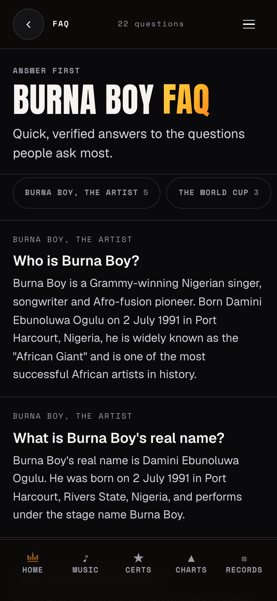

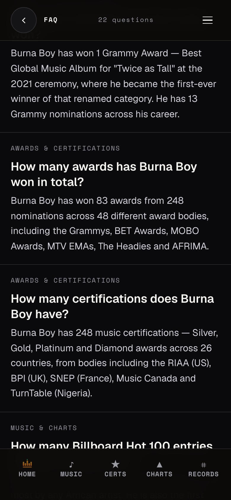

**Design:**
- The category row stays under the back bar, with the current group shown, using the artboard's short labels.
- Decide what the badge is: text or a control. If it becomes a control, say what it does.
- The answers stay open and in the HTML: they feed structured data.

### 7.4 Artboards

All optional; the file list is in §11. Excerpts are in [`artboards/`](artboards/README.md).
- `/updates`: `designs/desktop/Updates.dc.html` (filter lines 128–135, month groups 144–154) and Mobile **06** (lines 567–633), **edited in place**.
- `/faq`: `designs/desktop/FAQ.dc.html` (the category row, lines 105–115) and Mobile **08** (lines 695–744), **edited in place**.
- `/timeline`: **none** exists. Draw it on a new canvas, `designs/desktop/Timeline.dc.html`, desktop and phone.

---

## 8. Design system: extend it, don't replace it

- Don't invent a new visual language.
- Design every screen in **both themes**: dark is the default, and light ("paper") is a full theme.
- **Draw desktop and phone as separate designs.** A detail added to one must be drawn for the other.
- The full, cited token file is [`research/design-system.md`](research/design-system.md). What matters for this brief follows.

### 8.1 Type

- **Anton 400**, uppercase: display, headings, figures, region names, the card's country name.
- **Geist:** prose, table cells, card events, the map hint.
- **Space Mono 400/700, labels only:** kickers, buttons, chips, table heads, legends, badges. **Never a sentence.**
- **Floor 11px** everywhere, map labels and captions included. Figures use tabular numerals.

| Token | Size / line height |
|---|---|
| `--type-lede` | 18px / 1.5 (20px at ≥900) |
| `--type-body` | 16px / 1.6 |
| `--type-small` | 13.5px / 1.5 |
| `--type-caption` | 12.5px / 1.45 |
| `--type-label` | 11px / 1.2, 0.11em, Space Mono 700 uppercase |
| `--type-h-prose` | 20px / 1.3 |
| `--measure` | 62ch |

Tour-map display sizes today: h1 78px (57px at ≤1239, 40px on the phone); count figure 58px (44px at ≤1239); "By region" h2 34px; region name 17px.

### 8.2 Colour (light | dark)

**Surfaces and lines:**

| Token | Light | Dark | Role |
|---|---|---|---|
| `--bg` | `#f7f4ee` | `#0a0a0b` | Page |
| `--bg-soft` | `#ffffff` | `#141416` | Card or panel. **The map's sea** |
| `--bg-soft-2` | `#efeae1` | `#1c1c21` | Well. **Countries not played** |
| `--bg-raised` | `#e6e0d4` | `#24242a` | **Hover** (presses in on paper) |
| `--btn-face` | `#ffffff` | `#24242a` | Secondary button |
| `--scrim` | `rgba(247,244,238,.94)` | `rgba(12,10,9,.94)` | Fixed bars, 14px blur |
| `--line` | `rgba(23,20,15,.12)` | `rgba(245,244,240,.12)` | Decorative hairline (1.31:1) |
| `--rule-soft` | alpha .30 | alpha .24 | Secondary structure (1.97:1) |
| `--rule` | `rgba(23,20,15,.48)` | `rgba(245,244,240,.38)` | Structural line (3.30:1) |
| `--btn-edge` | `rgba(23,20,15,.55)` | `rgba(245,244,240,.42)` | Control outline (≥3:1) |
| `--scrim-base` | `#0c0a09` in **both** themes | | Today's map borders (fixed, doesn't theme) |

**Text:**

| Token | Light | Dark | Role |
|---|---|---|---|
| `--text` | `#17140f` | `#f5f4f0` | Ink |
| `--text-body` | `#4a443b` | `#cfc7bb` | Reading text |
| `--text-muted` | `#5f584f` | `#9b9ba3` | Secondary, kickers |
| `--dim` | `#6f685f` | `#85858e` | Smallest meta |

**Gold and signatures:**

| Token | Light | Dark | Role |
|---|---|---|---|
| `--gold` / `--gold-fill` | `#945e00` | `#ffb627` | Gold ink and fills |
| `--gold-bright` | `#945e00` | `#ffd24a` | Top of the ramp |
| `--gold-dim` | `#945e00` | `#c98a2e` | Bottom of the ramp, hover border |
| `--gold-hit` | `#5f3c00` | `#ffd24a` | **Map hover and active fill** |
| `--gold-wash-base` × `--wash-strength` | `#945e00` × 0.42 | `#ffb627` × 1 | Washes. The map fill ignores the strength today (42% in both themes) |
| `--ink-on-gold` | `#ffffff` | `#14100a` | Label on gold |
| `--ember` | `#b34700` | `#ff7a1a` | Records-family signature. It belongs on the kicker's **tick**, not its text |
| `--green` / `--green-dot` | `#146b3c` / `#1f9a5a` | `#3ed17f` | Live and verified ("Data last reviewed") |

**Colour rules:**
- **The gold fill:** `linear-gradient(180deg, --gold-bright 0%, --gold-fill 48%, --gold-dim 100%)`. On paper it is flat `#945e00` with a white label.
- **Gold text on paper** fails AA on `--bg-raised` (4.14:1). Never put gold text on a light hover surface.
- **Dark-only effects** (glows, vignette, grain) vanish on paper. No glows on this page's hover (rule 5).
- **Peak bands and tier colours are data colours**, never the brand gold. The Dai Dai map uses the peak-band ramp; don't recolour it.
- **A new colour must be a light/dark token pair in the global stylesheet, with a reason.** A test fails any colour literal in a page's styles. A likely candidate here: a map token pair for "played" and for "country border", since today's fill has no light value and today's border doesn't theme.

### 8.3 Shape, spacing, motion

- **Radius:** 6px for cards, 4px for the map zoom buttons, 999px for pills and chips.
  - Off-scale today: the phone map card is 8px and the desktop map frame is square.
- **Shadow:** dark `0 20px 50px rgba(0,0,0,.45)`; light `0 12px 32px rgba(23,20,15,.14)`.
- **Spacing scale:** 4 · 8 · 12 · 16 · 24 · 32 · 48 · 64 · 96 · 128. Please design on it.
- **Motion:** 0.15s / 0.2s / 0.3s, with `cubic-bezier(0.22,1,0.36,1)`. Reduced motion settles to the final state, and view changes are instant.
- **Layout:**
  - The tour map column is 1240px with 40px gutters; at 1440 its content starts at x 140 and the breadcrumb at x 80.
  - The phone gutter is 18px.
- **Breakpoints:**
  - phone ≤900;
  - the "1024 band" 901–1239 (menu button instead of the inline nav, display type steps down);
  - desktop ≥1240.

### 8.4 Phone chrome (don't redraw; place around it)

| Bar | Height | Notes |
|---|---|---|
| Back bar | 69px + safe area | Sticky. 44px back circle, mono 700 11px label, optional badge, 44px menu |
| Five-tab bar | 87px minimum | Fixed. Home, Music, Certs, Charts, Records; the current tab turns gold. The Home crown keeps its brand colours at opacity .55 when Home isn't current, which reads as half-lit but isn't a lit state (the owner's call) |
| Action bar | 75px + safe area | Fixed. One 50px gold pill, optionally a 50px round icon button |
| Masthead (desktop, and the three Job 3 pages today) | 69px | Sticky |

The z-order, low to high: back bar · map zoom buttons · action bar · masthead = **today's map card** · tab bar · menu sheet · skip link. The card and the masthead share a level, which is why the card paints over the nav.

**The theme control on the phone.** Screens with a back bar have no masthead, so their theme control is in the menu sheet the hamburger opens: the full three-way control, 44px segments, on-state `--gold-fill`. The three Job 3 screens join that pattern, which keeps rule 9.

### 8.5 Controls and states

- **Buttons:** 46px tall, 26px side padding, pill, Space Mono 700 13px at 0.08em uppercase.
  - **Primary:** the gold fill. One per screen.
  - **Secondary:** `--btn-face` with a 1px `--btn-edge`.
  - **Icon button:** 36px, 44px on touch.
  - **The link rule** (the site's own, written in `globals.css`; this brief follows it everywhere):
    - filled = the one primary action in a section; outlined = its secondary;
    - **↗ = a stand-alone link or button to another page.** The rule's own words are "navigation to a sibling page": "Festivals & shows ↗", "Open the map ↗", "Full leaderboard ↗". The few links that leave the site carry ↗ too (Ticketmaster, Wikipedia) and name the destination in their label ("Tickets · Ticketmaster ↗"); that label, not a different arrow, is what tells them apart. This brief adds no new arrow;
    - **→ = a card or full-width row that is itself the link:** the "Festivals & shows" jump card, Keep exploring, the country card's and panel's link rows, the new "More from the road" rows, the new "Where he's performed" card and the press tiles;
    - no arrow = utility (Copy, Download, Close). Prose links are underlined.
- **Phone filter chip:** 44px, pill, mono 700 11px. On-state: a gold wash with a gold border and label.
- **Dai Dai map toggle** ("Europe | World"): 44px, `--btn-edge` outline, mono 700 11px, muted. On-state: an **ink fill with a `--bg` label**.
- **Map zoom buttons:** 34px (44px on touch), `--bg-soft`, 1px `--line`, 4px radius, top-right inside the map.
- **Focus:**
  - Global ring: 2px solid `--gold` at a 2px offset.
  - Full-bleed rows: an inset 2px `--gold` ring.
  - Map shapes today: none (fill only).
- **Hover:** `--bg-raised`. Table rows use a 5–6% gold wash.
- **Tap targets:** 44px on the phone; 24px with a mouse.
- **Not reported:** an em dash in `--dim`.
- **Prose links:** underlined.

### 8.6 Map parts the site already has (reuse them)

| Part | Where it lives today | Use here |
|---|---|---|
| Nearest target within 22 screen px | Listeners map ([17](shots/17-listeners-map-phone-dark.jpg); its card open: [38](shots/38-listeners-map-phone-dark-card-open.jpg)) | Piece C |
| Dots that keep their screen size under zoom, with 1px outlines that don't scale | Listeners map | Region views, close-up |
| Europe view: inset on desktop, default crop with a toggle on phone | Dai Dai map (desktop [18](shots/18-dai-dai-map-desktop-dark.jpg); phone with its "Europe · World" toggle [36](shots/36-dai-dai-map-phone-dark-toggle.jpg)) | Pieces A and D (widen it for Turkey, or frame only the small countries) |
| A card that stays inside the map box; click pins, hover previews, Escape clears | Dai Dai map (a pinned card: [37](shots/37-dai-dai-map-desktop-dark-pinned-card.jpg)) | Piece E |
| A selection outline drawn over the neighbours but under the fill | Dai Dai map | Piece H |
| A light-theme ramp re-derived for paper | Peak map, `/records/visualized` ([39](shots/39-peak-map-desktop-light.jpg)). Peak 1 → 100, light: `#57360a` · `#945e00` · `#ba681a` · `#c97869` · `#dbb2aa` (9.05 : 4.54 : 3.45 : 2.75 : 1.60 against `--bg-soft-2`, `#efeae1`); dark: `#ffe27a` · `#ffad28` · `#f57b1b` · `#db3e24` · `#7a2220`. These are inline `light-dark()` values in the component, not tokens; a tour-map colour must be a token pair (§8.2) | Piece H |
| One Tab stop with arrow keys, Home and End | Dai Dai ranking chips | Piece H |
| A marker with a text label, sized to print at ≥11px | Dai Dai map (Singapore) | Labelling the dots on desktop, if you want it |
| The centre of a shape, for placing a badge or label | Dai Dai data helpers | Any per-country mark |
| Each certification country's board URL | Certifications code | "Certifications in <country> →" |
| One cached background map drawn once | Dai Dai map | §3.7 |

### 8.7 Tests your design must keep passing (or say which to change)

- **Every played country is drawn,** as a shape or a dot, and a dot exists only where there is no shape.
- **The phone footnote** must contain "(number word) territories have no usable shape at 110m", with the number derived. Rewording it means changing the test; say so in the change list.
- **The desktop legend** must contain "Territories too small to shade". Same rule.
- **"…and more"** must show on any country with more than two tour dates. Piece E drops "…and more", so this test changes: it should check that the documented line shows instead. List it.
- **No colour literal** in page styles; tokens only.

---

## 9. Owner rules (binding)

1. **Desktop and phone are separate designs and components,** split at 900px. Never scale or copy one into the other. Each layout gets its own artboards.
2. **Dense lists stay dense.** The owner reverted an accordion redesign. No new accordion or "show more" without his yes. List any fold you want; don't assume it.
3. **Gold (the `--gold` ramp) marks only live figures and actions**: links, buttons, the primary action. Headings, labels, tags and figures at rest are ink or muted. Where you keep gold elsewhere, list it.

   **An open question for the owner: the gold word in a split title.** The site's h1s set their last word in the gold ramp: "performed" on the tour map, "Curator", "Data Kit", "to bots?", and the siblings' "API" and "Sources". Rule 3 doesn't allow for it, since an h1 is a heading. (An earlier draft of this brief allowed "the brand word in an h1"; the owner's rule doesn't, so that is withdrawn.) Until the owner rules:
   - draw each h1 this brief has you draw (the tour map and the three Job 3 screens) with its split word in **ink**, the rule as written;
   - list each one in the change list under "gold → ink, owner to confirm";
   - don't add a gold h1 word anywhere new;
   - don't recolour the h1s of pages this brief doesn't redraw.

   If the owner keeps split-title gold, only the word's colour changes back.
4. **Type floor 11px everywhere,** map labels and captions included. **Mono (Space Mono) is for short labels only, never sentences.** Display is Anton; body is Geist.
5. **Hover is a press on paper:** `--bg-raised`. No glows.
6. **Tokens only.** Use the existing tokens. Propose a new token only with a reason, as a light/dark pair.
7. **Every figure comes from site data** and is drawn as a **live-data slot**: a dashed magenta outline, which is annotation, not colour. Never a typed number. Counts are labelled **"documented"** where the record is incomplete. Size each slot for its longest real value (§3.3).

   A figure that a page writes down on purpose as a fixed point (the correction's ledger, a past date) is part of that page's data. Draw it exactly as given, in ink, without a slot, and say it is fixed. A figure written by hand that can go stale ("June 2024" in the Tours lede, "Oct 2025" on the teaser, the correction's "17 September 2026" reading) is flagged on the change list. §5.1 sorts every figure on the Job 3 pages into these kinds.
8. **No new mapping library.** The site draws its own maps from its own country shapes (Equal Earth). The tour map, the listeners map and the Dai Dai map already exist; reuse their parts.
9. **The theme control stays in the masthead.** The five-tab phone bar and the phone back bar are existing chrome. **Link-preview (OG) cards stay gold.** On phone screens with a back bar there is no masthead, and the theme control is in the menu sheet (§8.4); that is where it stays.
10. **No invented data.** Tour itineraries start in 2018, so there is no "first show in each country" and no "watch his reach grow" animation; both are out of scope. **Nigeria has one dated show in the tour data. The design must not imply any count is complete.**
11. **No emoji as decoration.** Flags as country markers are existing content. **Burna Boy imagery only where the site already uses it**: no new photos, no illustrations of him.
12. **SEO:** one h1 per page, headings in order, and text content stays in the HTML at every width.
13. **Approved designs stay approved.** The Dai Dai page design (approved 26 Sep, #350) changes only in the one item Job 4 names.

**Accessibility, for every job:**
- AA contrast in both themes, **including hover**: 4.5:1 for text; 3:1 for large text, controls and **data marks** (played vs not played is a data mark).
- 44px targets on the phone.
- A visible focus ring.
- Nothing that exists only on hover.
- Reduced motion settles to the final state.
- "No. 1" with a space.

---

## 10. Out of scope

- **A "watch his reach grow" animation.** It needs a researched first-show year per country, which the site doesn't have.
- **"First show" in any country**, and any "since YYYY" framing of the documented years.
- **Any typed figure**, anywhere.
- **A new mapping library**, map tiles or a 3D map on the tour page.
- **The Dai Dai design beyond Job 4.** That includes the replay controls, the phone World view, the slider labels and the phone hero padding.
- **The masthead, the footer, the menu sheet, the tab bar's icons, and link-preview (OG) cards.**
- **The later map ideas:**
  - a city layer (it needs a city-coordinates table the site lacks);
  - tour routes;
  - a "played vs streamed" overlay (7 of his top-50 Spotify cities are in countries with no documented show: Santiago, Bogotá, Warsaw, Buenos Aires, Lima, Singapore, Kuala Lumpur).

  Mention them in your response only if your design leaves room for them.
- **The code-only fixes**, which are handled already, so don't design them:
  - the card flipping below the masthead;
  - the tour-map buttons' 40px misalignment and the COUNT heading;
  - flags kept with their names;
  - the Antarctica crop (do draw the map cropped);
  - loading the map shapes once;
  - the roving Tab-stop code, the per-country join and the Tours-page anchors;
  - the country field on festival rows;
  - the timeline's "LIVE" → "Show" rename;
  - "tours.ts" and "110m" in reader copy (the code pass rewrites these if you don't);
  - the `/records/tours` "Announced" card spacing and the unexplained green "Record nights" tint;
  - adding the three Job 3 pages to the back-bar route list.

---

## 11. Deliverables

**Every artboard in dark and light** unless marked. **Phone artboards are 402 wide**, in the bundle's 402 × 874 iPhone frames (the frame is the viewport, as in every mobile file); the sizes to draw to are in §3.5 A and §3.7. Desktop artboards are 1440, with 1024 checks where asked.

**Where each job's artboards go.** Paths are from the bundle root, `design_handoff_burnaboystats/`. "Edited in place" means you change that file and nothing else in it; "superseded" means the old file stays, with a one-line note at its top naming the file that replaces it.

| Job | New file | Existing files, and what happens to each |
|---|---|---|
| 1. Tour map | `designs/desktop/Tour Map.dc.html`: every Job 1 artboard, desktop 1440, the 1024 check, and the phone screens and states in iPhone frames | `designs/desktop/Records - Tour Map.html`: **superseded** by `Tour Map.dc.html`. Deep Pages screen 20 (`designs/mobile/Burna Boy Stats - Mobile Deep Pages.dc.html`, lines 670–715): **edited in place** to the new phone default state, with a note that the states are on `Tour Map.dc.html` |
| 2. Getting to the map | `designs/desktop/Map Links.dc.html`: only the artboards the files below don't have (the 1024 check of the cards row, any light version they lack, and the desktop home teaser if you draw it) | `designs/desktop/Records - Tours.dc.html`, Deep Pages 12 and 13, `designs/desktop/Records - Festivals.dc.html`, and Mobile screen 01 (`designs/mobile/Burna Boy Stats - Mobile.dc.html`, optional): all **edited in place** |
| 3. Three phone screens | `designs/mobile/Curator Press Correction - Mobile.dc.html`: the three full-length screens in both themes, the Copy states and the tab-bar proposal. Optional desktop changes go on `designs/desktop/Curator Press Correction.dc.html` | none: no existing artboard covers these pages |
| 4. Dai Dai | none: the 1024 and `/es` checks go at the end of the file they check | `designs/desktop/dai-dai-replay-map.html`, `Dai Dai Replay Module.dc.html` and `Dai Dai Redesign.dc.html`: **edited in place**, the inset and the strip padding only. `Dai Dai Replay States.dc.html` follows the map file; check it |
| 5. Optional | `designs/desktop/Timeline.dc.html` (desktop and phone), marked OPTIONAL | `designs/desktop/Updates.dc.html`, `designs/desktop/FAQ.dc.html`, and Mobile screens 06 and 08: **edited in place**, each changed artboard marked OPTIONAL |

### Job 1, the tour map

1. **Full page:**
   - desktop 1440;
   - phone 402;
   - a **1024 check** (dark only): the map, the close-up's placement and a pinned card.
2. **Map states, desktop 1440:**
   - default;
   - hover preview;
   - pinned card for the US, the UK, Canada, Nigeria, Benin, Mexico, Barbados and Kosovo (these can be card crops, dark; the UK and Benin also in light);
   - keyboard focus on Belgium and on Barbados;
   - Europe close-up with a country hovered in it (and the Caribbean, if you draw one);
   - a region row hovered, lighting its countries;
   - the find box: empty, "Tor", a city match, no match;
   - deep-linked `?country=gb` on load;
   - "Skip to country list" focused.
3. **Map states, phone 402:**
   - World, Europe, Africa and Caribbean views (or the set you recommend, with its reasons), with the frame height you chose and the first-screen sum (§3.5 F);
   - the chip row at 375 as well (§3.5 A);
   - a country selected with the panel open for the UK, Nigeria, Benin and Barbados;
   - deep-linked `?country=gb` on load, and `?country=pe` (no documented show);
   - a region row tapped, with the map switched;
   - external-keyboard focus;
   - reduced motion (a note is enough).
4. **The legend and the map fills in both themes,** with each contrast ratio written beside it.

### Job 2, getting to the map

1. Phone `/records/tours` from the last tour row to the bar, with **"More from the road"**.
2. Desktop `/records/tours`, the cards row with **"Where he's performed"** beside **"Festivals & shows"**, at 1440 and a 1024 check, plus the tickets panel without its map button.
3. `/records/tours/festivals` top, with the map link, on phone and desktop.
4. Optional: the home teaser, phone 402 and the desktop column at 1440.

### Job 3, three phone screens

1. `/curator`, `/press` and `/analysis/spotify-unmerge`, each as a **full-length phone screen, 402**.
2. The Copy button states (press), and the tab-bar state you propose.
3. Optional: desktop 1440 for any content change you propose.

### Job 4, Dai Dai

1. The world map with the inset in its new place at **1440 and 1024** (and, if you recommend option (c), the fixed 200 × 172 size written on the artboard).
2. The numbers strip at 1440 (6 across) and 1024 (3 × 2), plus a `/es` check at 1440 (dark is enough for the check).

### Job 5 (optional, marked OPTIONAL)

1. `/updates`: the phone month row, dates with the year, back-to-top and end marker; the desktop sticky filter band.
2. `/timeline`: the one-row era chips on phone and desktop.
3. `/faq`: the phone category row that stays under the bar, and the badge's behaviour.

### In every job

1. **Slots:** every figure drawn as a slot (dashed magenta outline), sized for its longest real value (§3.3). The only figures without a slot are the fixed literals §9 rule 7 describes, drawn exactly as given.
2. **A design response**, written by you: `design_handoff_burnaboystats/docs-design/design-response-tour-map-and-phone-screens.md`, in the shape of the earlier ones. The template is `design-response-on-this-day.md` (a copy is in [`artboards/templates/`](artboards/templates/design-response-on-this-day.md)). It holds:
   - the reasoning;
   - the region views you chose, with their boxes;
   - the card and panel placement rule;
   - each new token with its light and dark values and contrast;
   - the keyboard map and the screen-reader line pattern;
   - the longest real case per slot;
   - interaction notes (hover vs pin, deep links, the back button, view changes, reduced motion);
   - **a change list for the owner to approve**: every move, merge, removal or rewording, every gold → ink change (including the split-title h1 words, §9 rule 3, and the site-wide items: the Keep exploring label and the tag colours), every typed figure to derive (§9 rule 7), every new fold (there should be none), every test that has to change, and the Dai Dai inset option you recommend;
   - any place where your copy of an artboard differed from its excerpt in `artboards/`.
3. **A paste-ready prompt for Claude Code**, written by you, in the style of the earlier ones: `design_handoff_burnaboystats/PROMPT-TOUR-MAP.md`, with one commit per job and what each must pass. The template is `PROMPT-ON-THIS-DAY.md` (a copy is in [`artboards/templates/`](artboards/templates/PROMPT-ON-THIS-DAY.md)). As with On This Day, **write it once the owner has approved the change list**, and add a `START-HERE.md` entry pointing to the canvases, the response and the prompt.

---

## 12. Screenshots, in brief order

All were captured from the live site on 29 Sep 2026, or on 30 Sep where marked. Phone = 390 × 844 at 2× (files 780px wide), except the file marked 375. Desktop = 1440 × 900. The "1024 band" = 1024 × 768. Dark unless marked light. The live page wins if a shot and the page disagree. Full captions: [`shots/INDEX.md`](shots/INDEX.md).

**Job 1, the tour map**
1. [01-tour-map-desktop-dark](shots/01-tour-map-desktop-dark.jpg): desktop first screen; the map runs off the bottom.
2. [02-tour-map-desktop-light](shots/02-tour-map-desktop-light.jpg): the same in light; played vs not played barely separates.
3. [03-tour-map-desktop-dark-uk-hover](shots/03-tour-map-desktop-dark-uk-hover.jpg): the UK card over the masthead.
4. [04-tour-map-desktop-dark-region-table](shots/04-tour-map-desktop-dark-region-table.jpg): By region table, COUNT heading, split flags.
5. [05-tour-map-1024-dark](shots/05-tour-map-1024-dark.jpg): the 1024 band.
6. [06-tour-map-phone-dark-top](shots/06-tour-map-phone-dark-top.jpg): phone screen 20 as built.
7. [07-tour-map-phone-light-top](shots/07-tour-map-phone-light-top.jpg): the same in light.
8. [08-tour-map-phone-dark-country-tapped](shots/08-tour-map-phone-dark-country-tapped.jpg): the Nigeria card over the title and map.
9. [09-tour-map-phone-dark-zoomed](shots/09-tour-map-phone-dark-zoomed.jpg): after two presses of +, no scrolling (30 Sep, retaken).
10. [10-tour-map-phone-dark-regions](shots/10-tour-map-phone-dark-regions.jpg): region rows under the fixed bar.
11. [tourmap-phone-375-dark-card-nigeria](shots/tourmap-phone-375-dark-card-nigeria.jpg): the Nigeria card at 375.
12. [tourmap-desktop-1440-dark-uk-card-over-masthead](shots/tourmap-desktop-1440-dark-uk-card-over-masthead.jpg): the UK card over the masthead, reproduced.
13. [17-listeners-map-phone-dark](shots/17-listeners-map-phone-dark.jpg): the listeners map, the nearest-tap pattern to reuse.
14. [38-listeners-map-phone-dark-card-open](shots/38-listeners-map-phone-dark-card-open.jpg): the listeners map with a city's card open (30 Sep).
15. [36-dai-dai-map-phone-dark-toggle](shots/36-dai-dai-map-phone-dark-toggle.jpg): the Dai Dai phone map on its Europe view, with the "Europe · World" toggle (30 Sep).
16. [37-dai-dai-map-desktop-dark-pinned-card](shots/37-dai-dai-map-desktop-dark-pinned-card.jpg): the Dai Dai desktop map with a country's card pinned inside the map box (30 Sep).
17. [39-peak-map-desktop-light](shots/39-peak-map-desktop-light.jpg): the peak map on `/records/visualized` in light, the ramp re-derived for paper (30 Sep).

**Job 2, getting to the map**

18. [11-tours-desktop-dark-top](shots/11-tours-desktop-dark-top.jpg): Tours & Live, desktop first screen.
19. [12-tours-desktop-dark-tickets-panel](shots/12-tours-desktop-dark-tickets-panel.jpg): the tickets panel close-up.
20. [12a-tours-desktop-dark-festivals-card](shots/12a-tours-desktop-dark-festivals-card.jpg): the Festivals & shows card.
21. [13-tours-phone-dark-top](shots/13-tours-phone-dark-top.jpg): phone Tours top.
22. [14-tours-phone-dark-bottom](shots/14-tours-phone-dark-bottom.jpg): phone Tours bottom; no map link.
23. [14a-tours-phone-dark-full-page](shots/14a-tours-phone-dark-full-page.jpg): the whole phone Tours page.
24. [15-festivals-desktop-dark-top](shots/15-festivals-desktop-dark-top.jpg): Festivals & shows, desktop.
25. [15a-festivals-phone-dark-top](shots/15a-festivals-phone-dark-top.jpg): Festivals & shows, phone top (30 Sep).
26. [16-home-desktop-dark-map-teaser](shots/16-home-desktop-dark-map-teaser.jpg): the home map teaser.

**Job 3, three phone screens**

27. [27-about-phone-dark](shots/27-about-phone-dark.jpg): /about, the sibling grammar.
28. [28-analysis-phone-dark](shots/28-analysis-phone-dark.jpg): /analysis, the sibling grammar.
29. [34-methodology-phone-dark-top](shots/34-methodology-phone-dark-top.jpg): /methodology, the prose sibling for /curator (30 Sep).
30. [35-api-phone-dark-top](shots/35-api-phone-dark-top.jpg): /api, the sibling for /press (30 Sep).
31. [35a-api-phone-dark-code-box](shots/35a-api-phone-dark-code-box.jpg): /api, a code box with its Copy pill (30 Sep).
32. [21-curator-phone-dark](shots/21-curator-phone-dark.jpg): /curator, phone top.
33. [21a-curator-phone-dark-scrolled](shots/21a-curator-phone-dark-scrolled.jpg): /curator, phone mid-page.
34. [24-curator-desktop-dark](shots/24-curator-desktop-dark.jpg): /curator, desktop first screen.
35. [24a-curator-desktop-dark-scroll780](shots/24a-curator-desktop-dark-scroll780.jpg): /curator, desktop scrolled 780.
36. [24b-curator-desktop-dark-end](shots/24b-curator-desktop-dark-end.jpg): /curator, desktop end.
37. [22-press-phone-dark](shots/22-press-phone-dark.jpg): /press, phone top.
38. [22a-press-phone-dark-scrolled](shots/22a-press-phone-dark-scrolled.jpg): /press, phone mid-page.
39. [22b-press-phone-dark-scrolled](shots/22b-press-phone-dark-scrolled.jpg): /press, phone further down.
40. [25-press-desktop-dark](shots/25-press-desktop-dark.jpg): /press, desktop first screen.
41. [25a-press-desktop-dark-scroll780](shots/25a-press-desktop-dark-scroll780.jpg): /press, desktop scrolled 780.
42. [25b-press-desktop-dark-scroll1560](shots/25b-press-desktop-dark-scroll1560.jpg): /press, desktop scrolled 1,560.
43. [25c-press-desktop-dark-end](shots/25c-press-desktop-dark-end.jpg): /press, desktop end.
44. [23-spotify-unmerge-phone-dark](shots/23-spotify-unmerge-phone-dark.jpg): the Spotify correction, phone top.
45. [23a-spotify-unmerge-phone-dark-scrolled](shots/23a-spotify-unmerge-phone-dark-scrolled.jpg): the ledger on a phone.
46. [23b-spotify-unmerge-phone-dark-scrolled](shots/23b-spotify-unmerge-phone-dark-scrolled.jpg): the end of the ledger.
47. [26-spotify-unmerge-desktop-dark](shots/26-spotify-unmerge-desktop-dark.jpg): desktop first screen.
48. [26a-spotify-unmerge-desktop-dark-scroll780](shots/26a-spotify-unmerge-desktop-dark-scroll780.jpg): desktop, the arithmetic.
49. [26b-spotify-unmerge-desktop-dark-scroll1560](shots/26b-spotify-unmerge-desktop-dark-scroll1560.jpg): desktop, where that leaves him.
50. [26c-spotify-unmerge-desktop-dark-scroll2340](shots/26c-spotify-unmerge-desktop-dark-scroll2340.jpg): desktop, Common questions.
51. [26d-spotify-unmerge-desktop-dark-end](shots/26d-spotify-unmerge-desktop-dark-end.jpg): desktop end.

**Job 4, Dai Dai**

52. [18-dai-dai-map-desktop-dark](shots/18-dai-dai-map-desktop-dark.jpg): the EUROPE inset over western South America, 1440.
53. [daidai-desktop-1440-dark-europe-inset](shots/daidai-desktop-1440-dark-europe-inset.jpg): the same, with the heading.
54. [19-dai-dai-map-1024-dark](shots/19-dai-dai-map-1024-dark.jpg): the inset at 1024.
55. [20-dai-dai-numbers-desktop-dark](shots/20-dai-dai-numbers-desktop-dark.jpg): the numbers strip; figures against their dividers.
56. [20a-dai-dai-numbers-1024-dark](shots/20a-dai-dai-numbers-1024-dark.jpg): the strip at 1024, 3 × 2 (30 Sep).
57. [20b-dai-dai-es-numbers-desktop-dark](shots/20b-dai-dai-es-numbers-desktop-dark.jpg): the `/es` strip at 1440, Spanish captions (30 Sep).

**Job 5 (optional), long pages**

58. [29-updates-phone-dark](shots/29-updates-phone-dark.jpg): /updates, phone top.
59. [29a-updates-phone-dark-deep](shots/29a-updates-phone-dark-deep.jpg): /updates, phone deep in the list.
60. [30-updates-desktop-dark-scrolled](shots/30-updates-desktop-dark-scrolled.jpg): /updates, desktop mid-list.
61. [30a-updates-desktop-dark-filter-bar](shots/30a-updates-desktop-dark-filter-bar.jpg): the desktop filter bar.
62. [31-timeline-phone-dark-top](shots/31-timeline-phone-dark-top.jpg): /timeline, phone top.
63. [31a-timeline-phone-dark-scrolled](shots/31a-timeline-phone-dark-scrolled.jpg): /timeline, phone scrolled.
64. [32-timeline-desktop-dark](shots/32-timeline-desktop-dark.jpg): /timeline, desktop top.
65. [32a-timeline-desktop-dark-scrolled](shots/32a-timeline-desktop-dark-scrolled.jpg): /timeline, desktop scrolled.
66. [33-faq-phone-dark](shots/33-faq-phone-dark.jpg): /faq, phone top.
67. [33a-faq-phone-dark-scrolled](shots/33a-faq-phone-dark-scrolled.jpg): /faq, phone scrolled.

---
*Sources: the tour-map facts, the data tables and every measurement are in [`research/tour-map.md`](research/tour-map.md), with its re-runnable method in [`research/tour-map-method/`](research/tour-map-method/). What each of the 57 countries' cards can say, and where it links, is in [`research/countries.md`](research/countries.md), made by `card_counts.py`, `country_links.py` and `countries_md.py` in that folder from the site's tour, box-office, chart and certification data and the live list of certifications boards (30 Sep 2026). The region-view table in §3.5 A comes from `region_views.py`, and the close-up and Dai Dai inset figures in §3.5 D and §6 from `closeup_and_inset.py`, both in the same folder with their outputs beside them. The page contents, sibling screens and artboard map are in [`research/pages.md`](research/pages.md). Tokens and components are in [`research/design-system.md`](research/design-system.md). Artboard excerpts are in [`artboards/`](artboards/README.md). All figures are sizing examples; the build derives the real values.*
